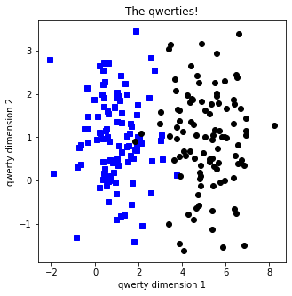

# Deep Learning

- [Deep Learning](#deep-learning)
  - [Math, numpy, PyTorch](#math-numpy-pytorch)
    - [Derivatives: Intuition and polynomials](#derivatives-intuition-and-polynomials)
  - [Gradient descent](#gradient-descent)
    - [Overview of gradient descent](#overview-of-gradient-descent)
    - [What about local minima?](#what-about-local-minima)
      - [Potential problems with gradient descent](#potential-problems-with-gradient-descent)
      - [But does it matter?](#but-does-it-matter)
      - [What to do about it?](#what-to-do-about-it)
    - [Gardient descent in 1D](#gardient-descent-in-1d)
    - [CodeChallenge: unfortuate starting value](#codechallenge-unfortuate-starting-value)
    - [Gradient descent in 2D](#gradient-descent-in-2d)
      - [Derivative, Partial derivatives and Gradient](#derivative-partial-derivatives-and-gradient)
      - [Repeat in 2D](#repeat-in-2d)
    - [CodeChallenge: 2D Gradient ascent](#codechallenge-2d-gradient-ascent)
    - [Parametric experiments on g.d.](#parametric-experiments-on-gd)
    - [CodeChallenge: Fixed vs. dynamic learning rate](#codechallenge-fixed-vs-dynamic-learning-rate)
    - [Vanishing and exploding gradients](#vanishing-and-exploding-gradients)
      - [How to minimize gradient problems](#how-to-minimize-gradient-problems)
  - [ANNs (Artificial Neural Networks)](#anns-artificial-neural-networks)
    - [The perceptron and ANN architecture](#the-perceptron-and-ann-architecture)
      - [The perceptron](#the-perceptron)
      - [Linear vs. nonlinear operations](#linear-vs-nonlinear-operations)
      - [The bias term (aka intercept)](#the-bias-term-aka-intercept)
      - [The full perceptron model](#the-full-perceptron-model)
    - [A geometric view of ANNs](#a-geometric-view-of-anns)
      - [Feature spaces](#feature-spaces)
      - [Categories of model output](#categories-of-model-output)
    - [ANN math part 1 (forward prop)](#ann-math-part-1-forward-prop)
      - [The model and the math](#the-model-and-the-math)
      - [Activation functions](#activation-functions)
      - [All about the weights](#all-about-the-weights)
    - [ANN math part 2 (errors, loss, cost)](#ann-math-part-2-errors-loss-cost)
      - [Loss functions](#loss-functions)
      - [From loss to cost](#from-loss-to-cost)
      - [The goal of DL optimization](#the-goal-of-dl-optimization)
      - [Is anything lost in the cost?](#is-anything-lost-in-the-cost)
    - [ANN math part 3 (backprop)](#ann-math-part-3-backprop)
      - [The shortening](#the-shortening)
      - [From perceptron to deep network](#from-perceptron-to-deep-network)
      - [Backprop is g.d. super-charged](#backprop-is-gd-super-charged)
      - [Backprop and the chain rule](#backprop-and-the-chain-rule)
    - [ANN for regression](#ann-for-regression)
      - [What is a simple regression?](#what-is-a-simple-regression)
      - [Should we use DL for statistics?](#should-we-use-dl-for-statistics)
    - [CodeChallenge: manipulate regression slope](#codechallenge-manipulate-regression-slope)
    - [ANN for classifying qwerties](#ann-for-classifying-qwerties)
    - [Learning rates comparison](#learning-rates-comparison)
    - [Multilayer ANN](#multilayer-ann)
      - [What about overfitting and cross-validation?](#what-about-overfitting-and-cross-validation)
    - [Linear solutions to linear problems](#linear-solutions-to-linear-problems)
      - [Code demonstration first](#code-demonstration-first)
    - [Why multilayer linear models don't exist](#why-multilayer-linear-models-dont-exist)
      - [Layers collapse without nonlinearities](#layers-collapse-without-nonlinearities)
    - [Multi-output ANN](#multi-output-ann)
      - [The iris dataset](#the-iris-dataset)
      - [Model architecture](#model-architecture)
      - [Softmax'ing the outputs](#softmaxing-the-outputs)
    - [CodeChallenge: Many qwerties!](#codechallenge-many-qwerties)
      - [What to do in this codeChallenge](#what-to-do-in-this-codechallenge)
    - [Comparing the number of hidden utnis](#comparing-the-number-of-hidden-utnis)
    - [Depth vs. breadth: Number of parameters](#depth-vs-breadth-number-of-parameters)
      - [Different models, same number of nodes](#different-models-same-number-of-nodes)
    - [Defining models using nn.Sequential vs. class](#defining-models-using-nnsequential-vs-class)
      - [Sequential vs. class](#sequential-vs-class)
      - [The two main functions in a nn.Module class](#the-two-main-functions-in-a-nnmodule-class)
      - [Sequential vs. class: pros and cons](#sequential-vs-class-pros-and-cons)
    - [Model depth vs. breadth](#model-depth-vs-breadth)
    - [CodeChallenge: convert nn.Sequential to class](#codechallenge-convert-nnsequential-to-class)
    - [Diversity of ANN visual representations](#diversity-of-ann-visual-representations)
    - [Reflection: Are DL models understandable yet?](#reflection-are-dl-models-understandable-yet)
  - [Overfitting and cross-validation](#overfitting-and-cross-validation)
    - [What is overfitting and is it as bad as they say?](#what-is-overfitting-and-is-it-as-bad-as-they-say)
      - [The problem with overfitting](#the-problem-with-overfitting)
      - [Over- and Under- fitting: summary](#over--and-under--fitting-summary)
      - [How to know the correct number of parameters?](#how-to-know-the-correct-number-of-parameters)
      - [How to avoid overfitting](#how-to-avoid-overfitting)
      - [Hidden overfitting: researcher degrees of freedom](#hidden-overfitting-researcher-degrees-of-freedom)
      - [How to avoid researcher overfitting](#how-to-avoid-researcher-overfitting)
    - [Cross-validation](#cross-validation)
      - [Cross-validation: terms and sets](#cross-validation-terms-and-sets)
      - [The cross-validation cycle](#the-cross-validation-cycle)
      - [Overfitting and the cross-validation cycle](#overfitting-and-the-cross-validation-cycle)
      - [K-fold cross-validation](#k-fold-cross-validation)
      - [Does cross-validation really prevent overfitting?](#does-cross-validation-really-prevent-overfitting)
    - [Generalization](#generalization)
      - [Generalization and its boundaries](#generalization-and-its-boundaries)
      - [Generalization and accuracy](#generalization-and-accuracy)
    - [Cross-validation - manual separation](#cross-validation---manual-separation)

## Math, numpy, PyTorch

### Derivatives: Intuition and polynomials

- Intuition of the derivative ('how things change')
- How to compute the derivative of a polynomial

Derivatives point in the direction of increases and decreases in a mathematical function.

In DL, the goal (e.g. classification) is represented as an error function. Thus, the best solution is the point with the smallest error.

The derivative tells us which way to `move` in that error landsacpe in order to find the optimal solution.

DL wouldn't work without derivatives.

- sympy : symbolic math in Python

[DUDL_math_derivatives1.ipynb](../math/DUDL_math_derivatives1.ipynb)

## Gradient descent

### Overview of gradient descent

- What `gradient descent` means and why we need it
- The gradient descent algorithm

How deep learning models learn:

1. Guess a solution
2. Coumpute the error (mistakes)
3. Learn from mistakes and modify the parameters

> - https://www.kdnuggets.com/2018/06/intuitive-introduction-gradient-descent.html

The fucntion and its derivative

$$f(x) = 3x^2 - 3x + 4$$

$$\frac{df}{dx} = 6x - 3$$

Gradient descent algorithm

1. Initialize random guess of minium
2. loop over training iterations
   1. Compute derivative at guess min
   2. Updated guess min is itself minus derivative scaled by learning rate

### What about local minima?

- Potential problems with the g.d. algorithm
- Why it's hard to know whether this is a serious issue
- Two possible strategies to avoid local minima

#### Potential problems with gradient descent

Gradient descent is guaranteed to go `downhill`.

It is not guaranteed to find the corret - or even the best solution!

Gradient descent can go wrong if parameters are not set right for the particular error landsacpe.

Error landscapes are impossible to visualize in > 2D.

#### But does it matter?

The success of deep learning, in spite of the problems with gradient descent, remains a mystrery.

It is possible that there are many good solutions (many equally good local minima). This interpretation is consistent with the huge diversity of weight configurations that produce similar model performance.

Another possibility is there are exterememly few local minima in high-dimensional space. This interpretation is consistent with the complexity and absurd dimensionality of DL models.

`G.D. will get trapped in a local minium only if that point is a minimum in all dimensions!`

`In an extremely high-D space, there might be very few local minima.`

#### What to do about it?

When model performance is good, don't worry about local minima.

One possible solution: `Re-train the model many times using different random weights` (different starting locations on the loss landsacpe) and pick the model that does best.

Another possible solution: `Increase the dimensionality (complexity) of the model to have fewer local minima.`

### Gardient descent in 1D

[DUDL_GradientDescent_1D.ipynb](../gradientDescent/DUDL_GradientDescent_1D.ipynb)

### CodeChallenge: unfortuate starting value

- Gain more experience with writing functions and their derivatives
- See what happends when the starting value is exactly incorrect

Step 1 : Repeat 1D g.d. to find minimun of the following functions:

$$ f(x) = cos(2 \pi x)+x^2, x \in \{-2, 2\} $$

미분 계산시

- 직접 계산
- sympy 활용 ([DUDL_math_derivatives1.ipynb](../math/DUDL_math_derivatives1.ipynb))

Step 2: Hard-code a starting value of x=0.

[DUDL_GradientDescent_CodeChallengeStartValue.ipynb](../gradientDescent/DUDL_GradientDescent_CodeChallengeStartValue.ipynb)

### Gradient descent in 2D

- See that gradient descent is the same in 2D as in 1D
- Further visualize the difficulty of finding global minima

#### Derivative, Partial derivatives and Gradient

- Derivative : the slope of the function at any given point
- Partial derivatives : the derivatives of the function, ignoring one dimension and only focusing on the other dimension

- Gradient : just a collection of all the partial derivatives with respect to all the dimensions of that function.

- ∇ : Nabla, it's just a collection of all the partial derivatives with respect to all of the different directions or dimensions of the data

#### Repeat in 2D

1. Compute the partial derivatives of the function using sympy and lambdify.

2. Repeat the gradient descent loop

Note that the local min is (x, y).

Visualize!

[DUDL_GradientDescent_2D.ipynb](../gradientDescent/DUDL_GradientDescent_2D.ipynb)

### CodeChallenge: 2D Gradient ascent

The thing to do:

- Modify the 2D gradient descent code to perform gradient ascent. Find the local maximum!

- There are two ways to solve this; find both!

[DUDL_GradientDescent_2D.ipynb](../gradientDescent/DUDL_GradientDescent_2D.ipynb)

위 코드에 수정을 가해서 부호를 고민하면 된다.

### Parametric experiments on g.d.

- Learn how to setup and run parametric experiments!
- Understand the importance of starting values, learning rate, and training iterations, in gradient descent.
- See (yet again!) that gradient descent is an amazing algorithm but is not guaranteed to give the correct answer.

Repeat the model from the 1D video.

Conduct a one-variable experiment using:

  1. Initial value
  2. Learning rate

Conduct a two-variable experiment using:

  1. Learning rate AND training epochs

[DUDL_GradientDescent_experiment.ipynb](../gradientDescent/DUDL_GradientDescent_experiment.ipynb)

- Experiment 1: systematically varying the starting locations

- Experiment 2: systematically varying the learning rate

- Experiment 3: interaction between learning rate and training epochs

### CodeChallenge: Fixed vs. dynamic learning rate

- Learn that the model learning rate does not need to have a static value.
- Think about different ways to change the learning rate, and when certain methods can fail.

Copy code from [DUDL_GradientDescent_1D.ipynb](../gradientDescent/DUDL_GradientDescent_1D.ipynb)

Think about how to change the learning rate.

1. Time (training epoch)
2. Derivative
3. Loss
4. Current local minimum value

Implement and test your idea in code!

Think critically about how your code might fail.

[DUDL_GradientDescent_codeChallenge_lr.ipynb](../gradientDescent/DUDL_GradientDescent_codeChallenge_lr.ipynb)

Possible ways to proportionate the learning rate:

1. Training epoch: Good method, often done in blocks. But unrelated to model performance/accuracty.
   - This method is called `learning rate decay` and you'll learn more about it later in the section `Metaparameters`.
2. Derivative : Adaptive to the problem. Requires additional parameters and appropriate scaling
   - This method is incorporated into `RMSprop` and `Adam` optimizers, and you'll learn more about it later in the section `Metaparameters`.
3. Loss: Adaptive to the problem. Works only when loss is in range of `[0, 1]` (scaling possible)
4. Current local minimum value: Adaptive to the problem. Too many assumptions for this generally to be a good idea.

### Vanishing and exploding gradients

- About the vanishing and exploding gradient problems in DL (and backprop-optimization more generally).
- A few strategies for avoiding these problems (details come later in the coures)

Vanishing gradient:

Weights don't change -> no learning. Problematic for deep networks.

Exploding gradient:

Weights change wildly -> bad solutions.

#### How to minimize gradient problems

- Use models with few hidden layers.
- Use activation functions that do not saturate (e.g., ReLU)
- Apply weight normalization.
- Pre-train networks using autoencoders.
- Use regularization techniques like batch normalization, dropout, and weight decay.
- Use architectures like residual networks (`resnet`).

## ANNs (Artificial Neural Networks)

### The perceptron and ANN architecture

- the basic architecture of an ANN
- the linear and nonlinear components of an artificial neural network.
- several key terms of neural networks.

#### The perceptron

#### Linear vs. nonlinear operations

- Linear : Addition and multiplication
- Nonlinear : Anything else

Linear models only solve linearly separable problems.

Nonlinear models can solve more complex problems.

Never use a linear model for a nonlinear problem, and never use a nonlinear model for a linear problem!

#### The bias term (aka intercept)

#### The full perceptron model

### A geometric view of ANNs

- More on the basic architecture of an ANN
- What the term `feature space` and `separating hyperplan` mean
- How to visualize the types of ANN predictions

#### Feature spaces

#### Categories of model output

### ANN math part 1 (forward prop)

- half of the math of ANNs (and therefore also DL!)
- More about biases, weights, and activation functions.
- How ANNs classify inputs.

#### The model and the math

#### Activation functions

#### All about the weights

### ANN math part 2 (errors, loss, cost)

- More of the math underlying ANNs.
- Different categories of errors, and their corresponding loss functions.
- The difference between loss and cost.

#### Loss functions

#### From loss to cost

#### The goal of DL optimization

#### Is anything lost in the cost?

- Why train on cost and not loss?
- Training on each sample is time-consuming and may lead to overfitting.
- But averaging over too many samples may decrease sensitivity.
- A good solution is to train the model in `batches` of samples.

### ANN math part 3 (backprop)

- More of the math underlying ANNs.
- How the gradient descent algorithm is extended to DL.
- That all nodes in a network are the same.

#### The shortening

#### From perceptron to deep network

Forward propagation: Compute output based on input.

Backwards propagation (backprop) : Adjust the weights based on loss/cost.

#### Backprop is g.d. super-charged

#### Backprop and the chain rule

### ANN for regression

- What a regression is.
- How to construct an ANN model for simple regresison.

#### What is a simple regression?

Simple regression means to predict one continuous variable from another.

[DUDL_ANN_regression.ipynb](../ANN/DUDL_ANN_regression.ipynb)

#### Should we use DL for statistics?

If DL is so great, why don't we all switch to DL models instead of traditional statistical models?

This in an important and ongoing discussion, but traditional statistical models tend to work better on smaller datasets, are better mathematically characterized (e.g., guaranteed optimal solutions), and are more interpretable.

### CodeChallenge: manipulate regression slope

- Further explore ANNs for regression.
- Understand the difference between predicting data vs. prediction data relationships.

Your mission:

1. Write a python function (def) that builds and trains the model, and outputs the final predictions and losses
2. Write a function that creates the data and outputs x, y. x is the same as in the previous video. y = m*x + randn/2. N=50.
3. In a parametric experiment, vary the slope from -2 to +2 in 21 steps. Repeat the entire experiment 50 times.
4. Plot the loss and accuracy (correlation of ŷ, y) as a function of the slope

[DUDL_ANN_codeChallenge_regression.ipynb](../ANN/DUDL_ANN_codeChallenge_regression.ipynb)

### ANN for classifying qwerties

- What a qwerty is (hint: it's a meaningless name that I thought would be cute).
- How to construct an ANN model for binary classification.
- Why it's dangerous to assume that ANNs always work.

### Learning rates comparison

- How to put the model-creation and model-training code into callable functions.
- How to run parametric experiments with ANN models.
- The effects of learning rate on performance.
- That puzzling results provide a great learning opportunity!

[DUDL_ANN_learningrates.ipynb](../ANN/DUDL_ANN_learningrates.ipynb)

### Multilayer ANN

- More terminology of DL
- About implementing multiplayer ANN models.

[DUDL_ANN_multilayer.ipynb](../ANN/DUDL_ANN_multilayer.ipynb)

#### What about overfitting and cross-validation?

### Linear solutions to linear problems

- The mystery of the qwerties!
- The difference between linear and nonlinar models.

#### Code demonstration first

Goal: Rerun the code file [DUDL_ANN_multilayer.ipynb](../ANN/DUDL_ANN_multilayer.ipynb), but remove the nonlinear activation functions from the hidden layers (keep the final output nonlinearity).

What to look for: How does linear model performance compare to nonlinear model performance?

Conclusion: That's for you to figure out!

Simple problems require simple solutions.

Qwuerties are linearly separable, so a linear separator will out-perform a nonlinear separator.

Nonlinear models (basically all of DL) are best-suited for complex nonlinear problems.

Appropriate methods for separating qwerties include a logistic regression and k-means.

- Don't throw a complicated DL model at every problem, just because you can.
- Approach every problem with an open, analytic, createive, and critical mind.
- Just because you can doesn't mean you should.

### Why multilayer linear models don't exist

- The math of multilayer linear models.
- Why a `multi-layer` linear model is really just one layer, as long as there are no nonlinear activation units.

#### Layers collapse without nonlinearities

All the weights just get to be combined into one sigle layer.

### Multi-output ANN

- How to extend the ANN to provide multiple outputs in a classification problem
- More about creating DL networks in pytorch.
- All about the famous `iris` dataset

#### The iris dataset

#### Model architecture

Terminology: `Fully connected` means that each node in layer n projects to each node in layer n+1. Each connection has its own weight.

#### Softmax'ing the outputs

[DUDL_ANN_multioutput.ipynb](../ANN/DUDL_ANN_multioutput.ipynb)

### CodeChallenge: Many qwerties!

- Gain more experience working with ANNs for multiple outputs
- Gain more experience copy/pasting/modifying code. A suuuuper important skill in DL!

#### What to do in this codeChallenge

Integrate two notebooks:

- [DUDL_ANN_classifyQwerties.ipynb](../ANN/DUDL_ANN_classifyQwerties.ipynb)
- [DUDL_ANN_multioutput.ipynb](../ANN/DUDL_ANN_multioutput.ipynb)

Make three groups of qwerties and train a 3-output ANN to classify them.

I used a 2-4-3 layer architecture, but you can use a different architecture.

[DUDL_ANN_codeChallengeQwerties.ipynb](../ANN/DUDL_ANN_codeChallengeQwerties.ipynb)

### Comparing the number of hidden utnis

- More about using ANNs to predict flowers in the iris dataset.
- How to parametrically change model architecture.
- More about model complexity and performance.

Goal: Classify flowers using a model with one hidden layer, but parametrically change the number of hidden units from 1 to 128. Plot classification accuracy as a function of the model size.

[DUDL_ANN_nHiddenUnits.ipynb](../ANN/DUDL_ANN_nHiddenUnits.ipynb)

### Depth vs. breadth: Number of parameters

- How models with the same number of nodes can have different numbers of parameters.
- How to count the number of trainable parameters in pytorch.
- Another reason why deep models are so powerful.

#### Different models, same number of nodes

[DUDL_ANN_numParameters.ipynb](../ANN/DUDL_ANN_numParameters.ipynb)

### Defining models using nn.Sequential vs. class

- The two approaches to defining models in PyTorch.
- Advantages and limitations of each approach.

#### Sequential vs. class

#### The two main functions in a nn.Module class

#### Sequential vs. class: pros and cons

[DUDL_ANN_seqVsClass.ipynb](../ANN/DUDL_ANN_seqVsClass.ipynb)

### Model depth vs. breadth

- More about the deepness of DL models.
- How to parametrically change model architecture.
- More about model complexity and performance.

Depth: The number of hidden layers (layers between input and output)

Breadth/width: The number of units per hidden layer (can vary across layers).

[DUDL_ANN_breadthVsDepth.ipynb](../ANN/DUDL_ANN_breadthVsDepth.ipynb)

What have we learned?

- Deeper models are not necessarily better. They require more training and more FLOPs.
- Model performance is not simply a function of the number of trainable parameters. Architecture matters.
- Shallow models learn fast, but deeper models can learn more complex mappings. (Not demonstrated here)

### CodeChallenge: convert nn.Sequential to class

- Gain more experience with creating DL models using the nn.Module class
- Become more familiar with developing models that can be flxibly adapted (important for advanced topcis and applications!).

Make a copy of the notebook [ANN/DUDL_ANN_multilayer.ipynb](../ANN/DUDL_ANN_multilayer.ipynb)

Recreate the model using a Python class instead of using nn.Sequential.

Re-run the code to make sure it still works!

[DUDL_ANN_codeChallengeSeq2class.ipynb](../ANN/DUDL_ANN_codeChallengeSeq2class.ipynb)

### Diversity of ANN visual representations

There is no lecture; this is a small assignment for you, which will help you appreciate the diversity of how ANNs are visualized.

Your task: Open a new Internet browser search for "ANN architecture." Look at the image results.

Notice the diversity -- and commonalities -- in how models are visualized, including the layers, weights, and activation functions. There is no simple, universal, widely agreed-upon format for illustrating ANN models (and deep learning models more generally).

### Reflection: Are DL models understandable yet?

- Think critically about whether we `understand` the ANN models we've worked with so far.
- Appreciate what simple complex systems mean.
- Be excited to learn methods to understand (a little bit...) models later in the course!

Hey, the model is awesome! It works!

But... how does it work? What is it `thinking`?

Take-home messages

The model is simple: Every node implements an equation so simple we could compute it by hand.

The model is complex: The nonlinearities and interactions across hundreds of parameters (weights) means that we have no idea what each node is actually encoding.

Is it hopeless? Nope! There are wyas to interrogate individual nodes. You'll learn those later in the courese.

Do you want this model to make major life decisions for you? Yikes! Let's hold off on this thorny issue until the Ethics section.

Appropriate applications for DL

DL is best for complex classifiction tasks, when you don't need to know how the classification works.

DL is less appropriate for gaining mechanistic insights into how a system behaves, and why.

Traditional statistical models (e.g. ANOVA or regression) are more appropriate for mechanistic insights into system behavior.

Is it hopeless? Nope! Mechanistic interpretations of DL are slowly improving. It is possible that in the future, DL will be beneficial for understanding, not oly for classifying.

## Overfitting and cross-validation

### What is overfitting and is it as bad as they say?

- The terms `underfitting` and `overfitting`.
- Why overffitting is more unanced than typically discussed.
- The insidious dangers of `researcher overfitting`.

#### The problem with overfitting

Overfitting limits our ability to generalize the pattern to new data. So in this particular example, the model with fewer parameters is better and the model with more parameters.

But that, of course, is not a general claim. We should not always say that simpler models with fewer parameters are better.

In fact, here's the opposite problem.

#### Over- and Under- fitting: summary

- Overfitting
  - Overly sensitive to noise
  - Increased sensitivity to subtle effects
  - Reduced generalizability
  - Over-parameterized models become difficult to estimate
- Underfitting
  - Less sensitive to noise
  - Less likely to detect true effects
  - Reduced generalizability
  - Parameters are better estimiated
  - Good results with less data

#### How to know the correct number of parameters?

With 1-2 dimensions: Visualize the data and make an informed decision.

With 3+ dimensions: Use cross-validation (next lecture)

#### How to avoid overfitting

1. Use cross-validation (training/hold-out/test sets).
2. Use regularization (L2, drop-out, data manipulations, early stopping)

#### Hidden overfitting: researcher degrees of freedom

Researcher degrees of freedom: The researcher has many choices for how to clean, organize, and select the data; and which models and how many models to run.

Example: Test models A, B, and C on the same data. Go back and clean the data again with different criteria, then test the three models again. Publish model B with re-cleaned data, which worked best on the test set.

#### How to avoid researcher overfitting

1. Decide on the model architecture in advance, and make only minor adjustments. Feasible for frequently-studied problems.
   - image recognition you start from the resnet, transfer learning
2. Build a series of models but never use the test set until all models are trained (kaggle-like competition). Best for new problems or new models.

### Cross-validation

- The terminology of cross-validation
- Why cross-validation helps minimize overfitting.
- The (often-unspoken) assumption that makes or break cross-validation.

#### Cross-validation: terms and sets

It turns out that whether this is or isn't overfitting depends on a key assumption of correlation and orthogonaility of data. That's an assumption that I will talk about later.

#### The cross-validation cycle

#### Overfitting and the cross-validation cycle

#### K-fold cross-validation

#### Does cross-validation really prevent overfitting?

Crucial assumption of cross-vallidation: The hold-out and test sets are independent of (uncorrelated with) the training set.

Example of assumption validity: Train a model to label pictures of pets as `cat`, `dog`, `bird`, or `wallabee`. Test set is pictures taken by people whose pictures were not in the training or hold-out sets.

Example of assumption violation: Train a model to predict age based on pictures of people's faces. Test set is pictures of their siblings.

> What is the problem with that? The problem is that although these are technically different pictures, there's a very, very strong correlation between how one person looks and their brother or sister. So the test set is technically different from the training set, but there are going to be strong correlations bewteen the data in the test set and the data in the training set. Again, the problem with this is that it limits the ability of the model to generalize to new data.

Example of assumption violation: Train a model to predict market value of homes. Training set is randomly selected homes in a city. Test set is homes next door.

> On the one hand, the homes next doors are different. They are independent homes, but they're certainly not going to be uncorrelated with the homes in the training set. Of course, the value of one house is going to be very strongly correlated with the value of the neighbours.

Conclusion: Overfitting is not intrinsically bad. `overfitting reduces generalizability`, which may or may not be problematic depending on the goals and scope of the model.

### Generalization

- More about what generalization means and why it's important
- How to think about generalization boundaries.

#### Generalization and its boundaries

Generalization: The model works well when applied to new data

Generalization boundaries: The population you want to apply the model to

Simple example: we are trying to predict weight based on height and the number of calories consumed.

Generalization boundaries:

- Must work on adult humans (both sexes, all countries).
- Doesn't need to work on children.
- Doesn't need to work on non-human animals

Generalization boundaries:

- Must work on city A.
- Doesn't need to work in any other city.

#### Generalization and accuracy

Important: Generalization entails some loss of accuracy!

The trick is to build a model that does well within the generalization boundaries.

Decide your generalization boundaries carefully.

Have examples from those populations in the training/hold-out/test sets.

### Cross-validation - manual separation

- How to implement cross-validation `manually` using numpy.
- How to perform cross-validation on the iris dataset classification problem.

