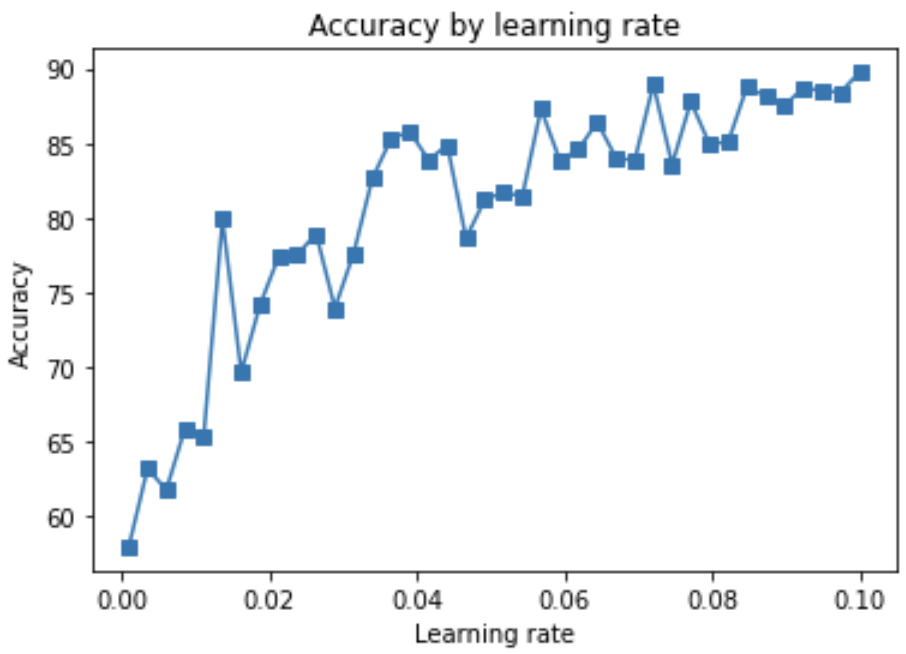
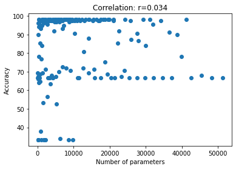
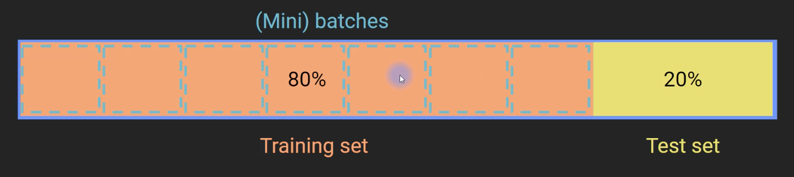
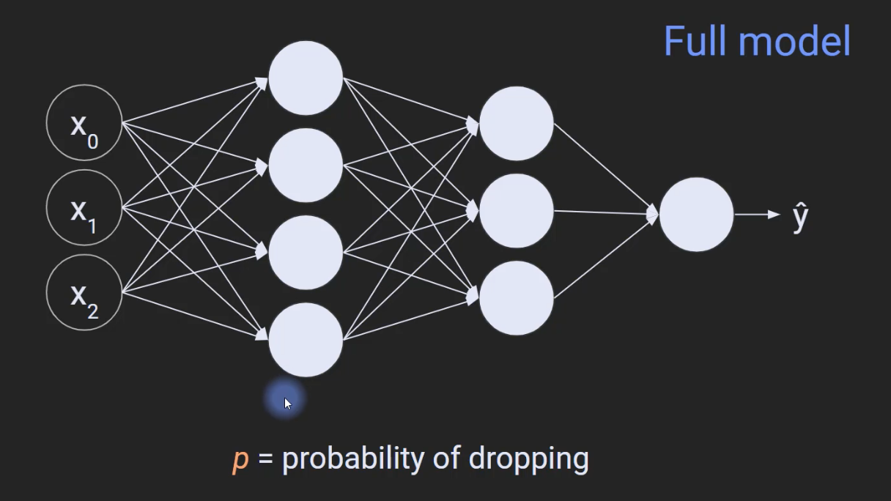
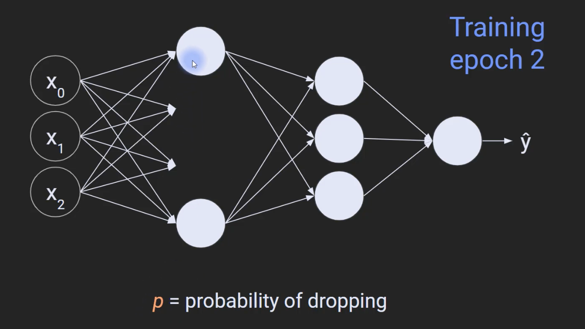
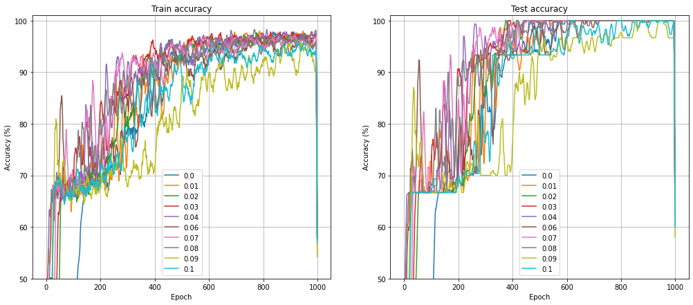

# Deep Learning

- [Deep Learning](#deep-learning)
  - [Math, numpy, PyTorch](#math-numpy-pytorch)
    - [Derivatives: Intuition and polynomials](#derivatives-intuition-and-polynomials)
  - [Gradient descent](#gradient-descent)
    - [Overview of gradient descent](#overview-of-gradient-descent)
    - [What about local minima?](#what-about-local-minima)
      - [Potential problems with gradient descent](#potential-problems-with-gradient-descent)
      - [But does it matter?](#but-does-it-matter)
      - [What to do about it?](#what-to-do-about-it)
    - [Gardient descent in 1D](#gardient-descent-in-1d)
    - [CodeChallenge: unfortuate starting value](#codechallenge-unfortuate-starting-value)
    - [Gradient descent in 2D](#gradient-descent-in-2d)
      - [Derivative, Partial derivatives and Gradient](#derivative-partial-derivatives-and-gradient)
      - [Repeat in 2D](#repeat-in-2d)
    - [CodeChallenge: 2D Gradient ascent](#codechallenge-2d-gradient-ascent)
    - [Parametric experiments on g.d.](#parametric-experiments-on-gd)
    - [CodeChallenge: Fixed vs. dynamic learning rate](#codechallenge-fixed-vs-dynamic-learning-rate)
    - [Vanishing and exploding gradients](#vanishing-and-exploding-gradients)
      - [How to minimize gradient problems](#how-to-minimize-gradient-problems)
  - [ANNs (Artificial Neural Networks)](#anns-artificial-neural-networks)
    - [The perceptron and ANN architecture](#the-perceptron-and-ann-architecture)
      - [The perceptron](#the-perceptron)
      - [Linear vs. nonlinear operations](#linear-vs-nonlinear-operations)
      - [The bias term (aka intercept)](#the-bias-term-aka-intercept)
      - [The full perceptron model](#the-full-perceptron-model)
    - [A geometric view of ANNs](#a-geometric-view-of-anns)
      - [Feature spaces](#feature-spaces)
      - [Categories of model output](#categories-of-model-output)
    - [ANN math part 1 (forward prop)](#ann-math-part-1-forward-prop)
      - [The model and the math](#the-model-and-the-math)
      - [Activation functions](#activation-functions)
      - [All about the weights](#all-about-the-weights)
    - [ANN math part 2 (errors, loss, cost)](#ann-math-part-2-errors-loss-cost)
      - [Loss functions](#loss-functions)
      - [From loss to cost](#from-loss-to-cost)
      - [The goal of DL optimization](#the-goal-of-dl-optimization)
      - [Is anything lost in the cost?](#is-anything-lost-in-the-cost)
    - [ANN math part 3 (backprop)](#ann-math-part-3-backprop)
      - [The shortening](#the-shortening)
      - [From perceptron to deep network](#from-perceptron-to-deep-network)
      - [Backprop is g.d. super-charged](#backprop-is-gd-super-charged)
      - [Backprop and the chain rule](#backprop-and-the-chain-rule)
    - [ANN for regression](#ann-for-regression)
      - [What is a simple regression?](#what-is-a-simple-regression)
      - [Should we use DL for statistics?](#should-we-use-dl-for-statistics)
    - [CodeChallenge: manipulate regression slope](#codechallenge-manipulate-regression-slope)
    - [ANN for classifying qwerties](#ann-for-classifying-qwerties)
    - [Learning rates comparison](#learning-rates-comparison)
    - [Multilayer ANN](#multilayer-ann)
      - [What about overfitting and cross-validation?](#what-about-overfitting-and-cross-validation)
    - [Linear solutions to linear problems](#linear-solutions-to-linear-problems)
      - [Code demonstration first](#code-demonstration-first)
    - [Why multilayer linear models don't exist](#why-multilayer-linear-models-dont-exist)
      - [Layers collapse without nonlinearities](#layers-collapse-without-nonlinearities)
    - [Multi-output ANN](#multi-output-ann)
      - [The iris dataset](#the-iris-dataset)
      - [Model architecture](#model-architecture)
      - [Softmax'ing the outputs](#softmaxing-the-outputs)
    - [CodeChallenge: Many qwerties!](#codechallenge-many-qwerties)
      - [What to do in this codeChallenge](#what-to-do-in-this-codechallenge)
    - [Comparing the number of hidden utnis](#comparing-the-number-of-hidden-utnis)
    - [Depth vs. breadth: Number of parameters](#depth-vs-breadth-number-of-parameters)
      - [Different models, same number of nodes](#different-models-same-number-of-nodes)
    - [Defining models using nn.Sequential vs. class](#defining-models-using-nnsequential-vs-class)
      - [Sequential vs. class](#sequential-vs-class)
      - [The two main functions in a nn.Module class](#the-two-main-functions-in-a-nnmodule-class)
      - [Sequential vs. class: pros and cons](#sequential-vs-class-pros-and-cons)
    - [Model depth vs. breadth](#model-depth-vs-breadth)
    - [CodeChallenge: convert nn.Sequential to class](#codechallenge-convert-nnsequential-to-class)
    - [Diversity of ANN visual representations](#diversity-of-ann-visual-representations)
    - [Reflection: Are DL models understandable yet?](#reflection-are-dl-models-understandable-yet)
  - [Overfitting and cross-validation](#overfitting-and-cross-validation)
    - [What is overfitting and is it as bad as they say?](#what-is-overfitting-and-is-it-as-bad-as-they-say)
      - [The problem with overfitting](#the-problem-with-overfitting)
      - [Over- and Under- fitting: summary](#over--and-under--fitting-summary)
      - [How to know the correct number of parameters?](#how-to-know-the-correct-number-of-parameters)
      - [How to avoid overfitting](#how-to-avoid-overfitting)
      - [Hidden overfitting: researcher degrees of freedom](#hidden-overfitting-researcher-degrees-of-freedom)
      - [How to avoid researcher overfitting](#how-to-avoid-researcher-overfitting)
    - [Cross-validation](#cross-validation)
      - [Cross-validation: terms and sets](#cross-validation-terms-and-sets)
      - [The cross-validation cycle](#the-cross-validation-cycle)
      - [Overfitting and the cross-validation cycle](#overfitting-and-the-cross-validation-cycle)
      - [K-fold cross-validation](#k-fold-cross-validation)
      - [Does cross-validation really prevent overfitting?](#does-cross-validation-really-prevent-overfitting)
    - [Generalization](#generalization)
      - [Generalization and its boundaries](#generalization-and-its-boundaries)
      - [Generalization and accuracy](#generalization-and-accuracy)
    - [Cross-validation - manual separation](#cross-validation---manual-separation)
    - [Cross-validation - scikitlearn](#cross-validation---scikitlearn)
      - [Why an 80/20 split?](#why-an-8020-split)
      - [HUGE dataset - 98/1/1 split](#huge-dataset---9811-split)
    - [Cross-validation - DataLoader](#cross-validation---dataloader)
      - [Same architecture, different batch size](#same-architecture-different-batch-size)
    - [Spliting data into train, devset, and test](#spliting-data-into-train-devset-and-test)
    - [Cross-validation on regression](#cross-validation-on-regression)
  - [Regularization](#regularization)
    - [Regularization: concept and methods](#regularization-concept-and-methods)
      - [Why regularize?](#why-regularize)
      - [Three families of regularizer (in DL)](#three-families-of-regularizer-in-dl)
      - [Node regularization](#node-regularization)
      - [Loss regularization](#loss-regularization)
    - [Data regularization](#data-regularization)
      - [How to think about regularization](#how-to-think-about-regularization)
      - [Which regularization method to use?](#which-regularization-method-to-use)
    - [train() and eval() modes](#train-and-eval-modes)
      - [Training vs. evaluation mode](#training-vs-evaluation-mode)
      - [The recommended way to do it](#the-recommended-way-to-do-it)
    - [Dropout Regularization](#dropout-regularization)
      - [Dropout regularization: how it works](#dropout-regularization-how-it-works)
      - [Dropout regularization: what it does](#dropout-regularization-what-it-does)
      - [Dropout: Scenes from the original paper](#dropout-scenes-from-the-original-paper)
    - [Dropout regularization in practice](#dropout-regularization-in-practice)
    - [Dropout example 2](#dropout-example-2)
    - [Weight Regularization (L2/L2): math](#weight-regularization-l2l2-math)
      - [Recap: The goal of DL algorithms](#recap-the-goal-of-dl-algorithms)
      - [What to regularize for?](#what-to-regularize-for)
      - [The difference between L1 and L2](#the-difference-between-l1-and-l2)
      - [How much to regularize?](#how-much-to-regularize)
      - [What else to regularize for?](#what-else-to-regularize-for)
      - [Why does regularization reduce overfitting?](#why-does-regularization-reduce-overfitting)
      - [When to use L1/L2 regularization?](#when-to-use-l1l2-regularization)
    - [L2 regularization in practice](#l2-regularization-in-practice)
    - [L1 regularization in practice](#l1-regularization-in-practice)
    - [Training in mini-batches](#training-in-mini-batches)
      - [What is a mini-batch?](#what-is-a-mini-batch)
      - [How and why to train with mini-batches?](#how-and-why-to-train-with-mini-batches)
      - [Why does batch-training regularize?](#why-does-batch-training-regularize)
      - [Mini-batch analogy](#mini-batch-analogy)
    - [Batch training in action](#batch-training-in-action)
    - [The importance of equal batch sizes](#the-importance-of-equal-batch-sizes)
    - [CodeChallenge: Effects of mini-batch size](#codechallenge-effects-of-mini-batch-size)

## Math, numpy, PyTorch

### Derivatives: Intuition and polynomials

- Intuition of the derivative ('how things change')
- How to compute the derivative of a polynomial


Derivatives point in the direction of increases and decreases in a mathematical function.

In DL, the goal (e.g. classification) is represented as an error function. Thus, the best solution is the point with the smallest error.

The derivative tells us which way to `move` in that error landsacpe in order to find the optimal solution.

DL wouldn't work without derivatives.

- sympy : symbolic math in Python

[DUDL_math_derivatives1.ipynb](../math/DUDL_math_derivatives1.ipynb)

## Gradient descent

### Overview of gradient descent

- What `gradient descent` means and why we need it
- The gradient descent algorithm

How deep learning models learn:

1. Guess a solution
2. Coumpute the error (mistakes)
3. Learn from mistakes and modify the parameters


> - https://www.kdnuggets.com/2018/06/intuitive-introduction-gradient-descent.html

The fucntion and its derivative

$$f(x) = 3x^2 - 3x + 4$$

$$\frac{df}{dx} = 6x - 3$$

Gradient descent algorithm

1. Initialize random guess of minium
2. loop over training iterations
   1. Compute derivative at guess min
   2. Updated guess min is itself minus derivative scaled by learning rate

### What about local minima?

- Potential problems with the g.d. algorithm
- Why it's hard to know whether this is a serious issue
- Two possible strategies to avoid local minima

#### Potential problems with gradient descent

Gradient descent is guaranteed to go `downhill`.

It is not guaranteed to find the corret - or even the best solution!

Gradient descent can go wrong if parameters are not set right for the particular error landsacpe.

Error landscapes are impossible to visualize in > 2D.


#### But does it matter?

The success of deep learning, in spite of the problems with gradient descent, remains a mystrery.

It is possible that there are many good solutions (many equally good local minima). This interpretation is consistent with the huge diversity of weight configurations that produce similar model performance.

Another possibility is there are exterememly few local minima in high-dimensional space. This interpretation is consistent with the complexity and absurd dimensionality of DL models.


`G.D. will get trapped in a local minium only if that point is a minimum in all dimensions!`

`In an extremely high-D space, there might be very few local minima.`

#### What to do about it?

When model performance is good, don't worry about local minima.

One possible solution: `Re-train the model many times using different random weights` (different starting locations on the loss landsacpe) and pick the model that does best.

Another possible solution: `Increase the dimensionality (complexity) of the model to have fewer local minima.`

### Gardient descent in 1D

[DUDL_GradientDescent_1D.ipynb](../gradientDescent/DUDL_GradientDescent_1D.ipynb)

### CodeChallenge: unfortuate starting value

- Gain more experience with writing functions and their derivatives
- See what happends when the starting value is exactly incorrect

Step 1 : Repeat 1D g.d. to find minimun of the following functions:

$$ f(x) = cos(2 \pi x)+x^2, x \in \{-2, 2\} $$

미분 계산시

- 직접 계산
- sympy 활용 ([DUDL_math_derivatives1.ipynb](../math/DUDL_math_derivatives1.ipynb))

Step 2: Hard-code a starting value of x=0.

[DUDL_GradientDescent_CodeChallengeStartValue.ipynb](../gradientDescent/DUDL_GradientDescent_CodeChallengeStartValue.ipynb)

### Gradient descent in 2D

- See that gradient descent is the same in 2D as in 1D
- Further visualize the difficulty of finding global minima

#### Derivative, Partial derivatives and Gradient


- Derivative : the slope of the function at any given point
- Partial derivatives : the derivatives of the function, ignoring one dimension and only focusing on the other dimension


- Gradient : just a collection of all the partial derivatives with respect to all the dimensions of that function.


- ∇ : Nabla, it's just a collection of all the partial derivatives with respect to all of the different directions or dimensions of the data

#### Repeat in 2D


1. Compute the partial derivatives of the function using sympy and lambdify.

2. Repeat the gradient descent loop

Note that the local min is (x, y).

Visualize!


[DUDL_GradientDescent_2D.ipynb](../gradientDescent/DUDL_GradientDescent_2D.ipynb)

### CodeChallenge: 2D Gradient ascent

The thing to do:

- Modify the 2D gradient descent code to perform gradient ascent. Find the local maximum!

- There are two ways to solve this; find both!

[DUDL_GradientDescent_2D.ipynb](../gradientDescent/DUDL_GradientDescent_2D.ipynb)

위 코드에 수정을 가해서 부호를 고민하면 된다.

### Parametric experiments on g.d.

- Learn how to setup and run parametric experiments!
- Understand the importance of starting values, learning rate, and training iterations, in gradient descent.
- See (yet again!) that gradient descent is an amazing algorithm but is not guaranteed to give the correct answer.

Repeat the model from the 1D video.


Conduct a one-variable experiment using:

  1. Initial value
  2. Learning rate

Conduct a two-variable experiment using:

  1. Learning rate AND training epochs

[DUDL_GradientDescent_experiment.ipynb](../gradientDescent/DUDL_GradientDescent_experiment.ipynb)

- Experiment 1: systematically varying the starting locations


- Experiment 2: systematically varying the learning rate


- Experiment 3: interaction between learning rate and training epochs


### CodeChallenge: Fixed vs. dynamic learning rate

- Learn that the model learning rate does not need to have a static value.
- Think about different ways to change the learning rate, and when certain methods can fail.

Copy code from [DUDL_GradientDescent_1D.ipynb](../gradientDescent/DUDL_GradientDescent_1D.ipynb)

Think about how to change the learning rate.

1. Time (training epoch)
2. Derivative
3. Loss
4. Current local minimum value

Implement and test your idea in code!

Think critically about how your code might fail.

[DUDL_GradientDescent_codeChallenge_lr.ipynb](../gradientDescent/DUDL_GradientDescent_codeChallenge_lr.ipynb)


Possible ways to proportionate the learning rate:

1. Training epoch: Good method, often done in blocks. But unrelated to model performance/accuracty.
   - This method is called `learning rate decay` and you'll learn more about it later in the section `Metaparameters`.
2. Derivative : Adaptive to the problem. Requires additional parameters and appropriate scaling
   - This method is incorporated into `RMSprop` and `Adam` optimizers, and you'll learn more about it later in the section `Metaparameters`.
3. Loss: Adaptive to the problem. Works only when loss is in range of `[0, 1]` (scaling possible)
4. Current local minimum value: Adaptive to the problem. Too many assumptions for this generally to be a good idea.

### Vanishing and exploding gradients

- About the vanishing and exploding gradient problems in DL (and backprop-optimization more generally).
- A few strategies for avoiding these problems (details come later in the coures)


Vanishing gradient:

Weights don't change -> no learning. Problematic for deep networks.

Exploding gradient:

Weights change wildly -> bad solutions.

#### How to minimize gradient problems

- Use models with few hidden layers.
- Use activation functions that do not saturate (e.g., ReLU)
- Apply weight normalization.
- Pre-train networks using autoencoders.
- Use regularization techniques like batch normalization, dropout, and weight decay.
- Use architectures like residual networks (`resnet`).

## ANNs (Artificial Neural Networks)

### The perceptron and ANN architecture

- the basic architecture of an ANN
- the linear and nonlinear components of an artificial neural network.
- several key terms of neural networks.

#### The perceptron


#### Linear vs. nonlinear operations

- Linear : Addition and multiplication
- Nonlinear : Anything else

Linear models only solve linearly separable problems.

Nonlinear models can solve more complex problems.

Never use a linear model for a nonlinear problem, and never use a nonlinear model for a linear problem!


#### The bias term (aka intercept)


#### The full perceptron model


### A geometric view of ANNs

- More on the basic architecture of an ANN
- What the term `feature space` and `separating hyperplan` mean
- How to visualize the types of ANN predictions

#### Feature spaces


#### Categories of model output


### ANN math part 1 (forward prop)

- half of the math of ANNs (and therefore also DL!)
- More about biases, weights, and activation functions.
- How ANNs classify inputs.

#### The model and the math


#### Activation functions


#### All about the weights


### ANN math part 2 (errors, loss, cost)

- More of the math underlying ANNs.
- Different categories of errors, and their corresponding loss functions.
- The difference between loss and cost.


#### Loss functions


#### From loss to cost


#### The goal of DL optimization


#### Is anything lost in the cost?


- Why train on cost and not loss?
- Training on each sample is time-consuming and may lead to overfitting.
- But averaging over too many samples may decrease sensitivity.
- A good solution is to train the model in `batches` of samples.

### ANN math part 3 (backprop)

- More of the math underlying ANNs.
- How the gradient descent algorithm is extended to DL.
- That all nodes in a network are the same.

#### The shortening


#### From perceptron to deep network


Forward propagation: Compute output based on input.

Backwards propagation (backprop) : Adjust the weights based on loss/cost.

#### Backprop is g.d. super-charged


#### Backprop and the chain rule


### ANN for regression

- What a regression is.
- How to construct an ANN model for simple regresison.

#### What is a simple regression?

Simple regression means to predict one continuous variable from another.


[DUDL_ANN_regression.ipynb](../ANN/DUDL_ANN_regression.ipynb)


#### Should we use DL for statistics?

If DL is so great, why don't we all switch to DL models instead of traditional statistical models?

This in an important and ongoing discussion, but traditional statistical models tend to work better on smaller datasets, are better mathematically characterized (e.g., guaranteed optimal solutions), and are more interpretable.

### CodeChallenge: manipulate regression slope

- Further explore ANNs for regression.
- Understand the difference between predicting data vs. prediction data relationships.

Your mission:

1. Write a python function (def) that builds and trains the model, and outputs the final predictions and losses
2. Write a function that creates the data and outputs x, y. x is the same as in the previous video. y = m*x + randn/2. N=50.
3. In a parametric experiment, vary the slope from -2 to +2 in 21 steps. Repeat the entire experiment 50 times.
4. Plot the loss and accuracy (correlation of ŷ, y) as a function of the slope

[DUDL_ANN_codeChallenge_regression.ipynb](../ANN/DUDL_ANN_codeChallenge_regression.ipynb)

### ANN for classifying qwerties

- What a qwerty is (hint: it's a meaningless name that I thought would be cute).
- How to construct an ANN model for binary classification.
- Why it's dangerous to assume that ANNs always work.


### Learning rates comparison

- How to put the model-creation and model-training code into callable functions.
- How to run parametric experiments with ANN models.
- The effects of learning rate on performance.
- That puzzling results provide a great learning opportunity!

[DUDL_ANN_learningrates.ipynb](../ANN/DUDL_ANN_learningrates.ipynb)





### Multilayer ANN

- More terminology of DL
- About implementing multiplayer ANN models.


[DUDL_ANN_multilayer.ipynb](../ANN/DUDL_ANN_multilayer.ipynb)


#### What about overfitting and cross-validation?


### Linear solutions to linear problems

- The mystery of the qwerties!
- The difference between linear and nonlinar models.

#### Code demonstration first

Goal: Rerun the code file [DUDL_ANN_multilayer.ipynb](../ANN/DUDL_ANN_multilayer.ipynb), but remove the nonlinear activation functions from the hidden layers (keep the final output nonlinearity).

What to look for: How does linear model performance compare to nonlinear model performance?

Conclusion: That's for you to figure out!

Simple problems require simple solutions.

Qwuerties are linearly separable, so a linear separator will out-perform a nonlinear separator.

Nonlinear models (basically all of DL) are best-suited for complex nonlinear problems.

Appropriate methods for separating qwerties include a logistic regression and k-means.

- Don't throw a complicated DL model at every problem, just because you can.
- Approach every problem with an open, analytic, createive, and critical mind.
- Just because you can doesn't mean you should.

### Why multilayer linear models don't exist

- The math of multilayer linear models.
- Why a `multi-layer` linear model is really just one layer, as long as there are no nonlinear activation units.

#### Layers collapse without nonlinearities


All the weights just get to be combined into one sigle layer.


### Multi-output ANN

- How to extend the ANN to provide multiple outputs in a classification problem
- More about creating DL networks in pytorch.
- All about the famous `iris` dataset

#### The iris dataset


#### Model architecture


Terminology: `Fully connected` means that each node in layer n projects to each node in layer n+1. Each connection has its own weight.

#### Softmax'ing the outputs


[DUDL_ANN_multioutput.ipynb](../ANN/DUDL_ANN_multioutput.ipynb)


### CodeChallenge: Many qwerties!

- Gain more experience working with ANNs for multiple outputs
- Gain more experience copy/pasting/modifying code. A suuuuper important skill in DL!

#### What to do in this codeChallenge

Integrate two notebooks:

- [DUDL_ANN_classifyQwerties.ipynb](../ANN/DUDL_ANN_classifyQwerties.ipynb)
- [DUDL_ANN_multioutput.ipynb](../ANN/DUDL_ANN_multioutput.ipynb)

Make three groups of qwerties and train a 3-output ANN to classify them.

I used a 2-4-3 layer architecture, but you can use a different architecture.


[DUDL_ANN_codeChallengeQwerties.ipynb](../ANN/DUDL_ANN_codeChallengeQwerties.ipynb)


### Comparing the number of hidden utnis

- More about using ANNs to predict flowers in the iris dataset.
- How to parametrically change model architecture.
- More about model complexity and performance.

Goal: Classify flowers using a model with one hidden layer, but parametrically change the number of hidden units from 1 to 128. Plot classification accuracy as a function of the model size.

[DUDL_ANN_nHiddenUnits.ipynb](../ANN/DUDL_ANN_nHiddenUnits.ipynb)


### Depth vs. breadth: Number of parameters

- How models with the same number of nodes can have different numbers of parameters.
- How to count the number of trainable parameters in pytorch.
- Another reason why deep models are so powerful.


#### Different models, same number of nodes


[DUDL_ANN_numParameters.ipynb](../ANN/DUDL_ANN_numParameters.ipynb)

### Defining models using nn.Sequential vs. class

- The two approaches to defining models in PyTorch.
- Advantages and limitations of each approach.

#### Sequential vs. class


#### The two main functions in a nn.Module class


#### Sequential vs. class: pros and cons


[DUDL_ANN_seqVsClass.ipynb](../ANN/DUDL_ANN_seqVsClass.ipynb)


### Model depth vs. breadth

- More about the deepness of DL models.
- How to parametrically change model architecture.
- More about model complexity and performance.

Depth: The number of hidden layers (layers between input and output)

Breadth/width: The number of units per hidden layer (can vary across layers).

[DUDL_ANN_breadthVsDepth.ipynb](../ANN/DUDL_ANN_breadthVsDepth.ipynb)




What have we learned?

- Deeper models are not necessarily better. They require more training and more FLOPs.
- Model performance is not simply a function of the number of trainable parameters. Architecture matters.
- Shallow models learn fast, but deeper models can learn more complex mappings. (Not demonstrated here)

### CodeChallenge: convert nn.Sequential to class

- Gain more experience with creating DL models using the nn.Module class
- Become more familiar with developing models that can be flxibly adapted (important for advanced topcis and applications!).

Make a copy of the notebook [ANN/DUDL_ANN_multilayer.ipynb](../ANN/DUDL_ANN_multilayer.ipynb)

Recreate the model using a Python class instead of using nn.Sequential.

Re-run the code to make sure it still works!

[DUDL_ANN_codeChallengeSeq2class.ipynb](../ANN/DUDL_ANN_codeChallengeSeq2class.ipynb)

### Diversity of ANN visual representations

There is no lecture; this is a small assignment for you, which will help you appreciate the diversity of how ANNs are visualized.

Your task: Open a new Internet browser search for "ANN architecture." Look at the image results.

Notice the diversity -- and commonalities -- in how models are visualized, including the layers, weights, and activation functions. There is no simple, universal, widely agreed-upon format for illustrating ANN models (and deep learning models more generally).

### Reflection: Are DL models understandable yet?

- Think critically about whether we `understand` the ANN models we've worked with so far.
- Appreciate what simple complex systems mean.
- Be excited to learn methods to understand (a little bit...) models later in the course!

Hey, the model is awesome! It works!

But... how does it work? What is it `thinking`?

Take-home messages

The model is simple: Every node implements an equation so simple we could compute it by hand.

The model is complex: The nonlinearities and interactions across hundreds of parameters (weights) means that we have no idea what each node is actually encoding.

Is it hopeless? Nope! There are wyas to interrogate individual nodes. You'll learn those later in the courese.

Do you want this model to make major life decisions for you? Yikes! Let's hold off on this thorny issue until the Ethics section.

Appropriate applications for DL

DL is best for complex classifiction tasks, when you don't need to know how the classification works.

DL is less appropriate for gaining mechanistic insights into how a system behaves, and why.

Traditional statistical models (e.g. ANOVA or regression) are more appropriate for mechanistic insights into system behavior.

Is it hopeless? Nope! Mechanistic interpretations of DL are slowly improving. It is possible that in the future, DL will be beneficial for understanding, not oly for classifying.

## Overfitting and cross-validation

### What is overfitting and is it as bad as they say?

- The terms `underfitting` and `overfitting`.
- Why overffitting is more unanced than typically discussed.
- The insidious dangers of `researcher overfitting`.

#### The problem with overfitting


Overfitting limits our ability to generalize the pattern to new data. So in this particular example, the model with fewer parameters is better and the model with more parameters.

But that, of course, is not a general claim. We should not always say that simpler models with fewer parameters are better.

In fact, here's the opposite problem.


#### Over- and Under- fitting: summary

- Overfitting
  - Overly sensitive to noise
  - Increased sensitivity to subtle effects
  - Reduced generalizability
  - Over-parameterized models become difficult to estimate
- Underfitting
  - Less sensitive to noise
  - Less likely to detect true effects
  - Reduced generalizability
  - Parameters are better estimiated
  - Good results with less data

#### How to know the correct number of parameters?

With 1-2 dimensions: Visualize the data and make an informed decision.

With 3+ dimensions: Use cross-validation (next lecture)

#### How to avoid overfitting

1. Use cross-validation (training/hold-out/test sets).
2. Use regularization (L2, drop-out, data manipulations, early stopping)

#### Hidden overfitting: researcher degrees of freedom

Researcher degrees of freedom: The researcher has many choices for how to clean, organize, and select the data; and which models and how many models to run.

Example: Test models A, B, and C on the same data. Go back and clean the data again with different criteria, then test the three models again. Publish model B with re-cleaned data, which worked best on the test set.

#### How to avoid researcher overfitting

1. Decide on the model architecture in advance, and make only minor adjustments. Feasible for frequently-studied problems.
   - image recognition you start from the resnet, transfer learning
2. Build a series of models but never use the test set until all models are trained (kaggle-like competition). Best for new problems or new models.

### Cross-validation

- The terminology of cross-validation
- Why cross-validation helps minimize overfitting.
- The (often-unspoken) assumption that makes or break cross-validation.

#### Cross-validation: terms and sets


It turns out that whether this is or isn't overfitting depends on a key assumption of correlation and orthogonaility of data. That's an assumption that I will talk about later.

#### The cross-validation cycle


#### Overfitting and the cross-validation cycle


#### K-fold cross-validation


#### Does cross-validation really prevent overfitting?

Crucial assumption of cross-vallidation: The hold-out and test sets are independent of (uncorrelated with) the training set.

Example of assumption validity: Train a model to label pictures of pets as `cat`, `dog`, `bird`, or `wallabee`. Test set is pictures taken by people whose pictures were not in the training or hold-out sets.

Example of assumption violation: Train a model to predict age based on pictures of people's faces. Test set is pictures of their siblings.

> What is the problem with that? The problem is that although these are technically different pictures, there's a very, very strong correlation between how one person looks and their brother or sister. So the test set is technically different from the training set, but there are going to be strong correlations bewteen the data in the test set and the data in the training set. Again, the problem with this is that it limits the ability of the model to generalize to new data.

Example of assumption violation: Train a model to predict market value of homes. Training set is randomly selected homes in a city. Test set is homes next door.

> On the one hand, the homes next doors are different. They are independent homes, but they're certainly not going to be uncorrelated with the homes in the training set. Of course, the value of one house is going to be very strongly correlated with the value of the neighbours.


Conclusion: Overfitting is not intrinsically bad. `overfitting reduces generalizability`, which may or may not be problematic depending on the goals and scope of the model.

### Generalization

- More about what generalization means and why it's important
- How to think about generalization boundaries.

#### Generalization and its boundaries

Generalization: The model works well when applied to new data

Generalization boundaries: The population you want to apply the model to

Simple example: we are trying to predict weight based on height and the number of calories consumed.


Generalization boundaries:

- Must work on adult humans (both sexes, all countries).
- Doesn't need to work on children.
- Doesn't need to work on non-human animals


Generalization boundaries:

- Must work on city A.
- Doesn't need to work in any other city.

#### Generalization and accuracy

Important: Generalization entails some loss of accuracy!

The trick is to build a model that does well within the generalization boundaries.

Decide your generalization boundaries carefully.

Have examples from those populations in the training/hold-out/test sets.

### Cross-validation - manual separation

- How to implement cross-validation `manually` using numpy.
- How to perform cross-validation on the iris dataset classification problem.

[DUDL_overfitting_manual.ipynb](../overfitting/DUDL_overfitting_manual.ipynb)

다음은 단순하게 비율로 학습용 데이터셋과 테스트용 데이터셋을 분리하는 예제이다.

```py
#  (no devset here)

# how many training examples
propTraining = .8 # in proportion, not percent
nTraining = int(len(labels)*propTraining)

# initialize a boolean vector to select data and labels
traintestBool = np.zeros(len(labels),dtype=bool)

# is this the correct way to select samples?
traintestBool[range(nTraining)] = True

# this is better, but why?
# items2use4train = np.random.choice(range(len(labels)),nTraining,replace=False)
# traintestBool[items2use4train] = True

traintestBool
```

전체 데이터를 분포를 고려하지 않고 그냥 비율로 잘라버렸다.

```text
array([ True,  True,  True,  True,  True,  True,  True,  True,  True,
        True,  True,  True,  True,  True,  True,  True,  True,  True,
        True,  True,  True,  True,  True,  True,  True,  True,  True,
        True,  True,  True,  True,  True,  True,  True,  True,  True,
        True,  True,  True,  True,  True,  True,  True,  True,  True,
        True,  True,  True,  True,  True,  True,  True,  True,  True,
        True,  True,  True,  True,  True,  True,  True,  True,  True,
        True,  True,  True,  True,  True,  True,  True,  True,  True,
        True,  True,  True,  True,  True,  True,  True,  True,  True,
        True,  True,  True,  True,  True,  True,  True,  True,  True,
        True,  True,  True,  True,  True,  True,  True,  True,  True,
        True,  True,  True,  True,  True,  True,  True,  True,  True,
        True,  True,  True,  True,  True,  True,  True,  True,  True,
        True,  True,  True, False, False, False, False, False, False,
       False, False, False, False, False, False, False, False, False,
       False, False, False, False, False, False, False, False, False,
       False, False, False, False, False, False])
```

```py
# test whether it's balanced
print('Average of full data:')
print( torch.mean(labels.float()) ) # =1 by definition
print(' ')

print('Average of training data:')
print( torch.mean(labels[traintestBool].float()) ) # should be 1...
print(' ')

print('Average of test data:')
print( torch.mean(labels[~traintestBool].float()) ) # should also be 1...
```

```text
Average of full data:
tensor(1.)
 
Average of training data:
tensor(0.7500)
 
Average of test data:
tensor(2.)
```

여기서 학습용 데이터의 평균값이 1이 아니어서 골고루 분산되어 있지 않다.

다음은 랜덤하게 학습용과 테스트용 데이터셋을 분리하는 코드이다.

```py
#  (no devset here)

# how many training examples
propTraining = .8 # in proportion, not percent
nTraining = int(len(labels)*propTraining)

# initialize a boolean vector to select data and labels
traintestBool = np.zeros(len(labels),dtype=bool)

# is this the correct way to select samples?
# traintestBool[range(nTraining)] = True

# this is better, but why?
items2use4train = np.random.choice(range(len(labels)),nTraining,replace=False)
traintestBool[items2use4train] = True

traintestBool
```

```text
array([ True, False,  True,  True,  True,  True, False,  True,  True,
       False,  True,  True,  True,  True, False,  True,  True,  True,
        True,  True, False,  True,  True,  True,  True,  True,  True,
       False, False,  True,  True,  True,  True,  True,  True, False,
        True,  True,  True,  True,  True,  True,  True,  True,  True,
       False, False, False,  True,  True,  True,  True,  True,  True,
       False, False, False,  True, False,  True,  True,  True,  True,
       False,  True, False,  True,  True, False,  True,  True,  True,
        True,  True,  True,  True,  True, False,  True,  True,  True,
        True,  True,  True,  True,  True,  True,  True, False,  True,
        True, False,  True, False,  True,  True,  True,  True,  True,
        True,  True,  True,  True,  True,  True,  True, False,  True,
        True,  True,  True,  True, False,  True,  True,  True,  True,
        True,  True,  True, False,  True,  True, False,  True, False,
        True,  True,  True,  True,  True, False,  True,  True,  True,
        True,  True,  True,  True,  True,  True, False,  True,  True,
        True,  True, False,  True,  True,  True])
```

```py
# test whether it's balanced
print('Average of full data:')
print( torch.mean(labels.float()) ) # =1 by definition
print(' ')

print('Average of training data:')
print( torch.mean(labels[traintestBool].float()) ) # should be 1...
print(' ')

print('Average of test data:')
print( torch.mean(labels[~traintestBool].float()) ) # should also be 1...
```

```text
verage of full data:
tensor(1.)
 
Average of training data:
tensor(1.0250)
 
Average of test data:
tensor(0.9000)
```

학습용 데이터의 평균값이 1에 근접하므로 골고루 분산되어 있다고 할 수 있다.

You learned more about cross-validation and the practical implementation of cross-validation, including the importance of randomly sampling your data to include in the training set versus the test set.

### Cross-validation - scikitlearn

- Learn how to implement cross-validation using scikitlearn.
- Perform a parametric experiment with the fraction of train/test items.

#### Why an 80/20 split?

General idea: Have as much training data as possible, while still have enough holdout and test data.

How much is `enough`?

Depends on the data, model architecture, generalizability, etc.

#### HUGE dataset - 98/1/1 split


- 98% training: 14,055,151
- 1% devset: 141,971
- 1% test: 141,971

[DUDL_overfitting_scikitlearn.ipynb](../overfitting/DUDL_overfitting_scikitlearn.ipynb)

```py
fakedata = np.tile(np.array([1,2,3,4]),(10,1)) + np.tile(10*np.arange(1,11),(4,1)).T
fakelabels = np.arange(10)>4
print(fakedata), print(' ')
print(fakelabels)

# [[ 11  12  13  14]
#  [ 21  22  23  24]
#  [ 31  32  33  34]
#  [ 41  42  43  44]
#  [ 51  52  53  54]
#  [ 61  62  63  64]
#  [ 71  72  73  74]
#  [ 81  82  83  84]
#  [ 91  92  93  94]
#  [101 102 103 104]]
#
# [False False False False False  True  True  True  True  True]

# use scikitlearn to split the data
train_data,test_data, train_labels,test_labels = \
                        train_test_split(fakedata, fakelabels, test_size=.2)

# NOTE the third input parameter above.
# This can be specified as test size or training size.
# Be mindful of which parameter is written!
```

```text
Training data size: (8, 4)
Test data size: (2, 4)
 
Training data: 
[[ 71  72  73  74]
 [ 21  22  23  24]
 [101 102 103 104]
 [ 41  42  43  44]
 [ 11  12  13  14]
 [ 31  32  33  34]
 [ 91  92  93  94]
 [ 81  82  83  84]]
 
Test data: 
[[51 52 53 54]
 [61 62 63 64]]
```

### Cross-validation - DataLoader

- Yet another way to implement cross-validation, using scikitlearn and torch.
- about the DataLoader and Dataset pytorch objects.
- A bit about batches, which are important for speeding up learning and decreasing computation time!



#### Same architecture, different batch size


[DUDL_overfitting_dataLoader.ipynb](../overfitting/DUDL_overfitting_dataLoader.ipynb)

```py
# import libraries
import torch
import torch.nn as nn
import numpy as np
import matplotlib.pyplot as plt
from sklearn.model_selection import train_test_split

# new!
from torch.utils.data import DataLoader

# create our fake dataset
fakedata = np.tile(np.array([1,2,3,4]),(10,1)) + np.tile(10*np.arange(1,11),(4,1)).T
fakelabels = np.arange(10)>4
print(fakedata), print(' ')
print(fakelabels)

# [[ 11  12  13  14]
#  [ 21  22  23  24]
#  [ 31  32  33  34]
#  [ 41  42  43  44]
#  [ 51  52  53  54]
#  [ 61  62  63  64]
#  [ 71  72  73  74]
#  [ 81  82  83  84]
#  [ 91  92  93  94]
#  [101 102 103 104]]
 
# [False False False False False  True  True  True  True  True]

# we need to create a Dataset that contains the data and labels
fakeDataset = torch.utils.data.TensorDataset(torch.Tensor(fakedata),torch.Tensor(fakelabels))
print( fakeDataset.tensors ), print(' ')

# then create another DataLoader
fakedataLdr = DataLoader(fakeDataset, shuffle=True)

# iterate through the data
for dat,lab in fakedataLdr:
  print(dat,lab)

# (tensor([[ 11.,  12.,  13.,  14.],
#         [ 21.,  22.,  23.,  24.],
#         [ 31.,  32.,  33.,  34.],
#         [ 41.,  42.,  43.,  44.],
#         [ 51.,  52.,  53.,  54.],
#         [ 61.,  62.,  63.,  64.],
#         [ 71.,  72.,  73.,  74.],
#         [ 81.,  82.,  83.,  84.],
#         [ 91.,  92.,  93.,  94.],
#         [101., 102., 103., 104.]]), tensor([0., 0., 0., 0., 0., 1., 1., 1., 1., 1.]))
 
# tensor([[91., 92., 93., 94.]]) tensor([1.])
# tensor([[31., 32., 33., 34.]]) tensor([0.])
# tensor([[71., 72., 73., 74.]]) tensor([1.])
# tensor([[41., 42., 43., 44.]]) tensor([0.])
# tensor([[61., 62., 63., 64.]]) tensor([1.])
# tensor([[51., 52., 53., 54.]]) tensor([0.])
# tensor([[81., 82., 83., 84.]]) tensor([1.])
# tensor([[101., 102., 103., 104.]]) tensor([1.])
# tensor([[21., 22., 23., 24.]]) tensor([0.])
# tensor([[11., 12., 13., 14.]]) tensor([0.])

# use scikitlearn to split the data
train_data,test_data, train_labels,test_labels = train_test_split(fakedata, fakelabels, test_size=.2)

# then convert them into PyTorch Datasets
train_data = torch.utils.data.TensorDataset(
     torch.Tensor(train_data),torch.Tensor(train_labels))

test_data = torch.utils.data.TensorDataset(
     torch.Tensor(test_data),torch.Tensor(test_labels))

# finally, translate into dataloader objects
# notice the batches (see next cell)!
train_loader = DataLoader(train_data,batch_size=4)
test_loader  = DataLoader(test_data)

# examine the contents of the dataloader (batching is an advantage of dataloader!)
print('TRAINING DATA')
for batch,label in train_loader: # iterable
  print(batch,label)
  print(' ')


print(' ')
print('TESTING DATA')
for batch,label in test_loader: # iterable
  print(batch,label)
  print(' ')

# TRAINING DATA
# tensor([[81., 82., 83., 84.],
#         [21., 22., 23., 24.],
#         [11., 12., 13., 14.],
#         [31., 32., 33., 34.]]) tensor([1., 0., 0., 0.])
 
# tensor([[ 51.,  52.,  53.,  54.],
#         [ 61.,  62.,  63.,  64.],
#         [101., 102., 103., 104.],
#         [ 41.,  42.,  43.,  44.]]) tensor([0., 1., 1., 0.])
 
 
# TESTING DATA
# tensor([[91., 92., 93., 94.]]) tensor([1.])
 
# tensor([[71., 72., 73., 74.]]) tensor([1.])
```

```py
# train the model

# global parameter
numepochs = 500

def trainTheModel():

  # initialize accuracies as empties (not storing losses here)
  trainAcc = []
  testAcc  = []

  # loop over epochs
  for epochi in range(numepochs):


    # loop over training data batches
    batchAcc = []
    for X,y in train_loader:

      # forward pass and loss
      yHat = ANNiris(X)
      loss = lossfun(yHat,y)
      
      # backprop
      optimizer.zero_grad()
      loss.backward()
      optimizer.step()

      # compute training accuracy just for this batch
      batchAcc.append( 100*torch.mean((torch.argmax(yHat,axis=1) == y).float()).item() )
    # end of batch loop...


    # now that we've trained through the batches, get their average training accuracy
    trainAcc.append( np.mean(batchAcc) )

    # test accuracy
    X,y = next(iter(test_loader)) # extract X,y from test dataloader
    predlabels = torch.argmax( ANNiris(X),axis=1 )
    testAcc.append( 100*torch.mean((predlabels == y).float()).item() )
  
  # function output
  return trainAcc,testAcc
```

### Spliting data into train, devset, and test

- Have a reminder about the difference between devset (aka hold-out) and test.
- Learn how to partition the data into these three sets manually and in scikitlearn.

[DUDL_overfitting_trainDevsetTest.ipynb](../overfitting/DUDL_overfitting_trainDevsetTest.ipynb)

```py
# specify sizes of the partitions
# order is train,devset,test
partitions = [.8,.1,.1]

# split the data (note the third input, and the TMP in the variable name)
train_data,testTMP_data, train_labels,testTMP_labels = \
                   train_test_split(fakedata, fakelabels, train_size=partitions[0])

# now split the TMP data
split = partitions[1] / np.sum(partitions[1:])
devset_data,test_data, devset_labels,test_labels = \
              train_test_split(testTMP_data, testTMP_labels, train_size=split)
```

### Cross-validation on regression

- See another example of cross-validation using the regression data from the previous section
- Gain more experience with DL.

[DUDL_overfitting_regression.ipynb](../overfitting/DUDL_overfitting_regression.ipynb)


## Regularization

### Regularization: concept and methods

- The motivation for reuularization
- The three families of regularization methods
- How to think about regularization.

#### Why regularize?

Regularization

- Penalizes memorization (over-learning examples)
- Helps the model generalize to unseen examples
- Changes the representations of learning (either more sparse or more distributed depending on the regularizer)

Other observations

- Can increase or decrease training time.
- Can decrease training accuracy but increase generalization.
- Works better for large models with multiple hidden layers
- Generally works better with sufficent data.

#### Three families of regularizer (in DL)

Family 1: Modify the model (drop out).

Family 2: Add a cost to the loss function (L1/2).

Family 3: Modify or add data (batch training, data augmentation, normalization).

---

Node regularization: Modify the model (dropout).

Loss regularization: Add a cost to the loss function (L1/2).

Data regularization: Modify or add data (batch training, data augmentation, normalization)

#### Node regularization


> Nobody really understands exactly why dropout works, but it does work really well.

#### Loss regularization


> `Something(L1/2)` makes sure that the weights are staying in a reasonable range that's relatively close to zero.

### Data regularization


> The idea is that we are changing or modifying the data in order to produce a larger dataset.

Now, when you're doing this, when you're doing data augmentation, you have to keep in mind the discussion.

We had several videos ago about cross-validation and selecting training and test data to be orthogonal to each other.

If you used this for the training data and these images for the test data, that is not really an orthogonal split because these images are correlated with this image.

I've just manipulated the pixel values somewhat.

OK, nonetheless, data augmentation is a super popular and very powerful way of increasing the size of your training set for deep learning models in particular.

This is really mostly used in CNN.

#### How to think about regularization

Adds a cost to the complexity of the solution.

Forces the solution to be smooth.

Prevents the model from learning item-specific details.


#### Which regularization method to use?

Some general guidelines for when to use which method.

Oftentimes the best method is problem- or architecture-specific.

In many cases, different regularization methods work equally well.


The main point that I wanted to illustrate to you from this particular figure is that not including any regularization led to worse performance and these five different methods of regularization, all improved performance significantly, but they were all roughly equally comparably good.

So this is something you will also find that sometimes any regularization is better than no regularization.

And exactly which regularization method you use may not matter quite as much.

### train() and eval() modes

- Learn about training and evaluation modes of models in PyTorch.
- Understand the order in which to activation and deactivate training mode.

#### Training vs. evaluation mode

Gradients are computed only during backprop, not during evalution.

Some regularization methods (drop out and batch normalization) are applied only during training, not during evaluation.

Ergo: We need a way to deactivate gradient computations and regularization while evaluating model performance.

|net.train()|net.eval()|torch.no_grad()|
|--|--|--|
|Training mode|Testing mode|Used in testing mode|
|Regularization active|Regularization off|Gardients not computed|
|Necessary for training regularization, on by default.|Necessary when evaluating models with regularization (dropout and batch normalization)|Never necessary, makes large models evaluate faster.|

#### The recommended way to do it


No grad just turns off some unnecessary computations related to keeping track of the gradients.

Again, this code is never necessary, but when you start working with larger, more complex models, it's going to speed up the computation time by not making a bunch of computations that don't actually need to be implemented.

### Dropout Regularization

- Learn more about the mechanism and implications and dropout regularization.

#### Dropout regularization: how it works




Now, in reality, in practice, how this actually works is the units are not actually dropped out of the model.

Instead, their output, their activation is forced to be zero.



We don't drop out any of the nodes during testing, during evaluation or testing.

Now this is actually problematic because here we have fewer units overall in the model that are active.

And so that means that the overall activation, the overall input, for example, into this unit is going to be smaller because here there's only two units that are contributing to the activation of the input in this unit, whereas here during evaluation, there are actually four inputs four units that are providing inputs into this specific unit here.

So that means that the overall input is going to be higher during testing compared to during training.

So this is the problem.

We need to fix this and therefore a solution.

One solution to resolving this issue is that during test, we multiply all of these weights by `one minus p` so that scaling down the weights according to the probability of dropping those weights.


So here there's only two units that are contributing to this unit, 


but during testing, there are four units.


However, each of these four units, individually, the weights individually are scaled down by, you know, in this case, point five or whatever is the probability of dropping.

So that means that the overall magnitude of the input from each of these units into this unit is going to decrease.

But the overall amount of input, the overall magnitude of the input into this unit is going to be the same during training and during testing.

Now this is one way to deal with these scaling issues by scaling down the input strength from the weights during evaluation.

Or there's an alternative method that we can use, which is effectively the same, but we just turn the procedure around backwards.


So during training, we scale all of the weights that are present.

You know, the weights that are not present are scaled by zero, of course.

But the weights that are present are the nodes that are present have their weights, so their contributions scaled by Q and Q is.

Basically, the inverse of P, so this means we are scaling up the weights of the weights get larger.

Right?

Imagine, you know, so I'd gave the numerical example of P equals zero point five.

So that means that this would be two.

So now these weights get multiplied by a factor of two.

And that accounts for the overall decrease of the input into the nodes here in this layer.

And then that means because we're scaling up during training, we no longer scaled down during testing.


So you can see there's two different ways of doing it.

They're effectively the same.

There isn't a practical difference between them as long as one of those two methods is applied.

We don't have a problem.

Now it turns out that PyTorch implements this second method, so PyTorch scales the weights up during training, and then it does not apply a scaling factor during testing.

---

Dropout reduces the overall activation (fewer elements in the weighted sums).

Solutions:

1. Scale up the weights during training (PyTorch)
2. Scale down the weights during testing

#### Dropout regularization: what it does

Effects

- Prevents a single node from learning too much.
- Forces the model to have distributed representations.
- Makes the model less reliant on individual nodes and thus more stable.

Other observations

- Generally requires more training (though each epoch computes faster).
- Can decrease training accuracy but increase generalization.
- Usually works better on deep and shallow networks.
- Debate about applying it to convolution layers (see CNN section).
- Works better with sufficient data, unnecessary with enough data

#### Dropout: Scenes from the original paper

I want to show you a couple of screenshots from the first paper that discussed dropout regularization.


[DUDL_regular_dropoutInPytorch.ipynb](../regularization/DUDL_regular_dropoutInPytorch.ipynb)

### Dropout regularization in practice

- Learn how to implement dropout in pytorch
- Run a parametric experiment on dropout rates
- Learn how to smooth a rugged accuracy function
- See that dropoup isn't always good!


I wanted us to have a data set that is not linearly separable.

So there is no straight line that you can draw through this graph that will separate the blue squares from the black dots.

There is only a tiny little bit of overfitting. The training data is only a little bit more accurate than the test data.

[DUDL_regular_dropout.ipynb](../regularization/DUDL_regular_dropout.ipynb)

```py
class theModelClass(nn.Module):
  def __init__(self,dropoutRate):
    super().__init__()

    ### layers
    self.input  = nn.Linear(  2,128)
    self.hidden = nn.Linear(128,128)
    self.output = nn.Linear(128, 1)

    # parameters
    self.dr = dropoutRate

  # forward pass
  def forward(self,x):

    # pass the data through the input layer
    x = F.relu( self.input(x) )

    # dropout after input layer
    x = F.dropout(x,p=self.dr,training=self.training) # training=self.training means to turn off during eval mode
    
    # pass the data through the hidden layer
    x = F.relu( self.hidden(x) )

    # dropout after hidden layer
    x = F.dropout(x,p=self.dr,training=self.training) # training=self.training means to turn off during eval mode
    
    # output layer
    x = self.output(x)
    # no dropout here!!
    return x
```


All right, so let's have a look at the results, so what we see here is the drop out proportion going from zero up to one as a function of the model accuracy or I say the accuracy as a function of drop proportion.

The blue line corresponds to the train data and the orange line corresponds to the test data.

So you can see the most striking thing is that accuracy for both train and test goes down as out goes up.

And in fact, the best performance was with zero drop out.

So no drop out at all actually gave the best results.

So that's pretty striking.

It's a good example of how regularization can be powerful and deep learning, but is not always beneficial.

And by the way, you know, I set these figure sizes to look good on my screen when I'm normally typing, which is something like this.

But when I zoom in for the recording, then these sizes are no longer appropriate.

You should feel free to change this big size parameter that controls the size, the width and the height of the figure.

So you can change this to make it look good on your computer screen with your resolution and so on.


So what you see here is this is just a plot of the difference between train and test.

So this is a measure of generalization error in the data.

So ideally, in the model performance, ideally we would want all of these values to be around zero, which would indicate that there is no generalization problem.

The model does as well on training and test, and when the numbers here are positive and larger, that means that we're doing better on train than on test, which means we have an overfitting problem.

The model is overfitting to the training data.

### Dropout example 2

- Another example of dropout regularization, using the iris dataset.
- Another example with dropout probability on performance.

[DUDL_regular_dropout_example2.ipynb](../regularization/DUDL_regular_dropout_example2.ipynb)


So, in fact, we started off without any dropout.

The model was already doing really well.

But as we added more and more dropout, the model got worse.

So the picture that we're starting to get from the previous video and this video is that dropout regularization can actually be detrimental.

And this is related to a couple of points that I mentioned a few videos ago where I said that dropout regularisation is generally not a good idea for simple models or small models.

It's also generally not a good idea when you don't have a huge amount of data.

So if you have a relatively small data set, then drop out and other forms of regularization as well might not be such a good thing to include.

Now, you will see examples later on in the course where including dropout actually had a really noticeable positive effect.

### Weight Regularization (L2/L2): math

- The math of L1/L2 regularization.
- How loss regularization prevents overfitting.

#### Recap: The goal of DL algorithms


#### What to regularize for?


#### The difference between L1 and L2

One axis is W and the other axis.

The Y axis will be the addition of this regularization term to the cost function.


The idea is that the weights are going to shrink, but the large weights are going to shrink a lot more.

And the small weights maybe, you know, they might not even shrink at all.


This is actually just the absolute value of the weight term. So that means the slope of this line is the same everywhere.


#### How much to regularize?


1. Regularize as little as possible and as much as necessary.
2. Decide based on previous models and cross-validation.

#### What else to regularize for?

Other possibilities:

- L1 + L2 (`elastic net` regression)
- Norm of weight matrix (more later in the course)
- Sample-specific (e.g., positive bias on cancer diagnosis)

#### Why does regularization reduce overfitting?

Discourages complex and sample-specific representations.

Prevents overfitting to training examples.

Large weights lead to instability (very different outputs for similar inputs)

#### When to use L1/L2 regularization?

- In large, complex models with lots of weights (high risk of overfitting)
- Use L1 when trying to understand the important encoding features (more common in regression than DL)
- When training accuracy is much higher that validation accuracy.

You can also use weights regularization if you find that you're training.

Accuracy is too much higher than the validation or the test accuracy.

When this sort of thing happens at training, accuracy is relatively high compared to the validation accuracy that can indicate that the model is memorising the training examples.

And so adding a weight regularisation will prevent the model from memorisation.

### L2 regularization in practice

- How to implement L2 regularization in PyTorch.

[DUDL_regular_L2regu.ipynb](../regularization/DUDL_regular_L2regu.ipynb)

```py
# a function that creates the ANN model

def createANewModel(L2lambda):

  # model architecture
  ANNiris = nn.Sequential(
      nn.Linear(4,64),   # input layer
      nn.ReLU(),         # activation unit
      nn.Linear(64,64),  # hidden layer
      nn.ReLU(),         # activation unit
      nn.Linear(64,3),   # output units
        )

  # loss function
  lossfun = nn.CrossEntropyLoss()

  # optimizer
  optimizer = torch.optim.SGD(ANNiris.parameters(),lr=.005,weight_decay=L2lambda)

  return ANNiris,lossfun,optimizer
```





And you can see that we get kind of a similar picture in some sense that the L2 regularization certainly isn't really helping model performance, but whether it's actually hurting or not within this range,

maybe it actually does go up a little bit here.

Well, I think you get the idea it's not super duper clear in this case because we have a relatively simple model and we don't have a lot of data.

However, the main point of this video is to show you how to implement L to regularization.

### L1 regularization in practice

- How to implement L1 regularization in PyTorch.
- More about the `guts` of a DL network and how to access the weights and biases

[DUDL_regular_L1regu.ipynb](../regularization/DUDL_regular_L1regu.ipynb)

```py
# train the model

# global parameter
numepochs = 1000

def trainTheModel(L1lambda):

  # initialize accuracies as empties
  trainAcc = []
  testAcc  = []
  losses   = []

  # count the total number of weights in the model
  nweights = 0
  for pname,weight in ANNiris.named_parameters():
    if 'bias' not in pname:
      nweights = nweights + weight.numel()


  # loop over epochs
  for epochi in range(numepochs):

    # loop over training data batches
    batchAcc  = []
    batchLoss = []
    for X,y in train_loader:

      # forward pass and loss
      yHat = ANNiris(X)
      loss = lossfun(yHat,y)


      ### add L1 term
      L1_term = torch.tensor(0.,requires_grad=True)

      # sum up all abs(weights)
      for pname,weight in ANNiris.named_parameters():
        if 'bias' not in pname:
           L1_term = L1_term + torch.sum(torch.abs(weight))
      
      # add to loss term
      loss = loss + L1lambda*L1_term/nweights
      


      # backprop
      optimizer.zero_grad()
      loss.backward()
      optimizer.step()

      # compute training accuracy just for this batch
      batchAcc.append( 100*torch.mean((torch.argmax(yHat,axis=1) == y).float()).item() )
      batchLoss.append( loss.item() )
    # end of batch loop...

    # now that we've trained through the batches, get their average training accuracy
    trainAcc.append( np.mean(batchAcc) )
    losses.append( np.mean(batchLoss) )

    # test accuracy
    X,y = next(iter(test_loader)) # extract X,y from test dataloader
    predlabels = torch.argmax( ANNiris(X),axis=1 )
    testAcc.append( 100*torch.mean((predlabels == y).float()).item() )
  
  # function output
  return trainAcc,testAcc,losses
```


One thing I'd like to stress, which I mentioned in a previous video, is that Regularisation doesn't always have a positive impact on relatively simple models and relatively small data sets.

### Training in mini-batches

- What batches and mini-batches are in DL
- Why training in mini-batches can be helpful
- How batch-training is a form of regularization

#### What is a mini-batch?


#### How and why to train with mini-batches?

Batch size is often powers-of-2 (e.g., 2^4]16), between 2 and 512.

Training in batches can decrease computation time because of vectorization (matrix multiiplication instead of for-loops).

But batching can increase computation time for large batches and large data samples (e.g., images).

Batching is a form of regularization: It smooths learning by averaging the loss over many samples, and thereby recues overfitting.

If samples are highly similar, minibatch=1 can give faster training.

#### Why does batch-training regularize?


Stochastic gradient descent might take a trajectory that looks something like this.

Now, why doesn't it just go straight down?

Well, that's because the the lost function for each individual sample, each individual data point might take us in a weird direction.

And that's just the nature of random sampling.


In contrast, if we use mini batches, then rather than computing the loss function of just one single data sample at a time, we are averaging over, let's say, 20 or 30 samples.

So that's going to smooth out a lot of these rough edges here and get us a nice cleaner trajectory with fewer steps to get to the center of this, which is the minimum of the error function.

#### Mini-batch analogy

Imagine you take an exam with 100 questions.

SGD: Teacher gives you detailed feedback on each answer. This is good for learning but very time consuming.

One batch: Teacher gives you a final exam score with no feedback. Grading is fast, but it's difficult to learn from your mistake.

Mini-batch: Teacher gives you a seperate grade and feedback on average performance of blocks of 10 questions. This balances speed and learning ability.

### Batch training in action

- How to implement mini-batches in PyTorch.

[DUDL_regular_minibatch.ipynb](../regularization/DUDL_regular_minibatch.ipynb)


Now, I mentioned this briefly in the slides in the in the previous video that if your data set is pretty homogenous, if the data are pretty similar to each other, then the model can really learn a lot from each individual sample.

And therefore, when you have a lot of similarity in the training set, it's actually good to have a small mini batch size that actually speeds up learning.

### The importance of equal batch sizes

- A quick demo of why mini-batches should be the same size.
- How to ensure that all batches the same size.

[DUDL_regular_testBatchT2.ipynb](../regularization/DUDL_regular_testBatchT2.ipynb)


The problem is computing the average over only to the average accuracy over only two data samples and then interpreting that accuracy in the same way that you would interpret the accuracy from a set of 40 samples.

So if you're using very small mini batches, just be mindful of the reduced precision in your accuracy.

### CodeChallenge: Effects of mini-batch size

- How to perform a parametric experiment on mini-batch size.

Your goal!

- Change the code from [regularization/DUDL_regular_minibatch.ipynb](../regularization/DUDL_regular_minibatch.ipynb) and set the mimi-batch size to 2^N for N=1,...,6. Set the learning rate to 0.001.
- Store the resulting train and test accuracy over epochs, for each batch size.

Plot them all!

[DUDL_regular_codeChallenge_minibatch.ipynb](../regularization/DUDL_regular_codeChallenge_minibatch.ipynb)


The model learned much faster when we had fewer training examples bundled into the many batches.

Now, this is not something that you would always observe.

This is a phenomenon that you see when the samples are generally quite similar to each other and when all of the data samples are pretty similar to each other, then the model learns really well from each individual.

Data sample, each sample, each data point is highly informative.

So the model learns a lot from each individual sample.

And in other cases, when the different samples are much more different from each other, then you often see the reverse that larger batch sizes up to a certain point.

Larger batch sizes will generally give better performance and the model will learn faster.

That's something you see more commonly in, for example, computer vision and image processing.

If you're trying to train a network to recognize pictures of cats, you can imagine that different pictures of cats look really, really different from each other in terms of the raw pixel values.

Whereas these data values, the iris data are much more homogenous.

They're much more similar to each other.
