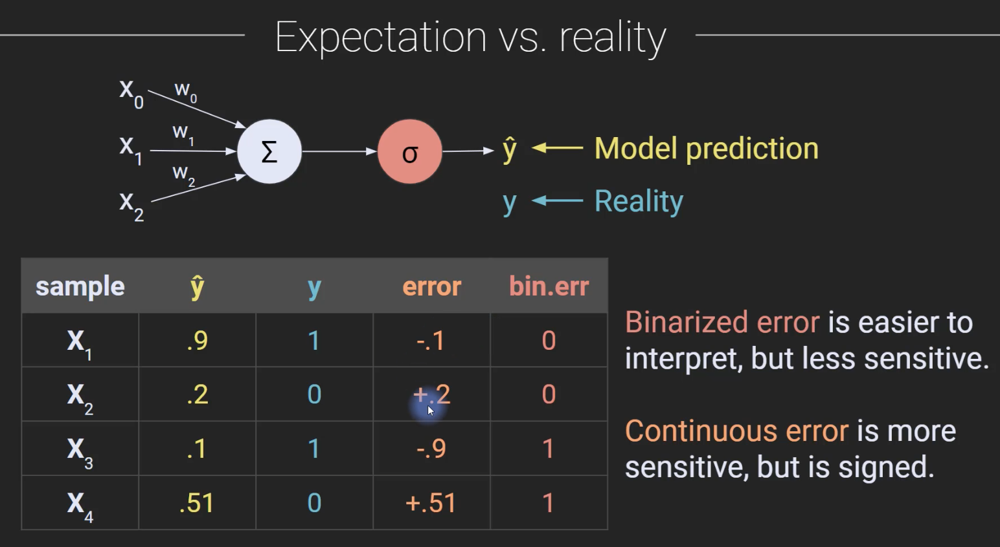
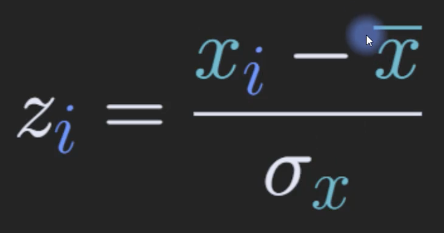
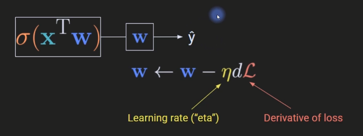
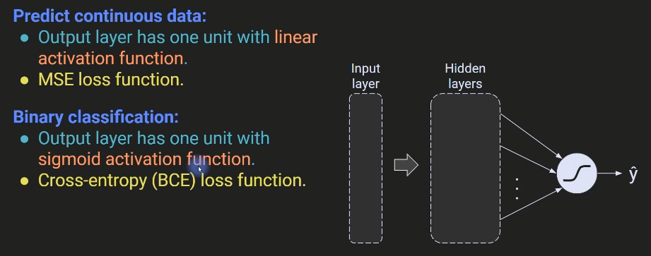
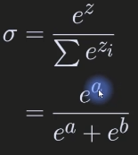
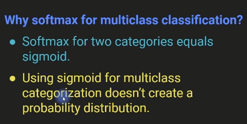
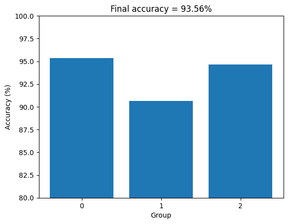
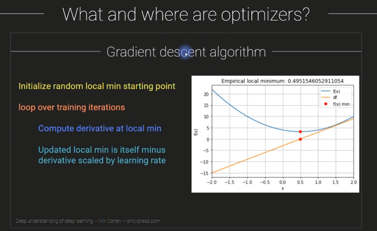
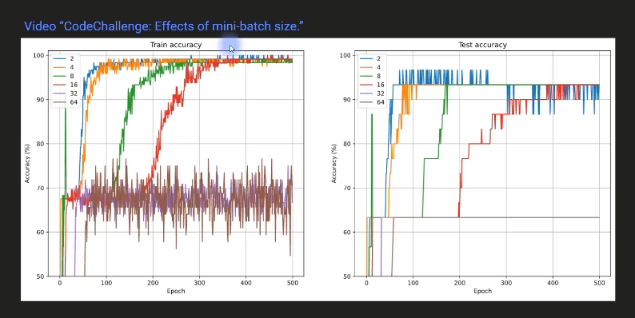

# Deep Learning

- [Deep Learning](#deep-learning)
  - [Math, numpy, PyTorch](#math-numpy-pytorch)
    - [Derivatives: Intuition and polynomials](#derivatives-intuition-and-polynomials)
  - [Gradient descent](#gradient-descent)
    - [Overview of gradient descent](#overview-of-gradient-descent)
    - [What about local minima?](#what-about-local-minima)
      - [Potential problems with gradient descent](#potential-problems-with-gradient-descent)
      - [But does it matter?](#but-does-it-matter)
      - [What to do about it?](#what-to-do-about-it)
    - [Gardient descent in 1D](#gardient-descent-in-1d)
    - [CodeChallenge: unfortuate starting value](#codechallenge-unfortuate-starting-value)
    - [Gradient descent in 2D](#gradient-descent-in-2d)
      - [Derivative, Partial derivatives and Gradient](#derivative-partial-derivatives-and-gradient)
      - [Repeat in 2D](#repeat-in-2d)
    - [CodeChallenge: 2D Gradient ascent](#codechallenge-2d-gradient-ascent)
    - [Parametric experiments on g.d.](#parametric-experiments-on-gd)
    - [CodeChallenge: Fixed vs. dynamic learning rate](#codechallenge-fixed-vs-dynamic-learning-rate)
    - [Vanishing and exploding gradients](#vanishing-and-exploding-gradients)
      - [How to minimize gradient problems](#how-to-minimize-gradient-problems)
  - [ANNs (Artificial Neural Networks)](#anns-artificial-neural-networks)
    - [The perceptron and ANN architecture](#the-perceptron-and-ann-architecture)
      - [The perceptron](#the-perceptron)
      - [Linear vs. nonlinear operations](#linear-vs-nonlinear-operations)
      - [The bias term (aka intercept)](#the-bias-term-aka-intercept)
      - [The full perceptron model](#the-full-perceptron-model)
    - [A geometric view of ANNs](#a-geometric-view-of-anns)
      - [Feature spaces](#feature-spaces)
      - [Categories of model output](#categories-of-model-output)
    - [ANN math part 1 (forward prop)](#ann-math-part-1-forward-prop)
      - [The model and the math](#the-model-and-the-math)
      - [Activation functions](#activation-functions)
      - [All about the weights](#all-about-the-weights)
    - [ANN math part 2 (errors, loss, cost)](#ann-math-part-2-errors-loss-cost)
      - [Loss functions](#loss-functions)
      - [From loss to cost](#from-loss-to-cost)
      - [The goal of DL optimization](#the-goal-of-dl-optimization)
      - [Is anything lost in the cost?](#is-anything-lost-in-the-cost)
    - [ANN math part 3 (backprop)](#ann-math-part-3-backprop)
      - [The shortening](#the-shortening)
      - [From perceptron to deep network](#from-perceptron-to-deep-network)
      - [Backprop is g.d. super-charged](#backprop-is-gd-super-charged)
      - [Backprop and the chain rule](#backprop-and-the-chain-rule)
    - [ANN for regression](#ann-for-regression)
      - [What is a simple regression?](#what-is-a-simple-regression)
      - [Should we use DL for statistics?](#should-we-use-dl-for-statistics)
    - [CodeChallenge: manipulate regression slope](#codechallenge-manipulate-regression-slope)
    - [ANN for classifying qwerties](#ann-for-classifying-qwerties)
    - [Learning rates comparison](#learning-rates-comparison)
    - [Multilayer ANN](#multilayer-ann)
      - [What about overfitting and cross-validation?](#what-about-overfitting-and-cross-validation)
    - [Linear solutions to linear problems](#linear-solutions-to-linear-problems)
      - [Code demonstration first](#code-demonstration-first)
    - [Why multilayer linear models don't exist](#why-multilayer-linear-models-dont-exist)
      - [Layers collapse without nonlinearities](#layers-collapse-without-nonlinearities)
    - [Multi-output ANN](#multi-output-ann)
      - [The iris dataset](#the-iris-dataset)
      - [Model architecture](#model-architecture)
      - [Softmax'ing the outputs](#softmaxing-the-outputs)
    - [CodeChallenge: Many qwerties!](#codechallenge-many-qwerties)
      - [What to do in this codeChallenge](#what-to-do-in-this-codechallenge)
    - [Comparing the number of hidden utnis](#comparing-the-number-of-hidden-utnis)
    - [Depth vs. breadth: Number of parameters](#depth-vs-breadth-number-of-parameters)
      - [Different models, same number of nodes](#different-models-same-number-of-nodes)
    - [Defining models using nn.Sequential vs. class](#defining-models-using-nnsequential-vs-class)
      - [Sequential vs. class](#sequential-vs-class)
      - [The two main functions in a nn.Module class](#the-two-main-functions-in-a-nnmodule-class)
      - [Sequential vs. class: pros and cons](#sequential-vs-class-pros-and-cons)
    - [Model depth vs. breadth](#model-depth-vs-breadth)
    - [CodeChallenge: convert nn.Sequential to class](#codechallenge-convert-nnsequential-to-class)
    - [Diversity of ANN visual representations](#diversity-of-ann-visual-representations)
    - [Reflection: Are DL models understandable yet?](#reflection-are-dl-models-understandable-yet)
  - [Overfitting and cross-validation](#overfitting-and-cross-validation)
    - [What is overfitting and is it as bad as they say?](#what-is-overfitting-and-is-it-as-bad-as-they-say)
      - [The problem with overfitting](#the-problem-with-overfitting)
      - [Over- and Under- fitting: summary](#over--and-under--fitting-summary)
      - [How to know the correct number of parameters?](#how-to-know-the-correct-number-of-parameters)
      - [How to avoid overfitting](#how-to-avoid-overfitting)
      - [Hidden overfitting: researcher degrees of freedom](#hidden-overfitting-researcher-degrees-of-freedom)
      - [How to avoid researcher overfitting](#how-to-avoid-researcher-overfitting)
    - [Cross-validation](#cross-validation)
      - [Cross-validation: terms and sets](#cross-validation-terms-and-sets)
      - [The cross-validation cycle](#the-cross-validation-cycle)
      - [Overfitting and the cross-validation cycle](#overfitting-and-the-cross-validation-cycle)
      - [K-fold cross-validation](#k-fold-cross-validation)
      - [Does cross-validation really prevent overfitting?](#does-cross-validation-really-prevent-overfitting)
    - [Generalization](#generalization)
      - [Generalization and its boundaries](#generalization-and-its-boundaries)
      - [Generalization and accuracy](#generalization-and-accuracy)
    - [Cross-validation - manual separation](#cross-validation---manual-separation)
    - [Cross-validation - scikitlearn](#cross-validation---scikitlearn)
      - [Why an 80/20 split?](#why-an-8020-split)
      - [HUGE dataset - 98/1/1 split](#huge-dataset---9811-split)
    - [Cross-validation - DataLoader](#cross-validation---dataloader)
      - [Same architecture, different batch size](#same-architecture-different-batch-size)
    - [Spliting data into train, devset, and test](#spliting-data-into-train-devset-and-test)
    - [Cross-validation on regression](#cross-validation-on-regression)
  - [Regularization](#regularization)
    - [Regularization: concept and methods](#regularization-concept-and-methods)
      - [Why regularize?](#why-regularize)
      - [Three families of regularizer (in DL)](#three-families-of-regularizer-in-dl)
      - [Node regularization](#node-regularization)
      - [Loss regularization](#loss-regularization)
    - [Data regularization](#data-regularization)
      - [How to think about regularization](#how-to-think-about-regularization)
      - [Which regularization method to use?](#which-regularization-method-to-use)
    - [train() and eval() modes](#train-and-eval-modes)
      - [Training vs. evaluation mode](#training-vs-evaluation-mode)
      - [The recommended way to do it](#the-recommended-way-to-do-it)
    - [Dropout Regularization](#dropout-regularization)
      - [Dropout regularization: how it works](#dropout-regularization-how-it-works)
      - [Dropout regularization: what it does](#dropout-regularization-what-it-does)
      - [Dropout: Scenes from the original paper](#dropout-scenes-from-the-original-paper)
    - [Dropout regularization in practice](#dropout-regularization-in-practice)
    - [Dropout example 2](#dropout-example-2)
    - [Weight Regularization (L2/L2): math](#weight-regularization-l2l2-math)
      - [Recap: The goal of DL algorithms](#recap-the-goal-of-dl-algorithms)
      - [What to regularize for?](#what-to-regularize-for)
      - [The difference between L1 and L2](#the-difference-between-l1-and-l2)
      - [How much to regularize?](#how-much-to-regularize)
      - [What else to regularize for?](#what-else-to-regularize-for)
      - [Why does regularization reduce overfitting?](#why-does-regularization-reduce-overfitting)
      - [When to use L1/L2 regularization?](#when-to-use-l1l2-regularization)
    - [L2 regularization in practice](#l2-regularization-in-practice)
    - [L1 regularization in practice](#l1-regularization-in-practice)
    - [Training in mini-batches](#training-in-mini-batches)
      - [What is a mini-batch?](#what-is-a-mini-batch)
      - [How and why to train with mini-batches?](#how-and-why-to-train-with-mini-batches)
      - [Why does batch-training regularize?](#why-does-batch-training-regularize)
      - [Mini-batch analogy](#mini-batch-analogy)
    - [Batch training in action](#batch-training-in-action)
    - [The importance of equal batch sizes](#the-importance-of-equal-batch-sizes)
    - [CodeChallenge: Effects of mini-batch size](#codechallenge-effects-of-mini-batch-size)
  - [Metaparameters (activations, optimizers)](#metaparameters-activations-optimizers)
    - [What are metaparameters?](#what-are-metaparameters)
      - [(Meta)parameters](#metaparameters)
      - [Many metaparameters](#many-metaparameters)
      - [More parameters, more problems](#more-parameters-more-problems)
    - [The wine quality dataset](#the-wine-quality-dataset)
      - [Background: What makes a good wine?](#background-what-makes-a-good-wine)
    - [CodeChallenge: Minibatch size in the wine dataset](#codechallenge-minibatch-size-in-the-wine-dataset)
    - [Data normalization](#data-normalization)
      - [The problem with non-normalized data](#the-problem-with-non-normalized-data)
      - [Z-transform](#z-transform)
      - [Min-max scaling: the main idea](#min-max-scaling-the-main-idea)
      - [Which normalization to use?](#which-normalization-to-use)
    - [The importance of data normalization](#the-importance-of-data-normalization)
      - [What to do](#what-to-do)
      - [Which is which?](#which-is-which)
    - [Batch normalization](#batch-normalization)
      - [Normalize the input... which input?](#normalize-the-input-which-input)
      - [Mechanism of batch normalization](#mechanism-of-batch-normalization)
      - [Batch normalization and train/test](#batch-normalization-and-traintest)
      - [Discussion](#discussion)
      - [Is batchnorm always great?](#is-batchnorm-always-great)
    - [Batch normalization in practice](#batch-normalization-in-practice)
    - [CodeChallenge: Batch-normalize the qwerties](#codechallenge-batch-normalize-the-qwerties)
      - [Blast from the past](#blast-from-the-past)
      - [What to do](#what-to-do-1)
    - [Activation functions](#activation-functions-1)
      - [Why do DL models need activation functions?](#why-do-dl-models-need-activation-functions)
      - [Desired qualities in an activation function](#desired-qualities-in-an-activation-function)
      - [Commoly used activation functions](#commoly-used-activation-functions)
        - [Sigmoid](#sigmoid)
        - [Hyperbolc tangent](#hyperbolc-tangent)
        - [ReLU](#relu)
      - [ReLU variants](#relu-variants)
      - [Comprehensive list of activation functions](#comprehensive-list-of-activation-functions)
      - [How to pick an activation function?](#how-to-pick-an-activation-function)
    - [Activation functions in PyTorch](#activation-functions-in-pytorch)
      - [Differences between torch and torch.nn](#differences-between-torch-and-torchnn)
    - [Activation functions comparison](#activation-functions-comparison)
    - [CodeChallenge: Compare relu variants](#codechallenge-compare-relu-variants)
      - [What to do](#what-to-do-2)
    - [CodeChallenge: Predict sugar](#codechallenge-predict-sugar)
      - [Background: What makes a sugary wine?](#background-what-makes-a-sugary-wine)
      - [Solution](#solution)
    - [Loss functions](#loss-functions-1)
      - [Reminder of why we need losses](#reminder-of-why-we-need-losses)
      - [Loss functions](#loss-functions-2)
      - [Cross-entropy loss](#cross-entropy-loss)
      - [Binary vs. multiclass cross-entropy](#binary-vs-multiclass-cross-entropy)
      - [Other loss functions - Kullback-Leibler divergence](#other-loss-functions---kullback-leibler-divergence)
      - [Output layer architectures](#output-layer-architectures)
      - [Sigmoid vs . Softmax](#sigmoid-vs--softmax)
      - [Softmax vs. log-softmax](#softmax-vs-log-softmax)
    - [Loss functions in PyTorch](#loss-functions-in-pytorch)
      - [Mean-squared error](#mean-squared-error)
      - [Binary cross-entropy](#binary-cross-entropy)
      - [Categorical cross-entropy](#categorical-cross-entropy)
      - [Creating your own custom loss function](#creating-your-own-custom-loss-function)
    - [More practice with multioutput ANNs](#more-practice-with-multioutput-anns)
      - [Haven't we already done multiclass ANNs?](#havent-we-already-done-multiclass-anns)
    - [Optimizers (minibatch, momentum)](#optimizers-minibatch-momentum)
      - [What and where are optimizers?](#what-and-where-are-optimizers)
      - [Stochastic gradient descent](#stochastic-gradient-descent)
      - [SGD on mini-batches](#sgd-on-mini-batches)
      - [Mini-batch stochastic gradient descent](#mini-batch-stochastic-gradient-descent)
      - [What is momentum?](#what-is-momentum)
      - [SGD with momentum](#sgd-with-momentum)
      - [Why do they call it momentum?](#why-do-they-call-it-momentum)
    - [SGD with momentum](#sgd-with-momentum-1)

## Math, numpy, PyTorch

### Derivatives: Intuition and polynomials

- Intuition of the derivative ('how things change')
- How to compute the derivative of a polynomial


Derivatives point in the direction of increases and decreases in a mathematical function.

In DL, the goal (e.g. classification) is represented as an error function. Thus, the best solution is the point with the smallest error.

The derivative tells us which way to `move` in that error landsacpe in order to find the optimal solution.

DL wouldn't work without derivatives.

- sympy : symbolic math in Python

[DUDL_math_derivatives1.ipynb](../math/DUDL_math_derivatives1.ipynb)

## Gradient descent

### Overview of gradient descent

- What `gradient descent` means and why we need it
- The gradient descent algorithm

How deep learning models learn:

1. Guess a solution
2. Coumpute the error (mistakes)
3. Learn from mistakes and modify the parameters


> - https://www.kdnuggets.com/2018/06/intuitive-introduction-gradient-descent.html

The fucntion and its derivative

$$f(x) = 3x^2 - 3x + 4$$

$$\frac{df}{dx} = 6x - 3$$

Gradient descent algorithm

1. Initialize random guess of minium
2. loop over training iterations
   1. Compute derivative at guess min
   2. Updated guess min is itself minus derivative scaled by learning rate

### What about local minima?

- Potential problems with the g.d. algorithm
- Why it's hard to know whether this is a serious issue
- Two possible strategies to avoid local minima

#### Potential problems with gradient descent

Gradient descent is guaranteed to go `downhill`.

It is not guaranteed to find the corret - or even the best solution!

Gradient descent can go wrong if parameters are not set right for the particular error landsacpe.

Error landscapes are impossible to visualize in > 2D.


#### But does it matter?

The success of deep learning, in spite of the problems with gradient descent, remains a mystrery.

It is possible that there are many good solutions (many equally good local minima). This interpretation is consistent with the huge diversity of weight configurations that produce similar model performance.

Another possibility is there are exterememly few local minima in high-dimensional space. This interpretation is consistent with the complexity and absurd dimensionality of DL models.


`G.D. will get trapped in a local minium only if that point is a minimum in all dimensions!`

`In an extremely high-D space, there might be very few local minima.`

#### What to do about it?

When model performance is good, don't worry about local minima.

One possible solution: `Re-train the model many times using different random weights` (different starting locations on the loss landsacpe) and pick the model that does best.

Another possible solution: `Increase the dimensionality (complexity) of the model to have fewer local minima.`

### Gardient descent in 1D

[DUDL_GradientDescent_1D.ipynb](../gradientDescent/DUDL_GradientDescent_1D.ipynb)

### CodeChallenge: unfortuate starting value

- Gain more experience with writing functions and their derivatives
- See what happends when the starting value is exactly incorrect

Step 1 : Repeat 1D g.d. to find minimun of the following functions:

$$ f(x) = cos(2 \pi x)+x^2, x \in \{-2, 2\} $$

미분 계산시

- 직접 계산
- sympy 활용 ([DUDL_math_derivatives1.ipynb](../math/DUDL_math_derivatives1.ipynb))

Step 2: Hard-code a starting value of x=0.

[DUDL_GradientDescent_CodeChallengeStartValue.ipynb](../gradientDescent/DUDL_GradientDescent_CodeChallengeStartValue.ipynb)

### Gradient descent in 2D

- See that gradient descent is the same in 2D as in 1D
- Further visualize the difficulty of finding global minima

#### Derivative, Partial derivatives and Gradient


- Derivative : the slope of the function at any given point
- Partial derivatives : the derivatives of the function, ignoring one dimension and only focusing on the other dimension


- Gradient : just a collection of all the partial derivatives with respect to all the dimensions of that function.


- ∇ : Nabla, it's just a collection of all the partial derivatives with respect to all of the different directions or dimensions of the data

#### Repeat in 2D


1. Compute the partial derivatives of the function using sympy and lambdify.

2. Repeat the gradient descent loop

Note that the local min is (x, y).

Visualize!


[DUDL_GradientDescent_2D.ipynb](../gradientDescent/DUDL_GradientDescent_2D.ipynb)

### CodeChallenge: 2D Gradient ascent

The thing to do:

- Modify the 2D gradient descent code to perform gradient ascent. Find the local maximum!

- There are two ways to solve this; find both!

[DUDL_GradientDescent_2D.ipynb](../gradientDescent/DUDL_GradientDescent_2D.ipynb)

위 코드에 수정을 가해서 부호를 고민하면 된다.

### Parametric experiments on g.d.

- Learn how to setup and run parametric experiments!
- Understand the importance of starting values, learning rate, and training iterations, in gradient descent.
- See (yet again!) that gradient descent is an amazing algorithm but is not guaranteed to give the correct answer.

Repeat the model from the 1D video.


Conduct a one-variable experiment using:

  1. Initial value
  2. Learning rate

Conduct a two-variable experiment using:

  1. Learning rate AND training epochs

[DUDL_GradientDescent_experiment.ipynb](../gradientDescent/DUDL_GradientDescent_experiment.ipynb)

- Experiment 1: systematically varying the starting locations


- Experiment 2: systematically varying the learning rate


- Experiment 3: interaction between learning rate and training epochs


### CodeChallenge: Fixed vs. dynamic learning rate

- Learn that the model learning rate does not need to have a static value.
- Think about different ways to change the learning rate, and when certain methods can fail.

Copy code from [DUDL_GradientDescent_1D.ipynb](../gradientDescent/DUDL_GradientDescent_1D.ipynb)

Think about how to change the learning rate.

1. Time (training epoch)
2. Derivative
3. Loss
4. Current local minimum value

Implement and test your idea in code!

Think critically about how your code might fail.

[DUDL_GradientDescent_codeChallenge_lr.ipynb](../gradientDescent/DUDL_GradientDescent_codeChallenge_lr.ipynb)


Possible ways to proportionate the learning rate:

1. Training epoch: Good method, often done in blocks. But unrelated to model performance/accuracty.
   - This method is called `learning rate decay` and you'll learn more about it later in the section `Metaparameters`.
2. Derivative : Adaptive to the problem. Requires additional parameters and appropriate scaling
   - This method is incorporated into `RMSprop` and `Adam` optimizers, and you'll learn more about it later in the section `Metaparameters`.
3. Loss: Adaptive to the problem. Works only when loss is in range of `[0, 1]` (scaling possible)
4. Current local minimum value: Adaptive to the problem. Too many assumptions for this generally to be a good idea.

### Vanishing and exploding gradients

- About the vanishing and exploding gradient problems in DL (and backprop-optimization more generally).
- A few strategies for avoiding these problems (details come later in the coures)


Vanishing gradient:

Weights don't change -> no learning. Problematic for deep networks.

Exploding gradient:

Weights change wildly -> bad solutions.

#### How to minimize gradient problems

- Use models with few hidden layers.
- Use activation functions that do not saturate (e.g., ReLU)
- Apply weight normalization.
- Pre-train networks using autoencoders.
- Use regularization techniques like batch normalization, dropout, and weight decay.
- Use architectures like residual networks (`resnet`).

## ANNs (Artificial Neural Networks)

### The perceptron and ANN architecture

- the basic architecture of an ANN
- the linear and nonlinear components of an artificial neural network.
- several key terms of neural networks.

#### The perceptron


#### Linear vs. nonlinear operations

- Linear : Addition and multiplication
- Nonlinear : Anything else

Linear models only solve linearly separable problems.

Nonlinear models can solve more complex problems.

Never use a linear model for a nonlinear problem, and never use a nonlinear model for a linear problem!


#### The bias term (aka intercept)


#### The full perceptron model


### A geometric view of ANNs

- More on the basic architecture of an ANN
- What the term `feature space` and `separating hyperplan` mean
- How to visualize the types of ANN predictions

#### Feature spaces


#### Categories of model output


### ANN math part 1 (forward prop)

- half of the math of ANNs (and therefore also DL!)
- More about biases, weights, and activation functions.
- How ANNs classify inputs.

#### The model and the math


#### Activation functions


#### All about the weights


### ANN math part 2 (errors, loss, cost)

- More of the math underlying ANNs.
- Different categories of errors, and their corresponding loss functions.
- The difference between loss and cost.



#### Loss functions


#### From loss to cost


#### The goal of DL optimization


#### Is anything lost in the cost?


- Why train on cost and not loss?
- Training on each sample is time-consuming and may lead to overfitting.
- But averaging over too many samples may decrease sensitivity.
- A good solution is to train the model in `batches` of samples.

### ANN math part 3 (backprop)

- More of the math underlying ANNs.
- How the gradient descent algorithm is extended to DL.
- That all nodes in a network are the same.

#### The shortening


#### From perceptron to deep network


Forward propagation: Compute output based on input.

Backwards propagation (backprop) : Adjust the weights based on loss/cost.

#### Backprop is g.d. super-charged


#### Backprop and the chain rule


### ANN for regression

- What a regression is.
- How to construct an ANN model for simple regresison.

#### What is a simple regression?

Simple regression means to predict one continuous variable from another.


[DUDL_ANN_regression.ipynb](../ANN/DUDL_ANN_regression.ipynb)


#### Should we use DL for statistics?

If DL is so great, why don't we all switch to DL models instead of traditional statistical models?

This in an important and ongoing discussion, but traditional statistical models tend to work better on smaller datasets, are better mathematically characterized (e.g., guaranteed optimal solutions), and are more interpretable.

### CodeChallenge: manipulate regression slope

- Further explore ANNs for regression.
- Understand the difference between predicting data vs. prediction data relationships.

Your mission:

1. Write a python function (def) that builds and trains the model, and outputs the final predictions and losses
2. Write a function that creates the data and outputs x, y. x is the same as in the previous video. y = m*x + randn/2. N=50.
3. In a parametric experiment, vary the slope from -2 to +2 in 21 steps. Repeat the entire experiment 50 times.
4. Plot the loss and accuracy (correlation of ŷ, y) as a function of the slope

[DUDL_ANN_codeChallenge_regression.ipynb](../ANN/DUDL_ANN_codeChallenge_regression.ipynb)

### ANN for classifying qwerties

- What a qwerty is (hint: it's a meaningless name that I thought would be cute).
- How to construct an ANN model for binary classification.
- Why it's dangerous to assume that ANNs always work.


### Learning rates comparison

- How to put the model-creation and model-training code into callable functions.
- How to run parametric experiments with ANN models.
- The effects of learning rate on performance.
- That puzzling results provide a great learning opportunity!

[DUDL_ANN_learningrates.ipynb](../ANN/DUDL_ANN_learningrates.ipynb)


### Multilayer ANN

- More terminology of DL
- About implementing multiplayer ANN models.


[DUDL_ANN_multilayer.ipynb](../ANN/DUDL_ANN_multilayer.ipynb)


#### What about overfitting and cross-validation?


### Linear solutions to linear problems

- The mystery of the qwerties!
- The difference between linear and nonlinar models.

#### Code demonstration first

Goal: Rerun the code file [DUDL_ANN_multilayer.ipynb](../ANN/DUDL_ANN_multilayer.ipynb), but remove the nonlinear activation functions from the hidden layers (keep the final output nonlinearity).

What to look for: How does linear model performance compare to nonlinear model performance?

Conclusion: That's for you to figure out!

Simple problems require simple solutions.

Qwuerties are linearly separable, so a linear separator will out-perform a nonlinear separator.

Nonlinear models (basically all of DL) are best-suited for complex nonlinear problems.

Appropriate methods for separating qwerties include a logistic regression and k-means.

- Don't throw a complicated DL model at every problem, just because you can.
- Approach every problem with an open, analytic, createive, and critical mind.
- Just because you can doesn't mean you should.

### Why multilayer linear models don't exist

- The math of multilayer linear models.
- Why a `multi-layer` linear model is really just one layer, as long as there are no nonlinear activation units.

#### Layers collapse without nonlinearities


All the weights just get to be combined into one sigle layer.


### Multi-output ANN

- How to extend the ANN to provide multiple outputs in a classification problem
- More about creating DL networks in pytorch.
- All about the famous `iris` dataset

#### The iris dataset


#### Model architecture


Terminology: `Fully connected` means that each node in layer n projects to each node in layer n+1. Each connection has its own weight.

#### Softmax'ing the outputs


[DUDL_ANN_multioutput.ipynb](../ANN/DUDL_ANN_multioutput.ipynb)


### CodeChallenge: Many qwerties!

- Gain more experience working with ANNs for multiple outputs
- Gain more experience copy/pasting/modifying code. A suuuuper important skill in DL!

#### What to do in this codeChallenge

Integrate two notebooks:

- [DUDL_ANN_classifyQwerties.ipynb](../ANN/DUDL_ANN_classifyQwerties.ipynb)
- [DUDL_ANN_multioutput.ipynb](../ANN/DUDL_ANN_multioutput.ipynb)

Make three groups of qwerties and train a 3-output ANN to classify them.

I used a 2-4-3 layer architecture, but you can use a different architecture.


[DUDL_ANN_codeChallengeQwerties.ipynb](../ANN/DUDL_ANN_codeChallengeQwerties.ipynb)


### Comparing the number of hidden utnis

- More about using ANNs to predict flowers in the iris dataset.
- How to parametrically change model architecture.
- More about model complexity and performance.

Goal: Classify flowers using a model with one hidden layer, but parametrically change the number of hidden units from 1 to 128. Plot classification accuracy as a function of the model size.

[DUDL_ANN_nHiddenUnits.ipynb](../ANN/DUDL_ANN_nHiddenUnits.ipynb)


### Depth vs. breadth: Number of parameters

- How models with the same number of nodes can have different numbers of parameters.
- How to count the number of trainable parameters in pytorch.
- Another reason why deep models are so powerful.


#### Different models, same number of nodes


[DUDL_ANN_numParameters.ipynb](../ANN/DUDL_ANN_numParameters.ipynb)

### Defining models using nn.Sequential vs. class

- The two approaches to defining models in PyTorch.
- Advantages and limitations of each approach.

#### Sequential vs. class


#### The two main functions in a nn.Module class


#### Sequential vs. class: pros and cons


[DUDL_ANN_seqVsClass.ipynb](../ANN/DUDL_ANN_seqVsClass.ipynb)


### Model depth vs. breadth

- More about the deepness of DL models.
- How to parametrically change model architecture.
- More about model complexity and performance.

Depth: The number of hidden layers (layers between input and output)

Breadth/width: The number of units per hidden layer (can vary across layers).

[DUDL_ANN_breadthVsDepth.ipynb](../ANN/DUDL_ANN_breadthVsDepth.ipynb)


What have we learned?

- Deeper models are not necessarily better. They require more training and more FLOPs.
- Model performance is not simply a function of the number of trainable parameters. Architecture matters.
- Shallow models learn fast, but deeper models can learn more complex mappings. (Not demonstrated here)

### CodeChallenge: convert nn.Sequential to class

- Gain more experience with creating DL models using the nn.Module class
- Become more familiar with developing models that can be flxibly adapted (important for advanced topcis and applications!).

Make a copy of the notebook [ANN/DUDL_ANN_multilayer.ipynb](../ANN/DUDL_ANN_multilayer.ipynb)

Recreate the model using a Python class instead of using nn.Sequential.

Re-run the code to make sure it still works!

[DUDL_ANN_codeChallengeSeq2class.ipynb](../ANN/DUDL_ANN_codeChallengeSeq2class.ipynb)

### Diversity of ANN visual representations

There is no lecture; this is a small assignment for you, which will help you appreciate the diversity of how ANNs are visualized.

Your task: Open a new Internet browser search for "ANN architecture." Look at the image results.

Notice the diversity -- and commonalities -- in how models are visualized, including the layers, weights, and activation functions. There is no simple, universal, widely agreed-upon format for illustrating ANN models (and deep learning models more generally).

### Reflection: Are DL models understandable yet?

- Think critically about whether we `understand` the ANN models we've worked with so far.
- Appreciate what simple complex systems mean.
- Be excited to learn methods to understand (a little bit...) models later in the course!

Hey, the model is awesome! It works!

But... how does it work? What is it `thinking`?

Take-home messages

The model is simple: Every node implements an equation so simple we could compute it by hand.

The model is complex: The nonlinearities and interactions across hundreds of parameters (weights) means that we have no idea what each node is actually encoding.

Is it hopeless? Nope! There are wyas to interrogate individual nodes. You'll learn those later in the courese.

Do you want this model to make major life decisions for you? Yikes! Let's hold off on this thorny issue until the Ethics section.

Appropriate applications for DL

DL is best for complex classifiction tasks, when you don't need to know how the classification works.

DL is less appropriate for gaining mechanistic insights into how a system behaves, and why.

Traditional statistical models (e.g. ANOVA or regression) are more appropriate for mechanistic insights into system behavior.

Is it hopeless? Nope! Mechanistic interpretations of DL are slowly improving. It is possible that in the future, DL will be beneficial for understanding, not oly for classifying.

## Overfitting and cross-validation

### What is overfitting and is it as bad as they say?

- The terms `underfitting` and `overfitting`.
- Why overffitting is more unanced than typically discussed.
- The insidious dangers of `researcher overfitting`.

#### The problem with overfitting


Overfitting limits our ability to generalize the pattern to new data. So in this particular example, the model with fewer parameters is better and the model with more parameters.

But that, of course, is not a general claim. We should not always say that simpler models with fewer parameters are better.

In fact, here's the opposite problem.


#### Over- and Under- fitting: summary

- Overfitting
  - Overly sensitive to noise
  - Increased sensitivity to subtle effects
  - Reduced generalizability
  - Over-parameterized models become difficult to estimate
- Underfitting
  - Less sensitive to noise
  - Less likely to detect true effects
  - Reduced generalizability
  - Parameters are better estimiated
  - Good results with less data

#### How to know the correct number of parameters?

With 1-2 dimensions: Visualize the data and make an informed decision.

With 3+ dimensions: Use cross-validation (next lecture)

#### How to avoid overfitting

1. Use cross-validation (training/hold-out/test sets).
2. Use regularization (L2, drop-out, data manipulations, early stopping)

#### Hidden overfitting: researcher degrees of freedom

Researcher degrees of freedom: The researcher has many choices for how to clean, organize, and select the data; and which models and how many models to run.

Example: Test models A, B, and C on the same data. Go back and clean the data again with different criteria, then test the three models again. Publish model B with re-cleaned data, which worked best on the test set.

#### How to avoid researcher overfitting

1. Decide on the model architecture in advance, and make only minor adjustments. Feasible for frequently-studied problems.
   - image recognition you start from the resnet, transfer learning
2. Build a series of models but never use the test set until all models are trained (kaggle-like competition). Best for new problems or new models.

### Cross-validation

- The terminology of cross-validation
- Why cross-validation helps minimize overfitting.
- The (often-unspoken) assumption that makes or break cross-validation.

#### Cross-validation: terms and sets


It turns out that whether this is or isn't overfitting depends on a key assumption of correlation and orthogonaility of data. That's an assumption that I will talk about later.

#### The cross-validation cycle


#### Overfitting and the cross-validation cycle


#### K-fold cross-validation


#### Does cross-validation really prevent overfitting?

Crucial assumption of cross-vallidation: The hold-out and test sets are independent of (uncorrelated with) the training set.

Example of assumption validity: Train a model to label pictures of pets as `cat`, `dog`, `bird`, or `wallabee`. Test set is pictures taken by people whose pictures were not in the training or hold-out sets.

Example of assumption violation: Train a model to predict age based on pictures of people's faces. Test set is pictures of their siblings.

> What is the problem with that? The problem is that although these are technically different pictures, there's a very, very strong correlation between how one person looks and their brother or sister. So the test set is technically different from the training set, but there are going to be strong correlations bewteen the data in the test set and the data in the training set. Again, the problem with this is that it limits the ability of the model to generalize to new data.

Example of assumption violation: Train a model to predict market value of homes. Training set is randomly selected homes in a city. Test set is homes next door.

> On the one hand, the homes next doors are different. They are independent homes, but they're certainly not going to be uncorrelated with the homes in the training set. Of course, the value of one house is going to be very strongly correlated with the value of the neighbours.


Conclusion: Overfitting is not intrinsically bad. `overfitting reduces generalizability`, which may or may not be problematic depending on the goals and scope of the model.

### Generalization

- More about what generalization means and why it's important
- How to think about generalization boundaries.

#### Generalization and its boundaries

Generalization: The model works well when applied to new data

Generalization boundaries: The population you want to apply the model to

Simple example: we are trying to predict weight based on height and the number of calories consumed.


Generalization boundaries:

- Must work on adult humans (both sexes, all countries).
- Doesn't need to work on children.
- Doesn't need to work on non-human animals


Generalization boundaries:

- Must work on city A.
- Doesn't need to work in any other city.

#### Generalization and accuracy

Important: Generalization entails some loss of accuracy!

The trick is to build a model that does well within the generalization boundaries.

Decide your generalization boundaries carefully.

Have examples from those populations in the training/hold-out/test sets.

### Cross-validation - manual separation

- How to implement cross-validation `manually` using numpy.
- How to perform cross-validation on the iris dataset classification problem.

[DUDL_overfitting_manual.ipynb](../overfitting/DUDL_overfitting_manual.ipynb)

다음은 단순하게 비율로 학습용 데이터셋과 테스트용 데이터셋을 분리하는 예제이다.

```py
#  (no devset here)

# how many training examples
propTraining = .8 # in proportion, not percent
nTraining = int(len(labels)*propTraining)

# initialize a boolean vector to select data and labels
traintestBool = np.zeros(len(labels),dtype=bool)

# is this the correct way to select samples?
traintestBool[range(nTraining)] = True

# this is better, but why?
# items2use4train = np.random.choice(range(len(labels)),nTraining,replace=False)
# traintestBool[items2use4train] = True

traintestBool
```

전체 데이터를 분포를 고려하지 않고 그냥 비율로 잘라버렸다.

```text
array([ True,  True,  True,  True,  True,  True,  True,  True,  True,
        True,  True,  True,  True,  True,  True,  True,  True,  True,
        True,  True,  True,  True,  True,  True,  True,  True,  True,
        True,  True,  True,  True,  True,  True,  True,  True,  True,
        True,  True,  True,  True,  True,  True,  True,  True,  True,
        True,  True,  True,  True,  True,  True,  True,  True,  True,
        True,  True,  True,  True,  True,  True,  True,  True,  True,
        True,  True,  True,  True,  True,  True,  True,  True,  True,
        True,  True,  True,  True,  True,  True,  True,  True,  True,
        True,  True,  True,  True,  True,  True,  True,  True,  True,
        True,  True,  True,  True,  True,  True,  True,  True,  True,
        True,  True,  True,  True,  True,  True,  True,  True,  True,
        True,  True,  True,  True,  True,  True,  True,  True,  True,
        True,  True,  True, False, False, False, False, False, False,
       False, False, False, False, False, False, False, False, False,
       False, False, False, False, False, False, False, False, False,
       False, False, False, False, False, False])
```

```py
# test whether it's balanced
print('Average of full data:')
print( torch.mean(labels.float()) ) # =1 by definition
print(' ')

print('Average of training data:')
print( torch.mean(labels[traintestBool].float()) ) # should be 1...
print(' ')

print('Average of test data:')
print( torch.mean(labels[~traintestBool].float()) ) # should also be 1...
```

```text
Average of full data:
tensor(1.)
 
Average of training data:
tensor(0.7500)
 
Average of test data:
tensor(2.)
```

여기서 학습용 데이터의 평균값이 1이 아니어서 골고루 분산되어 있지 않다.

다음은 랜덤하게 학습용과 테스트용 데이터셋을 분리하는 코드이다.

```py
#  (no devset here)

# how many training examples
propTraining = .8 # in proportion, not percent
nTraining = int(len(labels)*propTraining)

# initialize a boolean vector to select data and labels
traintestBool = np.zeros(len(labels),dtype=bool)

# is this the correct way to select samples?
# traintestBool[range(nTraining)] = True

# this is better, but why?
items2use4train = np.random.choice(range(len(labels)),nTraining,replace=False)
traintestBool[items2use4train] = True

traintestBool
```

```text
array([ True, False,  True,  True,  True,  True, False,  True,  True,
       False,  True,  True,  True,  True, False,  True,  True,  True,
        True,  True, False,  True,  True,  True,  True,  True,  True,
       False, False,  True,  True,  True,  True,  True,  True, False,
        True,  True,  True,  True,  True,  True,  True,  True,  True,
       False, False, False,  True,  True,  True,  True,  True,  True,
       False, False, False,  True, False,  True,  True,  True,  True,
       False,  True, False,  True,  True, False,  True,  True,  True,
        True,  True,  True,  True,  True, False,  True,  True,  True,
        True,  True,  True,  True,  True,  True,  True, False,  True,
        True, False,  True, False,  True,  True,  True,  True,  True,
        True,  True,  True,  True,  True,  True,  True, False,  True,
        True,  True,  True,  True, False,  True,  True,  True,  True,
        True,  True,  True, False,  True,  True, False,  True, False,
        True,  True,  True,  True,  True, False,  True,  True,  True,
        True,  True,  True,  True,  True,  True, False,  True,  True,
        True,  True, False,  True,  True,  True])
```

```py
# test whether it's balanced
print('Average of full data:')
print( torch.mean(labels.float()) ) # =1 by definition
print(' ')

print('Average of training data:')
print( torch.mean(labels[traintestBool].float()) ) # should be 1...
print(' ')

print('Average of test data:')
print( torch.mean(labels[~traintestBool].float()) ) # should also be 1...
```

```text
verage of full data:
tensor(1.)
 
Average of training data:
tensor(1.0250)
 
Average of test data:
tensor(0.9000)
```

학습용 데이터의 평균값이 1에 근접하므로 골고루 분산되어 있다고 할 수 있다.

You learned more about cross-validation and the practical implementation of cross-validation, including the importance of randomly sampling your data to include in the training set versus the test set.

### Cross-validation - scikitlearn

- Learn how to implement cross-validation using scikitlearn.
- Perform a parametric experiment with the fraction of train/test items.

#### Why an 80/20 split?

General idea: Have as much training data as possible, while still have enough holdout and test data.

How much is `enough`?

Depends on the data, model architecture, generalizability, etc.

#### HUGE dataset - 98/1/1 split


- 98% training: 14,055,151
- 1% devset: 141,971
- 1% test: 141,971

[DUDL_overfitting_scikitlearn.ipynb](../overfitting/DUDL_overfitting_scikitlearn.ipynb)

```py
fakedata = np.tile(np.array([1,2,3,4]),(10,1)) + np.tile(10*np.arange(1,11),(4,1)).T
fakelabels = np.arange(10)>4
print(fakedata), print(' ')
print(fakelabels)

# [[ 11  12  13  14]
#  [ 21  22  23  24]
#  [ 31  32  33  34]
#  [ 41  42  43  44]
#  [ 51  52  53  54]
#  [ 61  62  63  64]
#  [ 71  72  73  74]
#  [ 81  82  83  84]
#  [ 91  92  93  94]
#  [101 102 103 104]]
#
# [False False False False False  True  True  True  True  True]

# use scikitlearn to split the data
train_data,test_data, train_labels,test_labels = \
                        train_test_split(fakedata, fakelabels, test_size=.2)

# NOTE the third input parameter above.
# This can be specified as test size or training size.
# Be mindful of which parameter is written!
```

```text
Training data size: (8, 4)
Test data size: (2, 4)
 
Training data: 
[[ 71  72  73  74]
 [ 21  22  23  24]
 [101 102 103 104]
 [ 41  42  43  44]
 [ 11  12  13  14]
 [ 31  32  33  34]
 [ 91  92  93  94]
 [ 81  82  83  84]]
 
Test data: 
[[51 52 53 54]
 [61 62 63 64]]
```

### Cross-validation - DataLoader

- Yet another way to implement cross-validation, using scikitlearn and torch.
- about the DataLoader and Dataset pytorch objects.
- A bit about batches, which are important for speeding up learning and decreasing computation time!


#### Same architecture, different batch size


[DUDL_overfitting_dataLoader.ipynb](../overfitting/DUDL_overfitting_dataLoader.ipynb)

```py
# import libraries
import torch
import torch.nn as nn
import numpy as np
import matplotlib.pyplot as plt
from sklearn.model_selection import train_test_split

# new!
from torch.utils.data import DataLoader

# create our fake dataset
fakedata = np.tile(np.array([1,2,3,4]),(10,1)) + np.tile(10*np.arange(1,11),(4,1)).T
fakelabels = np.arange(10)>4
print(fakedata), print(' ')
print(fakelabels)

# [[ 11  12  13  14]
#  [ 21  22  23  24]
#  [ 31  32  33  34]
#  [ 41  42  43  44]
#  [ 51  52  53  54]
#  [ 61  62  63  64]
#  [ 71  72  73  74]
#  [ 81  82  83  84]
#  [ 91  92  93  94]
#  [101 102 103 104]]
 
# [False False False False False  True  True  True  True  True]

# we need to create a Dataset that contains the data and labels
fakeDataset = torch.utils.data.TensorDataset(torch.Tensor(fakedata),torch.Tensor(fakelabels))
print( fakeDataset.tensors ), print(' ')

# then create another DataLoader
fakedataLdr = DataLoader(fakeDataset, shuffle=True)

# iterate through the data
for dat,lab in fakedataLdr:
  print(dat,lab)

# (tensor([[ 11.,  12.,  13.,  14.],
#         [ 21.,  22.,  23.,  24.],
#         [ 31.,  32.,  33.,  34.],
#         [ 41.,  42.,  43.,  44.],
#         [ 51.,  52.,  53.,  54.],
#         [ 61.,  62.,  63.,  64.],
#         [ 71.,  72.,  73.,  74.],
#         [ 81.,  82.,  83.,  84.],
#         [ 91.,  92.,  93.,  94.],
#         [101., 102., 103., 104.]]), tensor([0., 0., 0., 0., 0., 1., 1., 1., 1., 1.]))
 
# tensor([[91., 92., 93., 94.]]) tensor([1.])
# tensor([[31., 32., 33., 34.]]) tensor([0.])
# tensor([[71., 72., 73., 74.]]) tensor([1.])
# tensor([[41., 42., 43., 44.]]) tensor([0.])
# tensor([[61., 62., 63., 64.]]) tensor([1.])
# tensor([[51., 52., 53., 54.]]) tensor([0.])
# tensor([[81., 82., 83., 84.]]) tensor([1.])
# tensor([[101., 102., 103., 104.]]) tensor([1.])
# tensor([[21., 22., 23., 24.]]) tensor([0.])
# tensor([[11., 12., 13., 14.]]) tensor([0.])

# use scikitlearn to split the data
train_data,test_data, train_labels,test_labels = train_test_split(fakedata, fakelabels, test_size=.2)

# then convert them into PyTorch Datasets
train_data = torch.utils.data.TensorDataset(
     torch.Tensor(train_data),torch.Tensor(train_labels))

test_data = torch.utils.data.TensorDataset(
     torch.Tensor(test_data),torch.Tensor(test_labels))

# finally, translate into dataloader objects
# notice the batches (see next cell)!
train_loader = DataLoader(train_data,batch_size=4)
test_loader  = DataLoader(test_data)

# examine the contents of the dataloader (batching is an advantage of dataloader!)
print('TRAINING DATA')
for batch,label in train_loader: # iterable
  print(batch,label)
  print(' ')


print(' ')
print('TESTING DATA')
for batch,label in test_loader: # iterable
  print(batch,label)
  print(' ')

# TRAINING DATA
# tensor([[81., 82., 83., 84.],
#         [21., 22., 23., 24.],
#         [11., 12., 13., 14.],
#         [31., 32., 33., 34.]]) tensor([1., 0., 0., 0.])
 
# tensor([[ 51.,  52.,  53.,  54.],
#         [ 61.,  62.,  63.,  64.],
#         [101., 102., 103., 104.],
#         [ 41.,  42.,  43.,  44.]]) tensor([0., 1., 1., 0.])
 
 
# TESTING DATA
# tensor([[91., 92., 93., 94.]]) tensor([1.])
 
# tensor([[71., 72., 73., 74.]]) tensor([1.])
```

```py
# train the model

# global parameter
numepochs = 500

def trainTheModel():

  # initialize accuracies as empties (not storing losses here)
  trainAcc = []
  testAcc  = []

  # loop over epochs
  for epochi in range(numepochs):


    # loop over training data batches
    batchAcc = []
    for X,y in train_loader:

      # forward pass and loss
      yHat = ANNiris(X)
      loss = lossfun(yHat,y)
      
      # backprop
      optimizer.zero_grad()
      loss.backward()
      optimizer.step()

      # compute training accuracy just for this batch
      batchAcc.append( 100*torch.mean((torch.argmax(yHat,axis=1) == y).float()).item() )
    # end of batch loop...


    # now that we've trained through the batches, get their average training accuracy
    trainAcc.append( np.mean(batchAcc) )

    # test accuracy
    X,y = next(iter(test_loader)) # extract X,y from test dataloader
    predlabels = torch.argmax( ANNiris(X),axis=1 )
    testAcc.append( 100*torch.mean((predlabels == y).float()).item() )
  
  # function output
  return trainAcc,testAcc
```

### Spliting data into train, devset, and test

- Have a reminder about the difference between devset (aka hold-out) and test.
- Learn how to partition the data into these three sets manually and in scikitlearn.

[DUDL_overfitting_trainDevsetTest.ipynb](../overfitting/DUDL_overfitting_trainDevsetTest.ipynb)

```py
# specify sizes of the partitions
# order is train,devset,test
partitions = [.8,.1,.1]

# split the data (note the third input, and the TMP in the variable name)
train_data,testTMP_data, train_labels,testTMP_labels = \
                   train_test_split(fakedata, fakelabels, train_size=partitions[0])

# now split the TMP data
split = partitions[1] / np.sum(partitions[1:])
devset_data,test_data, devset_labels,test_labels = \
              train_test_split(testTMP_data, testTMP_labels, train_size=split)
```

### Cross-validation on regression

- See another example of cross-validation using the regression data from the previous section
- Gain more experience with DL.

[DUDL_overfitting_regression.ipynb](../overfitting/DUDL_overfitting_regression.ipynb)


## Regularization

### Regularization: concept and methods

- The motivation for reuularization
- The three families of regularization methods
- How to think about regularization.

#### Why regularize?

Regularization

- Penalizes memorization (over-learning examples)
- Helps the model generalize to unseen examples
- Changes the representations of learning (either more sparse or more distributed depending on the regularizer)

Other observations

- Can increase or decrease training time.
- Can decrease training accuracy but increase generalization.
- Works better for large models with multiple hidden layers
- Generally works better with sufficent data.

#### Three families of regularizer (in DL)

Family 1: Modify the model (drop out).

Family 2: Add a cost to the loss function (L1/2).

Family 3: Modify or add data (batch training, data augmentation, normalization).

---

Node regularization: Modify the model (dropout).

Loss regularization: Add a cost to the loss function (L1/2).

Data regularization: Modify or add data (batch training, data augmentation, normalization)

#### Node regularization


> Nobody really understands exactly why dropout works, but it does work really well.

#### Loss regularization


> `Something(L1/2)` makes sure that the weights are staying in a reasonable range that's relatively close to zero.

### Data regularization


> The idea is that we are changing or modifying the data in order to produce a larger dataset.

Now, when you're doing this, when you're doing data augmentation, you have to keep in mind the discussion.

We had several videos ago about cross-validation and selecting training and test data to be orthogonal to each other.

If you used this for the training data and these images for the test data, that is not really an orthogonal split because these images are correlated with this image.

I've just manipulated the pixel values somewhat.

OK, nonetheless, data augmentation is a super popular and very powerful way of increasing the size of your training set for deep learning models in particular.

This is really mostly used in CNN.

#### How to think about regularization

Adds a cost to the complexity of the solution.

Forces the solution to be smooth.

Prevents the model from learning item-specific details.


#### Which regularization method to use?

Some general guidelines for when to use which method.

Oftentimes the best method is problem- or architecture-specific.

In many cases, different regularization methods work equally well.


The main point that I wanted to illustrate to you from this particular figure is that not including any regularization led to worse performance and these five different methods of regularization, all improved performance significantly, but they were all roughly equally comparably good.

So this is something you will also find that sometimes any regularization is better than no regularization.

And exactly which regularization method you use may not matter quite as much.

### train() and eval() modes

- Learn about training and evaluation modes of models in PyTorch.
- Understand the order in which to activation and deactivate training mode.

#### Training vs. evaluation mode

Gradients are computed only during backprop, not during evalution.

Some regularization methods (drop out and batch normalization) are applied only during training, not during evaluation.

Ergo: We need a way to deactivate gradient computations and regularization while evaluating model performance.

|net.train()|net.eval()|torch.no_grad()|
|--|--|--|
|Training mode|Testing mode|Used in testing mode|
|Regularization active|Regularization off|Gardients not computed|
|Necessary for training regularization, on by default.|Necessary when evaluating models with regularization (dropout and batch normalization)|Never necessary, makes large models evaluate faster.|

#### The recommended way to do it


No grad just turns off some unnecessary computations related to keeping track of the gradients.

Again, this code is never necessary, but when you start working with larger, more complex models, it's going to speed up the computation time by not making a bunch of computations that don't actually need to be implemented.

### Dropout Regularization

- Learn more about the mechanism and implications and dropout regularization.

#### Dropout regularization: how it works


Now, in reality, in practice, how this actually works is the units are not actually dropped out of the model.

Instead, their output, their activation is forced to be zero.


We don't drop out any of the nodes during testing, during evaluation or testing.

Now this is actually problematic because here we have fewer units overall in the model that are active.

And so that means that the overall activation, the overall input, for example, into this unit is going to be smaller because here there's only two units that are contributing to the activation of the input in this unit, whereas here during evaluation, there are actually four inputs four units that are providing inputs into this specific unit here.

So that means that the overall input is going to be higher during testing compared to during training.

So this is the problem.

We need to fix this and therefore a solution.

One solution to resolving this issue is that during test, we multiply all of these weights by `one minus p` so that scaling down the weights according to the probability of dropping those weights.


So here there's only two units that are contributing to this unit, 


but during testing, there are four units.


However, each of these four units, individually, the weights individually are scaled down by, you know, in this case, point five or whatever is the probability of dropping.

So that means that the overall magnitude of the input from each of these units into this unit is going to decrease.

But the overall amount of input, the overall magnitude of the input into this unit is going to be the same during training and during testing.

Now this is one way to deal with these scaling issues by scaling down the input strength from the weights during evaluation.

Or there's an alternative method that we can use, which is effectively the same, but we just turn the procedure around backwards.


So during training, we scale all of the weights that are present.

You know, the weights that are not present are scaled by zero, of course.

But the weights that are present are the nodes that are present have their weights, so their contributions scaled by Q and Q is.

Basically, the inverse of P, so this means we are scaling up the weights of the weights get larger.

Right?

Imagine, you know, so I'd gave the numerical example of P equals zero point five.

So that means that this would be two.

So now these weights get multiplied by a factor of two.

And that accounts for the overall decrease of the input into the nodes here in this layer.

And then that means because we're scaling up during training, we no longer scaled down during testing.


So you can see there's two different ways of doing it.

They're effectively the same.

There isn't a practical difference between them as long as one of those two methods is applied.

We don't have a problem.

Now it turns out that PyTorch implements this second method, so PyTorch scales the weights up during training, and then it does not apply a scaling factor during testing.

---

Dropout reduces the overall activation (fewer elements in the weighted sums).

Solutions:

1. Scale up the weights during training (PyTorch)
2. Scale down the weights during testing

#### Dropout regularization: what it does

Effects

- Prevents a single node from learning too much.
- Forces the model to have distributed representations.
- Makes the model less reliant on individual nodes and thus more stable.

Other observations

- Generally requires more training (though each epoch computes faster).
- Can decrease training accuracy but increase generalization.
- Usually works better on deep and shallow networks.
- Debate about applying it to convolution layers (see CNN section).
- Works better with sufficient data, unnecessary with enough data

#### Dropout: Scenes from the original paper

I want to show you a couple of screenshots from the first paper that discussed dropout regularization.


[DUDL_regular_dropoutInPytorch.ipynb](../regularization/DUDL_regular_dropoutInPytorch.ipynb)

### Dropout regularization in practice

- Learn how to implement dropout in pytorch
- Run a parametric experiment on dropout rates
- Learn how to smooth a rugged accuracy function
- See that dropoup isn't always good!


I wanted us to have a data set that is not linearly separable.

So there is no straight line that you can draw through this graph that will separate the blue squares from the black dots.

There is only a tiny little bit of overfitting. The training data is only a little bit more accurate than the test data.

[DUDL_regular_dropout.ipynb](../regularization/DUDL_regular_dropout.ipynb)

```py
class theModelClass(nn.Module):
  def __init__(self,dropoutRate):
    super().__init__()

    ### layers
    self.input  = nn.Linear(  2,128)
    self.hidden = nn.Linear(128,128)
    self.output = nn.Linear(128, 1)

    # parameters
    self.dr = dropoutRate

  # forward pass
  def forward(self,x):

    # pass the data through the input layer
    x = F.relu( self.input(x) )

    # dropout after input layer
    x = F.dropout(x,p=self.dr,training=self.training) # training=self.training means to turn off during eval mode
    
    # pass the data through the hidden layer
    x = F.relu( self.hidden(x) )

    # dropout after hidden layer
    x = F.dropout(x,p=self.dr,training=self.training) # training=self.training means to turn off during eval mode
    
    # output layer
    x = self.output(x)
    # no dropout here!!
    return x
```


All right, so let's have a look at the results, so what we see here is the drop out proportion going from zero up to one as a function of the model accuracy or I say the accuracy as a function of drop proportion.

The blue line corresponds to the train data and the orange line corresponds to the test data.

So you can see the most striking thing is that accuracy for both train and test goes down as out goes up.

And in fact, the best performance was with zero drop out.

So no drop out at all actually gave the best results.

So that's pretty striking.

It's a good example of how regularization can be powerful and deep learning, but is not always beneficial.

And by the way, you know, I set these figure sizes to look good on my screen when I'm normally typing, which is something like this.

But when I zoom in for the recording, then these sizes are no longer appropriate.

You should feel free to change this big size parameter that controls the size, the width and the height of the figure.

So you can change this to make it look good on your computer screen with your resolution and so on.


So what you see here is this is just a plot of the difference between train and test.

So this is a measure of generalization error in the data.

So ideally, in the model performance, ideally we would want all of these values to be around zero, which would indicate that there is no generalization problem.

The model does as well on training and test, and when the numbers here are positive and larger, that means that we're doing better on train than on test, which means we have an overfitting problem.

The model is overfitting to the training data.

### Dropout example 2

- Another example of dropout regularization, using the iris dataset.
- Another example with dropout probability on performance.

[DUDL_regular_dropout_example2.ipynb](../regularization/DUDL_regular_dropout_example2.ipynb)


So, in fact, we started off without any dropout.

The model was already doing really well.

But as we added more and more dropout, the model got worse.

So the picture that we're starting to get from the previous video and this video is that dropout regularization can actually be detrimental.

And this is related to a couple of points that I mentioned a few videos ago where I said that dropout regularisation is generally not a good idea for simple models or small models.

It's also generally not a good idea when you don't have a huge amount of data.

So if you have a relatively small data set, then drop out and other forms of regularization as well might not be such a good thing to include.

Now, you will see examples later on in the course where including dropout actually had a really noticeable positive effect.

### Weight Regularization (L2/L2): math

- The math of L1/L2 regularization.
- How loss regularization prevents overfitting.

#### Recap: The goal of DL algorithms


#### What to regularize for?


#### The difference between L1 and L2

One axis is W and the other axis.

The Y axis will be the addition of this regularization term to the cost function.


The idea is that the weights are going to shrink, but the large weights are going to shrink a lot more.

And the small weights maybe, you know, they might not even shrink at all.


This is actually just the absolute value of the weight term. So that means the slope of this line is the same everywhere.


#### How much to regularize?


1. Regularize as little as possible and as much as necessary.
2. Decide based on previous models and cross-validation.

#### What else to regularize for?

Other possibilities:

- L1 + L2 (`elastic net` regression)
- Norm of weight matrix (more later in the course)
- Sample-specific (e.g., positive bias on cancer diagnosis)

#### Why does regularization reduce overfitting?

Discourages complex and sample-specific representations.

Prevents overfitting to training examples.

Large weights lead to instability (very different outputs for similar inputs)

#### When to use L1/L2 regularization?

- In large, complex models with lots of weights (high risk of overfitting)
- Use L1 when trying to understand the important encoding features (more common in regression than DL)
- When training accuracy is much higher that validation accuracy.

You can also use weights regularization if you find that you're training.

Accuracy is too much higher than the validation or the test accuracy.

When this sort of thing happens at training, accuracy is relatively high compared to the validation accuracy that can indicate that the model is memorising the training examples.

And so adding a weight regularisation will prevent the model from memorisation.

### L2 regularization in practice

- How to implement L2 regularization in PyTorch.

[DUDL_regular_L2regu.ipynb](../regularization/DUDL_regular_L2regu.ipynb)

```py
# a function that creates the ANN model

def createANewModel(L2lambda):

  # model architecture
  ANNiris = nn.Sequential(
      nn.Linear(4,64),   # input layer
      nn.ReLU(),         # activation unit
      nn.Linear(64,64),  # hidden layer
      nn.ReLU(),         # activation unit
      nn.Linear(64,3),   # output units
        )

  # loss function
  lossfun = nn.CrossEntropyLoss()

  # optimizer
  optimizer = torch.optim.SGD(ANNiris.parameters(),lr=.005,weight_decay=L2lambda)

  return ANNiris,lossfun,optimizer
```


And you can see that we get kind of a similar picture in some sense that the L2 regularization certainly isn't really helping model performance, but whether it's actually hurting or not within this range,

maybe it actually does go up a little bit here.

Well, I think you get the idea it's not super duper clear in this case because we have a relatively simple model and we don't have a lot of data.

However, the main point of this video is to show you how to implement L to regularization.

### L1 regularization in practice

- How to implement L1 regularization in PyTorch.
- More about the `guts` of a DL network and how to access the weights and biases

[DUDL_regular_L1regu.ipynb](../regularization/DUDL_regular_L1regu.ipynb)

```py
# train the model

# global parameter
numepochs = 1000

def trainTheModel(L1lambda):

  # initialize accuracies as empties
  trainAcc = []
  testAcc  = []
  losses   = []

  # count the total number of weights in the model
  nweights = 0
  for pname,weight in ANNiris.named_parameters():
    if 'bias' not in pname:
      nweights = nweights + weight.numel()


  # loop over epochs
  for epochi in range(numepochs):

    # loop over training data batches
    batchAcc  = []
    batchLoss = []
    for X,y in train_loader:

      # forward pass and loss
      yHat = ANNiris(X)
      loss = lossfun(yHat,y)


      ### add L1 term
      L1_term = torch.tensor(0.,requires_grad=True)

      # sum up all abs(weights)
      for pname,weight in ANNiris.named_parameters():
        if 'bias' not in pname:
           L1_term = L1_term + torch.sum(torch.abs(weight))
      
      # add to loss term
      loss = loss + L1lambda*L1_term/nweights
      


      # backprop
      optimizer.zero_grad()
      loss.backward()
      optimizer.step()

      # compute training accuracy just for this batch
      batchAcc.append( 100*torch.mean((torch.argmax(yHat,axis=1) == y).float()).item() )
      batchLoss.append( loss.item() )
    # end of batch loop...

    # now that we've trained through the batches, get their average training accuracy
    trainAcc.append( np.mean(batchAcc) )
    losses.append( np.mean(batchLoss) )

    # test accuracy
    X,y = next(iter(test_loader)) # extract X,y from test dataloader
    predlabels = torch.argmax( ANNiris(X),axis=1 )
    testAcc.append( 100*torch.mean((predlabels == y).float()).item() )
  
  # function output
  return trainAcc,testAcc,losses
```


One thing I'd like to stress, which I mentioned in a previous video, is that Regularisation doesn't always have a positive impact on relatively simple models and relatively small data sets.

### Training in mini-batches

- What batches and mini-batches are in DL
- Why training in mini-batches can be helpful
- How batch-training is a form of regularization

#### What is a mini-batch?


#### How and why to train with mini-batches?

Batch size is often powers-of-2 (e.g., 2^4]16), between 2 and 512.

Training in batches can decrease computation time because of vectorization (matrix multiiplication instead of for-loops).

But batching can increase computation time for large batches and large data samples (e.g., images).

Batching is a form of regularization: It smooths learning by averaging the loss over many samples, and thereby recues overfitting.

If samples are highly similar, minibatch=1 can give faster training.

#### Why does batch-training regularize?


Stochastic gradient descent might take a trajectory that looks something like this.

Now, why doesn't it just go straight down?

Well, that's because the the lost function for each individual sample, each individual data point might take us in a weird direction.

And that's just the nature of random sampling.


In contrast, if we use mini batches, then rather than computing the loss function of just one single data sample at a time, we are averaging over, let's say, 20 or 30 samples.

So that's going to smooth out a lot of these rough edges here and get us a nice cleaner trajectory with fewer steps to get to the center of this, which is the minimum of the error function.

#### Mini-batch analogy

Imagine you take an exam with 100 questions.

SGD: Teacher gives you detailed feedback on each answer. This is good for learning but very time consuming.

One batch: Teacher gives you a final exam score with no feedback. Grading is fast, but it's difficult to learn from your mistake.

Mini-batch: Teacher gives you a seperate grade and feedback on average performance of blocks of 10 questions. This balances speed and learning ability.

### Batch training in action

- How to implement mini-batches in PyTorch.

[DUDL_regular_minibatch.ipynb](../regularization/DUDL_regular_minibatch.ipynb)


Now, I mentioned this briefly in the slides in the in the previous video that if your data set is pretty homogenous, if the data are pretty similar to each other, then the model can really learn a lot from each individual sample.

And therefore, when you have a lot of similarity in the training set, it's actually good to have a small mini batch size that actually speeds up learning.

### The importance of equal batch sizes

- A quick demo of why mini-batches should be the same size.
- How to ensure that all batches the same size.

[DUDL_regular_testBatchT2.ipynb](../regularization/DUDL_regular_testBatchT2.ipynb)


The problem is computing the average over only to the average accuracy over only two data samples and then interpreting that accuracy in the same way that you would interpret the accuracy from a set of 40 samples.

So if you're using very small mini batches, just be mindful of the reduced precision in your accuracy.

### CodeChallenge: Effects of mini-batch size

- How to perform a parametric experiment on mini-batch size.

Your goal!

- Change the code from [regularization/DUDL_regular_minibatch.ipynb](../regularization/DUDL_regular_minibatch.ipynb) and set the mimi-batch size to 2^N for N=1,...,6. Set the learning rate to 0.001.
- Store the resulting train and test accuracy over epochs, for each batch size.

Plot them all!

[DUDL_regular_codeChallenge_minibatch.ipynb](../regularization/DUDL_regular_codeChallenge_minibatch.ipynb)


The model learned much faster when we had fewer training examples bundled into the many batches.

Now, this is not something that you would always observe.

This is a phenomenon that you see when the samples are generally quite similar to each other and when all of the data samples are pretty similar to each other, then the model learns really well from each individual.

Data sample, each sample, each data point is highly informative.

So the model learns a lot from each individual sample.

And in other cases, when the different samples are much more different from each other, then you often see the reverse that larger batch sizes up to a certain point.

Larger batch sizes will generally give better performance and the model will learn faster.

That's something you see more commonly in, for example, computer vision and image processing.

If you're trying to train a network to recognize pictures of cats, you can imagine that different pictures of cats look really, really different from each other in terms of the raw pixel values.

Whereas these data values, the iris data are much more homogenous.

They're much more similar to each other.

## Metaparameters (activations, optimizers)

### What are metaparameters?

- The difference between parameters and metaparameters.
- A non-exhaustive list of DL metaparameters.
- What really makes DL complicated and diffcult!

#### (Meta)parameters

Parameters: Features of the model that are learned by the algorithm (mainly, the weights between nodes). YOu do not set the parameters.

Metaparameters: Features of the model that are set by you, not learned automatically by the model.

#### Many metaparameters

- Model architecture
- Number of hidden layers
- Number of units per layer
- Cross-validation sizes
- Mini-batch size
- Activation functions
- Optimization functions
- Learning rate
- Dropout
- Loss function
- Data normalization
- Weight normalization
- Weight initialization
- etc

#### More parameters, more problems

It is simply impossible to search the entire metaparameter space.

It is diffcult to know whether you are using the best model for your problem.

Fortunately, parametric experiments on some metaparameters are feasible.

Ultimately, you must use a combination of experience, intuition, previous successes, and empirical exploration,.

### The wine quality dataset

- About the wine dataset used in this section
- Some important data issues that we'll address in this section, including normalization and batch sizes.

#### Background: What makes a good wine?

[DUDL_metaparams_intro2winedata.ipynb](../metaparams/DUDL_metaparams_intro2winedata.ipynb)


아웃라이어 제거 후


노멀라이제이션 후


레이블 분포


이 레이블을 3,4,5는 bad 로 0, 6, 7, 8 은 good 으로 1로 변경한다.

### CodeChallenge: Minibatch size in the wine dataset

- Gain more experience working with batches.
- Run an experiment to determine the effects of batch size on learning in the wine dataset.

[DUDL_metaparams_CodeChallengeBatches.ipynb](../metaparams/DUDL_metaparams_CodeChallengeBatches.ipynb)


OK, now, this is just the training accuracy of what's really striking is the difference between training, accuracy and test accuracy here.

None of these models are actually getting above around 75 percent accuracy.

So what does that mean?

We have a huge discrepancy between what we find during training and what we find during testing.

Now, what this tells us is that these models are hugely overfitting the data, basically these models with very small batches.

The model is just memorizing each individual row of data.

The model is just learning the exact data points and it's just categorizing based on memorizing the data points here.

The model is unable to do that.

The model simply cannot memorize these data points because it's not learning from any of these test data points.

So with really small batches, we have some pretty serious overfitting problems and then we get to the larger batches.

One twenty eight and five twelve.

Of course, there's many numbers missing in between here that you could try.

But here we see the model (128 batches) isn't doing as well during the training accuracy, but it's certainly overfitting a lot less so in that sense.

This model here with one hundred and twenty eight is arguably the best meta parameter from this set for this particular model architecture and for this particular type of data.

And that's because it's still doing relatively well.

It learns relatively quickly and the overfitting is very small.

This is only I wouldn't even call this overfitting.

It's getting a couple of percentage points higher accuracy during train than during test.

So this means that when we present these different models to new data, then this model we can be most comfortable is going to have the best predictive ability of new data because it's not overfitting the training data as much as these other models are.

Now, as I mentioned in the beginning of this section, that doesn't mean that this is the best possible model we can ever, you know, possibly in the universe.

Great to predict when quality.

All we can say is that this seems to be the best from among these five models that we have trained here.


### Data normalization

- Learn why data need to be in the same sacle.
- Learn about z-normalization and min-max scaling.

#### The problem with non-normalized data


두 데이터 샘플의 로스 차이


한 데이터 샘플의 값의 차이

Data normalization helps ensure that:

- All samples are processed the same.
- All data features are treated the same.
- Weights remain numerically stable.

#### Z-transform

1. Mean-center : Subtract the average from each individual value.
2. Variance-normalize : Divide by the standard deviation.



- X bar is the mean of this data feature
- Xi is the column of the data
- Sigma X is the standard deviaion of the data in Vector X.

The units are standard deviations away from the mean of the ditribution.

That makes sure that all of the data features and all the data samples are in the same range.

The important point about Z transforming is that it doesn't change the relationships between the different values.

Z-transform shifts and stretches, but doesn't change shape.


I guess there are some small differences due to the bining, but the actual relationships between the different values haven't changed.


So here is height in centimeters on the x axis and the Y axis shows the same data, but Z normalized or Z score.

So the numerical values are different, but the relationship is exactly the same.

The correlation is exactly one.

These are perfectly correlated.

All we're doing is changing the numerical scale.

#### Min-max scaling: the main idea

The next one is called Min Max scaling and the idea of Min Max scaling is to transform the numerical values of the data such that the smallest data value becomes zero and the largest data value becomes one.


Min Max scaling like Z-normalization doesn't actually change the relationships between the different numbers, so that stays the same.

The correlation between the original data and the scale data is exactly one.


#### Which normalization to use?

- Oftentimes, either one is fine.

- Min-max scaling is common for images and uniform-data.

> When you have uniform distributed data so the data are limited by specific bounds, numerical boundaries, then min max scaling is more common.


- Z-scoring is common for data that are normally distributed.

> Z-scoring is more common for data that have tails and some central concentration of data. So normally distributed, it doesn't need to be exactly normally distributed, but you know, something like a normal-ish distribution.


The reason for that, by the way, is if you have, you know, data distributed like this, you might have one data point all the way out here.


So if you apply Min Max scaling to the data point, that's all the way to this distribution, then that's actually going to cluster most of the data values around zero or somewhere, you know, close to zero.

### The importance of data normalization

- See a real example of the impact of data normalization!

#### What to do

- Re-run two previous scripts but change the normalization.

We are going to use these two files right here.

- [DUDL_metaparams_CodeChallengeBatches.ipynb](../metaparams/DUDL_metaparams_CodeChallengeBatches.ipynb)
  - Now, this script here already had the data normalization on the data were already Z scored.
  - So what you want to do is rerun this code with the data Z scoring turn off.
  - So you basically just find the right line of code and then comment it out here.
- [DUDL_regular_minibatch.ipynb](../regularization/DUDL_regular_minibatch.ipynb)
  - This one, you might remember there was an entire cell about data normalization.
  - And I said in the code it's written and I also send the video that we don't touch that cell we leave that commented for now and we would get back to it in the future.

#### Which is which?


- 상 : 미정규화
  - Train > Test : 오버피팅
- 하 : 정규화
  - Train ≈ Test : Less overfitting
  - It did much better with the data normalization, particularly early on.

OK, so question for you, which is which one of these two has data normalization and the other one doesn't have data normalization?

The above is the previous result with no data normalization.

The below is the result with data normalization.


So this was the long one that took 15 minutes to run where we manipulated the batch size.

And we saw just as a quick reminder, we saw in general these models all did quite well.

The models with smaller mini batches learned better, but they turned out to be just memorizing the training data.

And the test performance was pretty good overall, somewhere around 75 to 80 percent in the end.


I reran the test without any data normalization and the results are pretty striking.

So first of all, we never get very high accuracy on the training.

Looks like it's still going up.

So maybe maybe if we ran for another thousand or three thousand bucks, we would get, you know, higher accuracy.

But you can see the test performance is also not doing very well.

So the test performance is somewhere around 70 percent.

Maybe a little bit over 70 percent, but that's noticeably lower, its worst performance compared to here with the data normalization, where we got up to around 80 percent accuracy.

This one really simple trick of just Z normalizing the data improved the test accuracy by, you know, close to 10 percent. That's that's a pretty significant increase.

```python
# z-score the data
import scipy.stats as stats
cols2zscore = iris.keys()
cols2zscore = cols2zscore.drop('species')
iris[cols2zscore] = iris[cols2zscore].apply(stats.zscore)
```

```python
# z-score all columns except for quality
cols2zscore = data.keys()
cols2zscore = cols2zscore.drop('quality')
data[cols2zscore] = data[cols2zscore].apply(stats.zscore)
```

### Batch normalization

> - Why normalizing the original data might not be enough
> - How to implement batch normalization
> - Why it probably should be called layer normalization not batch normalization

#### Normalize the input... which input?

So the question is, why would we normalize only the raw data that we input into the first layer of the model and not also normalize the input that goes into the subsequent layers of the model?

So you can imagine that even if these data, the raw input data are normalized, the Z normalized or that min max scale, even if these input data are normalized, the data going into this layer are not necessarily going to be normalized.

And then the data going into the next layer are even less likely to be normalized because we are taking weighted combinations of the inputs and furthermore, we're shifting them by the bias terms.

OK, so that's the idea.

The idea of batch normalization is we don't just normalize the input or I should say we extend the concept of normalizing the input from only applying it to the raw data, to applying it to all the inputs into any layer, regardless of where those inputs are coming from.


#### Mechanism of batch normalization


Batch normalization is not the same thing as Z Transformer, Z normalization, but it's very similar.

So what we do is we redefine the inputs to say some parameter here.

I'm calling a gamma times the actual inputs plus beta, which is like an offset parameter.

So beta is a `shifting parameter` and gamma is a `scaling parameter`.

So this kind of X as the mean shifting and this kind of X as the Standard deviation scaling.

So just make sure that this is clear.

So why here is the output of this layer, which is the input to the next layer.

So, of course, the outputs of one layer are the inputs into the next layer, except at the output layer of the model.

So then the computation of the output is the nonlinear activation function of this is not X Tildy, sorry, this is not X, this is now X Tildy where X tildy is the normalized input times the weights.

So still a weighted linear combination.

But now X Tilde is this normalized input here.

So it takes the quote unquote raw input which is the output from the previous layer, and it scales it by Gamma and it shifts it by Beta and that becomes the input into the linear weighted combination.

So and then again, Gamma and Beta are not terms that we define.

They are not drawn directly from the data.

They are parameters that the model will learn through back propagation, through training.

Now, you can see here, the way I wrote it, is that the normalization takes place inside the activation function.

So in General batch norm goes before the activation function.

It is actually a little bit discussed in the literature and online.

If you look for this, there's some I wouldn't really call it disagreements, but there are differing opinions as to where exactly batched Norm should go.

So most people say that batch Norm should go inside the linear term here and other people will apply the batch norm to the the result of sigma here.

So the output of the activation function in the code in the next video, you are going to have the opportunity to explore both of those.

It turns out it's really easy to change this implementation in the code.

So I don't have a really strong opinion about this.

To me, this approach seems to make more sense because here we are already applying, for example, RELU, which just takes the positive values.

So this approach of batch norm before the activation function feels more intuitive to me.

But, you know, in deep learning, intuition only gets you so far.

And what feels intuitive is not necessarily the best thing to do.

I think you will find if you explore this in many different models and many different data sets, I think you will find that sometimes it works better to batch Norm before the activation and sometimes it works just as well, or maybe better to normalize after or to batch norm after the activation function.

#### Batch normalization and train/test


OK, so because these are parameters that are learned, batch normalization is only applied during training.

During test batch norm get switched off during validation and also during testing.

And that's because the parameters that the gamma and beta parameters are learned based on individual batches of data.

So we have a batch of 32 data samples or 64 data samples and those batches define how the model learns the individual two parameters, the shifting and the stretching parameter.

Now during test the batch size could actually differ, including we could be testing only a single value, a single data point.

And so if you're testing only a single data point, then the mean is just that data point and the standard deviation is undefined.

There is no variance of one data point, one data sample.

So this is why batch normalization is modified and switched on during training.

When you get to the testing or evaluation mode, then the model will basically just apply the parameters that it learned during training.

As I've mentioned before, Python does this automatically for you with net.eval where net would be the name of your particular network.

So you type net.eval before running through the test data and the batch norm is switched off.

#### Discussion


So a few final points of discussion here.

Batch normalization.

This operation is applied to the inputs that are coming into each layer in the model.

They're not actually applied to the mini batches themselves in terms of the data, although the parameters are computed for each mini batch separately.

That's why it's called batch normalization.

In the next videos, you're going to see batch normalization applied to relatively shallow, deep learning network.

So without a huge number of layers in general, batch normalization tends to be most useful for deep networks.

So when you have many, many, many hidden layers, that's where you run a much higher risk of gradient, the gradients vanishing or exploding.

You can also try batch normalization if you have relatively low accuracy in  your training outcome, but mostly batch norm is something to use with with much deeper neural networks.

So batch norm is a form of regularisation, because the inputs get shifted per batch, so the parameters are applied to a group of data samples and the parameters are computed are learned based on a group of samples, not based on individual samples.

So therefore, we are aggregating more data into the estimation of the parameter.

And that is why batch form is a form of regularization.

#### Is batchnorm always great?


So here I ran the same model with batch norm applied and without batch norm applied.

I'll tell you about the data and the model in the next video so you don't have to worry about the details of the architecture here.

The main point is to see that the losses are smaller and they decay faster for when we have batch norm turned on compared to a batch norm turned off.

And also, if you look at the training accuracy, you can see the accuracy is higher.

Quite a bit is a pretty noticeable effect.

The training accuracy is higher with batch norm compared to without batch Norm.

But here at the test accuracy, it's a little bit less clear.

In fact, if anything, this time I ran through the model.

It was the test accuracy was even higher without Bache Norm.

So then I ran through the model again, you know, different random set of weights to begin with.

And here we actually did get higher performance with batch norm compared to without batch norm.

So some some features here seem pretty clear.

The losses are smaller with batched norm.

The training accuracy seems to be consistently higher.

As for the evaluation performance, the test accuracy is slightly less clear whether bad storm was really beneficial in this particular model and in this particular data set.

### Batch normalization in practice

[DUDL_metaparams_batchNorm.ipynb](../metaparams/DUDL_metaparams_batchNorm.ipynb)

```python
# create a class for the model WITH BATCH NORM

class ANNwine_withBNorm(nn.Module):
  def __init__(self):
    super().__init__()

    ### input layer
    self.input = nn.Linear(11,16)
    
    ### hidden layers
    self.fc1    = nn.Linear(16,32)
    self.bnorm1 = nn.BatchNorm1d(16) # the number of units into this layer
    self.fc2    = nn.Linear(32,20)
    self.bnorm2 = nn.BatchNorm1d(32) # the number of units into this layer

    ### output layer
    self.output = nn.Linear(20,1)
  
  # forward pass
  def forward(self,x,doBN):

    # input (x starts off normalized)
    x = F.relu( self.input(x) )


    if doBN:
      # hidden layer 1
      x = self.bnorm1(x) # batchnorm
      x = self.fc1(x)    # weighted combination
      x = F.relu(x)      # activation function

      # hidden layer 2
      x = self.bnorm2(x) # batchnorm
      x = self.fc2(x)    # weighted combination
      x = F.relu(x)      # activation function
    

    else:
      # hidden layer 1
      x = F.relu( self.fc1(x) )

      # hidden layer 2
      x = F.relu( self.fc2(x) )

    # output layer
    return self.output(x)
```

### CodeChallenge: Batch-normalize the qwerties

> - Get a bit more experience incorporating batch normalization
> - See Wheter batch normalization can fix an annoying problem from earlier in the course.

#### Blast from the past


In this challenge, you are going to have the opportunity to explore the impact of Bache normalization in a fairly simple, so learning model is not very deep and see whether that can actually fix an annoying problem that we discovered earlier in the course.

So you will remember in the section ANN's, it was a video called Multilayer ANN we built a deep learnin model that could classify qwerties.

And we ran an experiment where we retrained a model over many different learning rates.

And here's what we found, basically that the model either gets it, it gets above 99 percent accuracy or it just doesn't get it.

It gets 50 percent accuracy.

So it just is running a chance and the losses stay pretty high.

Now, the interpretation that I gave at that time previously was that, you know, maybe this kind of problem isn't really well suited for deep learning.

And that is true.

You know, that is it's a linearly separable problem.

So really, it would be better to use a different method like SVM or Kmeans or something like that.

But now we will revisit that conclusion and see if batch normalization helps us learn the distinction between the two populations of qwerties.

#### What to do


OK, so here is what you want to do.

[DUDL_ANN_multilayer.ipynb](../ANN/DUDL_ANN_multilayer.ipynb)

Go back to that code file that was DUDL_ANN_multilayer.

That's the name of the notebook file.

Modify that file to add batch normalization, just like I showed you in the previous video.

So you add batch normalization after the input layer.

So between the input layer and the hidden layer and basically just run the whole notebook again, do the experiment and see whether that fixes our problem, that we have a bunch of runs where the model just fails to learn above chance level.

```python
def createANNmodel(learningRate):

  # model architecture
  ANNclassify = nn.Sequential(
      nn.Linear(2,16),  # input layer
      nn.ReLU(),        # activation unit
      nn.BatchNorm1d(16),
      nn.Linear(16,1),  # hidden layer
      nn.ReLU(),        # activation unit
      nn.Linear(1,1),   # output unit
      nn.Sigmoid(),     # final activation unit
        )
```


위 처럼 들쪽날쭉 했던 결과가 아래처럼 변했다.


### Activation functions

> - A reminder about why activation functions are important in DL.
> - The features that make an activatio function useful
> - The commonly used activation functions
> - A laundry list of other activation functions that might also be useful.

Of course, you already know about activation functions and why they are important in deep learning,

but I haven't really talked about activation functions in a lot of detail.

And so in this video, I want to go into more depth, have a more in-depth discussion about different activation functions.

What are the advantages and limitations and similarities across different activation functions and so on.

And then over the next several videos, we are going to compare the different activation functions in PyTorch and see how they do.

#### Why do DL models need activation functions?


Let me start with a reminder of why we need activation nonlinear activation functions.

This is a picture from a slide from one of the earlier videos in the course where I introduced you to
multilayer Perceptron models or multilayered deep learning models.

And the point of that video was that all deep learning models, no matter how deep they are, no matter how many hidden layers they have, if the activation functions are linear, so the functions between
the layers are all linear, then they are all simply reducible to one layer regression models.

And that's because any linear activation function can be simply learned by the weights during training.

So therefore, we need some kind of nonlinear transformation between the different models that allows for the increased complexity and increased depth of abstraction, of learning the relationships between the different input variables.


So therefore our models look something like this.

We have the input and hidden layers and output layers and so on.

All of these layers themselves are linear.

They are all implementing linear operations.

It's just weighted combinations of the inputs into each of the units.

So therefore we need to have a nonlinear function, a nonlinear transformation in between the linear layers.


So that begs the question of what kind of activation function should we use?

What does it take to be a good activation function?

And that's because there is you know, there's literally an infinite number of possible nonlinear activation functions you could stick in between these layers.

So what does it take to be a good nonlinear activation function?

And why should we prefer some activation functions over others?

#### Desired qualities in an activation function


Well, when I was thinking about how to explain this and put this slide together, I had a funny thought that I could you know, we should have like like a dating app for activation functions.

So, you know, here's your phone and you open up the dating app and you see the picture of the activation function and, you know, some descriptions.

And then you get to swipe right, if you like, that activation function or you swipe left if you are not interested in that activation function.

Well, I didn't make a whole big deal out of this. I didn't actually make this app, but I just thought it would be a funny idea and I thought I would share it with you.

So here is when to swipe right for an activation after a hidden layer.

This is generally when to swipe right.

I'm not specifically talking about the ReLU function.

So you want to swipe right for an activation function attached to a hidden layer when that activation function has a non-linearity, when it is computationally simple.

This is important because that activation function is going to be called many, many, many times millions or billions, maybe even trillions of times.

So it has to be computationally simple.

Otherwise, your model is just going to take forever to train.

You want the activation function to avoid having to restrict it of a numerical range.

And you also want to prevent or at least minimize the risk of the activation function leading to varnishing or exploding gradient problems.

Now, if these final two points are not totally sensible yet, then don't worry.

I'm going to talk about them more in the next slide.

OK, so this is when you would swipe right.

This is when you would prefer a activation function for a hidden layer.

Then we can also talk about when to swipe right, when to prefer an activation function for an output

layer, because it turns out that the qualities that you want for and a hidden layer or also the input layer are different from the qualities that you want for an output layer.

So for an output layer, first of all, you have to think about the kind of problem that you're working on and what kind of output you need from the model.

So you want a non-linearity if the model is supposed to classify or categorize the input data or you want a linear activation function if you need a linear output like a regression or continuous numeric output, like a regression.

So the output layer can definitely have a linear activation function.

If you have a classification problem or categorization problem, then you want the nonlinear activation function to have boundaries of saturation that are easily convertible to probabilities.

That's quite a mouthful of words, but it basically means that you want your output layered, nonlinear activation function to be bound by zero and one.

So the smallest number of the model could possibly output is zero.

The largest number would be one.

OK, so these are the desired qualities.

I'm now going to show you a few of the most commonly used activation functions and I'll talk about their properties and how they match these desired properties here.

#### Commoly used activation functions

##### Sigmoid


OK, so let's start with a sigmoid.

Sigmoid functions are often used for output layers, the nonlinear activation of the output layer.

Now it has a biased average.

What does that mean?

It means that the average of all of the input numbers is is going to be zero, but the average of all the output numbers is going to be zero point five.

You can see this function never gets negative and it never goes above one.

So the average is 0.5.

So that actually introduces a shift into the model.

Now, for an output layer, that's categorizing.

That's great that we want that bias because that gives us a because we convert this into a probability.

We say, you know, with more than 50 percent probability, the model predicts that it's Category A..

Now, here I say that this function is nearly linear.

Obviously, this is a nonlinear function, but you can see that for ranges close to zero here.

So let's say around minus one to around plus one.

This function actually approach is a linear function, or at least it's well characterized as well, fit by a linear function.

So that means that the sigmoid function actually is fairly linear within a certain range.

So if the inputs are between approximately minus one to plus one, the outputs of the sigmoid function are basically going to be just a linear transformation.

So that makes the sigmoid function not really that great for a hidden layer.

It also saturates at zero and one which means it runs the risk of gradient varnishing.

So large changes and activations above, I don't know, two or two and a half or so and less than minus two and a half ish.

You can have very large variations out here with very, very tiny resulting changes in the sigmoid, the output of the sigmoid.

So that means that we are squeezing the gradient for relatively large values and the gradient or the 
computation becomes linear for values close to zero.

So for all those reasons, reasons, the sigmoid activation function is great for the output, the final output layer of a model.

It's not really that great for the hidden layers or the input layer of a model.

##### Hyperbolc tangent


Then we get to hyperbolic tangent.

This is very similar to a sigmoid.

In fact, you can just parameter you can add some parameters to it, sigmoid function and produce the hyperbolic tangent or at least a function that's extremely close to it.

So it's also nearly linear within some range.

You can see just like the sigmoid function, there's you can you can even see it looks like a straight line.

Of course, formally. This is not a straight line. This is not a linear function.

But there is a range of input values where the the hyperbolic tangent actually is basically a linear function.

And we also have some compression down here.

So we are going to squeeze these gradients, which risks vanishing gradients problems.

Now, hyperbolic tangent was for a long time for for many, many years.

This was the most commonly used activation function in the hidden layers.

So it used to be the case that the input and hidden layers had hyperbolic tangent activation functions and the output layer had sigmoid function.

##### ReLU


But since then, people developed or had the amazing insight that a ReLU function turns out to be really great.

Again, value is for rectified linear unit. It's a very simple system. It's very simple activation function.

It's zero for all negative values of the input and it is the identity function for all positive values. 

So the slope here is actually one.

It might look visually like the slope is larger than one, but that's just because of the differences in the the Y axis and the X axis scaling, which I wanted to match between these three plots.

So this actually has a slope of one.

You can see the formula is also super duper simple.

All we have to do is basically, you know, clip all of the negative values.

So anything negative turns into zero.

Anything positive stays itself.

So this means that it's actually a function of it's a piecewise Linear function, so we have this zero piece and we have this piece here.

I still say it's strongly non-linear and that is because in deep learning, we force all of the activations to be relatively close to zero.

And we do that through normalizing the input.

We do that through weights initialization, which I haven't talked about yet, but I will later in the course.

And we do that through batch normalization.

So basically, as the input data are going through each layer, as they get transformed over and over again through the different hidden layers, the activations are are pretty much clustered around, you know, minus one to two to plus one to two.

They're centered around zero and then stay close to zero.

So they're around zero. You see this really, really sharp non-linearity and around zero is exactly where you see the close approximation to a linear function here in tanH.

And here in sigmoid.

So therefore, ReLU has a really strong, nonlinear component to it.

It never saturates on the positive side.

That actually does mean that RELU functions run the risk of exploding gradients problem because all of the positive numbers can just get larger and larger and larger.

There's nothing in the activation function that would clamp them down.

So <ins>this is one reason why batch normalization works really well with the RELU activation function.</ins>

The batch normalization kind of prevents or minimizes the risk of exploding gradients.

OK, so in modern deep learning architectures, it's very common to use ReLUs for the hidden layers and also the input layer 

and sigmoid for the output layer if the model is doing categorization. 

TanH is less commonly used these days, although it is still used for some models in image processing and generative adversarial networks and so on.

So you will see that the hyperbolic tangent come back up later in this course.

#### ReLU variants


So let me talk a little bit more about the ReLU function, because it turns out that there's quite a few variants of the value activation function.

This is exactly the same as what I showed in the previous slide, just reproduced here for comparison.

So there's a variant called Leaky Relu.

You can see that it's really similar, except now we allow negative activation so we don't clamp down at zero.

We allow negative activations, but we scale them by some scaling factor called Alpha.

So this depicts an alpha of 0.1.

You can see there's still this very strong non-linearity.

It's still a piecewise function, but this allows negative activations to pass through.

And then here we have something called a the general term is called a ReLU-N where N corresponds to a number where you clamp the upper values.

So instead of allowing this function to grow up to infinity, you clamp down at some number.

So in this graph I'm depicting RELU-2, because this clamps down at a value of two, or maybe it's even a little higher than two.

But this is just for visualization.

A typical value is six.

So the typical value would be value dash six, indicating that you clamp down at a value of six.

I just didn't feel like extending the plot out that far.


By the way, one thing I forgot to mention in the previous slide about these ReLU functions and these other functions, these functions, the sigmoid and the hyperbolic tangent, they are all continuous and differentiable<sup>미분 가능한</sup> everywhere.

So you can define a derivative at every single point on these two functions.


ReLU functions are different. They are not continuous. They have a discontinuity.

And there is a point at zero at this discontinuity where there is no derivative.

The derivative is undefined here at exactly this point.

Now, you might think this would be problematic from a calculus perspective because we need to compute the derivative of this activation function during gradient descent.

However, this turns out to be not a problem.

We can simply replace this non differentiable point with zero, but also in practice, we don't really need to worry about it because this critical point here only exists at exactly, exactly, exactly zero.

And the probability of having an activation at exactly zero is infinitesimal<sup>극미한, 극소의</sup>.

It is galactically<sup>With regard to galaxies, or in a galactic context. To a huge degree;</sup> tiny because we have randomized weights, we have computer rounding errors and so on.

So we're basically never going to get an activation of exactly zero.

So in practice, it doesn't really matter that you have this this one point or in this case, two points of non differential ability.


OK, so which of these value functions is better?

It's it's unclear and it doesn't seem to be any clear winner.

So it is very clear that ReLUs are better than sigmoid and it is clear that they are better than TanH functions.

But some kinds of problems you'll see like the leaky ReLU will outperform the regular ReLU, but not always.

Sometimes it's the reverse.

It's not generally the case that any one of these is always going to be better than another one.

So people often stick to ReLU, I think largely for historical reasons, that this was the first one that was introduced.

So that's the one that gets baked into a lot of existing models we will see in the next couple of videos.

And also later on in the course, we'll see specific examples where leaky ReLU actually performs pretty well.

OK, so now I've introduced you to several nonlinear activation functions.

#### Comprehensive list of activation functions

These are by far not the only activation functions that exist.

In fact, I went to Google, I only started typing list of activation functions and Google suggested the rest of this search here.

And the first hit that came up was from twenty fifteen fifteen, which is like quite a few years ago.

So there are many, many, many nonlinear activation functions that can be used.

- https://pytorch.org/docs/stable/nn.html#non-linear-activations-weighted-sum-nonlinearity

#### How to pick an activation function?


So how do you pick a nonlinear activation function when there are so many out there?

Well, good thing is to a good practice is to start with the most commonly used functions.

There is a reason why Relu inside the model and sigmoid at the output layer are so commonly used because they really work very well.

They're simple, straightforward, and they work really well.

But you should definitely feel free to experiment with other activation functions, particularly if you are unsatisfied with the performance of your model.

Keep in mind that activation functions are meta parameters of the model, so if you are varying, the activation functions only evaluate them on the dev set and then you have to use the test set only at the very, very, very end.

Once you are happy with the activation function that you've selected based on the train dev set.

meta parameter training loop.

Finally, keep in mind that some of these activation functions are developed for academic or mathematical or intellectual purposes, and just because an activation function has been proposed has been published doesn't mean that it's necessarily great.

That doesn't mean that it's been rigorously tested in many, many different kinds of architectures and in many different datasets.

### Activation functions in PyTorch

[DUDL_metaparams_ActivationFuns.ipynb](../metaparams/DUDL_metaparams_ActivationFuns.ipynb)


#### Differences between torch and torch.nn

사용법만 다를 뿐 결과는 동일

```python
# redefine x (fewer points to facilitate visualization)
x = torch.linspace(-3,3,21)

# in torch
y1 = torch.relu(x)

# in torch.nn
f = torch.nn.ReLU()
y2 = f(x)


# the results are the same
plt.plot(x,y1,'ro',label='torch.relu')
plt.plot(x,y2,'bx',label='torch.nn.ReLU')
plt.legend()
plt.xlabel('Input')
plt.ylabel('Output')
plt.show()
```


- https://pytorch.org/docs/stable/nn.html#non-linear-activations-weighted-sum-nonlinearity

아래 그림은 선형 입력이 비선형 함수 ReLU 에 의해서 비선형적으로 변화하는가를 보여준다.


### Activation functions comparison

> - See a direct comparison of activation functions on the wine dataset
> - See that the sigmoid acitvation isn't the best choice (when used in hidden layers!)

[DUDL_metaparams_ActivationComparisons.ipynb](../metaparams/DUDL_metaparams_ActivationComparisons.ipynb)

```python
# create a class for the model

class ANNwine(nn.Module):
  def __init__(self,actfun):
    super().__init__()

    ### input layer
    self.input = nn.Linear(11,16)
    
    ### hidden layers
    self.fc1 = nn.Linear(16,32)
    self.fc2 = nn.Linear(32,32)

    ### output layer
    self.output = nn.Linear(32,1)

    # activation funcion to pass through
    self.actfun = actfun
  
  # forward pass
  def forward(self,x):
    # get activation function type
    # this code replaces torch.relu with torch.<self.actfun>
    actfun = getattr(torch,self.actfun)
    x = actfun( self.input(x) )
    x = actfun( self.fc1(x) )
    x = actfun( self.fc2(x) )
    return self.output(x)
```


> 👉 Batch Norm 을 적용하면 Test Accuracy 를 좀더 올릴수 있다.

### CodeChallenge: Compare relu variants

> - Adapt the code to work with torch.nn activation functions
> - See a direct comparison of three ReLU variants


#### What to do

- Copy the code from the previous video : [DUDL_metaparams_ActivationComparisons.ipynb](../metaparams/DUDL_metaparams_ActivationComparisons.ipynb)
- Modify the code to compare ReLU, ReLU6, and Leaky_ReLU.
- Use activation functions in torch.nn instead of torch
- If you get stuck, consult the code from the video "Acivation functions in PyTorch".

So now is the time to pause video switch to Python, start working through this code challenge on your own.

[DUDL_metaparams_CodeChallengeRelus.ipynb](../metaparams/DUDL_metaparams_CodeChallengeRelus.ipynb)


```python
class ANNwine(nn.Module):
  def __init__(self,actfun):
    super().__init__()

    ### input layer
    self.input = nn.Linear(11,16)
    
    ### hidden layers
    self.fc1 = nn.Linear(16,32)
    self.fc2 = nn.Linear(32,32)

    ### output layer
    self.output = nn.Linear(32,1)

    # activation funcion to pass through
    self.actfun = actfun
  
  # forward pass
  def forward(self,x):
    # get activation function type
    # this code replaces torch.relu with torch.<self.actfun>
    actfun = getattr(torch.nn,self.actfun)
    x = actfun()( self.input(x) )
    x = actfun()( self.fc1(x) )
    x = actfun()( self.fc2(x) )
    return self.output(x)
```

```python
activation_funs = [ 'ReLU', 'ReLU6', 'LeakyReLU' ]

trainByAct = np.zeros((numepochs,len(activation_funs)))
testByAct  = np.zeros((numepochs,len(activation_funs)))

for ai,actfun in enumerate(activation_funs):
  # create a model and train it
  winenet = ANNwine(actfun)
  trainByAct[:,ai],testByAct[:,ai],losses = trainTheModel()
```

### CodeChallenge: Predict sugar

> - Refresh your DL skills!
> - Need to put your thinking cap on :)

#### Background: What makes a sugary wine? 

in particular, we are going to go back to the line data set.

And now so far we've always been trying to predict good wines.

We've been trying to predict these subjective rating of each of these wines.

But now in this code challenge, we want to ask the question, what makes a wine sugary?

So instead of predicting wine quality, we want to predict wine, sugar in particular.

There is a column in the dataset that is called Residual Sugar, and we want to predict residual sugar from all of the other data features.

- Start from the code to predict wine quality [DUDL_metaparams_CodeChallengeBatches.ipynb](../metaparams/DUDL_metaparams_CodeChallengeBatches.ipynb)
- Modify the code:
  - Use only one batch size
  - Predict 'residual sugar'.

Be mindful! There are many small changes to make.

So here is an example of my results.


You can see the lost function for for training and test.

And you see there's a bit of overfitting that we have here.

So the training data or the model fits the training data better than the test data.

But you can see it's still actually you know, it's going down a tiny bit, but it is still technically going down.

So the model is still improving its performance a little bit over these 1000 training epics.

Here is another measure of model performance.

This is a correlation between the model predicted sugar and the actual sugar.

So in the lost function, this would be y hat and this would be y.

So you can see I'm plotting them here and then I compute the correlation coefficient between the model predicted output or the model predicted sugar, the output of the model and the actual value from the data.

You can see that during training the correlation is super duper high.

It's almost point nine eight.

That's a really strong correlation.

And for the test data, it still does pretty well.

The correlation of point eight three, that's certainly a respectable correlation, but it's not quite as good.

Now, I didn't spend a whole lot of time changing the model architecture or systematically exploring different things.

So if you like, you can do some additional work and see if you can beat my results.

You can see if you can get lower, in particular, the test loss to be lower and the test correlation to be stronger.

That said, the main focus, the most important thing is to properly adjust everything that needs to be adjusted in the code.

That's the most important thing to get it to work.

And then if you would like to go an extra step and see if you can outperform my model, then go for it, OK?

And after you finish running through the model, I would also like you to produce a graph of the correlation matrix.


So this is a matrix of all the correlations across all of the combinations of data features.

So these are all the columns in the data set, in the pandas data frame.

So here you see, for example, the correlation between chlorides and citric acid is point one five or whatever that number maps onto.

So and this row here, residual sugar, this is the data feature that we want to predict here in the columns.

So this is the thing we are going to predict.

And I would like you to look at this and see how you interpret these correlations, the patterns of correlations in context with this. Overall, very good performance of the learning model.

I will interpret this, I will talk more about this when we get to that point in the code.

All right.

So pause the video, see how well you can predict sugar in the wind data that I hope you enjoy working through this challenge.

#### Solution

[DUDL_metaparams_CodeChallenge_sugar.ipynb](../metaparams/DUDL_metaparams_CodeChallenge_sugar.ipynb)

```python
# z-score all columns (including quality!)
cols2zscore = data.keys()
data[cols2zscore] = data[cols2zscore].apply(stats.zscore)
cols2zscore
```

```python
# but first drop residual sugar
cols2zscore = cols2zscore.drop('residual sugar')

dataT = torch.tensor( data[cols2zscore].values ).float()
sugar = torch.tensor( data['residual sugar'].values ).float()
sugar = sugar[:,None] # transform to matrix
```

```python
def trainTheModel():

  # loss function and optimizer
  lossfun = nn.MSELoss()
```

정확도는 어떻게? 이것때문에 한참을 헤맸음.

풀이에서는 그냥 정확도 측정을 삭제했음. 헐!

하지만 다음 코멘트를 하긴 함.

Now, if you want a measure of accuracy within the training to see how accuracy improves over training, what you could do is run a correlation, compute the correlation between why hat and why.

> 그럴싸 하네.

### Loss functions

> - More about the commonly used loss functions
> - How to create the output-layer architecture
> - The relationship between sigmoid and softmax

Of course, you already know about lost functions, what they are, why we need them, and how they
are used to train deep learning models.

So part of this lecture is going to be a little bit of a refresher, a bit of a reminder about lost functions and commonly use lost functions.

But there also are will be several new pieces of information in this video, including, for example, the relationship between sigmoid and softmax.

Another kind of lost function is their modification called log soft max.

And I'm also going to talk more about the output layer of your deep learning models.

#### Reminder of why we need losses



So just by way of a quick reminder, we need losses to train the models.

So this row here represents the forward pass of the data going through the model.

So each node, each unit in the model computes this, which is a linear function.

So it's the input transpose times, the weight.

So it's a linear weighted combination of the inputs.

And then that passes through a sigma function, which is a nonlinear activation function.

You now know all about these functions and eventually that goes through to the final model output.

Which is our prediction about something about the real world.

And then we have to compare this y hat, the prediction of the model against the actual real world data, which we call y.

And that difference between y hat and y is the difference between what the model thinks is going on
in the outside world and what is actually measured from the outside world.

That difference is the lost function, and then the lost function is used to update the weights.

Actually, technically, we don't use the lost function.

We use the derivative of the lost function, and it's the derivative of the lost function with respect to the weights, which tells us how this lost function changes as a function of changes in our weight parameters.

And then we take that derivative of the lost function, which is actually called a gradient because it's a multidimensional derivative.

So the gradient of the loss gets multiplied by a learning rate, which we typically call eta Greek letter eta.

And the point of the learning rate is just to scale the gradient down so that we're taking small steps in the right direction, and then this gets subtracted off in the weights, and that gives us our new weights which replace these weights for the forward pass and so on.

And of course, the goal is to adjust the weights such that the difference between the model prediction y hat and the real data outcome, which is why is as small as possible.

#### Loss functions


Now you also know that in general there are two kinds of lost functions that are most commonly used in deep learning.

These are not the only lost functions.

In fact, I will talk more about different loss functions later on in the course, but most of the time most of the models that you use are sum something like mean square error or maybe a little bit of a variant of mean squared error.

For example, there is the mean absolute error where instead of squaring the difference, you would take the absolute value of the difference.

It's kind of a distinction between L1, L2 based learning, but well, mean square  Error is very popular, is used for continuous data when the output is a numerical prediction and the observed data values can take on a range of numerical values like height or weights or salary or house price or something like that.

And then we have this other kind of lost function, which is cross entropy or is sometimes called the logistic error function.

This is used for categorical data and then the output of the model is converted into a probability, and this is the probability of some category taking place. 

So the patient has the disease or doesn't have a disease.

There's a cat or not a cat in the picture and so on.

This formula here shows binary cross entropy, but actually this is just a simplification of the full formula for categorical cross entropy.

And I haven't actually discussed that in a lot of detail.

So so let me talk a little bit more about this kind of lost function.

#### Cross-entropy loss


So here I have again the formula for binary cross entropy, exactly as I showed in the previous slide.

Here's a drawing of what the binary cross entropy so BCE loss function looks like. So what the magnitude of the loss is for y equals zero and y equals one.

So again, this would be, you know, the patient does not have the disease.

This would be the patient does have the disease.

And here we have the model output y hat.

So this is the model's prediction about whether the patient has the disease.

And the main point to see here is that when these are congruent<sup>크기와 형태가 동일한, 합동의, 알맞은, 적절한</sup>, when the model makes a prediction that is the same or similar to the real world outcome, the loss is small.

So you see that over here.

For example, the model predicts a probability of zero and the outcome was actually zero.

So therefore the model was was correct or, you know, very close to being correct.

And the loss is very small and that you see over here as well.

So the the true value in the world was y equals one.

The model predicts y equals or y, hat equals something close to one.

And then we have a very small loss.

And when there is a mismatch, you see a large loss.

So the true state of the world is y equals zero, but the model predicts that y hat is close to one.

So then we get a very large loss.

You can see also these are nonlinear functions.

So the loss increases quite quickly when the model is really, really wrong and when the model is sort of kind of wrong but not really going in the right direction, then the loss is actually smaller.

Okay.

So this is binary cross entropy.

This is used when there are only two possible answers.

An extension of binary cross entropy. Or you could also say that binary cross entropy is a simplification of categorical cross entropy, which is also sometimes called negative log likelihood.

This is used with one hot encoding basically when you have multiple categories.


The N here is for nodes the number of of output or units in your output layer, and C is the number of categories.

Now, it might look initially like this formula for categorical cross entropy and this formula for binary cross entropy are different.

They might seem like different functions, but in fact they really are the same.

#### Binary vs. multiclass cross-entropy


And to do this, I would like you to get a piece of paper and write rewrite this formula here, assuming n equals one, which means one output node and C equals two, which means two categories.

So C equals two.

Here, and just ignore this term here and now.

You also have to appreciate that when there are only two categories, you have y one and y two.

But y two is exactly equal to one minus y one.

So for example, the probability that it rains today is equal to one minus the probability that it doesn't rain.

So these probabilities are exact complements of each other.

Okay, so.

So write out this equation.

Write out the whole sum using y two equals one minus y one.

And you will discover that you arrive at this formula here.

By the way, you know, it's probably easier just to drop the minus signs, just to make, you know, you don't have to worry about the minus sign here.

Now, we also discussed that with categorical data.

The Y's are either zero or one.

The Y hats, of course, are not zero or one.

There are any numerical value between zero and one because these are the probabilities that the model outputs.

The Y is the true state of the world.

It either did or didn't rain on this particular day.

So this term could be zero.

Y could be zero, which simplifies things quite a bit because then, you know, this whole term drops out here and then you also don't need to worry about this.

This just becomes the log of one minus y hat.

So mean squared error and cross entropy error.

Those are the two most common error functions.

#### Other loss functions - Kullback-Leibler divergence


I just very briefly want to mention another lost function here.

This is called the Kullback-Leibler divergence.

It's usually just shortened to KL divergence, sometimes also called KL distance.

This is a lost function that you use when you have two probability distributions and you want to measure the distance or the difference between those probability densities.


So here we have two probability functions and they certainly look different.

They look like they are different from each other.

And this is the formula.

Not going to go into too much detail about this.

This is a lost function that you would use, for example, in variational auto encoders when you're explicitly modeling probability distributions, but otherwise you don't need to worry about this too much.

I just wanted to mention it for completeness.

#### Output layer architectures


Now I'd like to talk more about the output layer and how to design your output layers.

Again, this is going to start off as a little bit of a review, but it's also going to lead into a more in-depth discussion that I hope you find new and insightful.

So when you are predicting continuous data, then the output layer has one unit with a linear activation function which can actually just be no activation function.

This could be just the identity function here.

And then of course use mean squared error loss function.

So this is for predicting continuous data.



When you're doing binary classification, then the output layer also has one unit just like with continuous data.

But here you have a sigmoid activation function and here you would be using cross entropy loss, in particular a binary cross entropy loss binary of course, because we are working with binary classification

something is the output is either zero or one, true or false fail or path and so on.


And then we get to multiclass or multi-way classification here.

This is starting to look different here you have an output layer with N units that correspond to your and different possible classifications.

So for example, if you are categorizing an image as containing a cat or a dog or a badger or a giraffe, then that's four options.

So then you would have four output units in the output layer.

You would use cross entropy loss function or categorical cross entropy loss, and you need to use a soft max activation function.

So the raw outputs of your output layer, your four nodes get passed into a soft max machine.

Remember earlier in the course, I call that the Soft Maximizer.

Now, it might seem strange that we use a sigmoid for binary classification and soft max for multiclass classification.

That might seem strange because I just argued a moment ago that categorical cross entropy and binary cross entropy are really exactly the same thing.

This is just a simplification of this.

So why do we use a completely different activation function for binary classification versus multi categorical classification?

#### Sigmoid vs . Softmax

Well, it turns out that sigmoid and softmax are really not that different.

So it turns out that these softmax function when you have exactly two categories, is the same thing as the sigmoid function.

So to illustrate that to you, let's go back and look at these formulas correctly.


So here was the formula for the softmax function.

And now I'm going to write this out, just assuming that there are exactly two categories.



So I'm going to call this E to the A divided by its the a plus E to the B, so a and B are just our two categories.

Here are the activation output functions for our two categories, A and B.

Okay.

And now I'm going to do something that initially might seem strange, but it will lead us to the conclusion that soft Macs is the same thing as sigmoid for two options.

I'm going to replace all of these terms with themselves minus A, so I'm just going to subtract a from every term in the exponentials up here.


So we have E to the A minus, a E to the A minus A and E to the B minus a, so e to the A, minus A,

here and here is E to the zero and any number to the power of zero is one.


So these two terms can be replaced with E to the zero, which is one.

And then here we can just flip this thing around and say that this is equal to.

So for two classes, this soft max function is actually equal to one divided by one plus E to the minus X.

And this is exactly the sigmoid function.

This is the form of the sigmoid function.

So that means that having a sigmoid for binary classification and using softmax for multiclass categorization,
these are not really different functions.

The sigmoid is just a simplification.

It just reduces the total number of computations that we don't need for doing binary categorization.

So now you might wonder, you know, why don't we just keep using sigmoid?

Why don't we just attach a sigmoid to the end of every node in the output layer?

Why do we need to even worry about these softmax?



Well, it turns out that the sigmoid for multiclass categorization does not create a probability distribution.

I've also discussed this earlier.

In the course, the sigmoid is going to give us a number between zero and one, but the numbers that those numbers are only going to sum to one when there are exactly two categories.

And the one category is defined as the opposite of the other category, like the probability that it rains today is one minus the probability that it doesn't rain today.

So if you have multiple categories, then putting each of them into a sigmoid independently is not going to give a probability distribution.

But the softmax function, of course, guarantees that all of the numbers sum to one, which means we can interpret them as a probability distribution.

Furthermore, the sigmoid function not only rewards correct responses, it also penalizes incorrect responses.

So that facilitates learning in the model, because the model is learning not only the good things to do, but it's also learning to avoid the bad things or the incorrect decisions.

Okay, so that's about sigmoid versus SOFtmax.

#### Softmax vs. log-softmax

I now want to introduce you to a flavor of SOFtMax, a variant of the soft max learning rule, which is to use log soft Max.


This is a screenshot from the lecture on logarithms in the math section.

And remember here I said that logs get increasingly negative, so large magnitude negative as the x value, which now we can call the probability value is getting smaller and smaller, closer to zero.

So it kind of stretches out the lower scale as we approach zero for probability values.

So the difference between soft max and log soft max is you probably guessed it by now.


You just take soft Max, you compute regular soft max, and then you take the log of all the probabilities instead of just working with the probability values themselves.

This has a couple of advantages.

It increases the sensitivity to discriminate between different decisions, different categories. At small probabilities.

And it also means that logs off max gives a stronger penalty for errors compared to regular soft max.

So in practice, in deep learning, you can think about using soft max. But in reality, when it comes to code, you're basically always going to want to use the log soft max function.

### Loss functions in PyTorch

> - How to implement commonly used loss functions in PyTorch
> - How to create a custom loss function

In this video, we are going to explore the lost functions in PyTorch, or at least the commonly used lost functions in PyTorch.

And then at the end of the video, I will also show you how to create your own custom lost function.

Now, this is not something you would normally do normally If you are using a standard lost function like MSE or BCE, you don't need to write your own lost function.

But I think it's nice to know that it's possible to create your own lost function and to see how it's done.

All right.

So let's switch to PyTorch and get started.

[DUDL_metaparams_loss.ipynb](../metaparams/DUDL_metaparams_loss.ipynb)

Because we are just going to focus on the lost functions in PyTorch, which we don't actually need to build any models, we don't need to worry about data or anything like that.

So we're only going to import a couple of libraries and mainly just.

OK, so let's see.

#### Mean-squared error

```python
# loss function
lossfunMSE = nn.MSELoss()

# create predictions and real answer
yHat = torch.linspace(-2,2,101)
y = torch.tensor(.5)

# compute MSE loss function
L = np.zeros(101)
for i,yy in enumerate(yHat):
  L[i] = lossfunMSE(yy,y)

plt.plot(yHat,L,label='Loss')
plt.plot([y,y],[0,np.max(L)],'r--',label='True value')
plt.xlabel('Predicted value')
plt.legend()
plt.show()
```

We're going to start by examining mean squared error in more detail.

So here I'm creating our lost function is actually an instance of this class nn.MSELoss.

And I'm just calling it lossfunMSE.

So here I'm creating a variable yHat.

Now this is linearly spaced numbers from minus two to plus two, but this is simulating the different outputs, the different possible outputs that your model can give.

Of course, when you run this model through one data point, you input one data observation into the model.

It's only going to give a single Y hat.

So this would be like if you ran through a hundred different data points, you would get 101 different data points, you would get one hundred and one different Y hat values.

And let's say that in this case, the correct value is zero point five.

OK, and then here I'm computing the loss for each one of these values.

So notice that we input we provide two inputs to the lost function yy, which is actually just one of the elements in Y hat.

So the output of the model and Y itself, which is the true value of what we actually measured in the outside world.

Now Y is actually staying the same inside this for loop.

I'm only varying yy the model prediction.

So this is going to show us the lost function for different model outputs, given that the true value is zero point five.

OK, and then here we do some plotting.


So what is the first thing that you notice when you look at this function?

Well, I hope you're immediately thinking that it's a it's a parabola.

It's a it's the function X squared.

It looks like X squared.

In fact, it doesn't just look like X squared.

That is exactly what the Mzee lost function is.

We can also see that by looking at the dock string here and this says creates a criterion, which is another name for lost function that measures the mean squared error or squared L2 norm between each element in the input X and the target Y.

All right.

So so then you see that the loss is smallest at zero point five, which corresponds to our true value, our measured value from the outside world, a target value that the model wants to be working towards.

So the further we are from the true value of point five, the larger the loss is.

So the model is going to learn more from this loss and it's going to learn less from this loss because it's closer.

OK, so that's a mean squared error.

#### Binary cross-entropy

```python
# loss function
lossfunBCE = nn.BCELoss()

# create predictions and real answer
yHat = torch.linspace(.001,.999,101)
y1 = torch.tensor(0.)
y2 = torch.tensor(1.)

# compute MSE loss function
L = np.zeros((101,2))
for i,yy in enumerate(yHat):
  L[i,0] = lossfunBCE(yy,y1) # 0 is the correct answer
  L[i,1] = lossfunBCE(yy,y2) # 1 is the correct answer

plt.plot(yHat,L)
plt.xlabel('Predicted value')
plt.ylabel('Loss')
plt.legend(['correct=0','correct=1'])
# plt.yscale('log')
plt.show()
```

Let's talk a little bit about binary cross entropy.

Here I am creating the lost function.

Again, this is an instance of a class nn.BCELoss.

And now here this is pretty similar to what we just did above, except now the outputs have to be simulated as varying between zero and one, because these are going to be the sigmoid outputs from the model for binary classification.

So and then I'm just avoiding the number zero here.

So a very small number up to something that's very close to one.

And now here I'm simulating two possible target values.

Y one and Y two corresponding to zero and one.

And the rest of this code is, you know, it's basically the same as the code above just with a different lost function and not surprising.


This shows exactly the plot that I showed in the slides in the previous video.

Again, the idea here is that when there is a match or a close match between the model prediction and the true state of the world, we get a small loss so that you see here, the true state of the world is zero and the model predicts zero.

And here the true state of the world is one and the model predicts one or something close to one. And the loss is small.

And when there's a mismatch between them, the loss is large and the larger the mismatch, the larger that loss.

And here I put this y axis scale option in a comment.

```python
plt.plot(yHat,L)
plt.xlabel('Predicted value')
plt.ylabel('Loss')
plt.legend(['correct=0','correct=1'])
plt.yscale('log')
plt.show()
```


This is just if you're curious to see what this function looks like with logarithmic scaling.

OK, so here I have defined the model outputs, the output of the model already to be in the range of zero to one.

But of course I've mentioned many times before that we don't actually use BCEloss and explicitly converting to probability using a sigmoid function.

But I just want to demonstrate to you what happens if you try to use the BCE lost function using a Y hat value.

So the output of a model Without transforming it to sigmoid.

So here we are going to say that the model output was to just the numerical value of two and then compute the lost function.

```python
# The example above shows data already in probabilities. Raw outputs will need to be converted to probabilities:

# "raw" output of a model
yHat = torch.tensor(2.)
print(lossfunBCE(yHat,y2))

# convert to prob via sigmoid
sig = nn.Sigmoid()
print(lossfunBCE( sig(yHat) ,y2))
```

And when we tried to run it, we get an error.

And the error message is that all elements of the input should be between zero and one.

So this would need to be converted into a this here.

This would need to be converted into a sigmoid pass through the sigmoid function in order to run a line of code like this.

```python
# "raw" output of a model
yHat = torch.tensor(2.)
# print(lossfunBCE(yHat,y2))

# convert to prob via sigmoid
sig = nn.Sigmoid()
print(lossfunBCE( sig(yHat) ,y2))
```

Some comment that and that's what you see here.

So here I have the sigmoid function equals the instance of this module and sigmoid and then we can pass the Y hat value, which we're specifying to be two through the sigmoid function, and that is going to convert that into a number between zero and one.

And then we can compare it to the target value of Y two.

So then we got a result here.

OK, now I've mentioned before that PyTorch recommends using a function that incorporates the sigmoid function and BCE and that is called BCEWithLogitsLoss.

So let me now illustrate that to you.

```python
# Thus, the recommended way to do it:
lossfunBCE = nn.BCEWithLogitsLoss()
yHat = torch.tensor(2.)
print(lossfunBCE(yHat,y2))
```

You can see here this is set up pretty similar to the to this example right here.

Right.

Specify why had to be the numerical value of two.

And in fact, they don't even need to repeat this line here and the target value Y two.

Now, here I'm inputting the number two.

This is exactly what gave us that error message in the previous code.

So but here we don't get a error message.

In fact, we get exactly the same result as this.

So here we took our raw output of the model, explicitly passed it through a sigmoid and computed BCE loss function.

Here we do.

We just use BCEWithLogitsLoss and we get the same answer without explicitly using the sigmoid function.

And this is just a little note.

Say that in two examples, you generally don't need to worry about numerical accuracy, but it's good practice in general to use BCEWithLogicLoss instead of explicitly computing the sigmoid of the raw output.

OK, very nice.

So that was binary categorization error.

#### Categorical cross-entropy

And now let's look at categorical cross entropy error, categorical cross entropy loss functions.

```python
# loss function
lossfunCCE = nn.CrossEntropyLoss()

# vector of output layer (pre-softmax)
yHat = torch.tensor([[1.,4,3]])

for i in range(3):
  correctAnswer = torch.tensor([i])
  thisloss = lossfunCCE(yHat,correctAnswer).item()
  print( 'Loss when correct answer is %g: %g' %(i,thisloss) )
```

So here I'm using or creating an instance of this class nn.CrossEntropyLoss.

And here again, I'm simulating the output of the model.

But now the output of the model is not a single number.

Instead it is a vector or a one dimensional tensor of three numbers.

And this is simulating a case where the output layer has three nodes in it.

Let's say let's say we are trying to categorize whether a picture is of a cat or a dog or a giraffe.

So there's three possibilities.

So the output layer, the final output layer of the model has three units and this would be the vector of numbers that are output by those different units.

So Y hat four one input is a three element vector.

And then when I'm doing this for loop here is simulating a correct answer or target answer of zero one two corresponding to this being correct or this being correct or this being correct.

And then we compute the lost function and then I'm just going to report that value.

```console
Loss when correct answer is 0: 3.34901
Loss when correct answer is 1: 0.349012
Loss when correct answer is 2: 1.34901
```

OK, so here we see that when the correct answer is zero, the loss is three point three.

Now, what does that mean?

Well, that means that the correct answer, the target value is actually the first category, but the first category actually had the smallest associated output.

So model was totally wrong here.

This is totally, totally wrong.

So therefore, the loss is going to be large and that's what we see here.

And then the second loop.

So corresponding to this message, this tells us that the the correct answer was Category one and the loss is still greater than zero.

Now, this initially might seem a little confusing because the model actually got the answer, correct?

Right.

The largest value here is four, which is in index one.

So, in fact, the model made the correct decision.

It correctly classified the input sample.

However, what we want to do in deep learning is not only learn from our correct responses, we also want to learn from possibilities of being incorrect.

So you see that?

Yeah, technically four is the largest number.

But the model also thought it was pretty likely that there was a giraffe in the picture.

So it also gave a large output to this value here.

So having a non-zero loss function is going to help the model learn not only that this is correct, but also that this is incorrect.

And so to show you the importance of that distinction, what I'm going to do is make this number larger.

```python
# loss function
lossfunCCE = nn.CrossEntropyLoss()

# vector of output layer (pre-softmax)
yHat = torch.tensor([[1.,7,3]])

for i in range(3):
  correctAnswer = torch.tensor([i])
  thisloss = lossfunCCE(yHat,correctAnswer).item()
  print( 'Loss when correct answer is %g: %g' %(i,thisloss) )
# Loss when correct answer is 0: 6.02058
# Loss when correct answer is 1: 0.0205811
# Loss when correct answer is 2: 4.02058
```

Let's set this to like seven.

So now it's still the same correct answer.

So in an absolutist, categorical sense, the model is equally correct here and here.

And even if I say three point seventy three point there, so three point one in an absolute categorical

sense, the model is equally correct here versus here.

However, the difference is that here the model is making a larger distinction between the categories.

So let's see what happens to the error function for this particular correct item.

So it goes from point three four down to zero point zero two.

So now the losses are smaller because the model is learning that this is correct and this is incorrect.

OK, very good.

Let me change this back to four, run it through again.

And then we see that when the model gives this output, when the and the target value, the correct

value is index to which corresponds to the third position, then the model is wrong.

But it's not as wrong as it was when the target value was zero.

So we still have a loss, but the loss isn't as high.

All right.

I hope that all makes sense.

```python
# Repeat using pre-softmaxified output
sm = nn.Softmax(dim=1)
yHat_sm = sm(yHat)

for i in range(3):
  correctAnswer = torch.tensor([i])
  thisloss = lossfunCCE(yHat_sm,correctAnswer).item()
  print( 'Loss when correct answer is %g: %g' %(i,thisloss) )
```

Let's go down to the next example here.

This is the same code.

This is the same code, except that I'm now applying the softmax function to the output.

So here I'm just inputting the raw numerical output data into this lossfunCCE or a cross entropy loss, a cross categorical entropy.

And here I am first applying the softmax function and then providing that as the input.

So I'm already transforming the softmax function.

And it's a little are you surprised that these numbers are different from these numbers to see why we actually shouldn't be surprised?

Let's look at the dock string for Lost Fun CCE, which is this instance of the cross categorical loss.


So we see this criteria in this lost function, Combine's LogSoftmax and torch.nn.NLLLoss And then this is negative log likelihood loss.

It's quite a lot of ls bouncing around here.

This is negative log likelihood lost in one single class and the input is expected to contain raw UNnormalized scores for each class.

So that means that this is already computing the softmax function for us.

So what does it mean if we if we compute softmax and then we we pass the softmax function, softmaxifid data into this lost function?

Well, it means that we are applying a nonlinear transformation to the data and then we pass it into the lost function.

So this is incorrect.

This is not the right way to do it because we are taking the softmax twice.

We are sorry, we are pre softmaxifying the model output and then the model.

This function also computes the softmax.

So this is not the way to do it.

But I just wanted to point it out explicitly and mention why this these numbers are different, and that's because the softmax is already a nonlinear transformation.

So we're stretching out these numbers, the raw model output, even more than they should have been.

OK, enough of that.

```python
# compare raw, softmax, and log-softmax outputs
sm = nn.LogSoftmax(dim=1)
yHat_logsm = sm(yHat)

# print them
print(yHat)
print(yHat_sm)
print(yHat_logsm)

# tensor([[1., 4., 3.]])
# tensor([[0.0351, 0.7054, 0.2595]])
# tensor([[-3.3490, -0.3490, -1.3490]])
```

Here, I want to show you the raw model output, softmax model output and log softmax model output.

And the main thing here is to illustrate the difference between softmax and log softmax.

OK, so to do this, I'm just creating this instance of this function log softmax.

So what we see here is the raw model outputs the softmax version of the raw model outputs and the log of these softmax.

Now, these numbers do not sum to one.

Obviously, you can see that pretty clearly.

These numbers.

This is softmax of the output.

So these numbers do sum to one.

```text
tensor([[1., 7., 3.]])
```

So these we just interpret as some some arbitrary numbers.

```text
tensor([[0.0024, 0.9796, 0.0179]])
```

These we can interpret as a probability distribution.

So now what we want, what we are going to trying to train the model to do is get this number to be as large as possible, close to one.

And we want these two numbers to be close to zero.

And when when we get that, that means that the model becomes more confident about a single choice.

```text
tensor([[-6.0206, -0.0206, -4.0206]])
```

OK, and then this is literally just the log.

This is the natural log of these numbers.

Now, I mentioned in the video in the previous video that we train using log softmax.

That's better than training Softmax.

And I think you can see the reason when looking at these numbers, the difference between this model output and this is the unit output.

The difference between the output of this unit and this unit (0.0351 and 0.7054) is around nine point seven ish.

But the difference in log softmax output is this versus this (-3.3490 and -0.3490), which is basically three units difference.

So the model is going to learn more in this case (`[-3.3490, -0.3490, -1.3490]`) than in this case (`[0.0351, 0.7054, 0.2595]`).

OK, very nice.

So that's really all I wanted to say about these lost functions.

I hope you found that information and these demonstrations useful.

#### Creating your own custom loss function

```python
class myLoss(nn.Module): # inherent info from nn.Module
  def __init__(self):
    super().__init__()
      
  def forward(self,x,y):
    loss = torch.abs(x-y)
    return loss

# test it out!
lfun = myLoss()
lfun(torch.tensor(4),torch.tensor(5.2))

# tensor(1.2000)
```

I now want to show one more thing in this video, which is how to create your own custom lost functions.

Now, let me say that in general, I do not really recommend creating your own lost function unless you really need to.

So if you're using a standard lost function that's already available in Python, then just use PyTorch's implementation.

However, if you go to advanced applications of deep learning, if you're really on the cutting edge of developing deep learning models, where you working on a problem where standard models and standard lost functions are simply not going to work for you, then it's important to know how to create your own custom lost function.

The good news is that it's basically the same as creating any other custom class in PyTorch.

In fact, you can see that this looks really, really similar to how we create our own classes for the deep learning models.

So we define the class, the name of the class, and is calling it my loss.

And we inherit a bunch of stuff, a bunch of properties from PyTorch.nn.Module and then you need two functions in here, the init function, which actually in this case we don't need to initialize anything.

So and just the functions is there and `def forward` And this is what gets run when you call this function or the instance of this class.

So here we can test it out.

I say lfun for lost function is an instance of the myLoss class and then here inputting two values.

These correspond to X and Y.

You can see the order is important here.

So we first input X and then Y, so this could be the output of the model and Y would be the target value.

And in this case I'm computing the L1 loss or the absolute value of the loss.

So we expect this difference.

Well, we can computers in our head.

This is going to be one point two.

And of course if I set this to like six, then this is going to be point eight, not minus point eight,

of course, because we're taking the absolute value.

### More practice with multioutput ANNs

> - Get a review and more experience working with ANNs and multioutput networks

This video is a bit of a throwback to the previous section of the course on ANNss when we were working with qwerties and trying to build models to categorize those qwerties.

So what we are going to do here is develop a model that can predict these three different categories of qwerties based on their X and Y axis coordinates.


So very similar to problems that we were working on earlier in the course.

#### Haven't we already done multiclass ANNs?


Now you might be wondering, hey, Mike, what are we doing with this?

Haven't we already done Multiclass Anan's?

And yeah, we did already do it.

But deep learning is tricky stuff.

It is much more of an empirical science than an analytic science.

And that means that the way to get better at deep learning is not by looking at equations and by reading papers, but by having lots and lots of practice and lots of sample code to look at and to work through and to modify.

So therefore, what I did here was rewrite the code.

I use slightly different code.

I set up the models in slightly different ways.

The training is a little bit different and the visualization of the results is also a bit different from what you've seen before.

So my goal here is just to help you build flexibility and intuition.

There's also going to be additional explorations that you can use at the end of the code notebook to help you further develop your deep learning skills.

So and then I have this final point here.

Real world models are rarely written from scratch.

So when you go out into the real world, you you're doing deep learning stuff.

You're not really building models from scratch.

So I thought it would also be helpful to give you a couple of additional example code files that you can modify in the future.

So with that, let's switch to Python and start coding.

[DUDL_metaparams_multioutput.ipynb](../metaparams/DUDL_metaparams_multioutput.ipynb)


OK, here is a slightly different way of viewing the. Outcome of the model, so what you see here is the sample number, so this is all 900 qwerties Now, this is actually not separating the data into train and test samples.

You can see I'm just taking all of the data, the entire dataset, passing it through.

The model is the trained version of the model and getting the predictions, the raw output from the model and then the.

So this is the raw output.

The predictions for which samples go with which categories that we get by taking the argmax of axis equals one, which means we are getting the maximum for each row over the three different columns.

So this is going to give us an answer of zero one or two, according to what the model predicted each data point should be categorized as.

And then I plot that as the blue circles and then I'm plotting these labels.

And this plus two plus point two is actually just a little bit of a y axis offset that just facilitates the visualization here.

So I think this is a pretty interesting way to see it.

You can see this is the target value.

This is the correct answer.

The true state of the world.

These orange looks like it's a bar, but in fact, these are just many, many individual squares that are compressed next to each other and they're a bit overlapping.

So every time you see that the blue circles and the orange squares are in the same category, that's a correct response.

And these are all errors.

The model is making errors here, here, here.

These are lots of errors, some errors here and more errors here.

I think this is a pretty interesting way to look at it, because this gives you insight into the difficulties that the model is having.

For example, the model seems to do worse in Category one.

So this Category zero, category one, Category two, the model seems to do worse in Category one.

And furthermore, it seems like most of the errors, most of the confusion that the model had made for Category one were in Category two.

So most of the time that the model incorrectly labeled data that was actually in Category one, the model had a preference and had a bias to label those as Category two.

Now, of course, these are just random data, so we don't really know what to make of that too much.

But this will be the kind of thing that you could use in real data to try and understand what is going wrong with your data.

Where is the data struggling?

And maybe that will inspire you to gather new data or somehow adjust the model so that the accuracy is higher or at least more balanced.

In fact, this will lead to larger discussions and a little bit later in the course, in a few sections on balanced versus unbalanced design and possible biases that might get introduced.

And then I will also talk in a later section about more sensitive ways to measure model performance, to understand whether the model's accuracy is relatively unbiased like this or relatively biased like this.

OK, so that's just a little bit of foreshadowing<sup>전조가 되다, 조짐을 나타내다</sup> for the kinds of details that we are going to discuss later in the course.

OK, now this is just visual and qualitative.

I'm just kind of guessing that there's more errors here than here.



So the next step is to quantify this.

So here I create a vector called accuracy and actually maybe I will print this out just to show you what this vector is.

So accuracy and then print accuracy like this.

So this is a vector that is ones and zeros and it's one for everywhere where the prediction, the predictive categories matched the true labels.

So the true categories and it's zero where there was a mismatch.

So these ones and zeros basically correspond to these predictions aligning or mis aligning here.

OK, so then what do we do with that?

So with that we can actually compute the accuracy per category.

So instead of looking at the overall accuracy, which is what you see in this plot, we can now examine the accuracy per individual item.

And that's what you're going to see here.

So the total average accuracy was ninety five percent.

This is, again, the entire data set.

So this is including the training data and the test data.

But you can see that the accuracy for the different groups, the different categories was not all equal.

In fact, the model did really well.

And Category zero and I mean, this is still pretty good.

It's like 92 percent.

So accuracy is still pretty high here.

But it was struggling more with group one compared to the other groups.

Again, this is going to lead to a larger discussion of how to quantify these differences.

We'll get to that a little bit later in the course.


OK, and then the final thing to show is.

A plot that I've also shown you before.

So here you see the three different categories and I've marked in X's everywhere where there was a miss categorization not surprising.

Most of the Miss Categorisations appeared with these kind of outlier data points where you couldn't  reasonably expect any model to get this one correct.

### Optimizers (minibatch, momentum)

> - Know what an optimizer is
> - See a reminder of stochastic gradient descent
> - Learn why mini-batch SGD acts as an optimizer
> - Learn about momentum and why it improves learning


The goal of the next half dozen videos is to teach you about the optimizers that are commonly used in deep learning to train deep learning models in this video, I'm going to explain what an optimizer is, what this term actually means after giving you a brief reminder of the algorithm for gradient descent.

And then in this video, we will discuss minibatch, stochastic gradient descent and momentum, the momentum algorithm.

And then in later videos, you will also learn about arms prop and the Adam algorithm.

#### What and where are optimizers?



So let me begin with a quick reminder of gradient descent.

So the idea of gradient descent is to find the minimum of a function.

Now, when I first introduce gradient descent, we were finding the minimum of just, you know, abstract, arbitrary functions like a quadratic, for example, or some polynomial.

Now, in deep learning, what we do is represent our errors, the models, errors, or the discrepancy between the model's prediction and the target variables, which is the real world data that we've measured.

We represent that error function as a mathematical function.

It's a landscape.

It's a multidimensional landscape.

And so the goal is to find the minimum point of that error landscape.

And we want to find the minimum because the minimum of the error or the smallest errors we can get corresponds to the highest accuracy.

So the best match between what the model can produce based on input and what we have actually measured in the real world.

And the map of that error landscape, the terrain, the grid on which that landscape is defined is the trainable weights.

These are the weights of the model.

So all the weights between the nodes and the biases that each node or each unit has.

So the idea of gradient descent is we start off with a totally random set of weights.

That means we just pick some random point on this graph here.

We pick a random value of X in the context of deep learning.

We call that W and we just initialize them to be random.

Now, there are actually different ways of initializing these random weights and we'll talk more about that later in the course.

But we do start off the model with random parameters and then we need to train those parameters.

We need to learn the best set of weights that minimizes the error, that steps down the error function,

and that's the idea of training in the gradient descent part of the algorithm.

So what we do is we compute the derivative at the current location.

So wherever the model is currently sitting in the error function, we compute the derivative with respect to the weights.

And because it's a multidimensional function, we call it a gradient instead of a derivative.

But the concept is the same.

And the reason why we compute the derivative or the gradient is that the gradient tells us which direction the function is going up in.

So therefore we know which direction in the error landscape is pointing up.

So therefore to go down, we simply reverse the sign of the gradient using a minus sign and then we add that gradient back to the weights and that allows us to step down in the error landscape.

Now, here is the key point here.

The key point is that the gradient itself is likely to be much larger than the step size that we really want to take.

So if we would just subtract off the gradient from the weights, we would end up just bouncing around just totally wildly and probably miss the error minimum completely.

So we need to scale down the gradient.

We need to slow down this updating process, this learning process, so that we are taking small steps instead of huge steps.

So therefore we scale by a learning rate.

And the learning rate is, you know, some small number.

It's point one or 0.01.

And the whole goal of the learning rate is just to slow down the learning so we're not going to miss the local minimum.

Here is where the optimizers come into play.


How exactly do we scale the gradient?

How do we optimize the size of the steps that we take?

So this is this is really where these various optimizers come into play.


So an optimizer is simply an algorithm that adjusts the weights during back prop.

Now, you already know about stochastic gradient descent.

Of course, I just gave you a reminder of that in the previous slide.

The most important thing to know about optimizers is that they are not fundamentally different from stochastic gradient descent.

Instead, all of these optimizers are simply modifications.

They are minor modifications or little tweaks, little tricks that we add to the stochastic gradient algorithm.

And the goal of these optimizers is basically to smooth the descent, we want to smooth down the descent

so that learning is a little bit faster and a little bit more efficient.

So here is a depiction of this.


This will be the lost magnitude over here in the Y axis and this will be training APOC.

So imagine that with vanilla gradient descent or, you know, standard old school classical gradient descent, you know, we have a lost function that looks something like this.

It's it's going down, but it's kind of bouncing around. (orange line)

So then the idea of an optimizer is just as smooth this out. (yellow line)

So we're getting this gradient descent to be faster and a little bit more efficient.

OK, so now I'm going to give another little reminder of stochastic gradient descent, using pictures to show you why we can get some of these bumps.

Why does gradient descent go down and then go up?

You know, why do we get this increase in loss here?

#### Stochastic gradient descent


So here's the formula again.

So we adjust the weights according to themselves, minus the gradient of the lost function at the location where the weights are scaled down by eta or some small number.

This is our learning rate.


OK, so stochastic gradient descent changes the weights after each data point, after each sample, after each row in your data matrix.

Now it turns out that stochastic gradient descent is a really great and highly efficient algorithm when the data samples that data points are all really similar to each other.

So when you have data that look really similar to each other, then stochastic gradient descent is going to be a really great and effective algorithm.

It's a little bit slow.

It's not necessarily the fastest way to learn, but it is very effective.

The thing is, this is not always the case.

The samples being really similar to each other is not always the case.

Imagine working with images and trying to classify images of carrots.

Well, you know, there's lots of different kinds of carrots and we can take pictures from many different angles.

The pictures themselves are going to have a lot of different things going on in the background.

So not all carrots, not all pictures of carrots look so similar to each other.

So that's an example of where stochastic gradient descent might not be so great.

Or conversely, imagine we are, you know, sorting through medical records from a large database.

And we've selected the data entries.

We've selected the patient records that are already maximally similar to each other.

These are all patients with the same lifestyle, the same disease and so on.

So there in that case, the gradient descent is actually going to be a really great algorithm just on its own.

So why does gradient descent work less well?

Why is this not such a great algorithm on its own when the data are different from each other, when there's heterogeneity in the data?


Well, stochastic gradient descent is very sensitive and so it can lead to volatile changes from non representative samples, which is another way of saying an outlier.

Let me give you a visual depiction so you see what this looks like.


Imagine we are trying to separate the green circles from the red circles.

Looks a bit like a like a qwerties separation problem.

So you can see that most of the green circles look pretty similar to each other.

Likewise for the red circles there.

But we do have this one outlier here.

OK, so we are going to learn a line that separates the green circles from the red circles.


So we start gradient descent with a completely random set of weights, which in this case means a random intercept and a random slope.

Obviously this is a terrible final solution, but it's totally fine.

This is how we initialized the model weights.

OK, so then we get our first data point and that's this data point.

Now we're working with stochastic gradient descent, so we have only one data point at a time.

Now we learn from this and we update the weights.


And, you know, this looks really good.

Now we go to the next step where we pick another data point, and that happens to be this one.

So we adjust the weights more and hey, things are going great.


This line, you know, after only two steps, this line is looking pretty good.

But then what happens?

We randomly pick this point and this point is so far off, which is giving us such a big loss that the weight ends up changing hugely.


The model changes too much at overcompensates for this unusual or non representative data point.

So one way to deal with this situation is by training in mini batches.

#### SGD on mini-batches

And I already told you all about mini batches, training in mini batches.

So just by way, a quick reminder, the idea is that we don't change the weights after each sample.

We're not updating after each sample instead.


We are averaging the losses across N samples were N is some number.

That's typically a power of two.

So it can be like 16 samples or 32 samples.

And the idea is that each individual sample is making a smaller contribution to the gradient.


So therefore mini batch training can be more robust than stochastic gradient descent.

On the other hand, as I already discussed, when the samples are very similar to each other, then stochastic gradient descent learning after each item actually is more effective and faster.

#### Mini-batch stochastic gradient descent


So going back to the visual example from the previous few slides here, we see imagine we have a mini batch size of five, so we're training five samples at a time.

Now you can see that these two samples are consistent.

Basically, all four of these samples are similar to their own group.

And then we have this one outlier here and now because the loss of this outlier is averaged in with the losses of these other data points, our learning is not going to be so unduly influenced by this one data sample.


This makes a smaller contribution because it gets averaged in with these other five data points or these other four data points.

So that is an illustration of why many batch gradient descent can smooth learning.

However, we have already seen an example where mini batch training actually doesn't necessarily improve performance.



This is the the results from the video `codeChallenge: effects of mini batch size` earlier in the course.

And here you saw that training was actually faster when we had smaller mini batches.

And the reason why this happened is that the data points were all very similar to each other.

The data was relatively homogenous within each category.

So therefore, averaging over the losses actually slowed down the model performance.

Of course, by the end it was all it was all fine.

Anyway, the models still learned just as well from these various mini batch size, but with the exception of getting really, really large, many batches.

#### What is momentum?

Now I'd like to discuss momentum.

So what is momentum?


Momentum essentially means smoothing by taking a weighted average of the data points.

So in this slide, I'm going to first illustrate the concept of momentum more abstractly.

And then in the next slide, I'll show you how this relates to deep learning and stochastic gradient descent.


So the idea of momentum is that each data point is a weighted average of itself and the previous data point.

So mathematically that looks something like this.


Imagine we have some variable V this is a vector over time.

So the subscript T is for time points and via some vector that's changing over time.

Now we set the value of V at time T to be equal to itself, plus the previous value of V, so V at T minus one.

And then we scale the present value and the previous value according to some factor beta, which varies between zero and one.

So let's imagine that beta equals zero point five.

So if beta equals zero point five, then this is literally just the average, the unweighted average of the current value and the previous value.

Now typically we set Beta to be some larger value, something closer to one.

I will get into that on the next slide.

So here's a depiction of some Time series.


It's a noisy time series and it's decreasing over time gradually.

But of course, locally it has a lot of fluctuations.

So this is our original Vector V and then here in green, you can see what happens when I set Beta to be equal to zero point nine.


So essentially we are just smoothing out this trajectory, which means we have fewer of these wild fluctuations up and down.

So essentially momentum is taking a weighted average.

It's also sometimes called an exponential average because the weighting of previous values, all the previous values are weighted less and less as time goes on or as training progresses.

#### SGD with momentum


OK, so with this as a brief introduction, here is the idea of stochastic gradient descent with momentum.

The first thing I would like you to do is imagine that this beta parameter equals zero.

So let's look at this.

Equate this set of equations when beta equals zero.

Well, this line says V equals this is just one times the gradient of the cost function plus zero.

So who cares about this?

This is zero.

So V equals the gradient of the loss of the cost function and then that goes into here, multiplies

the learning rate and updates w so you can see here that when momentum our side when beta equals zero then stochastic gradient descent with momentum is. Literally just stochastic gradient descent.

OK, so then we can increase beta, typically beta values in momentum are somewhere in between point nine and point nine nine, something like that.

So that means that the current value of the gradient of the cost function is weighted down by, you know, it's reduced by like 90 percent.

And instead we are focusing on the previous value.

So the most important thing, again, a little repetition here, but the most important thing to realize about momentum is that it's not fundamentally different from stochastic gradient descent.

The only thing we are adding is taking a weighted average of previous cost functions or previous lost functions, depending on how much you're averaging.

So that means that this gradient here, when we are updating the weights, the change of the weights is not only a function of the current losses, it's also a function of the previous losses.

So why is it called momentum?

Why don't they call it stochastic gradient descent with weighted averaging?

I guess they could have called it that.

But there is a geometric interpretation of of momentum and that I'm going to show you here.

#### Why do they call it momentum?


So the geometric interpretation is that the weight trajectory is biased by its previous direction.

So here is some two dimensional error landscape.

This is just an abstract, error landscape.

And so the goal, this is the minimum here.

And so we're starting off somewhere around here.

The goal of stochastic gradient descent is to move down this trajectory or move this trajectory towards the minimum of this error function, which is somewhere here in the middle.

So then the idea of momentum, so this would be stochastic gradient so that we can kind of bounce around.


Sometimes we end up going in the wrong direction because we are processing one data sample, which is unusual, like what I illustrated earlier.


So the idea of momentum is that we start off exactly the same, but then we compute the local gradient here just for this particular sample or this particular batch and the gradient here.

At this point, the gradient tells us we should move in this direction, but we have built up momentum going in this direction.


So this direction here is actually some weighted combination or sorry, the direction the step we actually take is some weighted combination of this vector plus the previous vector.

So you see that that the previous direction is going to bias us.

It's a little bit like if you're running, so imagine you're going for a run, you're running as fast as you can and then there's a really strong crosswind.

So there's a really strong gust of wind coming at you from the side.

It's not going to blow you completely to the other direction.

It's just going to change your direction a little bit because you've already have this momentum going from running.

OK, so you can see the idea of momentum.

It's just going to smooth out all of these rough edges that we are getting from stochastic gradient descent.

### SGD with momentum

[DUDL_metaparams_momentum.ipynb](../metaparams/DUDL_metaparams_momentum.ipynb)

```python
# create a class for the model
def createTheQwertyNet(momentum):

  class qwertyNet(nn.Module):
    def __init__(self):
      super().__init__()

      ### input layer
      self.input = nn.Linear(2,8)
      
      ### hidden layer
      self.fc1 = nn.Linear(8,8)

      ### output layer
      self.output = nn.Linear(8,3)

    # forward pass
    def forward(self,x):
      x = F.relu( self.input(x) )
      x = F.relu( self.fc1(x) )
      return self.output(x)
  
  # create the model instance
  net = qwertyNet()
  
  # loss function
  lossfun = nn.CrossEntropyLoss()

  # optimizer (note extra input!)
  optimizer = torch.optim.SGD(net.parameters(),lr=.01,momentum=momentum)

  return net,lossfun,optimizer
```


아래 코드 추가하 다시 실행하면

```python
ax[0].set_ylim([0, 2])
```


So here we see so ignoring the purple line here we see that in general, the model does a good job for all of these parameters. Eventually, the losses converge.

They all get small.

Here we see the training and test accuracy again.

They all do, except for the Purple Line.

They're all doing pretty well.

We we get up to around 90 percent accuracy for train and maybe eighty, eighty eight something percent accuracy for test.

But that's noticeably different for the different values of momentum.

So with momentum of zero, which means no momentum, just vanilla gradient descent, we get, you know, kind of decent learning trajectory, but it's relatively slow.

And then we increase the beta a little bit more and we increase the beta to around point nine and point nine five.

And now you see the model is training much faster.

In fact, it looks like with momentum we only really need, you know, maybe five training epochs in total to get the model to be really good.

So this experiment actually worked out really well.

The conclusions that we can draw from this experiment are great, and those conclusions are that having no momentum whatsoever is fine.

That's not necessarily bad.

Adding some momentum is good.

The more momentum we add, the larger the beta parameter, the better we get, the faster the training becomes.

Until we get to some point where the beta parameter is so large that we are not even effectively learning anymore.

So then the performance gets really awful.

In fact, the accuracy here is around thirty three percent, which with three categories, means we are literally performing at chance here now because this data set is relatively easy to learn.

What we see is that all of the momentum values give equal performance by the end.

When you're working with larger data sets, richer, more complex data sets, you will actually find that this difference here, which we only see early in the training, continues up until the end.

So you will find four more complicated data sets that are harder to categorize and for deeper, richer learning networks, you may never get to top performance using no momentum or very little momentum.

So momentum with beta parameters that to somewhere around point nine or point nine five ish is not only going to allow the model to train faster, but will continue better performance right until the end.
