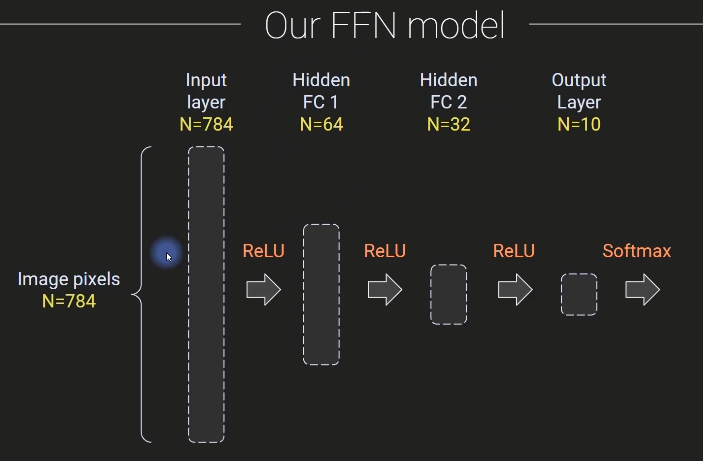
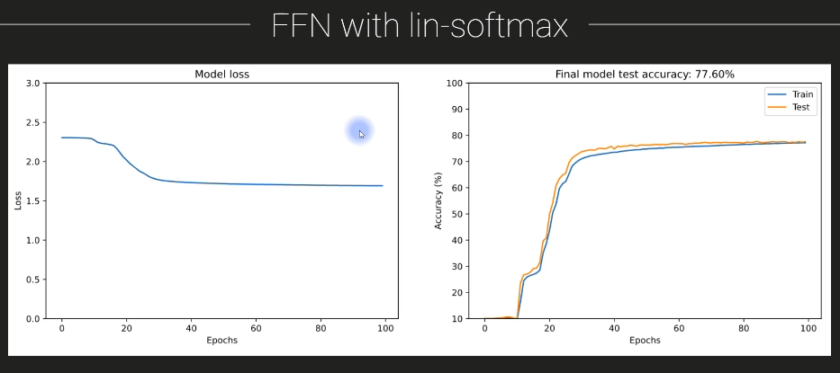

# Deep Learning

- [Deep Learning](#deep-learning)
  - [FFNs (Feed-Forward Networks)](#ffns-feed-forward-networks)
    - [What are fully-connected and feedforward networks?](#what-are-fully-connected-and-feedforward-networks)
      - [Fully connected network](#fully-connected-network)
      - [Fully connected networks aren't fully connected](#fully-connected-networks-arent-fully-connected)
      - [Feedfoward network](#feedfoward-network)
      - [FCN vs. FFN vs. ANN?](#fcn-vs-ffn-vs-ann)
    - [The MNIST dataset](#the-mnist-dataset)
      - [Why should we use the MNIST dataset?](#why-should-we-use-the-mnist-dataset)
    - [FFN to classify digits](#ffn-to-classify-digits)
      - [Our FFN model](#our-ffn-model)
      - [Reminders](#reminders)
      - [Softmax vs. log-softmax](#softmax-vs-log-softmax)
      - [FFN with lin-softmax](#ffn-with-lin-softmax)
      - [FFN with log-softmax](#ffn-with-log-softmax)

## FFNs (Feed-Forward Networks)

### What are fully-connected and feedforward networks?

> - The definition of a fully-connected network (hit: it's a misnomer<sup>부적절한/부정확한 명칭</sup> and you already know the definition!) and a feedforward network(slightly less of a misnomer)
> - The main goals of this section of the course

Welcome to this section of the course, which is focused on feed forward networks, often abbreviated as FFN.
In this video, I'm going to introduce you to the section and the goals of this section.

And I'm also going to discuss some terminology of the kind of deep learning architecture that people refer to when they use terms like fully connected network or feed forward network or fully connected feed forward network.

#### Fully connected network


So here you see a diagram of a network that you are now very familiar with.

You've seen things like this many times.

So when people use the term fully connected network, what they mean is a network in which each node, each unit in layer N projects to each and every node in layer N plus one.


So that means that every unit here so this unit projects to all three of these units, this unit projects, all three of these units and so on.


Every node in this network, every unit projects to every single node in the subsequent layer.

#### Fully connected networks aren't fully connected


Now, in my opinion, the term fully connected network is actually a misnomer because when I think of the word fully connected and what that means and also, by the way, how we use this phrase in neuroscience would actually look something like this so fully connected would mean that every unit is connected to every other unit, regardless of which layer you are in.

So this unit here connects to this guy and also to this guy.

And there's also going to be some backwards connections like this and all of them here just in the interest of time.

But I think you get the idea.

So these kinds of network architectures aren't truly, fully connected.

Instead, they're fully feed forward connected.


So in the context of deep learning, when people say a fully connected network, what they really mean, it's you know, it's just shorthand for a fully feed forward connected network.

#### Feedfoward network


Now, on the other hand, that term to say a feed forward network is also not totally precise.

It's technically still a little bit ambiguous because that feed forward actually just refers to the activation as it propagates from the input to the output.


But of course, all of these learning networks have back propagation.

So actually, the information does flow backwards.

Even in feed forward networks, we still have information flowing backwards.

It's just at a different stage of the learning process.

So I just wanted to clear that up a little bit about some confusing terminology.

But basically the feed forward networks are the kinds of ANNs that we have been working with so far in  the course.

#### FCN vs. FFN vs. ANN?


So why am I now calling them FFNs instead of a ANN or FCN?

Well, I have to be honest here.

This section is kind of an extension of a couple seconds ago on and ends, but I didn't feel like calling it ANN part two.

I thought that would sound a little bit boring.

So I just picked a different name for this section.

The goal of this section is to develop more skill, more knowledge, more expertise and experience with ANNs or FNNs or FCNs or FFCNs whatever you want to call these things, and deep learning more generally.

In fact, we are spending so much time on this kind of architectures feed for network architecture, because these are really the fundamental bases for all of deep learning, all of the crazy extensions, the beautiful, amazing, creative, innovative inventions that people have developed in deep learning, everything from RNNs to CNN's to Gan's to VAEs

Don't worry, I will talk about all these abbreviations later in the course.

But all of these more sophisticated, deep learning architectures are nothing more than standard FFNs with a few little tricks here and there.

Even CNN's convolutional neural networks are essentially the same thing as FFNs.

They're just with, you know, little tweaks here and there, a little bit of additional architectural optimizations.

So the more time you spend and the more you invest studying FFNs or ANNs, the more you are going to understand all of the more advanced concepts in deep learning.

OK, and then the other goal of this section is to introduce you about the mnist data set.

If you have taken a machine learning or deep learning course before, you are probably already familiar with this data set  it's a very famous data set.

It's used all the time to learn about machine learning and deep learning and to train deep learning algorithms.

### The MNIST dataset

> - About the famous MNIST dataset that is nearly always used in ML and DL.

I'm going to introduce you to the famous MNIST data set of handwritten digits, as I mentioned at the end of the previous video.

This is a super famous dataset it is ubiquitous in machine learning and deep learning.

And this wouldn't be a real deep learning course if we didn't learn how to categorize the MNIST dataset.

So what is the MNIST dataset?

Well, it is a database of images that are the digits zero through nine and they are handwritten and I think there's 80000 of these in total.

So there's lots and lots of numbers handwritten by a bunch of different people.


And the thing about this dataset is that you and I so as humans, we are very good at recognizing these digits.

Of course, there's always the weird exception, like, would you guess this is a seven?

This looks more like a table or something.

But anyway, you and I are generally very good at recognizing these digits.

Now, historically, it used to be the case that computer algorithms would have a hard time recognizing these digits because you can see that there's actually quite some diversity.

So if you look at this row of fives, it's clear that they are all fives, or maybe not so clear.

Some of these look like S's.

But you can see that they're all quite variable.

They all look a little bit different from each other.

So it used to be that that computer vision algorithms would struggle with this.

Or maybe they would get like, you know, 95 percent accuracy, which maybe is impressive for the 1980s,

but 95 percent accuracy for an application of recognizing numbers is actually really, really horrible,

totally unacceptable for any kind of real world application.

Now, when deep learning came along, that was totally transformative to computer vision and in particular, this MNIST dataset.

So here you see, is another screenshot from the Wikipedia page.


This is a different kinds of classifiers, different kinds of networks and machine learning algorithms.

And this is their error rates.

So the error rates are just the inverse of accuracy.

So this is an error rate of seven point six means an accuracy of ninety two point four percent.

Now, as I just mentioned, you know, this linear classifier 40 years ago, this was pretty impressive,

but this is totally unacceptable for any kind of real world application.

But you can see that a lot of these error rates are getting down really, really small, this is, you know, this down here.

An error rate of zero point one seven means that this model here is CNN convolutional neural network has an accuracy rate of ninety nine point eight percent.

That's really, really high.

That's pretty much as high as humans, right?

Because yeah, humans are also going to make a couple of mistakes here, like with this five mistaking this for an S.

So you can see that that all of these neural networks generally do quite well.

So much so that it's no longer really terribly interesting to use the MNIST dataset as a benchmark for evaluating the performance of modern deep learning networks.

So if that's the case, if we've basically saturated the accuracy, then why do we still use the MNIST dataset?

#### Why should we use the MNIST dataset?


Well, to some extent this is, you know, it's a little bit of like a rite<sup>의식</sup> of passage for every machine learning student to learn how to decode the MNIST dataset.

So we are going to do that as well.

So there aren't, you know, historical interesting reasons to continue training on the MNIST dataset.

But it does provide a lot of really great learning opportunities.

So maybe it's not the best dataset to use to benchmark a brand new state of the art deep learning architecture.

But for learning applications, it's it's actually still very useful.

And yeah, well, this is the point I've mentioned before.

There is little room for improvement, but still, I think it's it's a nice dataset to work with, so we will work with it for, I don't know, maybe half a dozen videos or something.

OK, so now we are going to switch to Python.

[DUDL_FFN_aboutMNIST.ipynb](../FFN/DUDL_FFN_aboutMNIST.ipynb)

We're not going to do any deep learning yet or any classification.

We're just going to explore this dataset to give you a feel for what the dataset looks like.

So we don't need PyTorch here, we're not doing any deep learning.

We just need Numpy and matplotlib.

Now it turns out conveniently that part of this MNIST data set actually comes right with Google colab and we can see that here.

If you navigate over to the left, click on this folder option and sample data.

And here you see the MNIST training and test set.

These are small versions.

So here we get.

Let's see, it's import the data, check the size.

And I believe the original MNIST dataset or the full amnesty dataset is seventy thousand or eighty thousand, I forget offhand.

This is 20000.

We have 20000 samples, 20000 images of handwritten numbers.

So this means that we are only working with a relatively small part of the data set around a quarter of the dataset.

That does mean that our models are not going to get quite as accurate as the current standard of over 99 percent.

But but that's actually fine.

OK, so the shape of this dataset, the size of this dataset is twenty thousand by seven hundred and eighty five.

So twenty thousand corresponds to the number of samples.

The number of images and seven hundred and eighty five actually corresponds to the images, which are of size.

Twenty eight by twenty eight and twenty eight by twenty eight gives us 784 pixels and then we have one extra row or sorry, one extra column in the beginning that contains the labels.

So whenever you are using this dataset, you first have to extract the labels as the first column and then the data, the Pixel data as all of the other columns.

So that's what I'm doing here.

Notice also, I'm overwriting this variable data, so we are no longer going to have this matrix b.

Seven hundred and eighty five columns instead set seven hundred and eighty four.

And let me just show you what these labels look like, so we can look at labels here and you can see this is an array of numbers.

So that means that the first sample here, the first image in this dataset is the number six. 

So let's see what these images look like.

Well, first of all, we need to we need to reshape this because this is a list of numbers.

This is just a vector.

It's a one dimensional vector for each sample, for each picture.

So we need to reshape this to 28 by 28 in order to visualize it.

And that's what you see here.

I'm just looping over 12 subplots, so I'm just going to plot 12 random images.

Here I pick an image at random or an index at random.

And here you can see I'm reshaping.

So from the data matrix, I grab this row corresponding to this randomly selected image.

All of the columns and then reshape that to be twenty eight by twenty eight.

And then I'm going to make an image of that and then show the title.

So here is what we see.

When we look at these data, you can see these are twenty eight by twenty eight, the number five, the number for the number eight and so on.

Now this is what the data look like to us humans.

When we are training the model, we are not actually feeding in this square matrix.

Instead, we're feeding in a vector of numbers.

So that actually means that when we are training a model on these data, the data actually see the images as something like this.


So it's just a list of numbers.

These are pixel intensity values on the y axis.

And this is the linear ized index of the images on the x axis.

So this is what the the the data look like that we will be using to train the feedforward networks.

So that's pretty interesting to think about that.

This is what the computer is going to be learning now.

Obviously, if I showed you this image, this plot here, you would not guess that this was the number two and this was the number one and so on.

These are impossible for us to understand, but these deep learning models will be able to learn that there is some structure in in this set of numbers.

There is meaningful organization here that maps onto the category that we call number two.

OK, so let's explore this a little bit here.

I'm going to just draw a couple of sevens, and the question here is to explore the variability and also the similarity across the different digits that have the same category.

So what I do here is find all of these sevens, so I find where all of the labels are equal to seven.

But this part here and then numpy dot where returns the indices at which this statement is true.

So the variable the seven is going to be all of the indices in the dataset that are an image of the number seven.

OK.

And then, yeah, this is just to to show some of the variability here.


So obviously, all of the sevens have some common features, but they are all unique.

This one has a horizontal bar.

It's also how I draw sevens.

Here we have a little frilly thing over here and so on.

OK, so now the question is, how similar are all these different sevens?

Do they really all look very different and they all look the same?

That's something we are going to explore with this code here.

So I guess, first of all, we're just printing out the total number of seven.

So how many sevens are there in the entire database out of two thousand images?

And then what I'm going to do is compute the correlation coefficient between all of these sevens.

So it's the correlation between this image and this image, the correlation between this image in this image and this image and this one and this one and so on, every possible pair of sevens.

We are going to correlate their pixel intensity values and then I'm going to show you the correlation matrix and make a histogram of those correlations.

And then I'm going to average all of the sevens together.

You can see that I'm doing here.

So here I get the data from all of the sevens in the database, averaging them together over the first axis, which is that the numbers of sevens and then reshaping that to be an image.

And that's what we see here.


OK, so this is a correlation matrix.

The color intensity value at each pixel here in this matrix tells us the correlation or the similarity between seven, you know, the 207 in the data set and the 607 in the dataset.

Here you can see the correlation values plotted as a histogram.

So what we see here is that there's actually quite some variability across the difference Seven.

So the peak of this correlation is around 0.4, maybe a little bit higher than zero point four and it kind of trails off here.

So this actually tells us that there is quite a bit of diversity across the different sevens in the dataset.

Now this is interesting because it means that the model cannot simply learn an exact mapping of pixels, because if you would just learn an exact mapping of pixels, so you just learn that exactly this, this and this and this and this and these pixels predict a seven, you're not going to be correct all the time.

The accuracy is going to be relatively low.

So the model's been needing to learn something slightly more abstract, some kind of interactions or relationships across all of the pixels in the image in order to accurately categorize these 7's.

That said, of course, there are some similarities.

So the nature of this distribution of correlations is visible here where I'm averaging all of the sevens together, and you see that there are some commonalities across all of these sevens.

### FFN to classify digits

> - See a simple FFN that reaches ~ 95% accuracy in MNIST (note: chance performance is 10%)
> - Learn about log-softmax and see its advatage over regular softmax

In this video, we are going to build a feed forward network, a deep learning network to classify the digits in the MNIST data set, you will see that a relatively simple feed for network gives us somewhere around 95 percent accuracy in the test set.

That's actually pretty decent.

Now, this is not state of the art accuracy levels, but this is pretty good considering we are going to build a fairly simple model.

It's not very deep and it's not very wide.

And we only have around a quarter of the full data set for training.

And also note that chance level performance is 10 percent because there are 10 digits.

So this is certainly way, way better than chance performance along the way.

You are also going to learn more about using softmax and the advantages of the sorry log softmax and the advantages over the regular softmax.

We might call it linear softmax.

I've already introduced you to log Softmax in a previous video.

Finally, I'm going to show you some new ways of inspecting the output of the model to try and understand how the model gets confused when it makes an error.

#### Our FFN model



So here is the architecture that we are going to design.

So remember from the previous video that the images are twenty eight by twenty eight pixels, but they are represented here as a vector of seven hundred and eighty four pixels.

So we are going to train this network on this one dimensional vector of seven hundred and eighty four pixels per image.

So the input layer obviously is seven hundred and eighty four because that has to match the number of 
elements that we have in our data, the number of data features we have.

And then we have two hidden layers.

One is sixty four units wide and the other is 32.

And then we have an output layer of 10 units and now this is constrained to be 10.

This has to be ten because there are ten categories.

There are ten digits.

So these numbers here are sixty four and thirty two.

These are adjustable.

You can change these as is the number of hidden layers that is also adjustable.

This number has to be seven hundred and eighty four and this number has to be ten because we have a multi category discrimination.

We need a softmax function attached to the output of this output layer.

So the 10 output units all pass through a softmax function.

#### Reminders


And that's going to guarantee that the final output is a probability density that we can use to examine or to calculate the probability of the input corresponding to each individual number.

Now, I've already discussed now several times that when working with probabilities, particularly small probabilities close to zero, it is often useful to consider the logarithm and to train based on the logarithm instead of on the absolute probability values themselves, or I should say, the raw probability values.

#### Softmax vs. log-softmax


And that's what we are going to do here.


We are going to use a log softmax instead of a regular softmax.

We might call this linear softmax.

So I've introduced this previously in the course.

But the basic idea is we repeat the regular softmax function and we just take the log of the output.


Again, the idea is that log softmax will stretch out the penalties for small probability values and this helps learning.

This helps us separate the different categories because the model is getting strong penalties for making incorrect responses.

And it also increases numerical stability because we don't have to worry about tiny probability values being close to zero, instead, tiny probability values become large magnitude negative numbers.

So why are we switching to log softmax here when in many previous problems, like in the qwerties categorization

and the wine quality data set, we were just using the regular softmax?

Well, sometimes you can use either one.


It turns out the log softmax tends to work better when there are multiple categories.

So a large number of categories, linear softmax works fine when you have a small number of categories.

And here I put this inequal apology quotes because there is no specific number of categories that is small or large, but something like two or three.

You're probably going to be fine with linear softmax if you have more categories like what we do here in the MNIST data set.

So 10 categories then log softmax tends to perform better.

That said, as with many other deep learning architectural choices and meta parameter choices, I encourage you to try both.


You shouldn't assume that log softmax will always work better, but in this case it does.

#### FFN with lin-softmax



And here is a little demonstration of this.

So I train the model that I'm going to show you in a few moments when we switch to Python and with linear softmax.

So just like the regular softmax, we got up to 77 percent accuracy after one hundred training epochs this, you know, like 35 years ago, this would this would still be OK, but this is actually pretty bad performance.

#### FFN with log-softmax


Now, here is exactly the same model.

Everything is the same.

I didn't change the number of hidden layers, the number of units.

I didn't change anything.

The only thing I changed was the softmax into log softmax.

And just that manipulation alone got us up to seventy six percent accuracy on the test data set.

And you can see for the training data set, we're pretty close to one hundred.

It's got to be over ninety nine percent accuracy on the training data set.

OK, now let's switch to Python and I will show you how to implement this network to categorize the MNIST digits.

[DUDL_FFN_FFNonMNIST.ipynb](../FFN/DUDL_FFN_FFNonMNIST.ipynb)

Here we import our libraries, nothing particularly new here that we haven't seen before.

Here is importing and processing the data.

This code here is exactly the same as what you saw in the previous video.

```python
# normalize the data to a range of [0 1]
dataNorm = data / np.max(data)

fig,ax = plt.subplots(1,2,figsize=(10,4))
ax[0].hist(data.flatten(),50)
ax[0].set_xlabel('Pixel intensity values')
ax[0].set_ylabel('Count')
ax[0].set_title('Histogram of original data')

ax[1].hist(dataNorm.flatten(),50)
ax[1].set_xlabel('Pixel intensity values')
ax[1].set_ylabel('Count')
ax[1].set_title('Histogram of normalized data')

plt.show()
```

Now, this code is a little bit new here.

We need to normalize the data to a range of zero to one.

We have previously discussed that data normalization is an important step in deep learning.

So the data are originally scaled between zero and 255.

So I'm going to scale them down to zero to one by dividing by the maximum numbers, the maximum value, which is actually 255.

OK, and then I'm going to make a histogram here of the of the entire dataset with and without the normalization.


So you see a couple of things that are striking here.

First of all, that it looks like there's only two possible values here, zero and two fifty five.

And here, when we normalize the data, zero and one.

Now, that's not actually the case.

This is just driven by the scale.

Look at the scale.

This is ten to the seven is a huge number here. This count.

And what's really happening is that most of the pixels in the images are zero.

So that's why zero is huge here.

And then there's a lot of pixels that are at maximum intensity.

So two fifty five or one.

And this right here, these are not actually zero.

These are just very, very small.

```diff
# normalize the data to a range of [0 1]
dataNorm = data / np.max(data)

fig,ax = plt.subplots(1,2,figsize=(10,4))
ax[0].hist(data.flatten(),50)
ax[0].set_xlabel('Pixel intensity values')
ax[0].set_ylabel('Count')
ax[0].set_title('Histogram of original data')
+ax[0].set_yscale('log')

ax[1].hist(dataNorm.flatten(),50)
ax[1].set_xlabel('Pixel intensity values')
ax[1].set_ylabel('Count')
ax[1].set_title('Histogram of normalized data')

plt.show()
```

So what I'm going to do now is add or change the y axis scale.

So zero set y scale and to make this log scaled.

So that makes the frequency counts Logarithmically scaled instead of linearly scaled.


And now you see there actually is quite a range of values that the image pixels can take on.

It's just that we don't see that when when we have the linear scale here because it's dominated by all of the zero value pixels.

OK, so that was data normalization.

here I'm converting the data into train and test partitions and this is all basically stuff you have seen 
before.

We are just converting from Numpy into PyTorch.

That's for the data, the T as Tenzer.

So we convert the data into a PyTorch Tensor and the labels also into PyTorch tensors

Now here we have to make sure that the data are floating point in so the data themselves are converted to floating point precision.

The labels are converted into integers, which is called long.

That's the function in PyTorch to convert into integers.

In this case, the keyword long actually converts to 64 bit precision integers.

OK, here we are using scikit Learn to split the data into the training set and the test set and then we convert those into PyTorch data sets and finally convert those into data loaders.

You can see from setting the batch size to be 32 and shuffle equals true.

So it's going to randomly shuffle which data go into which batch.

And finally I set drop_last equals true.

So that if there's a very small batch at the very end that just gets dropped.

Now we have twenty thousand images in total, so dropping one batch of less than thirty two isn't really such a big deal.

And let's see.

So this is also hardcoded that the test size is 10 percent of the data.

So that means that we have a training set of eighteen thousand images and a test set of two thousand images.

```python
# check all variables in workspace
%whos
```

Here is this is just a little F.I. about python coding, I think I've already discussed this in the appendix section about python coding, but this is you know, you can write percent who's that's the magic word that just gives us a list of all the variables that we have created in the workspace.

It tells us the type of variable and also a bit of information about that variable.

OK, so let's get to the exciting part here.

```python
# create a class for the model
def createTheMNISTNet():

  class mnistNet(nn.Module):
    def __init__(self):
      super().__init__()

      ### input layer
      self.input = nn.Linear(784,64)
      
      ### hidden layer
      self.fc1 = nn.Linear(64,32)
      self.fc2 = nn.Linear(32,32)

      ### output layer
      self.output = nn.Linear(32,10)

    # forward pass
    def forward(self,x):
      x = F.relu( self.input(x) )
      x = F.relu( self.fc1(x) )
      x = F.relu( self.fc2(x) )
      return torch.log_softmax( self.output(x),axis=1 )
      # NEW HERE: log-softmax the output, because I'm using NLLLoss instead of CrossEntropyLoss
  
  # create the model instance
  net = mnistNet()
  
  # loss function
  lossfun = nn.NLLLoss()

  # optimizer
  optimizer = torch.optim.SGD(net.parameters(),lr=.01)

  return net,lossfun,optimizer
```

We have the python function that will create and return the model that we are going to train.

So we define a class here.

We have the two methods that we need to specify init and forward.

And in the init, we create an input layer so you can see this is going from seven hundred and eighty four corresponding to the number of pixels to sixty four.

That's the size of the first hidden layer, which here I'm calling F.C. for fully connected.

Then the next hidden layer is 32 nodes wide.

And then finally the output layer, it goes to ten.

We have ten outputs.

And then here you can see in the forward pass we take our input into the Model X and then we pass that through the input layer, pass that through RELU function, repeat for fc1, fc2.

And then here is the output.

Now notice here I'm actually outputting torch.log_softmax of the output of the the output layer.

Now, previously in the course, I have said that you don't need to do this.

You can export the raw output numbers and then use the loss function of cross entropy loss.

However, here I want to explicitly include this log softmax output here, because later on I want to show you how to interpret these log softmax output.

So the raw outputs from this model.

So therefore I'm using outputting torch log softmax and here the lost function is `NLLLoss()` so negative log likelihood loss.

OK then here we get to the optimizer.

Now it's kind of a funny thing with this optimizer because you might be wondering why I'm using gradient descent when we discovered in the previous section that Adam Optimizer generally works but almost always works better than gradient descent.

Well, it turns out that if you use Adam here, the performance is so good that it makes everything else seem kind of uninteresting.

So, in fact, what we are going to do not all the time in this course, but several more times throughout this course, is explicitly slow down the learning to help us understand the impact of other features of the model, like log softmax, for example.

So after this video, I encourage you to come back here and change this from a standard gradient descent to Adam or rms prop, and it'll be interesting to see how well it does and how its performance does compared to what we are doing here.

OK, very good.

So now what we are going to do is test the model with one batch is something I've mentioned quite a few times.

```python
# test the model with one batch
net,lossfun,optimizer = createTheMNISTNet()

X,y = next(iter(train_loader))
yHat = net(X)

# values are log-probability of each number (0-9)
print(yHat)
# print(torch.exp(yHat))

# now let's compute the loss
loss = lossfun(yHat,y)
print(' ')
print('Loss:')
print(loss)
```

It's a good idea just to pass some data through the model, even if you're not training the model,

just to make sure that everything you see looks sensible, the outputs look sensible.

So create the model here.

And then I'm going to grab the first batch of data, pass the data through and inspect the output.

So now we have oops, I guess I didn't run this code up here.

Apology's let's see.

OK, now I think this should work.

OK, so we get a bunch of numbers.

```text
tensor([[-2.1488, -2.2792, -2.3315, -2.4755, -2.1701, -2.1972, -2.3988, -2.4080,
         -2.3537, -2.3165],
        [-2.1466, -2.2825, -2.3349, -2.4688, -2.1748, -2.1907, -2.3936, -2.4137,
         -2.3559, -2.3175],
        [-2.1472, -2.2784, -2.3362, -2.4733, -2.1726, -2.1921, -2.4031, -2.4070,
         -2.3533, -2.3168],
        [-2.1438, -2.2758, -2.3417, -2.4763, -2.1734, -2.1936, -2.4056, -2.4120,
......
```

So this is the output of the model from the forward propagation.

So let's make sure we can make sense of this output.

And actually before interpreting the numbers, we should just look at the shape and make sure that makes sense.

```python
print(yHat.shape)
# torch.Size([32, 10])
```

So this is 32 by ten and that is the correct shape because we have a batch size of thirty two and there are ten nodes in the output layer and that corresponds to ten categories or ten digits.

OK, so with that in mind now let's look at these numbers.

```text
```

So you see it's minus two, it's basically always minus two point something, something.

```python
# test the model with one batch
net,lossfun,optimizer = createTheMNISTNet()

X,y = next(iter(train_loader))
yHat = net(X)

# values are log-probability of each number (0-9)
print(torch.exp(yHat))
```

```text
tensor([[-2.1488, -2.2792, -2.3315, -2.4755, -2.1701, -2.1972, -2.3988, -2.4080,
         -2.3537, -2.3165],
        [-2.1466, -2.2825, -2.3349, -2.4688, -2.1748, -2.1907, -2.3936, -2.4137,
         -2.3559, -2.3175],
        [-2.1472, -2.2784, -2.3362, -2.4733, -2.1726, -2.1921, -2.4031, -2.4070,
         -2.3533, -2.3168],
        [-2.1438, -2.2758, -2.3417, -2.4763, -2.1734, -2.1936, -2.4056, -2.4120,
......
```

What does this number mean.

What is minus two and what do these numbers correspond to?

Well, these correspond to the log of the probabilities that the model is outputting.

So we can confirm that is the log of the probabilities by undoing or inverting the log function using torch.exp.

```python
# values are log-probability of each number (0-9)
# print(yHat)
print(torch.exp(yHat))
```

Remember that the natural exponential and the natural log are inverse functions of each other.

So now we have converted those numbers into probabilities and you can see that well there all around point one.

```text
tensor([[0.0959, 0.0952, 0.0906, 0.0825, 0.1106, 0.1064, 0.1154, 0.0916, 0.1111,
         0.1006],
        [0.0955, 0.0966, 0.0889, 0.0831, 0.1087, 0.1069, 0.1146, 0.0919, 0.1131,
         0.1007],
        [0.0941, 0.0947, 0.0897, 0.0832, 0.1092, 0.1077, 0.1152, 0.0909, 0.1144,
         0.1008],
......
```

And why does that make sense?

Well, that makes sense because we have ten categories and we have an untrained model.

So the prediction should be somewhere around 10 percent for every single category, for every single image.

Now, they're not exactly at 10 percent because we have randomly initialize the weights.

So purely by chance, the model is going to have some preferences for some numbers and some preferences against other numbers.

These biases are untrained as a process during the process of learning.

OK, so that is the output of the model.

Now let's compute the loss again.

```text
Loss:
tensor(2.3215, grad_fn=<NllLossBackward0>)
```

This is not an actual numerical value that we can interpret here.

I just want to make sure that everything is working.

The lost function is set up correctly.

Very nice.

So now let's get to training the model.

```python
# a function that trains the model

def function2trainTheModel():

  # number of epochs
  numepochs = 60
  
  # create a new model
  net,lossfun,optimizer = createTheMNISTNet()

  # initialize losses
  losses    = torch.zeros(numepochs)
  trainAcc  = []
  testAcc   = []


  # loop over epochs
  for epochi in range(numepochs):

    # loop over training data batches
    batchAcc  = []
    batchLoss = []
    for X,y in train_loader:

      # forward pass and loss
      yHat = net(X)
      loss = lossfun(yHat,y)

      # backprop
      optimizer.zero_grad()
      loss.backward()
      optimizer.step()

      # loss from this batch
      batchLoss.append(loss.item())

      # compute accuracy
      matches = torch.argmax(yHat,axis=1) == y     # booleans (false/true)
      matchesNumeric = matches.float()             # convert to numbers (0/1)
      accuracyPct = 100*torch.mean(matchesNumeric) # average and x100
      batchAcc.append( accuracyPct )               # add to list of accuracies
    # end of batch loop...

    # now that we've trained through the batches, get their average training accuracy
    trainAcc.append( np.mean(batchAcc) )

    # and get average losses across the batches
    losses[epochi] = np.mean(batchLoss)

    # test accuracy
    X,y = next(iter(test_loader)) # extract X,y from test dataloader
    yHat = net(X)
      
    # compare the following really long line of code to the training accuracy lines
    testAcc.append( 100*torch.mean((torch.argmax(yHat,axis=1)==y).float()) )

  # end epochs

  # function output
  return trainAcc,testAcc,losses,net
```

Here is the python function that trains the model will train for 60 epochs, which is a number that I kind of came up with.

It works pretty well and in the interest of time.

So this video doesn't get too long.

I'm not going to repeat all of these components.

But just as you know, a quick reminder.

So we have the loop over batches.

Well, let me start up here.

We have the for loop over training.

epochs the for loop over the batches.

We do the forward pass, we compute the loss, we instigate back propagation.

And then this is just some code to keep track of our performance.

We get the batch loss and the batch accuracy, and here we average those over all the batches.

Here we test accuracy.

We're getting some data from the test loader and then computing test accuracy at this epoch.

All right.

So here's the exciting part.

Let us run the model here.

Run the training procedure.

So I took around a minute or so to compute and then let's see here, we're going to plot the losses and the train and test accuracy.

```python
fig,ax = plt.subplots(1,2,figsize=(16,5))

ax[0].plot(losses)
ax[0].set_xlabel('Epochs')
ax[0].set_ylabel('Loss')
ax[0].set_ylim([0,3])
ax[0].set_title('Model loss')

ax[1].plot(trainAcc,label='Train')
ax[1].plot(testAcc,label='Test')
ax[1].set_xlabel('Epochs')
ax[1].set_ylabel('Accuracy (%)')
ax[1].set_ylim([10,100])
ax[1].set_title(f'Final model test accuracy: {testAcc[-1]:.2f}%')
ax[1].legend()

plt.show()
```

So let's see how this model does.


So the loss function goes down and then looks like it's not really going to go a whole lot further down

here We see the accuracy and we get the train accuracy goes.

It continues increasing up to somewhere pretty close to 100 percent.

And we see the final test accuracy is ninety five percent.

As I mentioned in the beginning of this video, I think this is actually pretty decent, considering that we just have a pretty simple small model and we're only training on about a quarter of the full data set.

So overall, not bad for getting started.

Now, what I'd like to do is inspect the results in more detail.

```python
# run the model through for the test data
X,y = next(iter(test_loader))
predictions = net(X).detach()

predictions
```

So I'm running through the test data, the lab, the test match, getting the predictions and then here we see the predictions.

Now, this is exactly the same as the Y had value that you saw a few moments ago, except here, this is actually a trained network.

So we do expect that these values are going to be more meaningful and more biased towards one particular stimulus compared to the other ones.


And by biased, I mean that each stimulus should have one large value and a bunch of other values close to zero.

So let's inspect the probabilities will convert this from log probabilities to actual probabilities.


So here you see this value is actually really, really close to one.

This is almost one.

And all these other values are really tiny.

Ten to the minus 19.

That's an extremely small number.

This is basically, you know, numbers like this, ten to the minus 19, the minus 16.

These numbers are basically at around machine precision.

So the computer isn't really going to have a very easy time working with numbers that are this tiny, that are this close to zero.

So this is one of the advantages of taking the log of these probabilities.

OK, so now I'm going to show you a plot that provides the models evidence for each number.

```python
# Evidence for all numbers from one sample
sample2show = 120

plt.bar(range(10),predictions[sample2show]) # try adding exp!
plt.xticks(range(10))
plt.xlabel('Number')
plt.ylabel('Evidence for that number')
plt.title('True number was %s' %y[sample2show].item())
plt.show()
```

So we just pick one sample at random and then I'm going to make a bar plot of the predictions for that particular sample.

So this is just, you know, item or image one hundred and twenty, whatever number that happens to be.


So the true number, well, we know what number it happens to be that comes from the labels y so the true number was seven.

And here we have the log of the probabilities for each of the different numbers.

Now it looks like seven is zero and that also should make sense because the log of one is zero.

So in fact, what we can do here is instead of plotting the log softmax output, we can plot the softmax output.

So I'm going to write torch.exp to undo the natural log plot this generate this plot again.


And now you see that the probability value for seven was extremely high, very close to one.

And for all of these other numbers, all these other categorizations, it's our categories.

It's basically zero.

It's like you can't even see it on the plot.

The bar is so thin that is completely covered by the black line, the boundary of the plot.

So that is pretty neat.

That means that the model was really, really certain that this image, this sample was a number seven.

OK, now, obviously, the model did not get every single number, correct.

It got about five percent of the numbers wrong.

```python
# find the errors
errors = np.where( torch.max(predictions,axis=1)[1] != y )[0]
print(errors)

# Evidence for all numbers from one sample
sample2show = 10

fig,ax = plt.subplots(1,2,figsize=(14,5))

ax[0].bar(range(10),np.exp(predictions[errors[sample2show]]))
ax[0].set_xticks(range(10))
ax[0].set_xlabel('Number')
ax[0].set_ylabel('Evidence for that number')
ax[0].set_title('True number: %s, model guessed %s' 
                %( y[errors[sample2show]].item(), torch.argmax(predictions[errors[sample2show]]).item() ))

ax[1].imshow( np.reshape(X[errors[sample2show],:],(28,28)) ,cmap='gray')

plt.show()
```

So what I'm doing here is finding the errors.

This is a pretty insightful thing to do with models.

You want to find the cases where the model made a mistake and then look at those cases, look at those images to try and get a sense of what went wrong.

So what I'm doing here is finding where all of the predictions, the maximum predictions did not equal the label values.

So when there was a mismatch between the predictions and the actual labels, so here we see some printing out all of those indices.


So these are the indices in the test set where the model made a mistake.

And then what I'm doing here is just picking one.

You know, number four is just some random choice here.

So I'm just saying show me the fourth mistake that the model made.

So one, two, three, four.

So now we're going to look at this sample here.


So here we see the sample and the true number was six, but the model guessed four.

So, you know, it's pretty I think this looks more like a six, but you can certainly see how the model got confused.

It does look a bit like a four here.

You see the probability for each of these categories and you see that six actually did get a little

bit of an energetic output here, but clearly it was dominated by four.

So this is pretty interesting.

I encourage you.

To play around with this, just pick you know, just pick some random numbers here, hear the true number was eight and the model guest, too.


OK, I think I would also guess eight here.

But you see, you know, the model had a probability value of a little over point two for the number eight.

And, you know, let's see if we can find some other interesting cases here.

Here, the model was really confused.


You can see the model gave a large, relatively large probability value for lots of numbers and it eventually went with one.

I can also see that.
