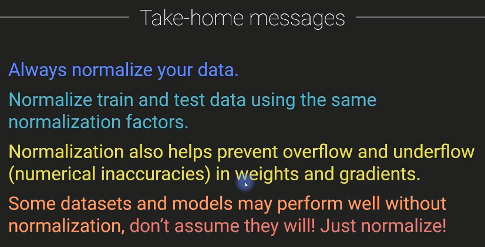
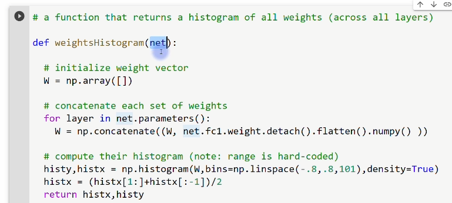
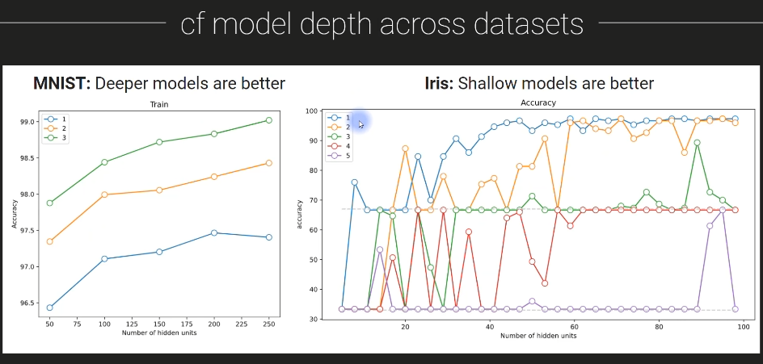
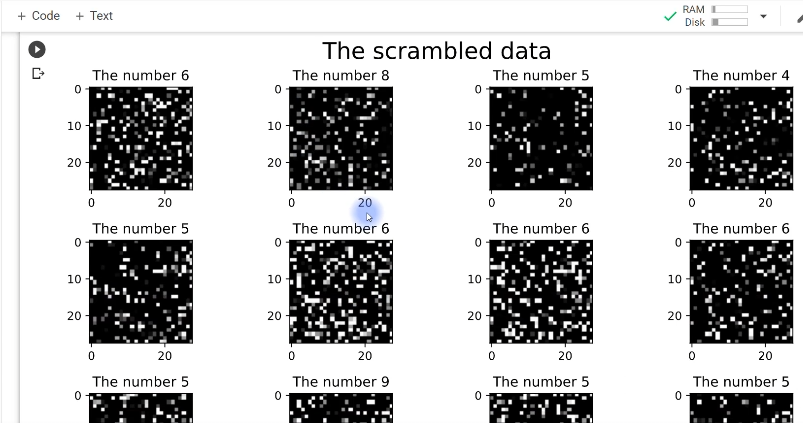
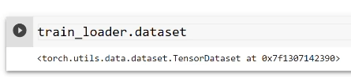
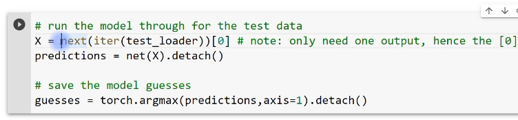

# Deep Learning

- [Deep Learning](#deep-learning)
  - [FFNs (Feed-Forward Networks)](#ffns-feed-forward-networks)
    - [What are fully-connected and feedforward networks?](#what-are-fully-connected-and-feedforward-networks)
      - [Fully connected network](#fully-connected-network)
      - [Fully connected networks aren't fully connected](#fully-connected-networks-arent-fully-connected)
      - [Feedfoward network](#feedfoward-network)
      - [FCN vs. FFN vs. ANN?](#fcn-vs-ffn-vs-ann)
    - [The MNIST dataset](#the-mnist-dataset)
      - [Why should we use the MNIST dataset?](#why-should-we-use-the-mnist-dataset)
    - [FFN to classify digits](#ffn-to-classify-digits)
      - [Our FFN model](#our-ffn-model)
      - [Reminders](#reminders)
      - [Softmax vs. log-softmax](#softmax-vs-log-softmax)
      - [FFN with lin-softmax](#ffn-with-lin-softmax)
      - [FFN with log-softmax](#ffn-with-log-softmax)
    - [CodeChallenge: Binarized MNIST images](#codechallenge-binarized-mnist-images)
      - [Does our FFN need a range of pixel values?](#does-our-ffn-need-a-range-of-pixel-values)
      - [Does our ANN need a range of pixel values?](#does-our-ann-need-a-range-of-pixel-values)
    - [CodeChallenge: Data normalization](#codechallenge-data-normalization)
      - [Normalizing data (reminder)](#normalizing-data-reminder)
      - [Goals for this codechallenge #0](#goals-for-this-codechallenge-0)
      - [Goals for this codechallenge #1](#goals-for-this-codechallenge-1)
      - [Goals for this codechallenge #2](#goals-for-this-codechallenge-2)
      - [Dicussion: Loss vs. accuracy](#dicussion-loss-vs-accuracy)
      - [Take-home messages](#take-home-messages)
    - [Distributions of weights pre- and post-learning](#distributions-of-weights-pre--and-post-learning)
      - [Weight initializations and changes](#weight-initializations-and-changes)
    - [CodeChallenge: MNIST and breadth vs. depth](#codechallenge-mnist-and-breadth-vs-depth)
      - [Reminder about terminology](#reminder-about-terminology)
      - [Your DL mission!](#your-dl-mission)
      - [cf model depth across datasets](#cf-model-depth-across-datasets)
      - [Take-home messages](#take-home-messages-1)
    - [CodeChallenge: Optimizers and MNIST](#codechallenge-optimizers-and-mnist)
      - [What to do](#what-to-do)
      - [Scrambled MNIST](#scrambled-mnist)
      - [DL breakfast: Scrambled MNIST](#dl-breakfast-scrambled-mnist)
      - [Shifted MNIST](#shifted-mnist)
      - [Shifting an image](#shifting-an-image)
      - [Our goal here](#our-goal-here)
      - [Shifting an image](#shifting-an-image-1)
    - [CodeChallenge: The mystery of the missing 7](#codechallenge-the-mystery-of-the-missing-7)
      - [How does a DL model classify things it has never seen?](#how-does-a-dl-model-classify-things-it-has-never-seen)
      - [Scenes from the codeChallenge](#scenes-from-the-codechallenge)
    - [Universal approximation theorem](#universal-approximation-theorem)
      - [Universal approximation theorem](#universal-approximation-theorem-1)
      - [Universal approximation theorem](#universal-approximation-theorem-2)

## FFNs (Feed-Forward Networks)

### What are fully-connected and feedforward networks?

> - The definition of a fully-connected network (hit: it's a misnomer<sup>부적절한/부정확한 명칭</sup> and you already know the definition!) and a feedforward network(slightly less of a misnomer)
> - The main goals of this section of the course

Welcome to this section of the course, which is focused on feed forward networks, often abbreviated as FFN.
In this video, I'm going to introduce you to the section and the goals of this section.

And I'm also going to discuss some terminology of the kind of deep learning architecture that people refer to when they use terms like fully connected network or feed forward network or fully connected feed forward network.

#### Fully connected network


So here you see a diagram of a network that you are now very familiar with.

You've seen things like this many times.

So when people use the term fully connected network, what they mean is a network in which each node, each unit in layer N projects to each and every node in layer N plus one.


So that means that every unit here so this unit projects to all three of these units, this unit projects, all three of these units and so on.


Every node in this network, every unit projects to every single node in the subsequent layer.

#### Fully connected networks aren't fully connected


Now, in my opinion, the term fully connected network is actually a misnomer because when I think of the word fully connected and what that means and also, by the way, how we use this phrase in neuroscience would actually look something like this so fully connected would mean that every unit is connected to every other unit, regardless of which layer you are in.

So this unit here connects to this guy and also to this guy.

And there's also going to be some backwards connections like this and all of them here just in the interest of time.

But I think you get the idea.

So these kinds of network architectures aren't truly, fully connected.

Instead, they're fully feed forward connected.


So in the context of deep learning, when people say a fully connected network, what they really mean, it's you know, it's just shorthand for a fully feed forward connected network.

#### Feedfoward network


Now, on the other hand, that term to say a feed forward network is also not totally precise.

It's technically still a little bit ambiguous because that feed forward actually just refers to the activation as it propagates from the input to the output.


But of course, all of these learning networks have back propagation.

So actually, the information does flow backwards.

Even in feed forward networks, we still have information flowing backwards.

It's just at a different stage of the learning process.

So I just wanted to clear that up a little bit about some confusing terminology.

But basically the feed forward networks are the kinds of ANNs that we have been working with so far in  the course.

#### FCN vs. FFN vs. ANN?


So why am I now calling them FFNs instead of a ANN or FCN?

Well, I have to be honest here.

This section is kind of an extension of a couple seconds ago on and ends, but I didn't feel like calling it ANN part two.

I thought that would sound a little bit boring.

So I just picked a different name for this section.

The goal of this section is to develop more skill, more knowledge, more expertise and experience with ANNs or FNNs or FCNs or FFCNs whatever you want to call these things, and deep learning more generally.

In fact, we are spending so much time on this kind of architectures feed for network architecture, because these are really the fundamental bases for all of deep learning, all of the crazy extensions, the beautiful, amazing, creative, innovative inventions that people have developed in deep learning, everything from RNNs to CNN's to Gan's to VAEs

Don't worry, I will talk about all these abbreviations later in the course.

But all of these more sophisticated, deep learning architectures are nothing more than standard FFNs with a few little tricks here and there.

Even CNN's convolutional neural networks are essentially the same thing as FFNs.

They're just with, you know, little tweaks here and there, a little bit of additional architectural optimizations.

So the more time you spend and the more you invest studying FFNs or ANNs, the more you are going to understand all of the more advanced concepts in deep learning.

OK, and then the other goal of this section is to introduce you about the mnist data set.

If you have taken a machine learning or deep learning course before, you are probably already familiar with this data set  it's a very famous data set.

It's used all the time to learn about machine learning and deep learning and to train deep learning algorithms.

### The MNIST dataset

> - About the famous MNIST dataset that is nearly always used in ML and DL.

I'm going to introduce you to the famous MNIST data set of handwritten digits, as I mentioned at the end of the previous video.

This is a super famous dataset it is ubiquitous in machine learning and deep learning.

And this wouldn't be a real deep learning course if we didn't learn how to categorize the MNIST dataset.

So what is the MNIST dataset?

Well, it is a database of images that are the digits zero through nine and they are handwritten and I think there's 80000 of these in total.

So there's lots and lots of numbers handwritten by a bunch of different people.


And the thing about this dataset is that you and I so as humans, we are very good at recognizing these digits.

Of course, there's always the weird exception, like, would you guess this is a seven?

This looks more like a table or something.

But anyway, you and I are generally very good at recognizing these digits.

Now, historically, it used to be the case that computer algorithms would have a hard time recognizing these digits because you can see that there's actually quite some diversity.

So if you look at this row of fives, it's clear that they are all fives, or maybe not so clear.

Some of these look like S's.

But you can see that they're all quite variable.

They all look a little bit different from each other.

So it used to be that that computer vision algorithms would struggle with this.

Or maybe they would get like, you know, 95 percent accuracy, which maybe is impressive for the 1980s,

but 95 percent accuracy for an application of recognizing numbers is actually really, really horrible,

totally unacceptable for any kind of real world application.

Now, when deep learning came along, that was totally transformative to computer vision and in particular, this MNIST dataset.

So here you see, is another screenshot from the Wikipedia page.


This is a different kinds of classifiers, different kinds of networks and machine learning algorithms.

And this is their error rates.

So the error rates are just the inverse of accuracy.

So this is an error rate of seven point six means an accuracy of ninety two point four percent.

Now, as I just mentioned, you know, this linear classifier 40 years ago, this was pretty impressive,

but this is totally unacceptable for any kind of real world application.

But you can see that a lot of these error rates are getting down really, really small, this is, you know, this down here.

An error rate of zero point one seven means that this model here is CNN convolutional neural network has an accuracy rate of ninety nine point eight percent.

That's really, really high.

That's pretty much as high as humans, right?

Because yeah, humans are also going to make a couple of mistakes here, like with this five mistaking this for an S.

So you can see that that all of these neural networks generally do quite well.

So much so that it's no longer really terribly interesting to use the MNIST dataset as a benchmark for evaluating the performance of modern deep learning networks.

So if that's the case, if we've basically saturated the accuracy, then why do we still use the MNIST dataset?

#### Why should we use the MNIST dataset?


Well, to some extent this is, you know, it's a little bit of like a rite<sup>의식</sup> of passage for every machine learning student to learn how to decode the MNIST dataset.

So we are going to do that as well.

So there aren't, you know, historical interesting reasons to continue training on the MNIST dataset.

But it does provide a lot of really great learning opportunities.

So maybe it's not the best dataset to use to benchmark a brand new state of the art deep learning architecture.

But for learning applications, it's it's actually still very useful.

And yeah, well, this is the point I've mentioned before.

There is little room for improvement, but still, I think it's it's a nice dataset to work with, so we will work with it for, I don't know, maybe half a dozen videos or something.

OK, so now we are going to switch to Python.

[DUDL_FFN_aboutMNIST.ipynb](../FFN/DUDL_FFN_aboutMNIST.ipynb)

We're not going to do any deep learning yet or any classification.

We're just going to explore this dataset to give you a feel for what the dataset looks like.

So we don't need PyTorch here, we're not doing any deep learning.

We just need Numpy and matplotlib.

Now it turns out conveniently that part of this MNIST data set actually comes right with Google colab and we can see that here.

If you navigate over to the left, click on this folder option and sample data.

And here you see the MNIST training and test set.

These are small versions.

So here we get.

Let's see, it's import the data, check the size.

And I believe the original MNIST dataset or the full amnesty dataset is seventy thousand or eighty thousand, I forget offhand.

This is 20000.

We have 20000 samples, 20000 images of handwritten numbers.

So this means that we are only working with a relatively small part of the data set around a quarter of the dataset.

That does mean that our models are not going to get quite as accurate as the current standard of over 99 percent.

But but that's actually fine.

OK, so the shape of this dataset, the size of this dataset is twenty thousand by seven hundred and eighty five.

So twenty thousand corresponds to the number of samples.

The number of images and seven hundred and eighty five actually corresponds to the images, which are of size.

Twenty eight by twenty eight and twenty eight by twenty eight gives us 784 pixels and then we have one extra row or sorry, one extra column in the beginning that contains the labels.

So whenever you are using this dataset, you first have to extract the labels as the first column and then the data, the Pixel data as all of the other columns.

So that's what I'm doing here.

Notice also, I'm overwriting this variable data, so we are no longer going to have this matrix b.

Seven hundred and eighty five columns instead set seven hundred and eighty four.

And let me just show you what these labels look like, so we can look at labels here and you can see this is an array of numbers.

So that means that the first sample here, the first image in this dataset is the number six. 

So let's see what these images look like.

Well, first of all, we need to we need to reshape this because this is a list of numbers.

This is just a vector.

It's a one dimensional vector for each sample, for each picture.

So we need to reshape this to 28 by 28 in order to visualize it.

And that's what you see here.

I'm just looping over 12 subplots, so I'm just going to plot 12 random images.

Here I pick an image at random or an index at random.

And here you can see I'm reshaping.

So from the data matrix, I grab this row corresponding to this randomly selected image.

All of the columns and then reshape that to be twenty eight by twenty eight.

And then I'm going to make an image of that and then show the title.

So here is what we see.

When we look at these data, you can see these are twenty eight by twenty eight, the number five, the number for the number eight and so on.

Now this is what the data look like to us humans.

When we are training the model, we are not actually feeding in this square matrix.

Instead, we're feeding in a vector of numbers.

So that actually means that when we are training a model on these data, the data actually see the images as something like this.


So it's just a list of numbers.

These are pixel intensity values on the y axis.

And this is the linear ized index of the images on the x axis.

So this is what the the the data look like that we will be using to train the feedforward networks.

So that's pretty interesting to think about that.

This is what the computer is going to be learning now.

Obviously, if I showed you this image, this plot here, you would not guess that this was the number two and this was the number one and so on.

These are impossible for us to understand, but these deep learning models will be able to learn that there is some structure in in this set of numbers.

There is meaningful organization here that maps onto the category that we call number two.

OK, so let's explore this a little bit here.

I'm going to just draw a couple of sevens, and the question here is to explore the variability and also the similarity across the different digits that have the same category.

So what I do here is find all of these sevens, so I find where all of the labels are equal to seven.

But this part here and then numpy dot where returns the indices at which this statement is true.

So the variable the seven is going to be all of the indices in the dataset that are an image of the number seven.

OK.

And then, yeah, this is just to to show some of the variability here.


So obviously, all of the sevens have some common features, but they are all unique.

This one has a horizontal bar.

It's also how I draw sevens.

Here we have a little frilly thing over here and so on.

OK, so now the question is, how similar are all these different sevens?

Do they really all look very different and they all look the same?

That's something we are going to explore with this code here.

So I guess, first of all, we're just printing out the total number of seven.

So how many sevens are there in the entire database out of two thousand images?

And then what I'm going to do is compute the correlation coefficient between all of these sevens.

So it's the correlation between this image and this image, the correlation between this image in this image and this image and this one and this one and so on, every possible pair of sevens.

We are going to correlate their pixel intensity values and then I'm going to show you the correlation matrix and make a histogram of those correlations.

And then I'm going to average all of the sevens together.

You can see that I'm doing here.

So here I get the data from all of the sevens in the database, averaging them together over the first axis, which is that the numbers of sevens and then reshaping that to be an image.

And that's what we see here.


OK, so this is a correlation matrix.

The color intensity value at each pixel here in this matrix tells us the correlation or the similarity between seven, you know, the 207 in the data set and the 607 in the dataset.

Here you can see the correlation values plotted as a histogram.

So what we see here is that there's actually quite some variability across the difference Seven.

So the peak of this correlation is around 0.4, maybe a little bit higher than zero point four and it kind of trails off here.

So this actually tells us that there is quite a bit of diversity across the different sevens in the dataset.

Now this is interesting because it means that the model cannot simply learn an exact mapping of pixels, because if you would just learn an exact mapping of pixels, so you just learn that exactly this, this and this and this and this and these pixels predict a seven, you're not going to be correct all the time.

The accuracy is going to be relatively low.

So the model's been needing to learn something slightly more abstract, some kind of interactions or relationships across all of the pixels in the image in order to accurately categorize these 7's.

That said, of course, there are some similarities.

So the nature of this distribution of correlations is visible here where I'm averaging all of the sevens together, and you see that there are some commonalities across all of these sevens.

### FFN to classify digits

> - See a simple FFN that reaches ~ 95% accuracy in MNIST (note: chance performance is 10%)
> - Learn about log-softmax and see its advatage over regular softmax

In this video, we are going to build a feed forward network, a deep learning network to classify the digits in the MNIST data set, you will see that a relatively simple feed for network gives us somewhere around 95 percent accuracy in the test set.

That's actually pretty decent.

Now, this is not state of the art accuracy levels, but this is pretty good considering we are going to build a fairly simple model.

It's not very deep and it's not very wide.

And we only have around a quarter of the full data set for training.

And also note that chance level performance is 10 percent because there are 10 digits.

So this is certainly way, way better than chance performance along the way.

You are also going to learn more about using softmax and the advantages of the sorry log softmax and the advantages over the regular softmax.

We might call it linear softmax.

I've already introduced you to log Softmax in a previous video.

Finally, I'm going to show you some new ways of inspecting the output of the model to try and understand how the model gets confused when it makes an error.

#### Our FFN model


So here is the architecture that we are going to design.

So remember from the previous video that the images are twenty eight by twenty eight pixels, but they are represented here as a vector of seven hundred and eighty four pixels.

So we are going to train this network on this one dimensional vector of seven hundred and eighty four pixels per image.

So the input layer obviously is seven hundred and eighty four because that has to match the number of 
elements that we have in our data, the number of data features we have.

And then we have two hidden layers.

One is sixty four units wide and the other is 32.

And then we have an output layer of 10 units and now this is constrained to be 10.

This has to be ten because there are ten categories.

There are ten digits.

So these numbers here are sixty four and thirty two.

These are adjustable.

You can change these as is the number of hidden layers that is also adjustable.

This number has to be seven hundred and eighty four and this number has to be ten because we have a multi category discrimination.

We need a softmax function attached to the output of this output layer.

So the 10 output units all pass through a softmax function.

#### Reminders


And that's going to guarantee that the final output is a probability density that we can use to examine or to calculate the probability of the input corresponding to each individual number.

Now, I've already discussed now several times that when working with probabilities, particularly small probabilities close to zero, it is often useful to consider the logarithm and to train based on the logarithm instead of on the absolute probability values themselves, or I should say, the raw probability values.

#### Softmax vs. log-softmax


And that's what we are going to do here.


We are going to use a log softmax instead of a regular softmax.

We might call this linear softmax.

So I've introduced this previously in the course.

But the basic idea is we repeat the regular softmax function and we just take the log of the output.


Again, the idea is that log softmax will stretch out the penalties for small probability values and this helps learning.

This helps us separate the different categories because the model is getting strong penalties for making incorrect responses.

And it also increases numerical stability because we don't have to worry about tiny probability values being close to zero, instead, tiny probability values become large magnitude negative numbers.

So why are we switching to log softmax here when in many previous problems, like in the qwerties categorization

and the wine quality data set, we were just using the regular softmax?

Well, sometimes you can use either one.


It turns out the log softmax tends to work better when there are multiple categories.

So a large number of categories, linear softmax works fine when you have a small number of categories.

And here I put this inequal apology quotes because there is no specific number of categories that is small or large, but something like two or three.

You're probably going to be fine with linear softmax if you have more categories like what we do here in the MNIST data set.

So 10 categories then log softmax tends to perform better.

That said, as with many other deep learning architectural choices and meta parameter choices, I encourage you to try both.


You shouldn't assume that log softmax will always work better, but in this case it does.

#### FFN with lin-softmax


And here is a little demonstration of this.

So I train the model that I'm going to show you in a few moments when we switch to Python and with linear softmax.

So just like the regular softmax, we got up to 77 percent accuracy after one hundred training epochs this, you know, like 35 years ago, this would this would still be OK, but this is actually pretty bad performance.

#### FFN with log-softmax


Now, here is exactly the same model.

Everything is the same.

I didn't change the number of hidden layers, the number of units.

I didn't change anything.

The only thing I changed was the softmax into log softmax.

And just that manipulation alone got us up to seventy six percent accuracy on the test data set.

And you can see for the training data set, we're pretty close to one hundred.

It's got to be over ninety nine percent accuracy on the training data set.

OK, now let's switch to Python and I will show you how to implement this network to categorize the MNIST digits.

[DUDL_FFN_FFNonMNIST.ipynb](../FFN/DUDL_FFN_FFNonMNIST.ipynb)

Here we import our libraries, nothing particularly new here that we haven't seen before.

Here is importing and processing the data.

This code here is exactly the same as what you saw in the previous video.

```python
# normalize the data to a range of [0 1]
dataNorm = data / np.max(data)

fig,ax = plt.subplots(1,2,figsize=(10,4))
ax[0].hist(data.flatten(),50)
ax[0].set_xlabel('Pixel intensity values')
ax[0].set_ylabel('Count')
ax[0].set_title('Histogram of original data')

ax[1].hist(dataNorm.flatten(),50)
ax[1].set_xlabel('Pixel intensity values')
ax[1].set_ylabel('Count')
ax[1].set_title('Histogram of normalized data')

plt.show()
```

Now, this code is a little bit new here.

We need to normalize the data to a range of zero to one.

We have previously discussed that data normalization is an important step in deep learning.

So the data are originally scaled between zero and 255.

So I'm going to scale them down to zero to one by dividing by the maximum numbers, the maximum value, which is actually 255.

OK, and then I'm going to make a histogram here of the of the entire dataset with and without the normalization.


So you see a couple of things that are striking here.

First of all, that it looks like there's only two possible values here, zero and two fifty five.

And here, when we normalize the data, zero and one.

Now, that's not actually the case.

This is just driven by the scale.

Look at the scale.

This is ten to the seven is a huge number here. This count.

And what's really happening is that most of the pixels in the images are zero.

So that's why zero is huge here.

And then there's a lot of pixels that are at maximum intensity.

So two fifty five or one.

And this right here, these are not actually zero.

These are just very, very small.

```diff
# normalize the data to a range of [0 1]
dataNorm = data / np.max(data)

fig,ax = plt.subplots(1,2,figsize=(10,4))
ax[0].hist(data.flatten(),50)
ax[0].set_xlabel('Pixel intensity values')
ax[0].set_ylabel('Count')
ax[0].set_title('Histogram of original data')
+ax[0].set_yscale('log')

ax[1].hist(dataNorm.flatten(),50)
ax[1].set_xlabel('Pixel intensity values')
ax[1].set_ylabel('Count')
ax[1].set_title('Histogram of normalized data')

plt.show()
```

So what I'm going to do now is add or change the y axis scale.

So zero set y scale and to make this log scaled.

So that makes the frequency counts Logarithmically scaled instead of linearly scaled.


And now you see there actually is quite a range of values that the image pixels can take on.

It's just that we don't see that when when we have the linear scale here because it's dominated by all of the zero value pixels.

OK, so that was data normalization.

here I'm converting the data into train and test partitions and this is all basically stuff you have seen 
before.

We are just converting from Numpy into PyTorch.

That's for the data, the T as Tenzer.

So we convert the data into a PyTorch Tensor and the labels also into PyTorch tensors

Now here we have to make sure that the data are floating point in so the data themselves are converted to floating point precision.

The labels are converted into integers, which is called long.

That's the function in PyTorch to convert into integers.

In this case, the keyword long actually converts to 64 bit precision integers.

OK, here we are using scikit Learn to split the data into the training set and the test set and then we convert those into PyTorch data sets and finally convert those into data loaders.

You can see from setting the batch size to be 32 and shuffle equals true.

So it's going to randomly shuffle which data go into which batch.

And finally I set drop_last equals true.

So that if there's a very small batch at the very end that just gets dropped.

Now we have twenty thousand images in total, so dropping one batch of less than thirty two isn't really such a big deal.

And let's see.

So this is also hardcoded that the test size is 10 percent of the data.

So that means that we have a training set of eighteen thousand images and a test set of two thousand images.

```python
# check all variables in workspace
%whos
```

Here is this is just a little F.I. about python coding, I think I've already discussed this in the appendix section about python coding, but this is you know, you can write percent who's that's the magic word that just gives us a list of all the variables that we have created in the workspace.

It tells us the type of variable and also a bit of information about that variable.

OK, so let's get to the exciting part here.

```python
# create a class for the model
def createTheMNISTNet():

  class mnistNet(nn.Module):
    def __init__(self):
      super().__init__()

      ### input layer
      self.input = nn.Linear(784,64)
      
      ### hidden layer
      self.fc1 = nn.Linear(64,32)
      self.fc2 = nn.Linear(32,32)

      ### output layer
      self.output = nn.Linear(32,10)

    # forward pass
    def forward(self,x):
      x = F.relu( self.input(x) )
      x = F.relu( self.fc1(x) )
      x = F.relu( self.fc2(x) )
      return torch.log_softmax( self.output(x),axis=1 )
      # NEW HERE: log-softmax the output, because I'm using NLLLoss instead of CrossEntropyLoss
  
  # create the model instance
  net = mnistNet()
  
  # loss function
  lossfun = nn.NLLLoss()

  # optimizer
  optimizer = torch.optim.SGD(net.parameters(),lr=.01)

  return net,lossfun,optimizer
```

We have the python function that will create and return the model that we are going to train.

So we define a class here.

We have the two methods that we need to specify init and forward.

And in the init, we create an input layer so you can see this is going from seven hundred and eighty four corresponding to the number of pixels to sixty four.

That's the size of the first hidden layer, which here I'm calling F.C. for fully connected.

Then the next hidden layer is 32 nodes wide.

And then finally the output layer, it goes to ten.

We have ten outputs.

And then here you can see in the forward pass we take our input into the Model X and then we pass that through the input layer, pass that through RELU function, repeat for fc1, fc2.

And then here is the output.

Now notice here I'm actually outputting torch.log_softmax of the output of the the output layer.

Now, previously in the course, I have said that you don't need to do this.

You can export the raw output numbers and then use the loss function of cross entropy loss.

However, here I want to explicitly include this log softmax output here, because later on I want to show you how to interpret these log softmax output.

So the raw outputs from this model.

So therefore I'm using outputting torch log softmax and here the lost function is `NLLLoss()` so negative log likelihood loss.

OK then here we get to the optimizer.

Now it's kind of a funny thing with this optimizer because you might be wondering why I'm using gradient descent when we discovered in the previous section that Adam Optimizer generally works but almost always works better than gradient descent.

Well, it turns out that if you use Adam here, the performance is so good that it makes everything else seem kind of uninteresting.

So, in fact, what we are going to do not all the time in this course, but several more times throughout this course, is explicitly slow down the learning to help us understand the impact of other features of the model, like log softmax, for example.

So after this video, I encourage you to come back here and change this from a standard gradient descent to Adam or rms prop, and it'll be interesting to see how well it does and how its performance does compared to what we are doing here.

OK, very good.

So now what we are going to do is test the model with one batch is something I've mentioned quite a few times.

```python
# test the model with one batch
net,lossfun,optimizer = createTheMNISTNet()

X,y = next(iter(train_loader))
yHat = net(X)

# values are log-probability of each number (0-9)
print(yHat)
# print(torch.exp(yHat))

# now let's compute the loss
loss = lossfun(yHat,y)
print(' ')
print('Loss:')
print(loss)
```

It's a good idea just to pass some data through the model, even if you're not training the model,

just to make sure that everything you see looks sensible, the outputs look sensible.

So create the model here.

And then I'm going to grab the first batch of data, pass the data through and inspect the output.

So now we have oops, I guess I didn't run this code up here.

Apology's let's see.

OK, now I think this should work.

OK, so we get a bunch of numbers.

```text
tensor([[-2.1488, -2.2792, -2.3315, -2.4755, -2.1701, -2.1972, -2.3988, -2.4080,
         -2.3537, -2.3165],
        [-2.1466, -2.2825, -2.3349, -2.4688, -2.1748, -2.1907, -2.3936, -2.4137,
         -2.3559, -2.3175],
        [-2.1472, -2.2784, -2.3362, -2.4733, -2.1726, -2.1921, -2.4031, -2.4070,
         -2.3533, -2.3168],
        [-2.1438, -2.2758, -2.3417, -2.4763, -2.1734, -2.1936, -2.4056, -2.4120,
......
```

So this is the output of the model from the forward propagation.

So let's make sure we can make sense of this output.

And actually before interpreting the numbers, we should just look at the shape and make sure that makes sense.

```python
print(yHat.shape)
# torch.Size([32, 10])
```

So this is 32 by ten and that is the correct shape because we have a batch size of thirty two and there are ten nodes in the output layer and that corresponds to ten categories or ten digits.

OK, so with that in mind now let's look at these numbers.

```text
```

So you see it's minus two, it's basically always minus two point something, something.

```python
# test the model with one batch
net,lossfun,optimizer = createTheMNISTNet()

X,y = next(iter(train_loader))
yHat = net(X)

# values are log-probability of each number (0-9)
print(torch.exp(yHat))
```

```text
tensor([[-2.1488, -2.2792, -2.3315, -2.4755, -2.1701, -2.1972, -2.3988, -2.4080,
         -2.3537, -2.3165],
        [-2.1466, -2.2825, -2.3349, -2.4688, -2.1748, -2.1907, -2.3936, -2.4137,
         -2.3559, -2.3175],
        [-2.1472, -2.2784, -2.3362, -2.4733, -2.1726, -2.1921, -2.4031, -2.4070,
         -2.3533, -2.3168],
        [-2.1438, -2.2758, -2.3417, -2.4763, -2.1734, -2.1936, -2.4056, -2.4120,
......
```

What does this number mean.

What is minus two and what do these numbers correspond to?

Well, these correspond to the log of the probabilities that the model is outputting.

So we can confirm that is the log of the probabilities by undoing or inverting the log function using torch.exp.

```python
# values are log-probability of each number (0-9)
# print(yHat)
print(torch.exp(yHat))
```

Remember that the natural exponential and the natural log are inverse functions of each other.

So now we have converted those numbers into probabilities and you can see that well there all around point one.

```text
tensor([[0.0959, 0.0952, 0.0906, 0.0825, 0.1106, 0.1064, 0.1154, 0.0916, 0.1111,
         0.1006],
        [0.0955, 0.0966, 0.0889, 0.0831, 0.1087, 0.1069, 0.1146, 0.0919, 0.1131,
         0.1007],
        [0.0941, 0.0947, 0.0897, 0.0832, 0.1092, 0.1077, 0.1152, 0.0909, 0.1144,
         0.1008],
......
```

And why does that make sense?

Well, that makes sense because we have ten categories and we have an untrained model.

So the prediction should be somewhere around 10 percent for every single category, for every single image.

Now, they're not exactly at 10 percent because we have randomly initialize the weights.

So purely by chance, the model is going to have some preferences for some numbers and some preferences against other numbers.

These biases are untrained as a process during the process of learning.

OK, so that is the output of the model.

Now let's compute the loss again.

```text
Loss:
tensor(2.3215, grad_fn=<NllLossBackward0>)
```

This is not an actual numerical value that we can interpret here.

I just want to make sure that everything is working.

The lost function is set up correctly.

Very nice.

So now let's get to training the model.

```python
# a function that trains the model

def function2trainTheModel():

  # number of epochs
  numepochs = 60
  
  # create a new model
  net,lossfun,optimizer = createTheMNISTNet()

  # initialize losses
  losses    = torch.zeros(numepochs)
  trainAcc  = []
  testAcc   = []


  # loop over epochs
  for epochi in range(numepochs):

    # loop over training data batches
    batchAcc  = []
    batchLoss = []
    for X,y in train_loader:

      # forward pass and loss
      yHat = net(X)
      loss = lossfun(yHat,y)

      # backprop
      optimizer.zero_grad()
      loss.backward()
      optimizer.step()

      # loss from this batch
      batchLoss.append(loss.item())

      # compute accuracy
      matches = torch.argmax(yHat,axis=1) == y     # booleans (false/true)
      matchesNumeric = matches.float()             # convert to numbers (0/1)
      accuracyPct = 100*torch.mean(matchesNumeric) # average and x100
      batchAcc.append( accuracyPct )               # add to list of accuracies
    # end of batch loop...

    # now that we've trained through the batches, get their average training accuracy
    trainAcc.append( np.mean(batchAcc) )

    # and get average losses across the batches
    losses[epochi] = np.mean(batchLoss)

    # test accuracy
    X,y = next(iter(test_loader)) # extract X,y from test dataloader
    yHat = net(X)
      
    # compare the following really long line of code to the training accuracy lines
    testAcc.append( 100*torch.mean((torch.argmax(yHat,axis=1)==y).float()) )

  # end epochs

  # function output
  return trainAcc,testAcc,losses,net
```

Here is the python function that trains the model will train for 60 epochs, which is a number that I kind of came up with.

It works pretty well and in the interest of time.

So this video doesn't get too long.

I'm not going to repeat all of these components.

But just as you know, a quick reminder.

So we have the loop over batches.

Well, let me start up here.

We have the for loop over training.

epochs the for loop over the batches.

We do the forward pass, we compute the loss, we instigate back propagation.

And then this is just some code to keep track of our performance.

We get the batch loss and the batch accuracy, and here we average those over all the batches.

Here we test accuracy.

We're getting some data from the test loader and then computing test accuracy at this epoch.

All right.

So here's the exciting part.

Let us run the model here.

Run the training procedure.

So I took around a minute or so to compute and then let's see here, we're going to plot the losses and the train and test accuracy.

```python
fig,ax = plt.subplots(1,2,figsize=(16,5))

ax[0].plot(losses)
ax[0].set_xlabel('Epochs')
ax[0].set_ylabel('Loss')
ax[0].set_ylim([0,3])
ax[0].set_title('Model loss')

ax[1].plot(trainAcc,label='Train')
ax[1].plot(testAcc,label='Test')
ax[1].set_xlabel('Epochs')
ax[1].set_ylabel('Accuracy (%)')
ax[1].set_ylim([10,100])
ax[1].set_title(f'Final model test accuracy: {testAcc[-1]:.2f}%')
ax[1].legend()

plt.show()
```

So let's see how this model does.


So the loss function goes down and then looks like it's not really going to go a whole lot further down

here We see the accuracy and we get the train accuracy goes.

It continues increasing up to somewhere pretty close to 100 percent.

And we see the final test accuracy is ninety five percent.

As I mentioned in the beginning of this video, I think this is actually pretty decent, considering that we just have a pretty simple small model and we're only training on about a quarter of the full data set.

So overall, not bad for getting started.

Now, what I'd like to do is inspect the results in more detail.

```python
# run the model through for the test data
X,y = next(iter(test_loader))
predictions = net(X).detach()

predictions
```

So I'm running through the test data, the lab, the test match, getting the predictions and then here we see the predictions.

Now, this is exactly the same as the Y had value that you saw a few moments ago, except here, this is actually a trained network.

So we do expect that these values are going to be more meaningful and more biased towards one particular stimulus compared to the other ones.


And by biased, I mean that each stimulus should have one large value and a bunch of other values close to zero.

So let's inspect the probabilities will convert this from log probabilities to actual probabilities.


So here you see this value is actually really, really close to one.

This is almost one.

And all these other values are really tiny.

Ten to the minus 19.

That's an extremely small number.

This is basically, you know, numbers like this, ten to the minus 19, the minus 16.

These numbers are basically at around machine precision.

So the computer isn't really going to have a very easy time working with numbers that are this tiny, that are this close to zero.

So this is one of the advantages of taking the log of these probabilities.

OK, so now I'm going to show you a plot that provides the models evidence for each number.

```python
# Evidence for all numbers from one sample
sample2show = 120

plt.bar(range(10),predictions[sample2show]) # try adding exp!
plt.xticks(range(10))
plt.xlabel('Number')
plt.ylabel('Evidence for that number')
plt.title('True number was %s' %y[sample2show].item())
plt.show()
```

So we just pick one sample at random and then I'm going to make a bar plot of the predictions for that particular sample.

So this is just, you know, item or image one hundred and twenty, whatever number that happens to be.


So the true number, well, we know what number it happens to be that comes from the labels y so the true number was seven.

And here we have the log of the probabilities for each of the different numbers.

Now it looks like seven is zero and that also should make sense because the log of one is zero.

So in fact, what we can do here is instead of plotting the log softmax output, we can plot the softmax output.

So I'm going to write torch.exp to undo the natural log plot this generate this plot again.


And now you see that the probability value for seven was extremely high, very close to one.

And for all of these other numbers, all these other categorizations, it's our categories.

It's basically zero.

It's like you can't even see it on the plot.

The bar is so thin that is completely covered by the black line, the boundary of the plot.

So that is pretty neat.

That means that the model was really, really certain that this image, this sample was a number seven.

OK, now, obviously, the model did not get every single number, correct.

It got about five percent of the numbers wrong.

```python
# find the errors
errors = np.where( torch.max(predictions,axis=1)[1] != y )[0]
print(errors)

# Evidence for all numbers from one sample
sample2show = 10

fig,ax = plt.subplots(1,2,figsize=(14,5))

ax[0].bar(range(10),np.exp(predictions[errors[sample2show]]))
ax[0].set_xticks(range(10))
ax[0].set_xlabel('Number')
ax[0].set_ylabel('Evidence for that number')
ax[0].set_title('True number: %s, model guessed %s' 
                %( y[errors[sample2show]].item(), torch.argmax(predictions[errors[sample2show]]).item() ))

ax[1].imshow( np.reshape(X[errors[sample2show],:],(28,28)) ,cmap='gray')

plt.show()
```

So what I'm doing here is finding the errors.

This is a pretty insightful thing to do with models.

You want to find the cases where the model made a mistake and then look at those cases, look at those images to try and get a sense of what went wrong.

So what I'm doing here is finding where all of the predictions, the maximum predictions did not equal the label values.

So when there was a mismatch between the predictions and the actual labels, so here we see some printing out all of those indices.


So these are the indices in the test set where the model made a mistake.

And then what I'm doing here is just picking one.

You know, number four is just some random choice here.

So I'm just saying show me the fourth mistake that the model made.

So one, two, three, four.

So now we're going to look at this sample here.


So here we see the sample and the true number was six, but the model guessed four.

So, you know, it's pretty I think this looks more like a six, but you can certainly see how the model got confused.

It does look a bit like a four here.

You see the probability for each of these categories and you see that six actually did get a little

bit of an energetic output here, but clearly it was dominated by four.

So this is pretty interesting.

I encourage you.

To play around with this, just pick you know, just pick some random numbers here, hear the true number was eight and the model guest, too.


OK, I think I would also guess eight here.

But you see, you know, the model had a probability value of a little over point two for the number eight.

And, you know, let's see if we can find some other interesting cases here.

Here, the model was really confused.


You can see the model gave a large, relatively large probability value for lots of numbers and it eventually went with one.

I can also see that.

### CodeChallenge: Binarized MNIST images

> - Acquire experience with normalizing image data
> - Learn more about DL on images

The goal of this challenge is to continue exploring the importance of data normalization and in particular the range of numerical values.

#### Does our FFN need a range of pixel values?


So in particular, the question that you want to answer here is whether the feed forward network that we created and trained in the previous video actually requires a range of numerical pixel values.

So in particular, you saw two videos ago that the model actually sees a range of values from zero to 255.

And then, of course, we normalize this to zero to one.

But still, there were many, many possible values between zero and one.

So in this video, what you want to do is repeat the same model as in the previous video, the same training <sup>제도, 체제, 정권, 상황</sup>, the same meta parameters and so on, the same everything, except now you want to binaries the data.

So now all of the data pixels in the image need to be either zero or one and nothing in between.

No values other than zero or ones only two possible values.

And the question is whether the model is still going to be able to learn with the same level of accuracy as we saw in the previous video.

So somewhere around 95 percent performance, maybe a little higher, maybe a little lower.

But the question is, does the model do considerably worse or considerably better or about the same with binarising the images?

#### Does our ANN need a range of pixel values?

So let me show you one more picture of what this would look like.


Here we have the image that you saw a couple of videos ago and here is the same numbers, the same images. But now I've just binaries these images.

So every pixel is either zero or one and that basically just kind of takes away the smoothness and some of the subtle granularity of the images.

So what you should do is make a copy of the notebook from the previous file and do something.

[DUDL_FFN_FFNonMNIST.ipynb](../FFN/DUDL_FFN_FFNonMNIST.ipynb)

I'm not going to tell you exactly how to binaries these images.

That is a choice that you can make and then run through the rest of the model.

Now, you don't need to do a really formal comparison of training the model with these number, the full range versus the binaries range.

It's OK if you just run the binaries data and qualitatively compare the results you get here to the results from the previous video.

So I hope that makes sense.

I hope you enjoy working through this challenge.

Now is the moment to pause the video and switch to Python.

[DUDL_FFN_CodeChallenge_binMNIST.ipynb](../FFN/DUDL_FFN_CodeChallenge_binMNIST.ipynb)

And now I will switch to Python and walk through my solution.

So we import our libraries, import the data here is basically the only thing that I'm changing in this entire notebook.

```python
# normalize the data to 0 or 1
dataNorm = (data > 0).astype(float)
```

So here I write dataNorm.

Now, previously I wrote data.

Norm equals data divided by the maximum value of data, which is the same thing as saying, you know, data divided by two fifty five.

So that's what we had in the previous video.

So here I'm saying data greater than zero.

And now this is going to convert all of the pixels to false or true false where it's exactly equal to

zero and true or it's anything other than zero.

But now I don't want to train on the boolean value, so I convert this results back to a floating point number.

OK, and then we can see the histograms again.


Now, the histograms don't really clearly demonstrate that my binary causation was successful.

That's because we still don't really see these values anyway, because there are relatively few of them compared to these values.

So what I decided to do was print out all of the unique values in the original data and the unique values in the normalized data.


So you see that in the original data we have pixel intensity values that range from zero up to two fifty five.

But the normalized data only has exactly two values. Zero and one.


OK, and then from here everything else is basically the same.

This I didn't change at all.

Literally not a single character.

I didn't change anything.

So here, training the model and plotting the results and I'll pause the video while our positive recording while this is going.


So here we see the results and the results are that it's basically the same.

The model does pretty much just as well, including on the training set where it gets it gets close to 100 percent accuracy and on the test set, where it gets somewhere around 95 percent accuracy with this collection of architecture and meta parameter choices.

So I wonder whether you are surprised or not surprised at the results.

The key point here is that sometimes the model can really leverage the full range of data values in a particular data set, and sometimes it doesn't.

The features are so apparent that the model doesn't even care about the relatively subtle features in the data, like any values between zero and one.

### CodeChallenge: Data normalization

> - Have a reminder of data normalization
> - Learn about the importance of normalizing the training and testing data
> - Understand the difference between 'loss' and 'accuracy'

You know, I thought the previous code challenge in the previous video was maybe a little bit too easy,

maybe it wasn't challenging enough, and so therefore I thought I would add another code challenge in this video still about data normalization, but taking a slightly different perspective.

I think the conclusions from this video, the learning opportunity in this video is going to be really interesting, both in terms of normalization and the relevance and importance of normalizing the training data and the testing data.

And also, this is a bit of a reminder.

This is something I've discussed before, but the difference between the loss, the the numbers of the loss and the numbers of the accuracy.

#### Normalizing data (reminder)


So let me first begin by tugging<sup>잡아당기다</sup> on your memory strings a little bit about the importance of normalizing data.

Now, you'll remember I've discussed this twice now already in the course that if you have different samples of data with very different numerical ranges, then you can get the loss is going to be very different for these two samples, these two images, these two digits, whatever these two columns of data represent, the loss is simply going to be numerically larger for this one than this one just because the raw input values are larger.

So this is one reason why it's important to normalize your data.

And here's a quick reminder about Min Max scaling.


And the idea here is just to rescale the data so that the smallest value turns into zero and the largest value turns into one and all the data points in between our linearly scale.

So the relationship between the successive data points is the same before and after scaling.

Here was the formula for that.


But I think you have this in your notes.

OK, so that brings us to this video and this code challenge.

What are we going to do here?

#### Goals for this codechallenge #0


Well, this code challenge actually has three parts.

So Part zero starting numbering at zero because we're working on Python.

So you want to start from the code in the previous video.

[DUDL_FFN_CodeChallenge_binMNIST.ipynb](../FFN/DUDL_FFN_CodeChallenge_binMNIST.ipynb)

So make a copy of the code from the previous video, the previous code challenge, and then what you want to do is normalize.

So we're not doing binarization anymore.

So normalize the training data to a range of zero to one and also normalize the test data to range of zero to one.

So same exact numerical range for the training data and the test data.

Then you want to make a plot of the losses and accuracy as a function of training epoch for the training data set and for the test data set now to confirm that you really have the normalization. Correct.


I want you to print out a message that looks something like this.

So you print out training data range and then the smallest value and the largest value and the test data range the smallest value to the largest value.

If you want, you can copy the code here, but you can also figure it out how you do it on your own.

Totally fine.

The point is that you want to print out the empirical minimum and maximum values to confirm that you have normalized to the correct numbers.

OK, this is part zero.

#### Goals for this codechallenge #1


Then we get to part one, which is basically the same thing, except, well, first of all, you don't actually need a new code file.

You can use the same notebook for all three of these versions of the code challenge.

[DUDL_FFN_CodeChallenge_binMNIST.ipynb](../FFN/DUDL_FFN_CodeChallenge_binMNIST.ipynb)

So you want to make one minor change compared to code challenge number zero, and that is that the training data are still normalized to a range of zero to one.

But the test data are left in their original range.

So scale between zero and 255.

And here you see that confirmed empirically down here.

So that training data are normalized to zero to one.

The testing data are go from zero to 255.

Well, that is number one.

#### Goals for this codechallenge #2


You can probably guess what code challenge number two is going to be, which is actually the third code 
part of this code challenge that's to swap them.

So now you want the test data.

Maybe this is confusingly written because I swapped the labels instead of the colors here.

But anyway, so now the training data go from zero to 255 and the test data go from zero to one.

So, again, let me review.

You want to run through the code three times once, normalizing the training data and the test data

both to zero to one, and then you want to normalize the training data to zero to one, but leave the

test data in the original scale of zero to 255.

Finally, you want to leave the training data in their original numerical range, zero to two fifty five and normalize the test data to zero to one.

And then once you get these three sets of results, it is time for you to think you might be surprised at the results, you see, so try to give yourself some time, meditate on this for a little while and see if you can understand or gain some intuition into why you get the results that you get.

All right.

So pause the video switch to Python.

I hope you enjoy working through this challenge.

When you're ready, come back to the video.

I'm going to show you my solution.

It's actually fairly quick and easy.

And then we'll come back to the slides.

We'll have a little discussion about why we get the results that we get.

[DUDL_FFN_CodeChallenge_normalization.ipynb](../FFN/DUDL_FFN_CodeChallenge_normalization.ipynb)

OK, so here we are in the code file code challenge normalization.

Now there's really only a couple of lines of code that you need, really just two lines of code that you need to modify here.

```python
# REMINDER:
# 0) normalize train to [0 1] and test to [0 1]
# 1) normalize train to [0 1] and test to [0 255]
# 2) normalize train to [0 255] and test to [0 1]
train_data = train_data/torch.max(train_data)
test_data  = test_data/torch.max(test_data)
```
So previously in the past couple of videos, we were normalizing the data basically up here, like right when we imported the data, we normalized it immediately.

So I put the normalization here after I call it step two, splitting the data into train and test.

So here I have train data equals itself, divided by the maximum value, which is two fifty five.

And the test data equal itself, divided by 255.

So now it's fairly straightforward.

All you have to do is go through the entirety of the code once with both of these lines intact, once with one line of code commented out and then again with the other line of code commented out.

Otherwise you don't need to change anything.

Here's the code, which I also added to to print out the ranges.

```python
# Confirm ranges of train and test data

print('Training data range %g to %g' 
      %(torch.min(train_loader.dataset.tensors[0]),torch.max(train_loader.dataset.tensors[0])) )

print('Test data range %g to %g' 
      %(torch.min(test_loader.dataset.tensors[0]),torch.max(test_loader.dataset.tensors[0])) )
```

But I showed you this code in the slides and the only other thing that I changed is I decided to get rid of the explicit log softmax here inside the model.

```python
    # forward pass
    def forward(self,x):
      x = F.relu( self.input(x) )
      x = F.relu( self.fc1(x) )
      x = F.relu( self.fc2(x) )
      return self.output(x)
```

So now the model is only outputting the raw values, not normalized or softmaxified.

And then I went back to the cross entropy loss loss function, which will internally compute log softmax from the raw numerical outputs.

OK, now I'm not going to run through all of the code right now in the video.

I've already done that.


And here you can see the results now, the plots are awfully small, I apologize for the probably unreasonably

small fonts, but you don't actually need to see the actual font size.

The important thing to note is that when they're normalized to the same range training test, you get good accuracy.

This is what basically exactly what we've seen before, 95 percent accuracy here's was kind of interesting.


And maybe you found this surprising when we trained on data from zero to one.

So we normalized the training data, but not the testing data.

We still got pretty good accuracy.

Now, the loss was numerically way higher.

It was much higher.

You can see here the lost value is around.

Point to, I guess, somewhere towards the end, maybe a little bit less than point two.

And here for for training the the lost value.

Numerical values are still tiny, but for test the loss values are pretty large.

There's somewhere around 40.

So like two orders of magnitude larger.


And here this is also quite a striking result.

Here is where we trained on the full range of data, zero to two fifty five and we tested on zero to one.

So we normalized the test data.

And here at the model did really terrible.

I mean, it was 20 percent.

That's horrible.

That's really bad.

And here you see as well, not only is the loss function much higher numerically, although not quite as high as here, it's higher numerically, but it also just barely goes down over training.

OK, so let me draw a few conclusions and then I will try to give a geometric interpretation of this pattern of findings.

#### Dicussion: Loss vs. accuracy


So first of all, the losses are scale dependent.

This is something that we have discussed before in the course.

So losses are scale dependent.

They depend on the numerical scale of the data.

Accuracy, in contrast, is boolean for any individual item, of course, for any individual image or individual data point.

So average across accuracy is going to vary or it's going to be bound by zero and one hundred percent.

So what this means is that you should look at the losses.

The losses are important to inspect, but what you want to look for in the losses is the overall shape of the loss function with learning.

So you want to see that the losses are going down and you don't want to see that they're sort of going back up.

That indicates overfitting.

You don't want to see that the losses are still going down and haven't yet asymptote<sup>점근, 점점 가까워짐</sup> it.

When you finish training, that indicates that there's more to learn.

So you want to see that the loss function goes down and then it gets kind of flattish<sup>약간 평평한, 좀 단조로운</sup> towards the end.

The actual numerical values of the losses are less important and less interpretable because they are dependent on the numbers in the data.

In contrast, accuracy is a metric that you can really compare across different data sets, across different types of models, different model architectures and so on.

So losses are important, but it's more about the shape.

OK, so now I want to try to present a geometric perspective of why we get the pattern of results that we get depending on whether we normalize the training data or the testing data.


So if you imagine that we have three dimensional data, then we can plot their three dimensional data in a three dimensional Cartesian graph like this.

Of course, the MNIST data are seven hundred and eighty four dimensional.

So it's it's not really possible to draw a seven hundred and eighty four dimensional graph.

So this is a bit of an abstraction.

We just want to imagine that we have three dimensional data.


OK, so now imagine that these vectors here are these lines point in the data space where there are where there is Category one and category two.

So these are the vectors that the model has learned that point in the direction of Category one and Category two.

So now imagine that this blue sphere corresponds to the training data in this sphere is limited.

You can imagine it's a unit sphere, so it has a radius of one because we have normalized the data.

So here we have the the test data, which are also in this green sphere and it's also in the same range.


I drew it with an offset here.

And that's just for visualization in practice, you know, these would overlap if you normalize the

train data and the test data in the same way.

This is like the normal scenario.

This is what you should be doing.

The train data and the test data are normalized the same to the same range.

OK, now let's imagine another scenario.


We train on the data that are normalized so all the training data fit inside this little sphere.

But we do not normalize the test data.

So they live in a much bigger sphere.

That's all the way out here.

So different test items are going to look something like this in different categories.


Now, this vector, which points to.

Category two, because this was trained on UN data with a smaller numeric range, we get to the test,

this vector basically gets projected out.

So to neighboring vectors down here, you know, if there was another the yellow vector is over here

for Category one, two neighboring vectors.

The further out they get from the origin, the further apart they get.

So the more they spread apart.

You can imagine that the yellow vector is here.

They're close together as they go further and further out, the orange vector and the yellow vector

get further apart from each other.

So therefore, if you train on data that is normalized and test on data that is non normalized, that's larger.

It's further away from the origin of the space, the data space, then it's not necessarily a problem because if anything, the differences between categories is getting larger as we get further out into this space.

OK, so that's why if you normalize the train data, don't normalize the test data, it's it's not so horrible, you know, not the best idea.

I'll talk about that in a moment, but it's not necessarily fatal.


Here is the other situation that we saw where the training data were spread out.

They were much further away from the origin.

The values went up to 255.

So the data cloud in the data space was much larger, as far away from the origin.

Now we're training all the way out here.

But now when these vectors that are pointing at different directions, corresponding to the different

categories, when they need to be projected further down, closer to the origin for the test data,

which are normalized and are much closer to the origin of this space, those two vectors, those two

discriminating vectors get compressed and now they're closer to each other.

So it's harder to discriminate because the training was made so far away and the testing was made so

close to the origin of this space.

So I hope that makes sense.

That's a little bit of geometric intuition for why we get the pattern of results that we saw here.

#### Take-home messages



So the take home messages are very simple.

Always normalize your data.

Couldn't get more simple than that.

But of course, you have to see the effects for yourself.

You have to experience how not normalize the data can make the model do perform horribly.

Otherwise you never really learn that lesson.

OK, so always normalize your data, normalize the training data and the testing data using the same normalization factors of the same constants.

We'll get back to this issue when we get to working with images in the CNN section, but basically always make sure that your training data and your testing data are normalized using the same normalization constants or factors or equations.

Normalization is good.

It helps prevent overflow, and underflow is basically different kinds of numerical accuracies associated with ginormous numbers and tiny, tiny numbers.

So normalization also helps with this.

This we discussed earlier.

And now finally, keep in mind that some data sets and some models can still perform pretty well without normalization.

You've already seen a couple of examples of that earlier in the course, like with the regression problems, we didn't normalize the data with the qwerties, we didn't normalize the data.

But in general, when data and models work without explicitly normalizing, it's usually because the original data in their raw numerical range are already fairly well normalized.

But here's the key thing.

Just because a model might work without normalizing the data, don't make that assumption always just normalize as a point of habit whenever you are training and evaluating models.

So that's the end of this code challenge.

I hope you found it inspiring and insightful.

We discussed the importance of data normalization and a reminder about the difference between loss and accuracy for evaluating model performance.

### Distributions of weights pre- and post-learning

> - How to access the weights in DL models
> - How the weights (en masse) change during learning

My goals for teaching this course are not just to give you code that you can use to run deep learning models, but instead to give you the skills and the knowledge so you can investigate these deep learning models on your own and understand their internal workings and dynamics, how they change as a function of training and so on.

And so along those lines in this video, I am going to show you how to extract the weights during learning and examine their distributions, their histograms.

#### Weight initializations and changes


So as a quick reminder, the entire purpose of deep learning, training of training or deep learning models is to adjust the weights so we can write that simply as this function where we want to find a set of weights.

So all the trainable parameters that minimize the cost function, where the cost function is just the difference between what the model predicts and what our target variables specify.

So the discrepancy<sup>차이, 불일치</sup> between what the model thinks is going on in the outside world and is what is actually going on in the outside world.

So where do these weights come from?


Well, we initialize them randomly.

We set them up to be random numbers at the beginning and then of course they are adjusted through back 
propagation.


The question we will focus on here in this video is how learning changes the distribution of the weights, which we can visualize through histograms.

Now there's going to be an entire section all about the weights.

A little bit later in the course we'll talk about how weights get initialized, different methods of initializing the weights, different formulas to use when initializing the weights, and also how to inspect the weights.

So this video is like it's a little bit of a teaser, a little bit of a trailer for what you're going to learn about in more detail later on in the course.

But I thought it would be interesting to already have something like this now.

So let's switch to Python.

We're going to build a model that can learn the MNIST data set and then we will extract the weights at each step of learning, of training the model, and then we will make histograms.

It's pretty neat.

It's pretty insightful to see how the weight distributions are changing during the training.

[DUDL_FFN_weightHistograms.ipynb](../FFN/DUDL_FFN_weightHistograms.ipynb)

A lot of the code in this notebook is stuff you've already seen before.

Here, we're not doing any weird things with normalizations like we've done in the previous couple of videos.

Just standard normalizing the data to a range of 0 to 1.

Okay.

And then let's see, then we create our data loaders also pretty standard.

Here we have our deep learning model.

Also, there's nothing standard or new in here yet.


The idea is that we are going to start exploring what's actually taking place inside these layers.

So these attributes here, these properties of this deep learning instance, this model instance, these are actually just matrices.

This is a matrix of 784 by 64.

This is a matrix.

It's called something fancy.

We call it a hidden layer self.fc1

But really this is just a matrix of numbers and of size 64 by 32 and same thing for all these other layers.

So let's see, run this code.


So now let's start exploring the model a little bit.

So here I'm just creating an instance of this model.

We call it temp, and this here I'm printing out a summary of the model.

Now this we've looked at several times already.

This shows us a summary of the model, gives us the names.


This each of the names here corresponds to what I specified in the class definition.

So input layer is a linear layer.

It has these and these size and a bias Okay Very nice. Nothing particularly new there.

Now what we are going to do is start exploring some of these numbers.


Let me comment this out so we don't get confused so we can write net.input.

So input actually let me let me do it this way so we can write next dot and then I hit the tab key and this shows me a list of all of the methods and attributes of this object net.

So you'll recognize some of these.

We looked at named parameters previously in the course and so on.

What I want to access now is net dot input.

Where is that here?

Net dot input.

So this is going to give me information about the input layer 


so we can see lots of parameters here, lots of properties.

So training is set to true.

That's because we are training the model.

This will be set to false if we would use net.eval instead of net.training.

And then we have all of the parameters.

This is a dictionary and we have here the weights.

This is lots and lots of numbers.

Here we have the bias and here we have even more numbers here.


And there's also some additional overhead stuff that PyTorch uses during back propagation and so on.

Okay, So this is how we access all of the input layer information.


Let's see if we just want to access the weights.

So now I will write net dot input just like above dot wait and then dot shape.

So this is going to print out.

Let me even start like this.

This is just going to print out the size of the weight matrix in the input layer.


Now, it's no surprise that it's this size because that's exactly what we specified in the model.

Okay, So now we can actually look at the weights themselves.

So here we are.


These are the actual numbers of the weights.

You can see that they are relatively small.

They're all close to zero and some of them are negative, some of them are positive.

Let's create a histogram of these weights so we can have a closer look visually and see what their distribution looks like.

So net, that's the name of the model instance, dot input.

This is the layer weight, this is the feature that we want.

We use detach to separate out the actual numbers from the additional overhead, the additional information that PyTorch is keeping in particular stuff about the gradient.

So that's what detach does.

And then dot flatten converts this from a matrix into a vector that just facilitates creating a histogram.

So then I create a histogram of these weights and I'm using 40 bins.

So now we can see what the distribution of the weights looks like in the input layer.


So you can see a couple of things.

It's symmetric around zero, so it goes from negative to positive and it's the same number.

So this is like 0.035 ish, I guess somewhere around there, negative and positive.

And you can see that this is a uniform distribution.

It's not a Gaussian distribution.

It doesn't have tails on both sides.

It is a uniform distribution.

So this is for the input layer.

You can probably imagine that if we wanted to inspect what this looked like for one of the hidden layers,

all we have to do is replace input with fc1, for example, to give us the distribution, the histogram.


Of the first hidden layer.

Now, this title is wrong, of course, but that's okay.


Now, this is pretty interesting.

You see that the absolute weight values are different, right?

When we looked at the hidden layer, they were smaller.

They were around 0.03.

So it was like this range here and now in this first hidden layer, it's actually larger.

Again, these are based on algorithms that I'm going to discuss in more detail later on in the course

in the section on weight initialization and investigations.

But I just want to introduce this to you now.



So what I do here is create a function, a python function that will take as input a network and return as output the histogram.

So it's essentially doing what I did here with a few exceptions.

First of all, I'm getting the weights for all of the layers.


So all of the layers, not just from one layer, like the hidden layer or input layer, some stacking all the weights from the entire network into one vector.

Here, computing the histogram here, I specify the the bin.

So it's going to be 100 bins between -0.8 and plus 0.8.

I'm hard coding this here because you'll see in a few moments we're going to be calling this many,

many times and comparing these distributions, these histograms over the course of learning.

So therefore it's convenient to have the bins be exactly the same every time we call this function.

Okay?

And then we return the x and y axis values from this histogram.

So compile this function and then test it by calling the function on the network that we've just created.


So what you're looking at here is the histogram of all of the weights for the entire network from all the layers.

Okay, very nice.

So what we are going to do now is incorporate this line of code into the training and that you see here the function that trains the model.

Now, I haven't really made any significant changes here except this line.


So this line is really the only thing that makes this code different, this training function different from the ones we've been using the past couple of videos.

So so at the beginning of each training epoch, over 100 epochs, I think it's 100 over 100 epochs at the beginning of each training epoch, I'm extracting all of the weights, computing their histograms and storing that in this matrix here histy now?

Hist x doesn't need to be stored in a matrix for each epoch because it never changes because it's hardcoded to be the same 

Okay Everything else in this code is stuff you've seen before, so I'm not going to spend much time talking about it here.

We train the model.

Okay, So that took around a minute or two.

And now let's investigate the model performance.

We're not looking at the weights yet just to check that the model is doing reasonably well.


Not surprisingly, it does around 95% performance.

That's what we'd expect from the past several videos based on this particular architecture and set of meta parameters.


So here's now going to be the interesting thing.

We will inspect the histograms of the weights as a function of training.

I will come back to this code in a moment.

I first want to show you what the results look like and how to explore how to interpret them.


So here we see the histograms of the weights.

So there's a lot of lines in here and they go from orange to blue.

So the orange lines are the histograms at the beginning of training and the lines slowly become more and more blue towards the end of training.

So after 100 training epochs and this is super interesting, I love looking at things like this.

It's really interesting.

So you see that although we set the weights initially to be uniformly distributed, what happened as a course of training is that a lot of the weights drifted to larger values, both larger negative values and also larger positive values.

So you see that the center of the distribution is flattening, it's decreasing and the tails of the distributions start to emerge and they get bigger.

So in fact, this is approaching a `Gaussian distribution`.

This looks more and more like a Gaussian distribution as the learning progresses.

And the reason why this happens is that the model is figuring out that the best way to classify these different images is to have some nodes in the network, be more important, have stronger weights compared to other nodes which have smaller weights.

So we see that the model is learning to distribute its weights over a larger numerical range.

That's pretty interesting.


This over here, this I don't know what you think this looks like.

Maybe it looks like a fire shooting out of a smokestack or maybe you think there's like a UFO up here and it's siphoning up our larva because that's what aliens need to know. They came to Earth to steal our larva.

Something like that.

When I first saw this plot, it actually reminds me a little bit of when I used to go camping in the desert outside of Las Vegas.

And you get this beautiful effect where you're the sky is black with some star and you see the light from the strip, from Las Vegas beaming up into the sky.

It's pretty neat.

Not quite this dramatic, but it's still nice to look at.

Anyway, each row in this matrix is one line in this plot here, so you can see that at the beginning of training, when the model is first starting out, that's down here at the bottom of the graph, we see these are all zero values and then it immediately shoots up to some large value density.

It goes up to three, four or so.

So we get very large values.

This shows the uniform distribution.

As learning progresses, we get to in this plot more and more bluish lines, and here we're going higher up in the plot.

So what you see is that the distribution of the weights is broadening, it's getting broader so there's less concentration of weights at the middle towards zero and more concentration of the weights or more shifting of the weights laterally here.

So to larger weight values.

So I hope you see these are just different ways of visualizing the same distributions.

And what we're looking at is how the learning is changing the weights of the model as the model learns to categorize these images.

By the way, in this model we are still using stochastic gradient descent.

I actually mentioned a couple of videos ago that sometimes in this course I'm slowing down learning.

I mean, making intentional choices that slow learning down to allow us to investigate the weights and other features of learning in more detail.

This is one example of that.

So we can actually get learning to be a little bit faster and a little bit better by changing some of the architectural and meta parameter choices in this model.

And that is what we are going to explore in the upcoming videos.

### CodeChallenge: MNIST and breadth vs. depth

> - Learn the importance of depth in DL
> - Gain more experience with findings/copy/pasting code (an important skill in ML!)

The goal of this code challenge is to run an experiment to explore the effects of model complexity so breadth and depth on the categorization performance in the MNIST data set.

#### Reminder about terminology


As a quick reminder of these two terms, we have modeled depth, and that refers to the number of hidden layers, the number of layers in between the input layer and the output layer.

And then we have the model breadth, which is the number of units, the number of nodes per hidden layer. 

Now in principle, this can vary across the layers, but when setting up these experiments, it's easiest to set the breadth to be a constant.

So all of the hidden layers would have the same number of units in them.

#### Your DL mission!


OK, so with that as a quick reminder, what you want to do in this code challenge is to vary systematically vary the number of hidden layers between one in three.

So you're going to have models with one hidden layer, models with two in layers, models with three and later hidden layers.

And also in different models vary the number of hidden units per layer between 50 and 200 and steps of 50.

So you're going to have models with 50 units in the layers with 100 units, 150, 200, 250.

So it ends up being quite a lot of models because you need all combinations of the units per layer and the number of layers.

OK, and then as I mentioned, for convenience, you should use the same number of units per layer.

And of course, the question is which models learn best?

Now, my recommendation is to start from these two code files.

- [DUDL_ANN_breadthVsDepth.ipynb](../ANN/DUDL_ANN_breadthVsDepth.ipynb)
- [DUDL_FFN_FFNonMNIST.ipynb](../FFN/DUDL_FFN_FFNonMNIST.ipynb)

So breadth versus depth in the ANN section and ANN MNIST, actually, I think I rename this code file to FFN, but I think you will find the right one.

OK, so open up those two code files and then start a new notebook and integrate the code for the experiment from this data file.

This code file.

And for the next categorization from this code file, your results are going to look something like this.


So here we have accuracy for the training data set and accuracy for the test set.

And here on the X axis, you have the number of hidden units.

So you don't you're not going to have lines drawn at each of these tick marks.

It's going to be 50, 100, one hundred and fifty, two hundred and two hundred and fifty.

And then there's going to be three lines in each of these plots corresponding to models with one hidden layer, two in layers and three hidden layers.

Now a little bit of a warning.

This code challenge isn't super duper difficult.

I think it will maybe it will take you know, it's a little bit of a challenge to figure out what you need to copy from which code file.

But I don't think you will really struggle with this code challenge too much.

But this code challenge will take a while.

There's many models to train and each model takes a few minutes on its own.

So be prepared for the actual experiment to run for a long time, like twenty or thirty minutes.

So once you have everything set up and you're confident that it's correct, set the code, let it run and you know, go watch some cartoons or get a cup of coffee or do something else.

OK, anyway, when you're ready, come back to the video.

I'm going to show you how I set up my solution and then we'll also have a discussion about how to interpret the results.

[DUDL_FFN_CodeChallengeBreadthDepth.ipynb](../FFN/DUDL_FFN_CodeChallengeBreadthDepth.ipynb)

Because this experiment takes such a long time to run, I'm not actually going to run it in this video.

Instead, I'm just going to scroll through the code and show you what I changed, what I integrated from previously in the course.

So you'll remember the last time that we ran this parametric experiment on the number of hidden layers and the number of units per hidden layer.


We set up the model layers to be a dictionary in particular.

It's a module dictionary.

So it's a particular type of dictionary that comes with the torch.nn module.

So we have this dictionary of layers and then I set the first input layer to be sorry, the first layer to be the input layer.

And then here I have a for loop that specifies all of the subsequent hidden layers because this is going to vary for the different models.

It's going to vary between one, two and three.

And you can see the number of units is the same and all of these cases is the output layer and that is specified as an optional input, as an input into this function here, which creates the model and also, of course, as a input here into the in its function.

All right.


So once we've set up the layers, then the forward pass looks pretty similar here for the the input layer.

We can just simply specify that.

And for the hidden layers, again, we need a for loop because the number, the exact number of hidden layers is going to vary between the different runs.

So after that, everything is pretty much standard.

And let's see, here is the function that trains the model.

This is also pretty standard.

I just deleted the line about computing and exporting the distribution of the weights from the previous video because, of course, we don't need that here.


Now, this is a good example of where it's really convenient to use this torch.no_grad.

Remember, I've discussed this before and I said that using this line here.

So deactivating all the auto grade computations is not necessary.

It doesn't actually change anything because we're not learning at this stage.

However, this turns off a lot of computations that we don't need here when evaluating the model.

Now, that turns out to be really beneficial in this experiment because this experiment really takes a long time.

So any way that we can shorten the computation time is going to be overall beneficial.

OK, so then here I run the experiment.


You can see I vary the number of layers from one to three.

Remember, these numbers are always exclusive upper bounce.

And here I specify the number of units goes from 50 to here, right?

Two hundred and fifty one in steps of fifty.

The thing is, if you would just write to two fifty, then this would only actually get up to 200 units.

So we need to go at least one step over.

So then here is our double for loop, where we loop over the number of units and the number of layers

and we provide those as inputs into the model.

And here at the bottom, I'm printing out a friendly little status message.

You may have noticed.

I generally don't do this.

I'm going to talk more later in the course about printing out these status messages as you're running through training.

I generally don't like printing these out because I'm a bit of a minimalist.

So I like to keep the output clean, but for really long experiments.

And it actually is useful to see these updates so you can monitor the progress of the models.


OK, and then this code down here is just doing some plotting of the accuracies.

So let me show you what the results look like from running through this code.


So here we see the model accuracy for training and testing data sets, and you see that is generally going up in all cases, the performance goes up when we increase the number of hidden units and the performance also increases as we increase the number of layers.

So going from one layer to two layer to three layers, we see increasing performance. 

Maybe not.

You know, here it looks like it dipped down a little bit.

But I think if you would just run the code again, you would find that it probably goes up here as well.

So overall, not bad.

You can also see that we are slowly inching higher in our final test performance, getting closer to what modern models are capable of.

Now, on the one hand, this might seem intuitive that the more complex the model, the more hidden units or units are.

The hidden layers we add in, the more hidden layers we add, the better the model does.

#### cf model depth across datasets



Overall, however, that is literally exactly the opposite conclusion from what we came to earlier in the course when we ran this experiment looking at the iris data set.

So this is a screenshot from earlier in the course.

You might remember this.

And there we also ran basically the same experiment, slightly different parameters, different numbers and so on, but basically the same experiment.

And here we actually found that although adding hidden adding units to the hidden layers was beneficial overall, we also found that adding more hidden layers was not necessarily good.

In fact, the best overall performance here was one hidden layer, which is the worst performance here. 

So that's pretty striking.

And we also see that, you know, the the performance as a function of the number of units and the hidden layer kind of saturated at maybe maybe somewhere around 50, 60, 80 or something, if you want to be generous.

But somewhere around here, we got some saturation model, wasn't really doing well.

But this is also totally a different conclusion from what we see here in the MNIST data set where it looks like we haven't even reached the asymptote.

Right.

This is still increasing.

So maybe if we would add even more units to the hidden layers, we would get even better performance in the training set and also in the test set.

So why this discrepancy?

What does this mean and what can we learn from these experiments?

#### Take-home messages


Well, as with nearly everything in deep learning, unfortunately, I have to admit I'm the first to admit this is a little frustrating, but the conclusions of one single experiment are not necessarily ubiquitous.

They are not necessarily transferable or generalizable to all possible models and architectures and meta parameters and data sets in deep learning.

And this is why you need to approach your deep learning endeavors as an experimental scientist.

So you constantly want to be running experiments.

Deep learning is a weird, complex, mysterious thing in the universe and we want to understand it.

And our best chance for understanding it and getting the best out of it that we can is to be experimental scientists and to run experiments on our deep learning models.

All of that said, there are a couple of, I guess, one key conclusion that we can draw from the seeming discrepancy in the previous slide, and that is more complex problems benefit from deeper networks.

So when you're working on a really complex problem, that's hard to solve.

It's very high dimensional.

It's more abstract, then that kind of problem is going to be better served with a deeper network.

So deeper both in terms of the model depth and also the model breadth.

So just adding more parameters will help.

And that's because deep networks are better at forming more abstract representations with less overall training.

So the iris dataset is actually pretty simple.

It's only four dimensions.

There's only three different types and it's a simpler problem.

It's not as complex of a mapping between input to categories.

So therefore, for that particular case, adding more layers was just adding complexity, which was actually unnecessary and also increased the training time.

All right.

So I hope you enjoyed working through this code challenge, both in terms of getting the code to work, setting up the experiment, and in the interesting conclusions that we were able to draw from this experiment.

In the next video, we are going to continue exploring different architectural choices and meta parameters in the next dataset.

### CodeChallenge: Optimizers and MNIST

> - Get more experience experimenting with optimizers and learning rates

In this code challenge, you will explore the effects of different optimizers and also learning rates on MNIST categorisation performance.

#### What to do


So in particular, what you want to do is open up these two code files.

- [DUDL_FFN_FFNonMNIST.ipynb](../FFN/DUDL_FFN_FFNonMNIST.ipynb)
- [DUDL_metaparams_CodeChallengeOptimizers.ipynb](../metaparams/DUDL_metaparams_CodeChallengeOptimizers.ipynb)

So DUDL_FFN_FFNonMNIST.ipynb, that was from the beginning of this section and the code challenge on optimizers from the Meta parameters section and then basically integrate these two code files in order to test three different optimizers.

So stochastic gradient descent, rms Prop and Adam and also six different learning rates going from zero point zero zero zero one to point one in six steps.

And those can be logarithmic steps.

So you want to use the same architecture that we used earlier.

Well, OK, let me change that.

The code the solution that I wrote has the same architecture that we used in the beginning.

You are, of course, welcome to use any other architecture you like.

Perhaps you want to use the best performing architecture that you discovered in the previous video.

That's totally fine.

Or make up your own architecture also totally fine.

The important thing is to write code that will run an experiment, test the three different optimizers and several different learning rates.

And then your results are going to look something like this, except you're actually going to see the results.


So we have the three lines corresponding to test accuracy for the three different optimizers over this range of learning rates.

Now, I have quantified accuracy here as the average of the last ten training epochs from the test performance.

So good luck.

I hope you enjoy working through this challenge.

When you're ready, you can come back and then I'll show you my solution.

And we'll also talk about the results and what they mean.

[DUDL_FFN_CodeChallenge_optimizers.ipynb](../FFN/DUDL_FFN_CodeChallenge_optimizers.ipynb)

As with the previous code challenge, this experiment takes quite a while to run at some tens of minutes, so I'm not going to run it now in the video.

But I will point out what I changed to get this code challenge to work.


So first of all, I defined the function that creates the network, that creates the model to take as input the optimizer algorithm and the learning rate.

Now, you can see, unlike what we did in the previous video, I'm just hard coding the architecture here.


So we have the input layer, the first hidden layer, the second hidden layer with thirty two units and then the output layer going of course to 10 units.


This stuff is the same.

So we just have a ReLU activation function calling each one of these layers here.

And then let's see, of course we have cross entropy loss here.


And now here is the code that you'll recognize from earlier in the course.

This basically allows us to soft code the actual optimizer that we want to run.

So we get that attribute, which is going to get this string is going to map this string onto a method in torch.optim, which is this function here.

And then we use that function with the learning rate that is specified as the input second input into this python function.

OK, and then training the model is also pretty vanilla stuff at this point.


You can see, you know, you just want to be mindful that you are using these two inputs into this function.

So you do need to be mindful of all these little changes that you're making from one code file to the next.

But I think that's a good thing because it means that you are really meticulously thinking about each 
line of code and not just copy pasting without really thinking about it.

OK, so then here is our experiment.


We have the learning rates which go logarithmically spaced from point one to point one in six steps as specified in the video.

And also the optimizer types are are these three gradient descent, rmsprop and Adam.

So then the rest of this is not superduper novel.


So let me switch back to the slides and show you what the results look like.


So here you see the results from my run, I hope yours looks somewhat similar, you know, it's never going to be numerically identical, but I assume you got the same overall pattern.

First of all, it's pretty beautiful aesthetically, right?

Like, it's this nice kind of upside down you with a table balancing on top or something.

It's just nice to look at nice symmetry in here.

OK, but what is the important point?

The important point is that we see that rms prop and adam do basically comparably well in this experiment

for this architecture and this data set, whereas stochastic gradient descent also does well for large learning rates, but not for small learning rates.

And the rms prop and adam actually do well for small learning rates and do poorly for large learning rates.

Now, this is actually a conclusion that we can generally apply from rms prop and in particular adam.

Now, I have mentioned I've explained in the previous section that these two optimizers actually change.

They scale the learning rate as a function of the model performance and the recent history of the variance in the gradients.

So because of that, these actually have built in dynamic learning rates.

So therefore, Adam, an rms prop, tend to do better when you initialize the learning rate to something small, something relatively small compared to a relatively large number and stochastic gradient descent.

If the learning rate is too small, then we basically run into varnishing gradient problems.

So the learning rate is so small, each individual step is just super tiny.

Now it could be it's possible that this model here with this learning rate would still learn pretty well.

You know, this is like awful performance.

It's possible that this model would learn well if you gave it, you know, 10000 training epochs instead of 100 training epochs

But who has time for all of that stuff?

So we see Adam and rms prop does really well.

And do you want to use a smaller learning rate for these two algorithms because they will intrinsically adjust the effective learning rate through training?

Very nice.


I hope you enjoyed working through this challenge and also the previous code challenge.

In the next couple of videos, we're going to continue exploring the MNIST data set and in particular the effect of manipulating the actual data.

And that's going to inspire a shift from studying feed forward networks to studying convolutional neural networks.

#### Scrambled MNIST

> - See whether FFNs leverage spatial information during learning
> - Get exctied to learn about CNNs!

We are going to explore whether feedforward networks actually use spatial information that is present in the images during learning.

This may or may not be a surprising result to you depending on your background in deep learning or machine learning.

So you might be surprised at the outcome of this video.

And either way, surprise or no surprise, I think you will be excited to learn about Convolutional neural networks.

It's a pretty exciting field of deep learning, which we will get to later in the course.

And in some sense this video is kind of setting us up for learning about CNNs.

By the way, I don't often eat eggs, but when I do eat eggs, I like them scrambled.

So you're going to see a couple of scrambled eggs references in this video.

Okay.

So what does it mean to scramble the Mnist data sets?

#### DL breakfast: Scrambled MNIST


Well, it is literally something like this.

So this is believe it or not, the numbers zero.

This is the number four.

Now, it might not look like a four to you, but the question is, will these feedforward networks that we have been working with be able to learn that this ridiculous collection of pixels actually corresponds to the number four?

So how did I create these?

Well, it looks like just random noise, but actually what I did was take the original image, which really did look like a four, and I just randomly scrambled the pixels around so totally randomly remapped the pixels in space.

And then the that spatial remapping is constant for every image for all of these numbers, we cannot as humans, we cannot see that this is a zero.

These three are zeros and you know, this is a five and so on.

In principle, you know, this image should look really similar to this image because these are both nines.

But so we as humans cannot really see this.

The question is what is the feedforward model going to do?

So let's switch to Python and we will see how to scramble these images and then we'll run through a test.

[DUDL_FFN_scrambledMNIST.ipynb](../ffn/DUDL_FFN_scrambledMNIST.ipynb)

There was actually only one thing, one cell in this notebook that we really need to change.


The rest of it is standard importing and normalizing the data that you've seen before.

Here is where we get to scrambling the images.


So here I use numpy dot random dot permutation to generate a random sequence of numbers and maybe just to make sure that this is really clear what this is doing.

I'm going to this is, by the way, a good strategy.

If you see a line of code, you don't really understand what it does, then create a new cell in the code file and just run it with some simple input.


So here, instead of using data dot shape one, which is the number of columns in the data set and that corresponds to 784.

So the number of pixels.


So instead of having a really large input, I'm just going to use the number five and then we can run this and the result is zero one. Sorry, it's already unsorted it here.


Okay, let's run this again and again and again and again.


So what you see is that this function random dot permutation, it is randomly permuting indices between 0 and 1 minus this number.

Now there's a couple of additional options.

If you like.

You can check out the docstring here that's actually not relevant.

So the point of us using this, the way that we are going to use this is to come up with a random permutation, a random swapping or reordering of the order of the pixels in the images.

So now I have this variable scrambled equals data norm and then it's all of the rows.

Those don't change and the columns are getting re sorted according to these indices here.

So this is how we implement the sorting.

Now notice that this sorting is applied to all of the images, so I'm not generating a different permutation, a different random reordering for each individual image.

Instead, we come up with one random sorting and that gets applied to every image.

All right.

And then here, I'm just going to visualize a couple of these images and that you see here.



So basically the same thing as what I showed in the slides.

So in theory, you know, these two things should look the same.

And this one, this one, these three images here, they're all the number six.

So somehow they should look like sixes.

I don't know.

Or at least look like each other.

Anyway, let's see if our feedforward network can do a better job than your teacher can.


All right, so the rest of this stuff is the same here.

I changed it previously.

It was data norm.

Of course, now it is scrambled.

So I'm going to go through this rather briskly.

This model architecture and loss function, everything is the same that we have been using before.

Here I'm training the model that's also the same as we've done before.

So let's have a look at the results.

Maybe you can do a little drum roll on your desk and 


here we see the loss goes down and the loss gets really, really small.


And here is the final model accuracy 96%.

This is even a little bit higher than what we have seen before with the intact images.

So the training accuracy looks like it's up pretty close to 100% and the test accuracy is also pretty good, somewhere a little over 96%.

Now, that kind of a result might seem surprising initially, but when you think about it, it actually shouldn't be so surprising.

Remember that in this model we don't actually input the image into the model during training.

Instead, we input the linearized vector.

So a list of all 784 pixels, not the actual image.

So that means that when we completely randomly re swap the pixels, the model doesn't know anything.

All the model knows is that there's a list of 784 things.

The model has no idea that those things are actually, you know, that they have some spatial structure, that they're all next to each other.

The model is simply learning that some pixels being co-active are associated with the number zero,

the category zero, and the model doesn't know or care where those things actually are in space, those pixels.

So that is the reason why the accuracy actually doesn't change at all when we scramble the images.

Now, this is not a the kind of result we would get for a CNN, a convolutional neural network, because convolutional neural networks are actually designed to extract local properties and features of images.

So it's very interesting to see that the feedforward neural networks don't actually care about the spatial arrangement.

And when we get to CNNs, you will see that, in fact, we are leveraging the spatial arrangement, the spatial autocorrelation structure in the data in order to maximize learning, while minimizing the total number of parameters that we need to learn the total number of weights.

Okay.

So I hope you're getting excited to learn about CNNs.

The main point of this video was to drive home the idea, the concept that feedforward neural networks actually do not leverage spatial information during learning.

Instead, they are merely learning more abstracted relationships of different pixels in the image.

#### Shifted MNIST

> - How to access data inside a dataloader object.
> - How to shift ("roll") images in PyTorch
> - A key limitation of FFNs that motivates using CNNs! (Similar to the previous video.)

Following up on the previous video here in this video, we are going to explore the effects or possible effects of shifting images on learning performance and also the evaluation performance of test performance 

In the process I'm also going to show you how to shift images in Py Torch, and I will talk a little bit more about accessing data inside these data load objects.

Now, so far, we have been using these data loader objects.

I haven't really talked a lot about them in a lot of detail.

And I'm going to actually get into this more in the next section, the section on data there.

I'm going to spend more time dissecting these data loader objects.

So you have a better idea of what they are and how to work with them.

But you will get some introduction in this video.

OK, anyway, so we're going to discover another feature of feed forward networks.

And that also might be a little surprising at first.

And that is going to continue motivating us to switch to CNN for image processing, which comes a little bit later in the course.

#### Shifting an image


OK, so what does it mean to shift an image?

Well, it's pretty simple, pretty straightforward.

Here we have the original image and here is that same image shifted.

So the image is shifted to the right by, I don't know, 10 pixels, maybe some number of pixels.

And then all of the images, all of the columns in the data over here actually get swapped.

They move over here.

So you can see the image is wrapping around.

This little guy here corresponds to the edge here, which of the nine which was wrapped around the other side.

So we would call these shifting.

Turns out PyTorch calls this rolling an image.

#### Our goal here


So here is what we are going to do in this video.

So we know from the previous video it is trivial that shifting all of the images will not affect categorization performance.

Right.

Shifting is actually just a different way of reswapping all of the pixels.

And we know from the previous video that that actually doesn't affect categorization accuracy.

So what we're going to do in this video is determine whether that also applies to just shifting the test images.

So we're going to leave the training data as they are and we are going to shift the test image by some number of pixels.

OK, so now we switch to Python.

I will show you a little bit about data lotas a little bit about shifting images and then we will get to the deep learning aspects.

[DUDL_FFN_shiftedMNIST.ipynb](../FFN/DUDL_FFN_shiftedMNIST.ipynb)

So normal stuff here and here and also creating a data loader, this is normal stuff here.

Now, first of all, actually, maybe first let me let me go through the the these data loaders a little bit.


So we have the train loader.

Let's just see what this looks like.

OK, so we can see this actually just points to an address on the drive where this variable is actually stored.

So that means this is an object.

I can access attributes and methods of this object using the period.

And I'm going to press tab on the keyboard to give me a list of what we have in here.


A few of these methods you will already recognize drop_last.

That was an option that we use when we are creating these data loaders and so on.

There's a couple that you can looking at.

The main one that we want to use now is this one here called Data Set.



So now I'm going to press control, enter again on the keyboard to see, OK, so this is another object.

This is a data set object and it's just at some location, some physical location.

So now I'm going to press period again and then tab again.

And now we see tensors, OK, now we're getting somewhere tensors are what PyTorch calls matrices.


So we see that train loader that data sets that Tensor is a tuple right, has some information separated by commas and surrounded by parentheses.

So this is a tuple this is a two element tuple.

So this is the first element in the tuple and the second element in the tuple.

And you might have already guessed that this first element here corresponds to all of the images, the image data, and this one corresponds to the labels.

Now it looks like it's all zeros.

It's actually not all zeros.

But remember, zeros numerically correspond to black pixels in the image.

And all of these images are actually have black in the edges.

So when when Python is only showing us the edges here, all we see are zeros.

OK, so with that in mind, what I'm doing now is grabbing one image of data.


So the first element of this tuple tensors, and that is the image data that we see here.

And then here I'm getting the first image from this entire tensor, OK?

And then here I'm reshaping it to be two dimensional.

So reshaping to twenty eight by twenty eight.

Here is the function that actually does the shifting.

So PyTorch calls it rolling.

I don't know why they chose that term, but you know, I'm powerless to do anything about it.

So what do these inputs here mean?


Well, you can probably guess that this first input corresponds to the image that we want to roll and then let's see what the other two inputs are.

So put the cursor inside the function call and press shift tab and that gives the doc string here.


So we see that the inputs are the input, which is the thing that we want to roll.

And then we have shifts, which is the number of pixels to shift by that you see here.


So the number of places by which the element of the tense are shifted.

So it just means how many pixels we are shifting.

And then we have dims, which is the dimension that we want to shift by.

So the axis along which to roll.

All right.


So I call the output of this function tempS and then we can make an image of temp and tempS.


So not surprising, we get basically, you know, this is just what I showed in the slides in a few moments ago, so if you would like, you can pause the video and spend a little bit of time playing around with this, try some different parameters here, change the dimensions and see what that does.

Actually, one of the additional explorations at the bottom of this code script is going to prompt you to explore this function more so you know not only how to shift images horizontally, but also vertically.

OK, so I hope that's enough information.


So what we do now is loop through all of the images in the test loader and the test data set.

And then we get that image.

We roll it as exactly as I showed above, except here, instead of a specified number of pixels, we are rolling by a random number of pixels.

So this is a random integer between minus 10 and plus 10.

So every test image is going to be shifted horizontally by a slightly different amount, somewhere between minus 10.

So 10 pixels to the left or to the right maximum.

It could also be shifted by zero pixels by, you know, by chance.

And then we put the data this shifted data back into the test loader data set.

Of course, we have to reshape it into an image for the rolling and then we reshape it back into a vector to put it back in its place here in the test loader.

OK, so run this cell.

And now this is just a in to run the previous cell.

So here.

So now here was with the test image centered.

This is the original test image.

And now the idea is that when I run this again, I expect to see this one slightly shifted and shifted by a random amount and in a random direction.

But I hope you can see that this is actually a little bit to the left now then compared to what it used to be.

Very good.

So we have now manipulated our test images by shifting them or rolling them horizontally.

The rest of this code is basically the same.

So I'm just going to go through it briskly.

Here is the training and when this is finished, we can see the results.

So this is pretty exciting.

Do you have a hypothesis, by the way?

Do you have an expectation about what kinds of results we might see?

Remember, it's always good as a scientist, particularly as an experimental scientist, you should always make predictions before looking at the results.

Even if you're wrong, it's totally fine.

It's better to make a prediction and be wrong than not to make a prediction and just to passively accept whatever kinds of results arise.

OK, so here are the results.


We can see the loss function goes down, but 


we can already see that this things are not going very well.

Over here in MNIST land, we see the model test accuracy is 33 percent.

That's really atrocious.

That is horrible.

The training did fine.

You know, if the training accuracy was also down at 30 percent, then we would know that something went horribly wrong.

Maybe we made a coding mistake somewhere.

So the fact that the training data where we didn't actually change the stimuli, we didn't change the images, that's fine.

So that means the model is doing what it should, but the model is simply not learning to generalize to the test images.

So just shifting by, you know, maximum 10 pixels is is really damaging.

It's extremely damaging.

Still doing better than chance, I have to say.

Chance, performance, remember, would be 10 percent accuracy.

So the model is learning something.

Somehow it's it's learning something that it can generalize to unseen images.

But, yeah, overall, it's just it's not doing very well.

#### Shifting an image


I would like you to take a moment and meditate on why that is the case, why does shifting have such a hugely negative impact on model performance when completely scrambling the pixels like we did in the previous video, actually had basically zero effect on the model performance.

So you have seen in this video that feed forward networks are not robust.

They are not able to deal with minor shifts in the locations of the images when that is used for testing compared to training.

And this is actually a pretty severe limitation of feed forward networks.

And also, to be clear, this is not a limitation of feed forward networks, period.

We haven't discovered some horrible flaw of feed forward networks that make them unusable.

Instead, this is a key limitation of feed forward networks for image processing.

This limitation is really just about image processing, but this really motivates the use of convolutional neural networks, which we will get to a bit later in the course.

### CodeChallenge: The mystery of the missing 7

> - Explore an interesting application of deep learning
> - Improve your ability to modify DL models.
> - Have fun! (I hope...)

I really enjoyed developing this code challenge, and I hope that you enjoy it as well.

I call this video the mystery of the missing seven and the goal here.

#### How does a DL model classify things it has never seen?


The goal of this challenge is to explore how a trained, deep learning model behaves when it's presented with images that it has never seen before, never trained on before.

So entire categories that the model doesn't know what to do with.

So in particular, here is what you want to do, train a feed forward network on the most data set on all of the numbers except for the number seven.

So you want to train this model to classify zero one, two, three, four, five, six and then eight and nine.

So that means during training, the model never sees the number seven. 

Any number seven.

OK, now you don't actually need to have a separate train and test split.

In this particular case, you don't need to partition the data into a separate test.

But because the sevens are actually the test data set.

So all of the numbers except for the sevens, all of the numbers are used to train the model.

After you finished training them, you show the model the sevens.

And the question is, what is the model going to do?

How will the model respond to sevens?

What is it going to categorise the sevens as, given that it's never seen sevens before?

Now, I want to leave this a little bit open to you.

I want you to have the freedom and creativity to explore the model behavior as you like.

I'm going to show you two screenshots from my solution.

But of course, that doesn't mean that you necessarily have to reproduce the figures that I have or that you are limited to the figures that I have done.

If you have other ideas for how to explore the model, then go for it.

#### Scenes from the codeChallenge


OK, so here are some funny results.

So again, this is a test set.

So these are all sevens, but the model has never seen a Category seven in training.

So the model thinks that this is actually a nine.

It thinks that this is the nine.

I would have guessed that this would be a one.

Actually, this one gets a three.

That's a little funny to think that if it thought this was a three, you can see actually most of the time the model guessed nine, which is not that surprising.

This one actually this one really looks like a four.

This is easily confusable with a four.


OK, so this is one image I created another map here that shows the proportion of times that seven was labeled as these different categories. 

So this is what I just mentioned on the previous slide, that the majority of times the model mislabeled a seven as a nine.

So that was around 60 ish, but over 60 percent of the time.

And you can see that the model also confused seven with two and one and three and so on.

Obviously, it never confused.

It never labeled seven as of seven because it never learned this during training.

OK, so pause the video.

So enjoy yourself, have fun, be creative, go nuts.

And when you're ready, you can come back to thescikit video.

I'm going to show you my solution.

[DUDL_FFN_CodeChallenge_missing7.ipynb](../FFN/DUDL_FFN_CodeChallenge_missing7.ipynb)

So import the libraries, import the data.


Notice that I'm still normalizing all of the data, including the Sevan's, so the train and the test data, which are the Sevens, get normalized still to the same range.

It's only down here where I start to actually separate the data into not Seven's and with sevens.


So I convert the data to PyTorch tensors.

Here is where I'm actually finding all of the sevens.

So it is a little confusing if you're not really used to working with Boolean vectors, but you have the single equal sign here for assignment to this variable, this vector where seven and then here is a boolean test, this test for where the labels equals the category seven.

So this thing here is a boolean vector.

That's true or false, and it's going to be true wherever there is a seven and false where there isn't a seven.

And so that's how we separate the data here.


So these are all of the data where there is No Seven.

So this is going to be used for training.

You can see I'm negating this boolean vector, so all the truths turn to falsies and false is telling the truth.

And then here I have data seven.

And this is the from the original data where we have a seven.

So all of the samples where there was a label of seven.

OK, and then I create the train.

Let me see.

Let me go on here.

So the train loader is created from the entire data set that doesn't contain seven, so excluding seven.

And the test loader is the entire data set that does contain seven.

And here's just a quick confirmation.


What we should see here is all the numbers from zero through nine except for seven.

And that just confirms that what that the code that I wrote up here is correct.

OK, so this code here, there's some new stuff here.


Here there isn't really anything new except I'm going back to giving the output in log softmax, which means I also need to use the loss function and NLLLoss()

And this is because I would like to inspect the probabilities of the model giving each of the ten categories.

So I want this to be log softmax instead of just the raw numerical output.

OK, very good.

So that is more or less the same.

The function that trains the model is basically the same, except that we don't actually need to do any testing here.

So the testing doesn't need to happen inside the training apoc.

So here we have all of the the for loop over all of the training aspects.

Here we loop over the, the mini batches in the train loader and then you can see I've just deleted a bunch of code here.

This is normally where you would have the code to test the model performance on the test set or the deficit, but we don't need to do that here.

All right.

So now we are going to train the models.

So again, this is only training on the the training set, which does not include any sevens.

And then here I'm going to show the losses and the train accuracy.

And this is basically just to confirm that the model is still performing really well, even without the sevens included.

So let's see how the model performed on the training set.


So the losses go down all the way to the bottom.


The model accuracy is ninety nine point nine nine percent.

That's like super duper high accuracy.

Of course, this is the training data.

So this includes some mix of real learning and a little bit of overfitting as well.

But this just confirms that the model still works really well, even though we are missing the sevens,

even though we're missing an entire category.

OK, so now for the mystery test.

What we do here is export the data or grab the data out of the test loader.



Now, normally we have a construction like X, comma Y, but here we don't actually need the labels.

Right.

The labels are all seven and it doesn't really matter what the labels are anyway.

So we only need the first of the tuple, the first element of the tuple that comes from this batch.

That's iterable.

So that's why I have this zero here.

OK, and then we run the data through the trained model, detach the numerical values from the additional information that PyTorch keeps in these objects, like about the the gradient and so on, and then compute argmax from each row, which tells us what the model thinks that this number actually was.

OK, so here we are going to show a couple of test images and their labels.

This is the same thing I showed in the slides.


So we can see that the model often mis labels or thinks that this seven is a nine.

It's pretty frequent.

And here's this one.

This looks like.

Look easily confusable for one.

OK, so that's that.

And then here is the code to write another graph that I showed in the slides.


This shows the proportion of times that seven was labeled as each one of these other numbers.

Obviously, it's not going to be exactly identical to what I showed in the slides or what you get on your computer because of random weight initialization and so on.

But overall, it looks pretty similar.

The model clearly prefers to think that sevens are nines and there's also quite a bit of twos and threes going on here.

OK, so this is this and I did one more visualization, which is something we have done before.

This was in one of the first videos of this section where we plot the evidence for each of the numbers from one sample.

So I'm going to pick sample number 12.

So we just get predictions for this particular item, this particular number seven and plotts, the EXP, because these are the log softmax outputs.

So inverting the natural log with the natural exponential is going to give us the numbers that we can interpret as probabilities.

So this is pretty interesting to look at.


You can see that although the model labeled this seven as a nine, I'm not actually showing the seven, but it would be a good idea.

So maybe if you like, you can also modify my code so that it's also showing the actual picture of your sample to show twelfth of twelfth sample here anyway.

So it's interesting to see that although the model labeled this image as a nine Category nine, it also 
gave pretty strong evidence for it being a two and a three and a little bit for an eight.

So we can try other numbers.

How about 30?

And here we see the model is really convinced that this was number two with about eighty five or maybe is around 90 percent.

So I hope you enjoyed working through this code challenge.

It's always interesting to push these models outside of their comfort zone, outside of what they are used to working with, to see how they perform and how they categorize data that not only have they not seen the exact data, they've also never seen data that are like those data.

So data from totally different categories.

### Universal approximation theorem

> - Explore an interesting application of deep learning
> - Improve your ability to modify DL models.
> - Have fun! (I hope...)

The universal approximation theorem is one of the most important theoretical underpinnings of deep learning, if you haven't heard of the universal approximation theorem, then you're in for a treat.

It's a really wild theorem, and if you have heard of it, then this video will serve as a bit of a reminder.

#### Universal approximation theorem


So what is the UAT as it's sometimes abbreviated.

So the universal approximation theorem basically says that a deep learning network that is sufficiently wide or sufficiently deep can approximate any possible function where a function is a mapping between a set of inputs and outputs.

So, for example, the input might be pixels in an image and the output is a category of that image,

like a cat or a giraffe, or the input might be a list of features of different houses and the output might be the sale price of those houses.

OK, so that is a function.

It's a mapping between some inputs and one or more outputs.

And this mapping is the entire purpose of training and using deep learning networks, not only feed forward networks, but also RNN's and CNN's and Gan's and Vae's and all sorts of crazy deep learning architectures.

Really, all of these deep learning architectures are just designed to learn functions.

They learn input output mappings.

And the UAT says that a sufficiently wide or deep network can approximate any possible function that we can come up with.

There is a mathematical representation of this statement which looks something like this.


Now, if you are not used to looking at math notation, this expression might seem a little bit mysterious and difficult to parse.

So let me take a moment to explain all of the different components of this.

So we're all on the same page about how to interpret this statement.


So this sup here, this is actually short for Supreme or largest.

So this means the largest given a that's the largest value, given some input X or a set of inputs X and set of parameters theta.

Now this theta here refers to all the parameters.

So the trainable parameters like the weights and the biases and also the hyper parameters that you choose,

like the learning rate, the optimizer, the model architecture and so on.

These double vertical bars here are for the absolute value 

F is for the function that is really out there in the real world.

So this is the true function and G of Theta is the function that represents the deep learning model.

So this is a representation of the entire model that we are working with.


So the model of X, given these parameters and then this whole expression here is saying the difference between the function in the real world, the true input output mapping and the output of our deep learning network, given the inputs and given these parameters.

And then we take the absolute value because we don't actually care about the sine we don't care if this is positive or negative.

We just want to know whether there is an error, what the discrepancy is.

OK, so the largest possible discrepancy between the real world mapping and the mapping or the function that our deep learning network has learned that largest possible error is smaller than Epsilon, where Epsilon is some arbitrarily small number.


There isn't a specific numerical value attached to this parameter.

It's just an arbitrarily tiny number.

You often see expressions like this in calculus and optimization.

OK, so essentially this formula here, this expression is saying that the largest difference between the model output and the true state of the world, the true function is is arbitrarily small.

So what does this thing mean?

What does that mean?

#### Universal approximation theorem


Well, it means that a deep learning network.

So there exists some deep learning network architecture and set of parameters that can solve any possible problem or perform any possible task as long as that task can be somehow represented as a mapping between inputs and outputs.

Now, this is a very bold statement.

This is a very big claim.

Why is this true?

Why do we trust the universal approximation theorem?


Well, it basically has to do with the combination of the linear weighted sums and the nonlinear activation functions.

And because there are so many of these, there are so many linear weighted combinations and nonlinear activation functions that basically guarantees that any mapping from any given space to any other space is theoretically possible.

This is also, you know, these are also just a bunch of words that I'm throwing up here on the slide, there is a full mathematical proof.

There's a rigorous proof for this, which I'm not going through here just because I think, you know, it's a pretty involved proof and it's outside the scope of this course.

If you're math inclined and you're curious, you can look it up online.

But the gist of it is that we can generate a deep learning network that is sufficiently complex.

It combines all of the different inputs in sufficiently sophisticated ways, both linear and nonlinear,

and that guarantees that any mapping is going to be possible.

Now, let me also be clear that the universal approximation theorem is a theoretical claim.


the UAT does not guarantee that any given function that you create is going to be arbitrarily good at classifying.

Of course, we've already seen that many times.

We've seen many models that do terrible, you know, that get like barely above chance level performance.

We've also seen many models that do pretty well, like, you know, 90 percent, 95 percent accuracy,

but not incredibly well.

So the universal approximation theorem is about the theoretical possibility of a deep learning network approximating any function arbitrarily, closely.


It doesn't mean that it always happens in practice.

That depends a lot on the network architecture.

It depends on how much data you have to train.

It depends on your computing power.

You know, we cannot just design arbitrarily large and arbitrarily complex networks.

We have some practical, real world limitations.


So, again, the UAT does not guarantee that the model architecture you have picked is going to solve any given problem.

It just guarantees that there is a theoretical possibility for a deep learning network to solve the problem that you are working on now.


This UAT relies on the assumption that the network is shallow but arbitrarily wide or arbitrarily deep, but narrow or both are also fine.

So, you know, it might be theoretically possible to get perfect categorization with the MNIST data set with only one layer, with one input layer and no hidden layers.

But maybe that input layer would need to be 10 quadrillion units.

You know, you would need a huge number of units and you would need like a trillion examples of training and then it could work.

So you can see that the UAT is more of a theoretical concept.

It doesn't guarantee how things are going to work out in practice here.


I just wanted to give you a brief reminder of of broad and deep networks so the UAT could be true in practice.

But maybe we need, you know, 10 million nodes in this network, which we just don't have enough data to train in most cases.

OK, so that is the UAT, essentially the implication of this theorem for deep learning and the way that you can start thinking about conceptualizing deep learning models is that they are simply functions at approximate other functions.

So we are training a network that can approximate some function, some input output mapping that really exists out there in the real world.
