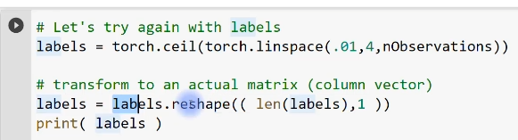
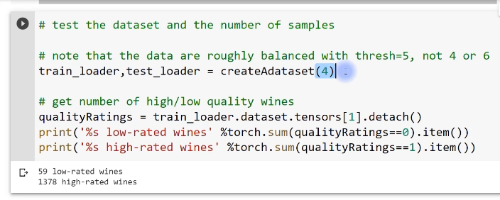
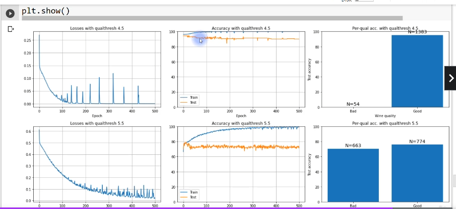

# A ddep understanding of deep learning

- [A ddep understanding of deep learning](#a-ddep-understanding-of-deep-learning)
  - [More on data](#more-on-data)
    - [Anatomy of a torch dataset and dataloader](#anatomy-of-a-torch-dataset-and-dataloader)
      - [Goals of this section of the course](#goals-of-this-section-of-the-course)
    - [Data size and network size](#data-size-and-network-size)
      - [Reminder: deeper networks have fewer parameters](#reminder-deeper-networks-have-fewer-parameters)
      - [Goals of this code demonstration](#goals-of-this-code-demonstration)
    - [CodeChallenge: unbalanced data](#codechallenge-unbalanced-data)
      - [A thought experiement](#a-thought-experiement)
      - [How balanced is balanced enough?](#how-balanced-is-balanced-enough)
      - [CodeChallenge](#codechallenge)

## More on data

### Anatomy of a torch dataset and dataloader

> - Know the goals of this section of the course
> - Learn more about how PyTorch organizes data

Welcome to this section of the course, which is all about data in this video, I'm going to give you a brief introduction to the section.

I'll just tell you about the major goals for this section, and then we'll switch to Python and I will show you a little bit more about the Python dataset and data loader objects, how to inspect them and work with them.

#### Goals of this section of the course

OK, so a couple of goals for this section.

We will discuss what unbalanced data sets means and why it's potentially dangerous and how to deal with unbalanced data sets.

I will also show you how to appropriately sample and oversample and also augment data.

We will learn how to get data into CoLab from outside CoLab and also learn about how to find data sets online that are interesting for deep learning exercises.

And also we'll talk about how to save models after you've trained them and how to load train models back into your Python workspace so that you don't need to retrain the model every single time you want to use it.

All right.

So that's just a couple of quick words about this section.

Let's now switch to Python and talk about PyTorch datasets.

[DUDL_data_datasetLoader.ipynb](../data/DUDL_data_datasetLoader.ipynb)

Of course, we've been using these data set and data loader objects for, you know, many, many videos now, so you're already quite familiar with them.

So what I hope to do in this video is just give you a little bit more insight into how the data are actually stored in these objects and how you can access them and work with them.

Now, we don't need to build any models here.

We don't need to import any data.

It's easiest just to create our own data.

So here I'm just creating some random data.

This is a data matrix with 100 observations and 20 features.

So it is a 100 by 20 data set here.

I'm converting it into a PyTorch tensor.

So this is a line of code that you've seen before.

I'll show you in a moment why we need to convert data into PyTorch's internal format.

So here I have dataT for Tensor and now here I'm going to print out some information.

Let's see.

So here we have the Numpy data.

This is the type.

So we see type of data.

It's a numpy array and array for n dimensional array.

This is the size.

And in Numpy, to get the size of a matrix, you type the Matrix, name the variable name and dot shape.

So then we see this is one hundred by twenty.

And here is the type of data.

This is a float, 64 bit representation.

So basically these are floating point numbers.

Now this is the type and this is the type.

So let's discuss the difference between this type.

Here is the variable type.

This is what Python recognizes as the variable type of this variable, the class of this variable.

Here, when we say dot dtype, this is the data type, this is the way that the information contained inside this variable is represented.

OK, so the the class of the variable is called a Numpy array.

And the type of the data that's contained inside that variable is floating point numbers.

OK, so that is for Numpy.

Here's the same thing for the dataT the PyTorch Tensor.

So we see that this is a torch that Tensor object or class.

It's the same size it's printed out differently.

You can see that, that just the way that this is visually printed, it's slightly different.

But the size of the same of course, and the data type is also the same, except this is now a torch dot float.

Sixty four instead of just a regular float.

Sixty four.

Also notice the difference in functions here.

So here we say data.

This is Numpy.

We say data dot shape here.

This is PyTorch.

We say data dot size.

Now it turns out that shape also works in PyTorch so we can type dataT dot shape and still get the same answer.

But that doesn't work or the converse doesn't work in Numpy.

So Data Dot size.

This is the method that works for PyTorch objects.

It doesn't work for Nampy.

I guess there is a more general point here, which I've mentioned a few times already in the course,

which is that sometimes Numpy and PyTorch have basically the same syntax, basically the same function names, the same methods, names, and sometimes they don't.

And unfortunately that's just something you're going to have to get used to with experience, with practice.

OK, very good.

Now we have our data here.

I'm just showing you some ways to convert data not only into a PyTorch Tensor, which we've done above, but also simultaneously changing the data type.

Now, you've actually already seen code that looks like this.

We have often used this long format when we when we create labels.

So we need the labels in PyTorch to be integers and the data should be floating point.

So in this case, in this particular example, we don't actually need the float because these are already floating point numbers.

But but it doesn't hurt to have it here anyway.

Here we actually do need dot long if we want these to be integers.

So let's run this code.

Now we see that we have floats and we have INTs.

And what is the implication of that for these variables?

Let's have a look.

So here is we start with data.

Actually, this is the original Numpy data that I created.

And then here I have T two.

So this is converting the data to PyTorch Tensor and then adding that float to make sure that it gets converted as a floating point number.

Here we have the same thing.

So, you know, the visual output, the formatting is slightly different, but the numbers are the same, except that it's a Tensor here.

And now let's look at T-3.

This is where we converted to Long, which is the PyTorch speak for integers.

Now, here you can see this really made a change, right?

These are now integers or zeros and ones and minus ones, and there's probably a couple of twos and minus twos and so on in here as well.

So you can see that by typing dot long, we have converted this floating point number matrix into integers,

so all of the decimal points are dropped.

OK, so that is the implication of long.

Now I'm going to convert this into a PyTorch dataset and actually I want to run this one first.

So now what I'm doing is trying to create a data set by inputting the variable data.

Now, remember, this data variable is what we created in Numpy.

This is not a PyTorch object is a numpy array.

And when we run this, we get an error message and the error is, well, I guess in this case, unfortunately, the error isn't so meaningful.

But the problem is, or I should say interpretable isn't so interpretable.

It's not a super helpful error message.

But the problem here is that this object here is not a PyTorch tensor.

So instead, all we do is add the T here.

This has been converted from Numpy into PyTorch and then it converts just fine.

Of course, that numerical values here and here are the same.

It's just the internal representation of the variable type is different.

OK, so now I've already shown you this before, but data set is an object so we can type DOT and then now I press tab on the keyboard and we can see there's going to be depending on what optional inputs you include here, there's going to be some different methods or attributes that we have access to.

So here we have data set, tensors, and that's what's printed out here.

So you can see this is actually a tuple right.

It's separated by parentheses.

And here we have a comma.

Now, there's nothing after the comma.

So that means that this is a tuple with only one element in it.

So we can see the length of this tuple is just one.

So in fact, this comment here is not entirely correct.

This is only containing data next in this out.

In a moment, we're going to also create labels.

OK, so so this is a a tuple and the first object we can access by indexing zero.

And that is the all of the numbers themselves.

So here we created a dataset with only or by using this function tensor dataset and providing only one input, which is the data matrix.

So let's try it again with labels.

So here I'm creating some labels.

These are just numbers that go, you know, these are just going to be integers that go from one to four in one hundred steps.

So I'll print this out in a moment so you see what it looks like.

And then actually, I think I will just go through this step by step.

So here I create the labels.

You can see that it's just the numbers one through four.

Now, this is a just like a list of numbers.

It's not organized into a matrix or a tensor that has orientation's.

So now what I'm doing is reshaping the labels to be themselves, the length of the labels and then one.

Now, this just specifies that labels needs to be a column vector.

Notice here we only have one set of square brackets.

And now when I run this code again, we get a second set of square brackets indicating that this is the first row.

So this first square bracket indicates the opening of the tensor, the beginning of the Tensor the matrix here.

This is the first row, the second row, the third row and so on.

So now you see that this set of numbers has an orientation.

It is a column vector.

OK, so let's get rid of that.

And where are we?

We are all the way up here, actually.

OK, so now I'm going to make a new data set.

I think I will comment out this line.

So now we're going to make another data set to recreate this dataset.

And now we have two inputs into this tensor data set function, the data and the labels.

So that means that now and just to make this a little more seamless from before, and it's a length of data set and now we see a very different answer here.

So remember before when we created the tensor data set only by adding the data, then the length of this data set was one.

It was a one element tuple.

Now we input it.

We provided two inputs, the data and the labels and the length of this data set is now one hundred.

And of course, this corresponds to the total number of observations that we have.

So now we can look at the first element in data set and you see that this is a small number of numbers.

In fact, there's twenty numbers here corresponding to all of the features.

From the first observation, so this is the first observation and here is the label, and then, of

course, here is the 11th observation and so on.

So this means that the output of the tensor data set function is slightly different, depending on the kinds of inputs that we provide or the number of inputs that we provide.

Now, this is actually the most typical way of setting up your tensor data set, because in most cases you have the data and you have corresponding labels.

Not always, but this is generally what happens pretty often.

OK, so then we also have all of the data stored in Tensas.

So here we have data set, Tensas and OK, maybe we can look at the length of this and see that this is now a two element tuple where the first element corresponds to the data and the second element corresponds to the labels.

And that brings us back to this code here.

So now I'm printing out the size of the first element of the Tensas tuple and the second element of the Tensas tuple.

So this is that one hundred observations by twenty features.

And here we have the one hundred labels organized as a Column Matrix.

And to be honest, I don't remember what I wanted to do with this.

I think I wanted to show here the difference between this organization of one hundred by one showing that this really is a matrix, it has an orientation, it's a column versus here where we just create some random integers.

And this is not a matrix.

It doesn't have an intrinsic orientation.

This is just an ordered set of numbers.

OK, very good.

So that's for Tensor data sets.

Now, I want to talk a little bit more about data loaders.

Of course, you have already seen data loaders before.

So this is a little bit of a reminder, and I hope you will gain some additional insights into how these data loader objects are organized.

OK, so data loader, we input the data set which we created above and the batch size which here I'm setting to be twenty five.

So these are also objects and there are also many attributes of these dataloader objects here.

I'm going to focus on how the data themselves are organized.

So data loader data set which corresponds to this.

Now you can see from here the everything after the dot, the data set.

This is starting to look the same as what we were investigating here.

And in fact, it really is.

So this is just where PyTorch stores the actual data set in the data loader.

So the data set is a this is the full data set.

It's one hundred by twenty.

Now, this is not the batches, right?

Because we are taking we are specifying mini batches of size.

Twenty five and you don't see twenty five anywhere in here.

Instead when we use the data load or object as an iterable in a for loop, this is when the methods associated with this data loader object are going to start breaking up the data into the mini batches.

So here we have looping over the many batches that are twenty five by twenty.

This is the data is twenty five by twenty.

Twenty five of course is the size and twenty is a number of features.

So then the labels of course are also twenty five.

So you can see that the data loader is not simply storing the different batches, instead it's storing the entire data set.

And when you call the data loader as an iterable, that's when internally it will start breaking up the data or segregating the data into these different mini batches like this.

OK, and then here just to have a look at the labels, you can see these are all organized into the mini batches here, but that's because of the way that I specified them.

So I said that, you know, there's twenty five mini batches and they go from one to four mean for mini batches of twenty five elements each.

OK, now here we have turned shuffling off, which it is by default.

So you can see here I say shuffle equals true and I've come into this out which means the default is false.

So there's no shuffling here, which is why these labels are all in order.

So now we're going to run this again with shuffling.

OK, so now you see, well, it's no surprise that the labels are completely shuffled.

The data, of course, are correspondingly shuffled, but it doesn't really make sense to look at them.

They're just random numbers.

OK, I have a question for you.

I am going to comment out this line here.

And the question is, if we do not recreate this data loader, which means we're not, you know, having this line here, what is what are these labels going to look like?

Is it going to be exactly the same order or is it going to.

A new random shuffling, so the question really is where does pytorch actually do the shuffling?

Does it shuffle them once up here or does it shuffle them here inside the for loop when we call this as an iterable?

So here's the answer.

We just have to look at one, four, three and see if that's the same.

So run this code again and we don't see one for three.

We can run it again and again and again.

And what we have learned from this little experiment is that the data loader gets reshuffled every time it gets called in and as an iterable.

So each time you have a for loop like this PyTorch is going to come up with a new set of random sorting integers or indices for sorting the data and the corresponding labels.

OK, so that is also worth knowing.

And then the final thing I want to discuss is how to get only one batch out of a data loader.

So instead of using a for loop to get all of the batches inside this this for loop, if you only want to get one batch, one mini batch, then you just use next itor.

So this is two functions.

This extracts the iterable here and this gets the next iteration, this code you've also seen we use this all the time when we are testing the model for evaluation.

These data sets and data loader objects are quite central to working with data in Python.

So I hope that now at the end of this video, you have a little bit more confidence and understanding of how these objects are organized.

### Data size and network size

> - Learn more about the relationship between the amount of training data and DL architecture.
> - Witness yet another illustration of how DL is often unintuitive yet amazing.

We are going to explore the relationship between the amount of training data and the size of the Deep Learning Network in terms of the breadth and the width.

I think this will also provide another nice illustration of how deep learning is amazing.

It's remarkable.

It's almost magical.

And yet it's also kind of unintuitive in that it's often difficult or impossible to predict how a particular model or model architecture is going to perform without first actually just testing on data and empirically evaluating how different model architectures perform.

#### Reminder: deeper networks have fewer parameters

So let me start by reminding you of a concept that we discussed previously in the course, and that is different model architectures can have the same number of units, but still have a different number of trainable parameters.

So you I hope you recognize this slide from earlier in the course here.

We discovered that if we have the same number of units in the model, depending on the architecture,

if it's a wide model or a deep model, the number of trainable parameters differs.

In particular, models tend to have fewer total parameters for, you know, when you equate the number of nodes compared to wide models.

#### Goals of this code demonstration

So with this in mind, but we are going to do in the code here is train a bunch of models to classify the three category qwerties.

I guess you might have missed those that are going back to them for a little bit.

And what we are going to do is parametrically vary the depth and the breadth of the models while keeping the total number of units constant.

So this is a little bit like the screenshot I showed in the previous video.

So here we are going to have all of our models with exactly 80 units.

The question is, how are those units organized and how many layers do those units exist?

And then we're also going to parametrically vary the total amount of data from 50 data samples to 550 data samples in sets of 50.

Now, this right here is a good example of why out of the advantage of creating our own data are generating our own data.

We can simply create as much data as we want.

OK, and then we'll see what happens.

It's going to be fun and exciting.

[DUDL_data_dataVsDepth.ipynb](../data/DUDL_data_dataVsDepth.ipynb)

So the data creation code is very similar to what you've seen before, but it's actually a little bit different here.

So notice here, instead of just creating the data right away, I'm actually writing a function is the python function that will create the data and then export the data and the labels and the input into this function is this variable and nPerClust, which is the number of data points per cluster.

OK, so then a lot of this code is the same.

One of the things that's different here is I'm putting the data and the labels.

So here the data here are the labels for the category labels and putting those into a dictionary that here I'm calling output.

And the dictionary has two keys called data and labels, of course.

OK, and then I split the data into train and test data loaders here.

And those also go as separate keys into the output dictionary.

And then I just return that dictionary.

Now, you don't actually need a dictionary here.

We could also just have all of these variables and just, you know, return them all out here as a tuple of four different outputs.

Or maybe we only need these to be totally fine.

As I said before, I like to vary things in code a little bit to give you more variety of how to solve problems in Python and also in PyTorch.

And that's because I want you to have the flexibility to be able to adapt code to your particular projects and data sets and models.

And it's not always going to be the case that, you know what?

The code that I write in this course is always the best for your applications anyway.

OK, so we create that function.

And here I'm just checking that the function works.

So I get this variable, the data, which is actually a dictionary and I call the function with 50 and N equals 50.

So in fact, also as a little reminder, this actually creates one hundred and fifty total data points.

It's fifty data points per category.

OK, and then here we plot them.

You can see this is relatively sparse compared to what we do know, how much data we usually generate for these qwerties problems.

So it will be an interesting question whether the deep learning models can still learn, given this relatively small amount of data and whether the model performance depends on the architecture.

So wide networks versus deep but shallow networks.

Now let's create the model.

 

Now, this is borrowing from code that we have used previously where we manipulated the number of layers and nodes in the hidden layers.

So I think you will recognize this code here inside def and it's for creating the deep learning class.

So here I initialize self-taught layers to be a dictionary, and then here I specify in a for loop that

the hidden layers are defined as linear layers with nunits by nunits.

So we are going to input into this function that creates the model.

We input the number of units and the number of layers.

OK, so that code you've seen before and then also this forward pass thing you've seen before as well.

So it always goes through the input layer.

We only have one input layer.

Here is the variable number of hidden layers which we are going to parametrically the set.

And then of course, we just have one output layer which gets returned.

And here, of course, I'm returning the raw numerical value because I'm using the cross entropy loss function.

Now you can see that here I'm using stochastic gradient descent with a learning rate of point zero one.

In fact, I made this choice because I wanted to slow down the learning a little bit.

So in the additional exploration's at the end of this notebook, you'll see that there are some opportunities for you to explore whether the findings that we will see here with gradient descent are also observed with using the adam optimizer.

OK, so now we are going to test the model with some fake data.

Again, the point of having code like this is just to make sure that we haven't done anything wrong or made any coding mistakes up here that would lead to python errors or inconsistent errors.

So and then here I'm just inputting some random numbers into the model.

Again, this is just to make sure that we get an output, we just get some kind of numerical output that has the size that we expect.

So there's three categories of qwerties.

So we expect to have three columns here.

Very nice.

So that builds the model.

Now let's train the model and all of this training code is not new.

You can see here at the top we are creating a new instance of the model, using the number of units and the number of hidden layers that we get to specify.

OK, so then let's see.

We can scroll all the way through this.

Again, this is just testing the model here before we run the actual experiment.

So I'm creating some data with two hundred data points per category.

Here I am building and training the model.

Now, here I say the inputs are 80 comman one.

What does that mean?

Well, this means that we're going to have 80 units and only one hidden layer.

So this model will have an input layer, one really wide hidden layer and then an output layer.

OK, and then we are going to look at the results.

Again, we don't really need to interpret this so much.

We just want to make sure that all of this code works so we don't run into errors later on in the experiment.

So this looks pretty good.

Looks like the train accuracy is around 95 percent, 94 percent.

And the test accuracy kind of wobbles around a little, actually, but some also somewhere around 95 percent overall.

This looks pretty good.

I think we are ready for the experiment.

Now, the idea of this experiment is that we want to fix the total number of units in the model while changing the architecture between wide models and deep models.

So therefore, we need a little bit of extra code to get that to work.

So here's the way that I set this up here.

I specify the total number of nodes in the model and here I specify the the different options for layers.

So our model is going to have one layer, five layers, 10 hidden layers and 20 hidden layers.

Now, these are not arbitrarily chosen numbers.

I pick these numbers so that they are all divisible into 80.

So that's going to make sure that even as we change the number of layers, we're always going to have the same number of units across the hidden layers, which means the same number of units in the model, because the input and the output layers are are fixed.

The number of units they have is already fixed into the model architecture.

And then the number of data points varies from fifty to five hundred and fifty instead of 50.

And again, this is per category.

So the total sample size is actually these numbers times three.

OK, so this code here is actually not running the experiment yet.

Instead, I'm just confirming I'm just printing out some messages that will confirm that we are in fact getting the model architecture as we specify here.

So here we can input the layers.

This is the number of layers that gets specified and now the units per layer that actually has to vary depending on the number of layers.

And that's what I do with this computation here.

So I'd say the number of total nodes in the model divided by the number of layers, and that gives us the number of nodes and the number of units per layer.

I hope that makes sense.

So the total model size, the total number of units, and then we divide by the number of layers and that tells us how many nodes we need per layer.

So then I create that network.

And here this code here, I think you will recognize this.

If not, here's one of these several references in the course where we've discussed code like this.

But essentially this is a list comprehension here that is looping through all of the layers in the model that have parameters, that have trainable parameters, and it simply counts the total number of them per layer and then some over all of those layers, all of those parameters.

So this is just going to tell us how many parameters are in this particular model.

All right.

So run this code and we see this model has one five, 10, 20 layers as specified.

Now, each layer, each hidden layer has 80 units here.

Each of these hidden layers has 16 units and so on, up to 40 or four.

So you can see that the product of all of these is always 80.

So we fix 80 parameters.

But this is super interesting.

Look at this unbelievable difference.

This is an order of magnitude difference in the number of trainable parameters, even though the total number of units in the model is exactly the same.

I find that to be quite striking.

OK, so now we've basically done a lot of sanity checking.

We have confirmed that the model works, the training code works, and we have a nice little algorithm that determines the total number of. Units per layer and according to the number of layers, now we are ready for our experiment.

The code in this code cell is not really any different from code you have already seen up above earlier in this code file.

So here we extract the data, we generate data and we extract the training data and the test data.

And here we loop over the layers, which is also looping over the notes per layer, then train the model and get the average accuracy and the losses.

And here I'm just taking from the previous sorry, the last five training epochs.

And it's just a way to smooth out the plots a little bit.

OK, so this code takes several minutes to run.

So if you're running this on your own alongside the video, then, you know, you probably want to run this cell like this and then, you know, go for coffee or check your email or something.

I'm going to pause the recording.

I'll see you when this finishes.

All right, so the way that we are going to plot these is using line plots, so I'm going to have the

x axis showing the number of data points and the Y axis showing the results, which is the loss function or the losses, the numerical losses and the accuracy for the different models.

So there's going to be different lines corresponding to the different models with different architectures.

So let's see how this looks.

This is pretty striking, I think.

So we get the blue line and the orange line correspond to a relatively large number of parameters and also relatively shallow, but wide networks.

So one layer with 80 units and five layers with 16 units and they're the lost function is small.

Now, it looks like the green line is missing here, but it's actually almost perfectly overlapping with the red line.

So having 10 layers and 20 layers basically gives the same loss, which is pretty much saturating at the maximum.

Now, maybe on your screen you can see the difference.

I can actually see a tiny it looks like, you know, one or two pixels that they differ over here.

But anyway, they're pretty much overlapping here.

We get to accuracy and here we see, of course, the complementary function as for the losses.

So in this case, having a wide network does really well.

And also you have five layers with six units that also does pretty well, but having really deep layers, but very shallow.

So not many units, but many layers.

Those also just performed abysmal, really, really terrible.

Barely got up to, you know, 33 percent performance, which would be accuracy.

So it was really just totally guessing here.

So I find this to be a fairly striking result because we've now seen in this course so far several cases where having deeper models did better.

And we also see in cases like in this video where having fewer models does or so fewer layers actually gives better performance.

So this is what I meant when I said at the beginning of this video that deep learning is sometimes unintuitive in that it's hard to predict exactly how a model is going to perform without having some experience already with that kind of model, that kind of architecture, and also this kind of data and the kind of problem that we are working with.

So it is not the case that having more layers, you know, a deeper network is necessarily good or necessarily better.

Likewise, it's also not always the case.

You can just not generally say that having fewer layers and a wider network is necessarily good.

The good news, though, is that the more you work on deep learning problems, the more you try to solve problems and categorize and learn data using deep learning with different architectures.

The more practice you get, the more videos you watched, the more overall experience you have.

You will start to develop some intuition for what kinds of architectures and meta parameters are suitable for what kinds of problems and data sets.

### CodeChallenge: unbalanced data

> - Understand why an unbalanced design is dangerous
> - Learn more about quantifying DL performance

Part of my core teaching philosophy is that students learn best when they experience something firsthand that is much better than, you know, just me yakking수다를 늘어놓다 away into this microphone and having some words on the screen.

So with that in mind, the goal of this code challenge is for you to explore and see for yourself what happens when you have an unbalanced data design in deep learning.

So I'm going to first talk a little bit about theory and then I will explain what you should do in this, code, challenge.

And I think it will be pretty eye opening.

I hope you find this a very interesting and informative code challenge.

#### A thought experiement

So what does an unbalanced design mean?

Well, let me start by doing a thought experiment.

Let's run a thought experiment here.

We have 100 different pictures or 100 pictures, 99 of them are cats and one is a ship. It's a boat.

So let's say that the goal is to train a model to distinguish pictures of cats from pictures of boats.

So we develop a deep learning model.

We set the architecture, the meta parameters and so on, and we start training.

We're ready to go with training this model.

Now, the question is here is the critical question.

Do you even need to train the model?

Is it even necessary to train the model to distinguish cats from boats in this data set?

Well, the answer is actually no.

You do not need to do any training at all.

All you need to do is tell the model to call everything a cat.

So the model simply outputs cat.

It doesn't matter what the input is.

The model just says that everything is a cat and the model is actually going to be correct 99 percent of the time.

The model will get amazingly high accuracy, 99 percent accuracy simply by calling everything a cat.

So this is a problem with an unbalanced design.

Effectively, the model is not learning features of the stimuli.

That's not learning what it means to be a cat in the eyes and the ears and so on, and said, this model is learning a bias.

It is learning to give a biased response towards the answer of cats towards the category cat.

So this is the problem.

Unbalances.

I'm OK now.

You know, this is a bit of an extreme example.

We don't always have generally don't have models like this, but these sorts of things do arise in real data.

For example, if you are working with clinical data, there are many more people that do not have a disease than there are patients who do have a disease.

Or if you're working with credit card data, this is another common use case of unbalanced data designs.

Most credit card transactions are not fraudulent but valid.
Very few credit card transactions actually are fraudulent.

#### How balanced is balanced enough?

So what we want ideally is to have a perfect 50 50 split.

So exactly 50 percent of the data is cats and 50 percent is boats.

And of course, this for two categories.

You know, if you had four categories and you would want ideally to have a perfect twenty five.

Twenty five, twenty five, twenty five split so that more generally, ideally, you want all of your categories to have the exact same number of samples.

Now when you are generating your own data, which we do sometimes hear, or if you have like a huge,

huge data set and you can pick and choose and you can select data, then it's possible to generate perfect splits.

In reality, it doesn't really have to be perfect.

It's totally fine if you have a little bit of an imbalance, this generally isn't a problem.

So here we have a little bit of an imbalance.

There's fifty five cats and forty five boats.

I don't think this kind of a slight imbalance is really going to be problematic.

So in real data, a perfect split might be impossible or impractical.

And this issue is slightly less important when you have lots and lots of  data in that small differences

in category sizes are not so important and not so impactful when you have really large data sets.

Again, this is all within reason.

You still want to have a roughly even split between the different categories.

Whenever you do have an uneven split between your different categories, then it's good to compute the accuracy per category.

So you don't just want to compute the accuracy for all of the images or, you know, all of the observations.

In total, it's good to separate the accuracy per category.

So balanced design and having a the same or comparable number of data points per category is an important issue.

Over the next several videos, I'm going to discuss this in more detail, talk about how to do oversampling and augmentation and so on.

#### CodeChallenge

To deal with cases where you have an unbalanced design, what we are going to do in this code challenge is to demonstrate empirically the importance of balanced design and see what happens when the categories are unbalanced.

OK, so here is what you want to do, make a copy of the wine quality code.

[DUDL_metaparams_CodeChallengeRelus.ipynb](../metaparams/DUDL_metaparams_CodeChallengeRelus.ipynb)

And I suggested this particular one because that's the one that I started with.

This is that notebook that I started with for creating this code challenge.

You can take any other code file.

It doesn't matter as long as it's about the wine quality and you want to develop a model that uses the leaky RELU activation function, the adam optimizer with a learning rate of zero point zero zero one train for 500 epochs.

OK, so then so this is pretty standard stuff.

I don't think you will be this this stuff won't be any any difficulty for you.

OK, and then what you want to do is create a python function that will create an export training and test data loaders with a specified quality threshold for binaries, the low quality wines versus the high quality wines in particular.

You want to create three different data sets using three different thresholds for quality.

So let me make sure it's clear what this means.

Here is this histogram should look familiar.

This is the histogram of the wine quality ratings.

We have seen this before when we first started working with these data.

Now, previously in this course, we've always been finalizing the data.

We've been thresholding the wine quality ratings at in between five and six.

So let's say five point five.

So that means that quality ratings three, four and five, we called zero.

So low quality and rating six, seven and eight, we called high quality.

And that leads to not a perfect balance, but a roughly equal balance between low quality and high quality wines.

What you are going to do here is rethreshold the data using these three different thresholds.

So if you use a threshold of four point five, that means that these two categories are going to be considered low quality and all of these will be considered high quality.

You can see that there's going to be a huge imbalance of sample size.

So this one low quality here is going to be like, I don't know what these numbers are, maybe around

60 somewhere around there, 60 or 70 in total.

And these guys all together, five, six, seven and eight, that's going to be, I don't know, thirteen

hundred or something, you know, some really large number.

OK, so split three and four being low quality, three, four and five being low quality and then three,

four or five and six being low quality, which means that only the seven and eights are considered high quality.

Then you run through the data of course, and plot the results.

So your data visualizations, your plots should be something like what you see here.

So we have a three by three grid of plots.

The top row corresponds to setting the quality threshold at 4.5.

So this is unbalanced in one direction.

Here we have the same quality threshold that we have been using previously in the course.

That's why I'm showing you this here.

And then we have the quality threshold in the other side.

So six point five, OK, and then here in the first column, I'm showing the losses.

You can see that they are going down here.

I have the accuracy as a function of training for the training and loss our test data sets.

You can see, by the way, that with Adam, we get a little bit more overfitting compared to with standard gradient descent.

So with gradient descent, we actually you know, we didn't get accuracy, training, accuracy quite this high and the test accuracy is still somewhere around 80 percent.

What do you see here in this third column?

Is the quality sorry, the accuracy computed per quality bean.

So this is the low quality wine and the high quality wine.

The end here corresponds to the number of training samples.

So these are not the test, the number of test samples, these are the number of training samples.

But the accuracy here is the test accuracy.

I hope that's not too confusing here.

So you can see that the accuracy is roughly equivalent.

It seems like it's a bit higher here for the high quality wines compared to the low quality wines,

but that's actually not a real meaningful difference.

If you would run this whole experiment again, you might find this flip.

So these are roughly comparable for these two categories.

So it will be interesting to see what are the accuracy functions here and here and how the accuracy is split up for the low and high quality wines.

All right.

I hope that makes sense.

There's quite a bit of work to do in this challenge, but I believe in you.

I know that you can do it and I also hope that you enjoy working through this and find it interesting, you should now pause the video

and switch to Python and work on this code challenge.

When you're ready, you can come back.

I will show my solution and engage in a discussion about the results.

[DUDL_data_CodeChallengeUnbalanced.ipynb](../data/DUDL_data_CodeChallengeUnbalanced.ipynb)

Much of this code should look familiar to you.

This is importing the data.

Notice here, the importing the data is all the same.

This happens before we split up the data.

So here we are importing doing some light processing and normalizing to Z score.

Here is something new.

So here is the python function that creates the data set.

Now, most of the code inside this function is the same that you have seen before.

It's just copied and pasted.

You can see I'm outputting from the function, the train loader and test loader.

What is new in this function is these two lines right here.

And actually this also isn't so new.

It's just slightly modified.

Previously in all the previous videos with the wine quality data set, I had this fixed to five.

So I said the data quality where the data quality, the quality column is greater than five, then this ends up being true and then we convert that into integers.

So this ends up being zeros and ones, which then replaces the column here bool quality.

So what we do now instead is soft code this to be this value qual threshold, which is the input into this function.

OK, so that is the function to create the data loaders and yeah.

Here I'm just testing it a little bit so we can see actually let's start with four.

So with a threshold of four then I'm going to basically create these two data loaders and then print out the number of samples that we have in each of the categories.

So you see here with a threshold of fours actually in the slides, what I referred to as four point five.

We have sixty so fifty nine low rated wines and almost fourteen hundred high rated wines.

So this is a huge difference in the sample size.

Really big difference.

OK, then we go for five.

This is what we have done so far.

You can see these are also not perfectly matched.

They are around 100 samples different.

But it turns out that this is not really problematic.

The accuracy for these two categories is roughly similar.

So, you know, not really ideal to have one hundred samples. Different difference, but this is not really a problem.

OK, and then for six now we have the reverse problem, as with when this was set to four.

So now we have many, many low quality wines and relatively few high quality wines, although this is not quite as bad as it was with the four split.

All right.

Very nice.

Now, let's see the model.

I just decided, you know, probably out of laziness, maybe I decided to leave the model architecture

basically as it was with the two hidden layers and 32 units and 16 here and so on.

And here we are doing leaky Relu instead of regular Vanilla Relu.

Now, there isn't any specific reason why I said to make this be leaky Relu.

I thought it would just be nice to have a little bit of diversity just to change something a little bit.

By the way, you can also see that here I don't actually have a python function to create the in the model instance and I'll put that model in since I'm just creating the the class right here in the code without a python function.

Sometimes I do it in python functions, sometimes I do it this way.

As I mentioned before, I think it's nice for me to show slightly different ways of accomplishing the same goals.

That just gives you more examples to learn from.

OK, so then here I actually do have a python function to train the model because we're going to train the model multiple times.

So we want to put this stuff in a function.

Uh, let's see, 500 training box using the dam optimizer with a learning rate of zero point zero zero one.

As I specify, I believe the rest of this code is not changed from how it was before.

So just run that and let's see.

Well, as you know from me saying this many times, I'm a big fan of testing out these models before running an experiment.

So what we do here is just create one data set, train the model and let's see.

Then after the model is fully trained, I'm going to test the model on the test data set and compute the I call this variable itemAccuracy because it is the accuracy for each individual data sample in the test loader.

And then here I am separating out the accuracy for Y equals zero, which is the low quality target and quality equals.

One, which is the high quality target.

OK, so let's run this, that will take, I don't know, a couple tens of seconds.

Maybe I'll come back when it finishes.

So here we see the accuracy for low quality wines and high quality wines and actually a little surprised

that this is low at 70 and 74, I was expecting it to be a little bit higher than that.

But maybe we just had an unfortunate start with random weights.

Anyway, the main point to this was to make sure that we don't get any errors or any warning messages

in Python, which we don't.

So therefore, I'm going to go on to the experiment.

So the code to run this experiment is not terribly fancy.

We just have a for loop that loops over these three thresholds and then basically does all of the code

that you've already seen.

So create a new data set and create a new instance of the model, train the model and then compute the here per quality accuracy, just as I did above.

The only thing new in this for Loop is all the plotting stuff, but this is actually pretty straightforward.

So it's just going to plot the losses and plot the accuracy and then the bar plot for the per category accuracy.

Maybe this is interesting for you to look through.

If you're not really familiar with using text or creating text inside plots, then you can check out this code.

Otherwise, I am just going to run this code.

This takes several minutes to run through and I will see you in a moment.

It's kind of funny that I say things like, OK, good bye, see you in a few minutes and you know,

I'm pausing the recording so you don't actually experience me leaving.

But I walked away, you know, I got some water and wash some dishes and things.

Anyway, let's have a look at the results.

So this middle row here is not so interesting because we already saw it, although we can see again that, you know, I'm a little surprised this time that the accuracy is a bit lower.

It's usually around 80 percent.

Anyway, let's look up here at this accuracy.

So now this this is with a quality threshold of 4.5.

And here you see that the accuracy initially looks really impressive.

It looks like the model is basically at 100 percent for the training data set and for the test set,

it looks like it's somewhere around 90 percent.

Maybe it's a little over 90 percent, somewhere around 90 percent.

But look at this.

This is amazing.

When you see the test accuracy for the low quality and high quality wine, you see, it's a huge bias.

The model is basically getting nearly all of the high quality wines correct, around 90 over 90 percent accuracy.

And for the low quality wine, I think this is exactly zero.

Maybe it's you know, I don't see anything here.

I don't see a bar.

Maybe it's a little bit above zero.

But anyway, it's basically at zero.

So this model is kind of doing what I said at the beginning of the video with the cat and the boat example.

This model is basically always saying that the wine quality is good, almost always.

Not exactly.

Always makes a few mistakes, almost always has a really, really strong response bias, almost always saying that the wine is good.

So this model isn't really learning anything about wine quality.

It's just learning to say good all the time.

OK, and then we get to hear, although the the performance is a little bit lower than I would have expected.

Still, you can see it's fairly balanced between these two categories.

And here we have the opposite example as what I showed above.

Now, it's not so extreme in this case, but there is still clearly a bias.

So here you see the model is really just preferring to say that the wine is low quality as often as possible.

And here for good, this looks like it's around 40 percent ish accuracy.

So that's you know, that that's pretty awful.

Actually, it's it's really bad.

So the model has clearly learned a bias in this case and it has clearly learned a bias in this case.

And it didn't seem to have a bias here.

I hope you enjoyed working through this code challenge, you gained firsthand knowledge of the reason why unbalanced designs are dangerous for deep learning.

They make learning, deep learning quite difficult without making any changes.

So in the next video, I'm going to say a few things about what to do about unbalanced data designs.
