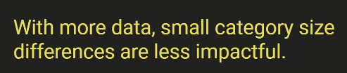
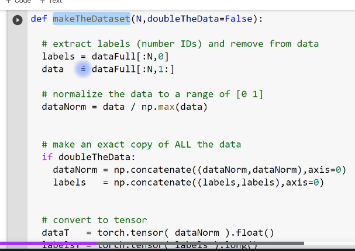
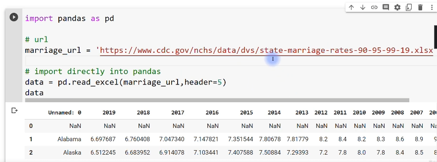

# A ddep understanding of deep learning

- [A ddep understanding of deep learning](#a-ddep-understanding-of-deep-learning)
  - [More on data](#more-on-data)
    - [Anatomy of a torch dataset and dataloader](#anatomy-of-a-torch-dataset-and-dataloader)
      - [Goals of this section of the course](#goals-of-this-section-of-the-course)
    - [Data size and network size](#data-size-and-network-size)
      - [Reminder: deeper networks have fewer parameters](#reminder-deeper-networks-have-fewer-parameters)
      - [Goals of this code demonstration](#goals-of-this-code-demonstration)
    - [CodeChallenge: unbalanced data](#codechallenge-unbalanced-data)
      - [A thought experiement](#a-thought-experiement)
      - [How balanced is balanced enough?](#how-balanced-is-balanced-enough)
      - [CodeChallenge](#codechallenge)
    - [What to do about unbalanced designs?](#what-to-do-about-unbalanced-designs)
      - [Which datasets are unbalanced?](#which-datasets-are-unbalanced)
      - [Strategies for dealing with unbalanced data](#strategies-for-dealing-with-unbalanced-data)
    - [Data oversampling in MNIST](#data-oversampling-in-mnist)
      - [Oversampling by exact replications](#oversampling-by-exact-replications)
      - [About the code example](#about-the-code-example)
    - [Data noise augmentation](#data-noise-augmentation)
      - [Noise data augmentation](#noise-data-augmentation)
      - [About the code example](#about-the-code-example-1)
      - [Noise augmentation as regularization](#noise-augmentation-as-regularization)
    - [Data feature augmentation](#data-feature-augmentation)
      - [Qwerties and distance to the origin](#qwerties-and-distance-to-the-origin)
      - [Discussion](#discussion)
    - [Getting data into colab](#getting-data-into-colab)

## More on data

### Anatomy of a torch dataset and dataloader

> - Know the goals of this section of the course
> - Learn more about how PyTorch organizes data

Welcome to this section of the course, which is all about data in this video, I'm going to give you a brief introduction to the section.

I'll just tell you about the major goals for this section, and then we'll switch to Python and I will show you a little bit more about the Python dataset and data loader objects, how to inspect them and work with them.

#### Goals of this section of the course

OK, so a couple of goals for this section.

We will discuss what unbalanced data sets means and why it's potentially dangerous and how to deal with unbalanced data sets.

I will also show you how to appropriately sample and oversample and also augment data.

We will learn how to get data into CoLab from outside CoLab and also learn about how to find data sets online that are interesting for deep learning exercises.

And also we'll talk about how to save models after you've trained them and how to load train models back into your Python workspace so that you don't need to retrain the model every single time you want to use it.

All right.

So that's just a couple of quick words about this section.

Let's now switch to Python and talk about PyTorch datasets.

[DUDL_data_datasetLoader.ipynb](../data/DUDL_data_datasetLoader.ipynb)

Of course, we've been using these data set and data loader objects for, you know, many, many videos now, so you're already quite familiar with them.

So what I hope to do in this video is just give you a little bit more insight into how the data are actually stored in these objects and how you can access them and work with them.

Now, we don't need to build any models here.

We don't need to import any data.

It's easiest just to create our own data.

So here I'm just creating some random data.

This is a data matrix with 100 observations and 20 features.

So it is a 100 by 20 data set here.

I'm converting it into a PyTorch tensor.

So this is a line of code that you've seen before.

I'll show you in a moment why we need to convert data into PyTorch's internal format.

So here I have dataT for Tensor and now here I'm going to print out some information.

Let's see.

So here we have the Numpy data.

This is the type.

So we see type of data.

It's a numpy array and array for n dimensional array.

This is the size.

And in Numpy, to get the size of a matrix, you type the Matrix, name the variable name and dot shape.

So then we see this is one hundred by twenty.

And here is the type of data.

This is a float, 64 bit representation.

So basically these are floating point numbers.

Now this is the type and this is the type.

So let's discuss the difference between this type.

Here is the variable type.

This is what Python recognizes as the variable type of this variable, the class of this variable.

Here, when we say dot dtype, this is the data type, this is the way that the information contained inside this variable is represented.

OK, so the the class of the variable is called a Numpy array.

And the type of the data that's contained inside that variable is floating point numbers.

OK, so that is for Numpy.

Here's the same thing for the dataT the PyTorch Tensor.

So we see that this is a torch that Tensor object or class.

It's the same size it's printed out differently.

You can see that, that just the way that this is visually printed, it's slightly different.

But the size of the same of course, and the data type is also the same, except this is now a torch dot float.

Sixty four instead of just a regular float.

Sixty four.

Also notice the difference in functions here.

So here we say data.

This is Numpy.

We say data dot shape here.

This is PyTorch.

We say data dot size.

Now it turns out that shape also works in PyTorch so we can type dataT dot shape and still get the same answer.

But that doesn't work or the converse doesn't work in Numpy.

So Data Dot size.

This is the method that works for PyTorch objects.

It doesn't work for Nampy.

I guess there is a more general point here, which I've mentioned a few times already in the course,

which is that sometimes Numpy and PyTorch have basically the same syntax, basically the same function names, the same methods, names, and sometimes they don't.

And unfortunately that's just something you're going to have to get used to with experience, with practice.

OK, very good.

Now we have our data here.

I'm just showing you some ways to convert data not only into a PyTorch Tensor, which we've done above, but also simultaneously changing the data type.

Now, you've actually already seen code that looks like this.

We have often used this long format when we when we create labels.

So we need the labels in PyTorch to be integers and the data should be floating point.

So in this case, in this particular example, we don't actually need the float because these are already floating point numbers.

But but it doesn't hurt to have it here anyway.

Here we actually do need dot long if we want these to be integers.

So let's run this code.

Now we see that we have floats and we have INTs.

And what is the implication of that for these variables?

Let's have a look.

So here is we start with data.

Actually, this is the original Numpy data that I created.

And then here I have T two.

So this is converting the data to PyTorch Tensor and then adding that float to make sure that it gets converted as a floating point number.

Here we have the same thing.

So, you know, the visual output, the formatting is slightly different, but the numbers are the same, except that it's a Tensor here.

And now let's look at T-3.

This is where we converted to Long, which is the PyTorch speak for integers.

Now, here you can see this really made a change, right?

These are now integers or zeros and ones and minus ones, and there's probably a couple of twos and minus twos and so on in here as well.

So you can see that by typing dot long, we have converted this floating point number matrix into integers,

so all of the decimal points are dropped.

OK, so that is the implication of long.

Now I'm going to convert this into a PyTorch dataset and actually I want to run this one first.

So now what I'm doing is trying to create a data set by inputting the variable data.

Now, remember, this data variable is what we created in Numpy.

This is not a PyTorch object is a numpy array.

And when we run this, we get an error message and the error is, well, I guess in this case, unfortunately, the error isn't so meaningful.

But the problem is, or I should say interpretable isn't so interpretable.

It's not a super helpful error message.

But the problem here is that this object here is not a PyTorch tensor.

So instead, all we do is add the T here.

This has been converted from Numpy into PyTorch and then it converts just fine.

Of course, that numerical values here and here are the same.

It's just the internal representation of the variable type is different.

OK, so now I've already shown you this before, but data set is an object so we can type DOT and then now I press tab on the keyboard and we can see there's going to be depending on what optional inputs you include here, there's going to be some different methods or attributes that we have access to.

So here we have data set, tensors, and that's what's printed out here.

So you can see this is actually a tuple right.

It's separated by parentheses.

And here we have a comma.

Now, there's nothing after the comma.

So that means that this is a tuple with only one element in it.

So we can see the length of this tuple is just one.

So in fact, this comment here is not entirely correct.

This is only containing data next in this out.

In a moment, we're going to also create labels.

OK, so so this is a a tuple and the first object we can access by indexing zero.

And that is the all of the numbers themselves.

So here we created a dataset with only or by using this function tensor dataset and providing only one input, which is the data matrix.

So let's try it again with labels.

So here I'm creating some labels.

These are just numbers that go, you know, these are just going to be integers that go from one to four in one hundred steps.

So I'll print this out in a moment so you see what it looks like.

And then actually, I think I will just go through this step by step.

So here I create the labels.

You can see that it's just the numbers one through four.

Now, this is a just like a list of numbers.

It's not organized into a matrix or a tensor that has orientation's.

So now what I'm doing is reshaping the labels to be themselves, the length of the labels and then one.

Now, this just specifies that labels needs to be a column vector.

Notice here we only have one set of square brackets.

And now when I run this code again, we get a second set of square brackets indicating that this is the first row.

So this first square bracket indicates the opening of the tensor, the beginning of the Tensor the matrix here.

This is the first row, the second row, the third row and so on.

So now you see that this set of numbers has an orientation.

It is a column vector.

OK, so let's get rid of that.

And where are we?

We are all the way up here, actually.

OK, so now I'm going to make a new data set.

I think I will comment out this line.

So now we're going to make another data set to recreate this dataset.

And now we have two inputs into this tensor data set function, the data and the labels.

So that means that now and just to make this a little more seamless from before, and it's a length of data set and now we see a very different answer here.

So remember before when we created the tensor data set only by adding the data, then the length of this data set was one.

It was a one element tuple.

Now we input it.

We provided two inputs, the data and the labels and the length of this data set is now one hundred.

And of course, this corresponds to the total number of observations that we have.

So now we can look at the first element in data set and you see that this is a small number of numbers.

In fact, there's twenty numbers here corresponding to all of the features.

From the first observation, so this is the first observation and here is the label, and then, of

course, here is the 11th observation and so on.

So this means that the output of the tensor data set function is slightly different, depending on the kinds of inputs that we provide or the number of inputs that we provide.

Now, this is actually the most typical way of setting up your tensor data set, because in most cases you have the data and you have corresponding labels.

Not always, but this is generally what happens pretty often.

OK, so then we also have all of the data stored in Tensas.

So here we have data set, Tensas and OK, maybe we can look at the length of this and see that this is now a two element tuple where the first element corresponds to the data and the second element corresponds to the labels.

And that brings us back to this code here.

So now I'm printing out the size of the first element of the Tensas tuple and the second element of the Tensas tuple.

So this is that one hundred observations by twenty features.

And here we have the one hundred labels organized as a Column Matrix.

And to be honest, I don't remember what I wanted to do with this.

I think I wanted to show here the difference between this organization of one hundred by one showing that this really is a matrix, it has an orientation, it's a column versus here where we just create some random integers.

And this is not a matrix.

It doesn't have an intrinsic orientation.

This is just an ordered set of numbers.

OK, very good.

So that's for Tensor data sets.

Now, I want to talk a little bit more about data loaders.

Of course, you have already seen data loaders before.

So this is a little bit of a reminder, and I hope you will gain some additional insights into how these data loader objects are organized.

OK, so data loader, we input the data set which we created above and the batch size which here I'm setting to be twenty five.

So these are also objects and there are also many attributes of these dataloader objects here.

I'm going to focus on how the data themselves are organized.

So data loader data set which corresponds to this.

Now you can see from here the everything after the dot, the data set.

This is starting to look the same as what we were investigating here.

And in fact, it really is.

So this is just where PyTorch stores the actual data set in the data loader.

So the data set is a this is the full data set.

It's one hundred by twenty.

Now, this is not the batches, right?

Because we are taking we are specifying mini batches of size.

Twenty five and you don't see twenty five anywhere in here.

Instead when we use the data load or object as an iterable in a for loop, this is when the methods associated with this data loader object are going to start breaking up the data into the mini batches.

So here we have looping over the many batches that are twenty five by twenty.

This is the data is twenty five by twenty.

Twenty five of course is the size and twenty is a number of features.

So then the labels of course are also twenty five.

So you can see that the data loader is not simply storing the different batches, instead it's storing the entire data set.

And when you call the data loader as an iterable, that's when internally it will start breaking up the data or segregating the data into these different mini batches like this.

OK, and then here just to have a look at the labels, you can see these are all organized into the mini batches here, but that's because of the way that I specified them.

So I said that, you know, there's twenty five mini batches and they go from one to four mean for mini batches of twenty five elements each.

OK, now here we have turned shuffling off, which it is by default.

So you can see here I say shuffle equals true and I've come into this out which means the default is false.

So there's no shuffling here, which is why these labels are all in order.

So now we're going to run this again with shuffling.

OK, so now you see, well, it's no surprise that the labels are completely shuffled.

The data, of course, are correspondingly shuffled, but it doesn't really make sense to look at them.

They're just random numbers.

OK, I have a question for you.

I am going to comment out this line here.

And the question is, if we do not recreate this data loader, which means we're not, you know, having this line here, what is what are these labels going to look like?

Is it going to be exactly the same order or is it going to.

A new random shuffling, so the question really is where does pytorch actually do the shuffling?

Does it shuffle them once up here or does it shuffle them here inside the for loop when we call this as an iterable?

So here's the answer.

We just have to look at one, four, three and see if that's the same.

So run this code again and we don't see one for three.

We can run it again and again and again.

And what we have learned from this little experiment is that the data loader gets reshuffled every time it gets called in and as an iterable.

So each time you have a for loop like this PyTorch is going to come up with a new set of random sorting integers or indices for sorting the data and the corresponding labels.

OK, so that is also worth knowing.

And then the final thing I want to discuss is how to get only one batch out of a data loader.

So instead of using a for loop to get all of the batches inside this this for loop, if you only want to get one batch, one mini batch, then you just use next itor.

So this is two functions.

This extracts the iterable here and this gets the next iteration, this code you've also seen we use this all the time when we are testing the model for evaluation.

These data sets and data loader objects are quite central to working with data in Python.

So I hope that now at the end of this video, you have a little bit more confidence and understanding of how these objects are organized.

### Data size and network size

> - Learn more about the relationship between the amount of training data and DL architecture.
> - Witness yet another illustration of how DL is often unintuitive yet amazing.

We are going to explore the relationship between the amount of training data and the size of the Deep Learning Network in terms of the breadth and the width.

I think this will also provide another nice illustration of how deep learning is amazing.

It's remarkable.

It's almost magical.

And yet it's also kind of unintuitive in that it's often difficult or impossible to predict how a particular model or model architecture is going to perform without first actually just testing on data and empirically evaluating how different model architectures perform.

#### Reminder: deeper networks have fewer parameters

So let me start by reminding you of a concept that we discussed previously in the course, and that is different model architectures can have the same number of units, but still have a different number of trainable parameters.

So you I hope you recognize this slide from earlier in the course here.

We discovered that if we have the same number of units in the model, depending on the architecture,

if it's a wide model or a deep model, the number of trainable parameters differs.

In particular, models tend to have fewer total parameters for, you know, when you equate the number of nodes compared to wide models.

#### Goals of this code demonstration

So with this in mind, but we are going to do in the code here is train a bunch of models to classify the three category qwerties.

I guess you might have missed those that are going back to them for a little bit.

And what we are going to do is parametrically vary the depth and the breadth of the models while keeping the total number of units constant.

So this is a little bit like the screenshot I showed in the previous video.

So here we are going to have all of our models with exactly 80 units.

The question is, how are those units organized and how many layers do those units exist?

And then we're also going to parametrically vary the total amount of data from 50 data samples to 550 data samples in sets of 50.

Now, this right here is a good example of why out of the advantage of creating our own data are generating our own data.

We can simply create as much data as we want.

OK, and then we'll see what happens.

It's going to be fun and exciting.

[DUDL_data_dataVsDepth.ipynb](../data/DUDL_data_dataVsDepth.ipynb)

So the data creation code is very similar to what you've seen before, but it's actually a little bit different here.

So notice here, instead of just creating the data right away, I'm actually writing a function is the python function that will create the data and then export the data and the labels and the input into this function is this variable and nPerClust, which is the number of data points per cluster.

OK, so then a lot of this code is the same.

One of the things that's different here is I'm putting the data and the labels.

So here the data here are the labels for the category labels and putting those into a dictionary that here I'm calling output.

And the dictionary has two keys called data and labels, of course.

OK, and then I split the data into train and test data loaders here.

And those also go as separate keys into the output dictionary.

And then I just return that dictionary.

Now, you don't actually need a dictionary here.

We could also just have all of these variables and just, you know, return them all out here as a tuple of four different outputs.

Or maybe we only need these to be totally fine.

As I said before, I like to vary things in code a little bit to give you more variety of how to solve problems in Python and also in PyTorch.

And that's because I want you to have the flexibility to be able to adapt code to your particular projects and data sets and models.

And it's not always going to be the case that, you know what?

The code that I write in this course is always the best for your applications anyway.

OK, so we create that function.

And here I'm just checking that the function works.

So I get this variable, the data, which is actually a dictionary and I call the function with 50 and N equals 50.

So in fact, also as a little reminder, this actually creates one hundred and fifty total data points.

It's fifty data points per category.

OK, and then here we plot them.

You can see this is relatively sparse compared to what we do know, how much data we usually generate for these qwerties problems.

So it will be an interesting question whether the deep learning models can still learn, given this relatively small amount of data and whether the model performance depends on the architecture.

So wide networks versus deep but shallow networks.

Now let's create the model.

 

Now, this is borrowing from code that we have used previously where we manipulated the number of layers and nodes in the hidden layers.

So I think you will recognize this code here inside def and it's for creating the deep learning class.

So here I initialize self-taught layers to be a dictionary, and then here I specify in a for loop that

the hidden layers are defined as linear layers with nunits by nunits.

So we are going to input into this function that creates the model.

We input the number of units and the number of layers.

OK, so that code you've seen before and then also this forward pass thing you've seen before as well.

So it always goes through the input layer.

We only have one input layer.

Here is the variable number of hidden layers which we are going to parametrically the set.

And then of course, we just have one output layer which gets returned.

And here, of course, I'm returning the raw numerical value because I'm using the cross entropy loss function.

Now you can see that here I'm using stochastic gradient descent with a learning rate of point zero one.

In fact, I made this choice because I wanted to slow down the learning a little bit.

So in the additional exploration's at the end of this notebook, you'll see that there are some opportunities for you to explore whether the findings that we will see here with gradient descent are also observed with using the adam optimizer.

OK, so now we are going to test the model with some fake data.

Again, the point of having code like this is just to make sure that we haven't done anything wrong or made any coding mistakes up here that would lead to python errors or inconsistent errors.

So and then here I'm just inputting some random numbers into the model.

Again, this is just to make sure that we get an output, we just get some kind of numerical output that has the size that we expect.

So there's three categories of qwerties.

So we expect to have three columns here.

Very nice.

So that builds the model.

Now let's train the model and all of this training code is not new.

You can see here at the top we are creating a new instance of the model, using the number of units and the number of hidden layers that we get to specify.

OK, so then let's see.

We can scroll all the way through this.

Again, this is just testing the model here before we run the actual experiment.

So I'm creating some data with two hundred data points per category.

Here I am building and training the model.

Now, here I say the inputs are 80 comman one.

What does that mean?

Well, this means that we're going to have 80 units and only one hidden layer.

So this model will have an input layer, one really wide hidden layer and then an output layer.

OK, and then we are going to look at the results.

Again, we don't really need to interpret this so much.

We just want to make sure that all of this code works so we don't run into errors later on in the experiment.

So this looks pretty good.

Looks like the train accuracy is around 95 percent, 94 percent.

And the test accuracy kind of wobbles around a little, actually, but some also somewhere around 95 percent overall.

This looks pretty good.

I think we are ready for the experiment.

Now, the idea of this experiment is that we want to fix the total number of units in the model while changing the architecture between wide models and deep models.

So therefore, we need a little bit of extra code to get that to work.

So here's the way that I set this up here.

I specify the total number of nodes in the model and here I specify the the different options for layers.

So our model is going to have one layer, five layers, 10 hidden layers and 20 hidden layers.

Now, these are not arbitrarily chosen numbers.

I pick these numbers so that they are all divisible into 80.

So that's going to make sure that even as we change the number of layers, we're always going to have the same number of units across the hidden layers, which means the same number of units in the model, because the input and the output layers are are fixed.

The number of units they have is already fixed into the model architecture.

And then the number of data points varies from fifty to five hundred and fifty instead of 50.

And again, this is per category.

So the total sample size is actually these numbers times three.

OK, so this code here is actually not running the experiment yet.

Instead, I'm just confirming I'm just printing out some messages that will confirm that we are in fact getting the model architecture as we specify here.

So here we can input the layers.

This is the number of layers that gets specified and now the units per layer that actually has to vary depending on the number of layers.

And that's what I do with this computation here.

So I'd say the number of total nodes in the model divided by the number of layers, and that gives us the number of nodes and the number of units per layer.

I hope that makes sense.

So the total model size, the total number of units, and then we divide by the number of layers and that tells us how many nodes we need per layer.

So then I create that network.

And here this code here, I think you will recognize this.

If not, here's one of these several references in the course where we've discussed code like this.

But essentially this is a list comprehension here that is looping through all of the layers in the model that have parameters, that have trainable parameters, and it simply counts the total number of them per layer and then some over all of those layers, all of those parameters.

So this is just going to tell us how many parameters are in this particular model.

All right.

So run this code and we see this model has one five, 10, 20 layers as specified.

Now, each layer, each hidden layer has 80 units here.

Each of these hidden layers has 16 units and so on, up to 40 or four.

So you can see that the product of all of these is always 80.

So we fix 80 parameters.

But this is super interesting.

Look at this unbelievable difference.

This is an order of magnitude difference in the number of trainable parameters, even though the total number of units in the model is exactly the same.

I find that to be quite striking.

OK, so now we've basically done a lot of sanity checking.

We have confirmed that the model works, the training code works, and we have a nice little algorithm that determines the total number of. Units per layer and according to the number of layers, now we are ready for our experiment.

The code in this code cell is not really any different from code you have already seen up above earlier in this code file.

So here we extract the data, we generate data and we extract the training data and the test data.

And here we loop over the layers, which is also looping over the notes per layer, then train the model and get the average accuracy and the losses.

And here I'm just taking from the previous sorry, the last five training epochs.

And it's just a way to smooth out the plots a little bit.

OK, so this code takes several minutes to run.

So if you're running this on your own alongside the video, then, you know, you probably want to run this cell like this and then, you know, go for coffee or check your email or something.

I'm going to pause the recording.

I'll see you when this finishes.

All right, so the way that we are going to plot these is using line plots, so I'm going to have the

x axis showing the number of data points and the Y axis showing the results, which is the loss function or the losses, the numerical losses and the accuracy for the different models.

So there's going to be different lines corresponding to the different models with different architectures.

So let's see how this looks.

This is pretty striking, I think.

So we get the blue line and the orange line correspond to a relatively large number of parameters and also relatively shallow, but wide networks.

So one layer with 80 units and five layers with 16 units and they're the lost function is small.

Now, it looks like the green line is missing here, but it's actually almost perfectly overlapping with the red line.

So having 10 layers and 20 layers basically gives the same loss, which is pretty much saturating at the maximum.

Now, maybe on your screen you can see the difference.

I can actually see a tiny it looks like, you know, one or two pixels that they differ over here.

But anyway, they're pretty much overlapping here.

We get to accuracy and here we see, of course, the complementary function as for the losses.

So in this case, having a wide network does really well.

And also you have five layers with six units that also does pretty well, but having really deep layers, but very shallow.

So not many units, but many layers.

Those also just performed abysmal, really, really terrible.

Barely got up to, you know, 33 percent performance, which would be accuracy.

So it was really just totally guessing here.

So I find this to be a fairly striking result because we've now seen in this course so far several cases where having deeper models did better.

And we also see in cases like in this video where having fewer models does or so fewer layers actually gives better performance.

So this is what I meant when I said at the beginning of this video that deep learning is sometimes unintuitive in that it's hard to predict exactly how a model is going to perform without having some experience already with that kind of model, that kind of architecture, and also this kind of data and the kind of problem that we are working with.

So it is not the case that having more layers, you know, a deeper network is necessarily good or necessarily better.

Likewise, it's also not always the case.

You can just not generally say that having fewer layers and a wider network is necessarily good.

The good news, though, is that the more you work on deep learning problems, the more you try to solve problems and categorize and learn data using deep learning with different architectures.

The more practice you get, the more videos you watched, the more overall experience you have.

You will start to develop some intuition for what kinds of architectures and meta parameters are suitable for what kinds of problems and data sets.

### CodeChallenge: unbalanced data

> - Understand why an unbalanced design is dangerous
> - Learn more about quantifying DL performance

Part of my core teaching philosophy is that students learn best when they experience something firsthand that is much better than, you know, just me yakking수다를 늘어놓다 away into this microphone and having some words on the screen.

So with that in mind, the goal of this code challenge is for you to explore and see for yourself what happens when you have an unbalanced data design in deep learning.

So I'm going to first talk a little bit about theory and then I will explain what you should do in this, code, challenge.

And I think it will be pretty eye opening.

I hope you find this a very interesting and informative code challenge.

#### A thought experiement

So what does an unbalanced design mean?

Well, let me start by doing a thought experiment.

Let's run a thought experiment here.

We have 100 different pictures or 100 pictures, 99 of them are cats and one is a ship. It's a boat.

So let's say that the goal is to train a model to distinguish pictures of cats from pictures of boats.

So we develop a deep learning model.

We set the architecture, the meta parameters and so on, and we start training.

We're ready to go with training this model.

Now, the question is here is the critical question.

Do you even need to train the model?

Is it even necessary to train the model to distinguish cats from boats in this data set?

Well, the answer is actually no.

You do not need to do any training at all.

All you need to do is tell the model to call everything a cat.

So the model simply outputs cat.

It doesn't matter what the input is.

The model just says that everything is a cat and the model is actually going to be correct 99 percent of the time.

The model will get amazingly high accuracy, 99 percent accuracy simply by calling everything a cat.

So this is a problem with an unbalanced design.

Effectively, the model is not learning features of the stimuli.

That's not learning what it means to be a cat in the eyes and the ears and so on, and said, this model is learning a bias.

It is learning to give a biased response towards the answer of cats towards the category cat.

So this is the problem.

Unbalances.

I'm OK now.

You know, this is a bit of an extreme example.

We don't always have generally don't have models like this, but these sorts of things do arise in real data.

For example, if you are working with clinical data, there are many more people that do not have a disease than there are patients who do have a disease.

Or if you're working with credit card data, this is another common use case of unbalanced data designs.

Most credit card transactions are not fraudulent but valid.
Very few credit card transactions actually are fraudulent.

#### How balanced is balanced enough?

So what we want ideally is to have a perfect 50 50 split.

So exactly 50 percent of the data is cats and 50 percent is boats.

And of course, this for two categories.

You know, if you had four categories and you would want ideally to have a perfect twenty five.

Twenty five, twenty five, twenty five split so that more generally, ideally, you want all of your categories to have the exact same number of samples.

Now when you are generating your own data, which we do sometimes hear, or if you have like a huge,

huge data set and you can pick and choose and you can select data, then it's possible to generate perfect splits.

In reality, it doesn't really have to be perfect.

It's totally fine if you have a little bit of an imbalance, this generally isn't a problem.

So here we have a little bit of an imbalance.

There's fifty five cats and forty five boats.

I don't think this kind of a slight imbalance is really going to be problematic.

So in real data, a perfect split might be impossible or impractical.

And this issue is slightly less important when you have lots and lots of  data in that small differences

in category sizes are not so important and not so impactful when you have really large data sets.

Again, this is all within reason.

You still want to have a roughly even split between the different categories.

Whenever you do have an uneven split between your different categories, then it's good to compute the accuracy per category.

So you don't just want to compute the accuracy for all of the images or, you know, all of the observations.

In total, it's good to separate the accuracy per category.

So balanced design and having a the same or comparable number of data points per category is an important issue.

Over the next several videos, I'm going to discuss this in more detail, talk about how to do oversampling and augmentation and so on.

#### CodeChallenge

To deal with cases where you have an unbalanced design, what we are going to do in this code challenge is to demonstrate empirically the importance of balanced design and see what happens when the categories are unbalanced.

OK, so here is what you want to do, make a copy of the wine quality code.

[DUDL_metaparams_CodeChallengeRelus.ipynb](../metaparams/DUDL_metaparams_CodeChallengeRelus.ipynb)

And I suggested this particular one because that's the one that I started with.

This is that notebook that I started with for creating this code challenge.

You can take any other code file.

It doesn't matter as long as it's about the wine quality and you want to develop a model that uses the leaky RELU activation function, the adam optimizer with a learning rate of zero point zero zero one train for 500 epochs.

OK, so then so this is pretty standard stuff.

I don't think you will be this this stuff won't be any any difficulty for you.

OK, and then what you want to do is create a python function that will create an export training and test data loaders with a specified quality threshold for binaries, the low quality wines versus the high quality wines in particular.

You want to create three different data sets using three different thresholds for quality.

So let me make sure it's clear what this means.

Here is this histogram should look familiar.

This is the histogram of the wine quality ratings.

We have seen this before when we first started working with these data.

Now, previously in this course, we've always been finalizing the data.

We've been thresholding the wine quality ratings at in between five and six.

So let's say five point five.

So that means that quality ratings three, four and five, we called zero.

So low quality and rating six, seven and eight, we called high quality.

And that leads to not a perfect balance, but a roughly equal balance between low quality and high quality wines.

What you are going to do here is rethreshold the data using these three different thresholds.

So if you use a threshold of four point five, that means that these two categories are going to be considered low quality and all of these will be considered high quality.

You can see that there's going to be a huge imbalance of sample size.

So this one low quality here is going to be like, I don't know what these numbers are, maybe around

60 somewhere around there, 60 or 70 in total.

And these guys all together, five, six, seven and eight, that's going to be, I don't know, thirteen

hundred or something, you know, some really large number.

OK, so split three and four being low quality, three, four and five being low quality and then three,

four or five and six being low quality, which means that only the seven and eights are considered high quality.

Then you run through the data of course, and plot the results.

So your data visualizations, your plots should be something like what you see here.

So we have a three by three grid of plots.

The top row corresponds to setting the quality threshold at 4.5.

So this is unbalanced in one direction.

Here we have the same quality threshold that we have been using previously in the course.

That's why I'm showing you this here.

And then we have the quality threshold in the other side.

So six point five, OK, and then here in the first column, I'm showing the losses.

You can see that they are going down here.

I have the accuracy as a function of training for the training and loss our test data sets.

You can see, by the way, that with Adam, we get a little bit more overfitting compared to with standard gradient descent.

So with gradient descent, we actually you know, we didn't get accuracy, training, accuracy quite this high and the test accuracy is still somewhere around 80 percent.

What do you see here in this third column?

Is the quality sorry, the accuracy computed per quality bean.

So this is the low quality wine and the high quality wine.

The end here corresponds to the number of training samples.

So these are not the test, the number of test samples, these are the number of training samples.

But the accuracy here is the test accuracy.

I hope that's not too confusing here.

So you can see that the accuracy is roughly equivalent.

It seems like it's a bit higher here for the high quality wines compared to the low quality wines,

but that's actually not a real meaningful difference.

If you would run this whole experiment again, you might find this flip.

So these are roughly comparable for these two categories.

So it will be interesting to see what are the accuracy functions here and here and how the accuracy is split up for the low and high quality wines.

All right.

I hope that makes sense.

There's quite a bit of work to do in this challenge, but I believe in you.

I know that you can do it and I also hope that you enjoy working through this and find it interesting, you should now pause the video

and switch to Python and work on this code challenge.

When you're ready, you can come back.

I will show my solution and engage in a discussion about the results.

[DUDL_data_CodeChallengeUnbalanced.ipynb](../data/DUDL_data_CodeChallengeUnbalanced.ipynb)

Much of this code should look familiar to you.

This is importing the data.

Notice here, the importing the data is all the same.

This happens before we split up the data.

So here we are importing doing some light processing and normalizing to Z score.

Here is something new.

So here is the python function that creates the data set.

Now, most of the code inside this function is the same that you have seen before.

It's just copied and pasted.

You can see I'm outputting from the function, the train loader and test loader.

What is new in this function is these two lines right here.

And actually this also isn't so new.

It's just slightly modified.

Previously in all the previous videos with the wine quality data set, I had this fixed to five.

So I said the data quality where the data quality, the quality column is greater than five, then this ends up being true and then we convert that into integers.

So this ends up being zeros and ones, which then replaces the column here bool quality.

So what we do now instead is soft code this to be this value qual threshold, which is the input into this function.

OK, so that is the function to create the data loaders and yeah.

Here I'm just testing it a little bit so we can see actually let's start with four.

So with a threshold of four then I'm going to basically create these two data loaders and then print out the number of samples that we have in each of the categories.

So you see here with a threshold of fours actually in the slides, what I referred to as four point five.

We have sixty so fifty nine low rated wines and almost fourteen hundred high rated wines.

So this is a huge difference in the sample size.

Really big difference.

OK, then we go for five.

This is what we have done so far.

You can see these are also not perfectly matched.

They are around 100 samples different.

But it turns out that this is not really problematic.

The accuracy for these two categories is roughly similar.

So, you know, not really ideal to have one hundred samples. Different difference, but this is not really a problem.

OK, and then for six now we have the reverse problem, as with when this was set to four.

So now we have many, many low quality wines and relatively few high quality wines, although this is not quite as bad as it was with the four split.

All right.

Very nice.

Now, let's see the model.

I just decided, you know, probably out of laziness, maybe I decided to leave the model architecture

basically as it was with the two hidden layers and 32 units and 16 here and so on.

And here we are doing leaky Relu instead of regular Vanilla Relu.

Now, there isn't any specific reason why I said to make this be leaky Relu.

I thought it would just be nice to have a little bit of diversity just to change something a little bit.

By the way, you can also see that here I don't actually have a python function to create the in the model instance and I'll put that model in since I'm just creating the the class right here in the code without a python function.

Sometimes I do it in python functions, sometimes I do it this way.

As I mentioned before, I think it's nice for me to show slightly different ways of accomplishing the same goals.

That just gives you more examples to learn from.

OK, so then here I actually do have a python function to train the model because we're going to train the model multiple times.

So we want to put this stuff in a function.

Uh, let's see, 500 training box using the dam optimizer with a learning rate of zero point zero zero one.

As I specify, I believe the rest of this code is not changed from how it was before.

So just run that and let's see.

Well, as you know from me saying this many times, I'm a big fan of testing out these models before running an experiment.

So what we do here is just create one data set, train the model and let's see.

Then after the model is fully trained, I'm going to test the model on the test data set and compute the I call this variable itemAccuracy because it is the accuracy for each individual data sample in the test loader.

And then here I am separating out the accuracy for Y equals zero, which is the low quality target and quality equals.

One, which is the high quality target.

OK, so let's run this, that will take, I don't know, a couple tens of seconds.

Maybe I'll come back when it finishes.

So here we see the accuracy for low quality wines and high quality wines and actually a little surprised

that this is low at 70 and 74, I was expecting it to be a little bit higher than that.

But maybe we just had an unfortunate start with random weights.

Anyway, the main point to this was to make sure that we don't get any errors or any warning messages

in Python, which we don't.

So therefore, I'm going to go on to the experiment.

So the code to run this experiment is not terribly fancy.

We just have a for loop that loops over these three thresholds and then basically does all of the code

that you've already seen.

So create a new data set and create a new instance of the model, train the model and then compute the here per quality accuracy, just as I did above.

The only thing new in this for Loop is all the plotting stuff, but this is actually pretty straightforward.

So it's just going to plot the losses and plot the accuracy and then the bar plot for the per category accuracy.

Maybe this is interesting for you to look through.

If you're not really familiar with using text or creating text inside plots, then you can check out this code.

Otherwise, I am just going to run this code.

This takes several minutes to run through and I will see you in a moment.

It's kind of funny that I say things like, OK, good bye, see you in a few minutes and you know,

I'm pausing the recording so you don't actually experience me leaving.

But I walked away, you know, I got some water and wash some dishes and things.

Anyway, let's have a look at the results.

So this middle row here is not so interesting because we already saw it, although we can see again that, you know, I'm a little surprised this time that the accuracy is a bit lower.

It's usually around 80 percent.

Anyway, let's look up here at this accuracy.

So now this this is with a quality threshold of 4.5.

And here you see that the accuracy initially looks really impressive.

It looks like the model is basically at 100 percent for the training data set and for the test set,

it looks like it's somewhere around 90 percent.

Maybe it's a little over 90 percent, somewhere around 90 percent.

But look at this.

This is amazing.

When you see the test accuracy for the low quality and high quality wine, you see, it's a huge bias.

The model is basically getting nearly all of the high quality wines correct, around 90 over 90 percent accuracy.

And for the low quality wine, I think this is exactly zero.

Maybe it's you know, I don't see anything here.

I don't see a bar.

Maybe it's a little bit above zero.

But anyway, it's basically at zero.

So this model is kind of doing what I said at the beginning of the video with the cat and the boat example.

This model is basically always saying that the wine quality is good, almost always.

Not exactly.

Always makes a few mistakes, almost always has a really, really strong response bias, almost always saying that the wine is good.

So this model isn't really learning anything about wine quality.

It's just learning to say good all the time.

OK, and then we get to hear, although the the performance is a little bit lower than I would have expected.

Still, you can see it's fairly balanced between these two categories.

And here we have the opposite example as what I showed above.

Now, it's not so extreme in this case, but there is still clearly a bias.

So here you see the model is really just preferring to say that the wine is low quality as often as possible.

And here for good, this looks like it's around 40 percent ish accuracy.

So that's you know, that that's pretty awful.

Actually, it's it's really bad.

So the model has clearly learned a bias in this case and it has clearly learned a bias in this case.

And it didn't seem to have a bias here.

I hope you enjoyed working through this code challenge, you gained firsthand knowledge of the reason why unbalanced designs are dangerous for deep learning.

They make learning, deep learning quite difficult without making any changes.

So in the next video, I'm going to say a few things about what to do about unbalanced data designs.

### What to do about unbalanced designs?

> - The situations where unbalanced designs occurs and does not occur
> - Several strategies for dealing with unbalanced designs

The goal of this video is to introduce you to a few strategies that you can apply when you have an unbalanced data design.

#### Which datasets are unbalanced?

I want to start by just saying what kinds of data sets are likely to be unbalanced?

And actually, I've already discussed this in the previous video, but things like, you know, fraud detection, this is an example, disease prediction.

If you're trying to predict the presence of a disease, basically, any time you're trying to classify or predict things that don't often happen, then by definition, your data set is likely to be unbalanced.

OK, so what do you do practically?

#### Strategies for dealing with unbalanced data

What can you actually do when you have unbalanced data in this slide?

I'm going to present six different strategies for dealing with unbalanced data, although two of them are are really closely related.

So it's kind of like five and a half, let's say.

Anyway, the first strategy this is actually the best strategy is to get more data whenever possible, try to just get more data to balance out your designs.

This is really the best solution.

Obviously, this is not always possible.

You know, it's very easy just for me to write this on the computer, and it's very easy for me to tell you to get more data.

But it's easier said than done.

But it's not always impossible.

Even if you are working with rare clinical data, you know, it might be possible to search around on the Web for other data sets that you can incorporate.

Or if this is research data, you can try contacting other researchers or colleagues to see if they can share some of their data to increase your sample size.

So this is the best solution.

It's not always possible.

So another solution is called under sampling.

Under sampling means to throw out a lot of your data from the categories that have too much data in order to match the sample sizes.

Now, the thing is that, you know, this will work.

You can throw out data from other categories to make all of the categories have a matched number of data samples.

But the problem is, you know, it's a bit of a pity to throw out perfectly good data just because one of your categories has relatively few samples.

And reducing data also means that the models are going to be harder to train.

It risks that the model will have poor generalization performance.

Now, if you have already a ton of data, if you have tens of thousands or hundreds of thousands of data observations, then under sampling might not be such a bad idea.

But in general, this is this is a possibility to keep in mind there's nothing really wrong with this approach.

But it's just, you know, I'm an empirical scientist, so I.

I would hate to throw out perfectly good data.

OK, so that's under sampling.

The next option is over sampling.

here The idea is you create multiple copies of the rare data or of the data in the category that doesn't have a lot of data in it.

So you take the data that you only have a small number of examples of and you literally just copy it multiple times to increase the sample size.

Now, on the one hand, this is really easy to do.

It's very easy to implement.

But on the other hand, you're not actually creating any new information.

You're not actually making more giving the model more information to work with and to learn from.

You're just increasing the number of the same copies of the same data.

So the danger with oversampling is that it increases the risk of overfitting.

That means you're increasing the chance that the model is simply memorizing the training data without being able to generalize to new data.

Nonetheless, oversampling is is a is an OK strategy.

So here we have another strategy which is related to oversampling, but this is data augmentation.

So here the idea is that you take your actual data, but instead of repeating exact copies of the data, you change the data.

Somehow you can add some I don't know, I wrote nonlinear.

They can also be linear transformations, but you just change the data somehow to add new features or change the features.

In such a way. It has to be done carefully because you don't want to push the data into a new category.

So the features that you augment need to be still close enough to the original data that they are still categorized in the same way.

Now, data augmentation is quite feasible.

When you were working with images, it's not always so easily done if you're working with other data like tabular data or financial records or things like that.

When we start talking about CNN and image Processing, you will learn more about data augmentation techniques.

So this was strategy one, two, three, four.

Here we get I don't know if this is strategy five or maybe this is like strategy for a these two are really closely related to each other.

So the idea here is to create what are called synthetic samples, which is basically generating new data.

So you're making up new data, kind of like what we have done before when we have generated our own data.

But the idea of synthetic samples is that you're creating fake data that specifically looks a lot like the real data.

In fact, you can actually do this in some cases by just taking random samples of your data from the rare category and averaging them together.

It's not always quite as simple as averaging.

It depends a lot on the nature of the data and the type of data and so on.

There is a method called SMOTE, which stands for a synthetic minority over sampling technique.

I guess the final E comes from this E or something, or maybe they've meant to give it another name.

But anyway, SMOTE is basically a technique to average multiple data samples together.

Except you're not taking an arithmetic average, you're taking a geometric average in the feature space.

So if you're you know, if you can look up, it's fairly straightforward to implement a procedure like this.

OK, and then finally, so these are all strategies you would use for for still using data with a deep learning model.

A final strategy is to consider maybe I should have even called this strategy zero is to consider whether a non deep learning solution would be better.

Now, the thing is, everywhere in statistics, everywhere in machine learning, having unbalanced designs is suboptimal.

But there are some statistical methods where an unbalanced design is not so bad.

And in deep learning, having an unbalanced design, it can be very dangerous, as you saw in the previous video.

So you can think about something like clustering methods or a linear regression.

These are method or an ANOVA.

These are methods that are a little bit more robust to unbalance data designs.

So here you go.

These are several different strategies for dealing with unbalanced data.

Unfortunately, none of these methods is perfect.

None of these methods is really great.

So whenever possible, you should try to start with unbalanced data design so you don't even have to worry about this stuff.

### Data oversampling in MNIST

> - One way to implement oversampling
> - That oversampling can lead to suspiciously수상쩍게, 의심스럽게 good performance.

In the previous video, I told you that one strategy for dealing with an unbalanced design is a procedure called oversampling, which basically means that you repeat samples, you repeat data observations from the category that doesn't have enough data samples already in it.

In this video, we are going to explore the effects of data oversampling on categorisation performance in the MNIST data set.

Now, this is not exactly the same as what we were discussing in the previous video because we are not creating an unbalanced design, the MNIST data that is not already unbalanced.

So we're oversampling from the entire distribution, but still it will show you how to oversample and it will allow us to explore the impact of oversampling.

OK, so let me begin by having a brief discussion about what oversampling means and and how it works.

#### Oversampling by exact replications

So let's imagine we have a very small data set within N equals four.

So this is the data set and now we are going to oversample simply by repeating these four images.

So now our new data set looks like this.

Now, here's a question.

What is the what's the real sample size here?

You know, in in a literal sense, the sample size is now eight.

Obviously, we have, you know, eight items in this data set.

But there is another sense in which the sample size is kind of still four.

Right, because we only have four unique data samples in here.

And then these additional samples are exact replications.

They do not actually provide any new information that the model can leverage.

So is there really a difference between training on this data set versus training on this data set with twice the number of training epochs?

It's an interesting question and we are going to come back to that discussion later on.

#### About the code example

So here's what we are going to do in the code example.

We're going to train on the MNIST data set using relatively small sample sizes varying between 500 and 4000.

So this is up to about a quarter of our data sample, which is, you know, less than a tenth of the total sample size of the MNIST the full MNIST data set.

And then we are going to train all the models twice, once using unique samples and once with a doubling of the samples, just like I showed in the previous slide.

And, well, this is nothing new about this video.

Obviously, we always think super critically about the results.

But yeah, we're going to have a discussion about how to interpret the results from doubling from oversampling the data and what they mean and how we could possibly evaluate them.

[DUDL_data_oversampling.ipynb](../data/DUDL_data_oversampling.ipynb)

So import all of our favorite libraries here and now this cell here, 

this code cell is a little bit different from how I normally set up importing the MNIST data set.

This part is the same, although I'm calling this data full.

Actually, technically, this isn't really the full data set because Google CoLab only provides us with a small version.

But anyway, this is the full of the small version that we have now.

Here I create this python function that will create a data set.

Now, when you look through this code, most of it should look pretty familiar.

We are extracting the labels and normalizing the data, converting to PyTorch Tensor, using Scikit learn to partition the data and then creating train and test lotas which are exported out of this function.

So overall, it's pretty similar to what you've seen before, but there's a couple of things that are new that you need to know about.

So one is that I'm not taking all of the data samples here.

I'm only taking the first N samples where N is an input into this function.

So that is one new piece of this puzzle.

And then you can see there's also a second input here called double the data.

This is a boolean.

The default value is false.

So if you don't provide a second input when calling this python function, the value of double the data will be set to false.

If this is set to true, if we call this function and set the second input to true, then we are going to run this code here, which is to double the data.

Here you can see I'm replacing the data and of course, the labels with a concatenated version of themselves.

So concatenate data norm with data norm.

It's literally just a doubling of the data, an exact doubling repetition.

OK, and then the rest of this stuff is all the same.

Here you can see I have a little bit of code that commented out.

Now, this initially looks very similar to what we have up here.

Here we are creating an exact copy of all of the data.

So the data here get doubled before the split into train and test.

And here with this code, you know, if you would uncommented this code, the training data and the training labels get doubled, but the test data do not get doubled.

So let's leave this comment for now.

I'm going to get back to this issue in in a few moments.

This is going to be important for later on in the video.

OK, so this is new code that we haven't seen before.

So whenever you have new code, it's always important to do some sanity checks to test the code and make sure that it works the way you expect it to.

And that's what we do here.

So here I'm creating a small data set with only two hundred samples.

This would not be very useful for training, but we don't we're not actually doing any training here.

I'm just creating these data loaders and then checking the sizes of the this is for the the train data and the test data with the second input being false, which means do not double the data and true.

Which means to double the data.

OK, so run this out and you can see these numbers.

Here are this of course, seven hundred and eighty four corresponding to the number of pixels in the image here we have one hundred and eighty and twenty.

Now those two numbers add up to two hundred and one hundred and eighty corresponds to ninety percent of the data and that is the partition into training and and testing that I have specified over here.

So the train size is zero point nine.

OK, so and then here for the second part of this code here now we see that it's three hundred and sixty and forty.

So it's literally an exact doubling of the sample size here.

So we input two hundred, but then we we select for the first two hundred MNIST images and then we double them and that doubles the sample size.

OK, very good.

So now I'm convinced that this code cell up here works, this python function works.

So now we're going to create and train the deep learning model.

This is all the same that you have seen before.

I didn't change the model architecture.

Also, the the function to train the model hasn't changed.

I set the epochs the number of training at bux down to fifty because in fact we don't want to have full training here.

I want there to be a little bit of room for variability so we can see whether doubling the sample size actually has an effect.

So let's see.

The rest of this is all old news.

So run this cell and yeah.

So here we're going to run the model once to confirm that it works again.

This is, you know, just sort of basic sanity checking before we get to the experiment.

So I'm making still a relatively small data.

So data set using five thousand in.

This is about a quarter of the sample size that we have now.

We don't really expect this model to do extremely well because the sample size is pretty small, but

we do expect it to do reasonably well.

And here we see the training.

Accuracy gets up to around 90 percent, a bit over 90 percent.

That's I think that's pretty reasonable considering the architecture we have and the fact that we have relatively a relatively small data sample and now we come to the experiment.

So here is the experiment.

We are going to test a range of sample sizes from 500 up to 4000 in steps of 500 here.

Initialize the results matrices.

You can see those two, I call them single and double corresponding to one repeat and are no repeats, I guess, and a doubling.

So one repeat of the data set.

The first dimension corresponds to the different sample sizes and the three in the second dimension is going to be used for storing the loss, the training, accuracy and the test accuracy.

OK, so then we have our for loop that actually runs the experiment.

This is pretty straightforward.

We're creating a data set with this size specified by sample sizes and here I'm setting it to false,

which means we are not doubling the data, train the model and extract the model performance.

The this five lines of code here is exactly the same as above, except this is set to true instead of false.

So here we actually are doubling the data.

All right.

So I'll run this.

This takes a couple of minutes.

I'm sure you are super duper curious to see what the results look like, so without further ado, let's run this code, which simply plots all of the results now before discussing the results.

Let me first make sure that the plots are not misinterpreted because normally we have plots that look like this accuracy and they go up over the x axis and normally the X axis is corresponding to the training epochs.

So then we say the model is improving.

It's getting better with more training.

That's not what we see in this case here.

Every data point actually corresponds to the average of the last five epochs from a different run.

And what we see here on the x axis is the the sample size, the number of unique samples that were in the data.

So when you see this going up, this basically means that the model is learning better when we when we increase our sample size.

OK, so that said, we see that the model, the original model, which means just the unique values of the unique data values, it does pretty poorly with the small data size and it gets better and better with larger and larger data sets.

Of course, this is going to continue to grow somewhat as we would add more and more data.

Now, when we double the sample size, this the accuracy is way, way higher. 

It's way higher at small sample sizes.

And as we increase the sample size, it's really get you know, this looks like it's nearly 100 percent accuracy.

Now, of course, this could be due to overfitting.

It's possible that because we have presented the model with the same samples twice, the model is simply memorizing the data samples.

So therefore, we have a look at the devset now.

It still looks very impressive, almost too good to be true.

Right, with only four thousand samples.

And we we have a doubling of the of the data that we get to almost 100 percent accuracy.

This looks like it's around, you know, ninety eight.

Ninety nine percent accuracy.

This should feel suspicious.

You know, you should always think critically about your results, whether they are really correct.

You know, when we were training with the full twenty thousand samples, we still didn't get up to, you know, we didn't get above like 96 percent accuracy.

So there's something that feels a little bit fishy about this.

And I would like you to think about this, maybe pause the video, if you would like, and think about what could what could be the problem here.

OK, did you come up with it?

Did you figure out what is the issue here?

So the problem is that the way that we split the data or sorry, the way that we doubled the data before splitting it into train and test means that we have some exact replicas of the samples in the training set and in the devset or the test set.

In other words, there are going to be some data samples where there are there's, you know, let's call them the two twin brothers.

And one twin is in the training set and the other twin is in the devset.

So to the extent that the model was simply memorizing individual data samples, the model could also leverage that in the deficit.

So this is actually not a really great test set not that I'm being too nice there.

This is actually an invalid devset.

That's the truth.

This is not valid because we have included training examples in the devset.

So therefore, this orange line simply cannot be trusted.

The blue line can be trusted.

So, you know, this kind of interesting in its own right that we see that adding more samples improves accuracy.

But the orange line is a bit mixed.

So it seems like the doubling the the samples is giving us better performance.

But we cannot really evaluate that here confidently because of this problem of mixing with these two data samples.

OK, so there actually is a way that we can resolve this.

There's two ways that we can resolve it.

One is by using a true independent test set, and that's one of the questions in the additional exploration here.

Another possibility is to partition the data before we actually double the sample size for the training set.

And that is what I do all the way back here.

That was the code that I commented out.

So I think now you can see the importance of this code.

So what I'm going to do is comment about this.

So now we are not going to double all of the data set.

Instead, we are only going to double the training data.

So now the test data are still going to remain purely original samples.

There's not going to be any repetitions in the training set and in the test set.

So now I'm going to rerun this.

Code, it'll take several minutes and we will have another look at that.

Actually, let me go down.

So it's fresh, uh, before we do.

Yeah.

So, again, we saw that the when we double the samples, we get much better performance, get starting at like 85 percent and or 82 percent and going up to nearly 100 percent.

OK, let's see how it's going to look when I rerun it.

All right, so now things have changed quite a bit, actually, not that the train set right.

The accuracy here looks basically the same as it did in the previous room, certainly qualitatively the same.

Now, the devset performance gives a totally different picture.

Now it seems like doubling the data set.

So having an exact repetition of the data set doesn't really affect the training performance for larger sample sizes.

It does look like it has an effect for small sample sizes.

And this is pretty interesting.

Apropos the discussion in the previous video about using oversampling as a strategy for dealing with categories that have too small of a sample.

So not enough data.

Now, this is just one run.

So, you know, we would want to repeat this experiment multiple times.

And we also examined this on a true test set, which I as I mentioned, I that's the goal here.

But it does seem like doubling the data is going to improve performance for small sample sizes and not really for larger sample sizes.

I hope you found this illustration enlightening and interesting, and I think one of the take home messages here was that when the results looks suspiciously good, when it seems like the model is doing better than you think it probably should, then you should definitely be suspicious and think carefully and go back and look at the code.

### Data noise augmentation

> - How to oversample without being exactly redundant
> - That noise augmentation can improve performance
> - Why noise augmentation can also help prevent overfitting ('data regularization')

This video is a little bit similar to the previous video in that we are going to continue exploring the implications of oversampling data for training and test performance, but it's a little bit different here.

We are going to not just exactly copy the images, but instead create noise, augmented versions.

So the copied images are not going to be exact replicas.

I'll show you what that looks like in a moment.

You will see that noise Augmentation helps to minimize overfitting.

So this is a form of data regularization.

#### Noise data augmentation

So I think when you look at this picture, I think you can figure out which are the original images and which are the noisy images.

Pretty obvious.

So what we are going to do is not just make a copy of the data, but make a noisy copy of the data.

So all of the images with noise here are copies, but they are not exactly identical.

So the pixel, you know, the numerical values that each pixel are going to differ from the images from which they are copied.

Now, it's still debatable whether this is really a new sample, whether this is really different from the original noiseless two.

I think the answer is it's somewhere in between.

It's it's not a totally independent sample, but it's also not exactly identical.

#### About the code example

So what are we going to do in the code file here?

Well, it's it's similar to the previous video.

We are still going to double the sample size, but the double samples are going to have white noise added with the range of zero to point five.

So that's half of the normalized image range.

And in this video, we're also going to have a separate test set.

So we will have the the training set and the devset and then we'll have a test set that is really independent,

that doesn't use any any possibility of doubling the images, which we thought was a problem in the previous video.

All right.

So let's switch to Python and see what we can learn about deep learning.

[DUDL_data_noiseAugmentation.ipynb](../data/DUDL_data_noiseAugmentation.ipynb)

This function here is pretty similar to the function in the previous video, except when we make a copy of the data, we're not just copying the data Exactly.

Instead, we are concatenating the data plus data N

this data N is a noisy version of the data.

So you can see what I'm doing here.

If this toggle is set to true, then I create a new data matrix dataN I set that equal to data plus some random numbers.

Now this function here is going to give me random numbers drawn from me, not a uniform distribution between zero and one.

And so then I divide by two.

So that gives a resulting data set that has numerical values between zero and point five.

So this part gives so the noise a scale between zero and point five.

And then I add it to the data.

Now there's actually one crucial line of code that's that's missing in here, which is that these data are normalized to range of zero to one.

But when we add random numbers between zero and point five, two numbers between zero and one, it is possible that some of these pixels will have a values larger than one.

So, in fact, the way I've written the code here, the data, the ultimate data that we're going to be training on can have values that exceed our range of zero to one.

So it would actually be a good idea for you.

I'm not going to do this.

I would like you to do this to add a line of code here where you re normalize the data so you make sure that the data have a real range of zero to one.

OK, but then anyway, we can see that I'm you know, in the previous video we were concatenating like this data and data.

Now it's data and dataN

so as I mentioned in the slides a moment ago, we are concatenating with something that is similar.

It's very similar to the data, but is not exactly identical.

So these are not identical copies.

OK, otherwise, let's see, the rest of this is the same.

I'm actually not going to discuss this in detail in this video because we spent quite some time in the previous video on this.

But I do encourage you after the video to go through this and basically uncommented this code and comment this code to see what effect that has on the performance.

And then there's another new thing here, which is that I'm creating a test set and now this test that is truly unique.

These are images that are not included in the training set and not including in the devset that you can see how I define them here.

It's from data full.

And then, you know, up here we get images from data file from the beginning up to sample.

And here we have from sample N to the end.

So, in fact, this is the test set is going to be much larger than the training set.

And it's basically all of the the rest of the images that are not used for training and dev set.

Now, in this case, I decided not to convert these into a data loader here, the test images into a data loader because we don't actually need them.

We just need the data and the labels to be in PyTorch tensor format.

So I'm just outputting here.

This is also new, this third output from this python function.

I'm just outputting a tuple that contains the test data and the test labels.

Again, we don't need them as data loaders.

OK, so run that code.

And here I'm just visualizing some of the images.

This is basically just selecting a couple of images, more or less at random and creating a grid.

This is what I showed in the slides a moment ago.

Now, from here, a lot of this code is the same.

Setting up the model is the same.

The function that trains the model is the same.

Again, I'm using only 50 epochs here because I want to undertrained a little bit so that we can see the effect of oversampling.

OK, and then here is the experiment.

So now this code is also nearly identical to the code from the previous video, actually, just some very minor housekeeping changes, like we need to have a third output from this function, make the data set, but otherwise this is the same.

OK, so I'll run this and then I'll come back to the video and we will get to see what the results look like.

All right, let's have a look.

Let's see what these results look like.

So this is exactly the same figure organization as the figure in the previous video.

So the X axis here is not the training, but it is the sample size, the number of unique samples in the data.

So we look at train, this looks basically the same as what we saw in the previous video.

So when we double the sample size by augmenting, of course, in this case, it's noisy augmentation,

but still we get to nearly 100 percent performance accuracy, even with relatively small sample sizes.

And now here, when we look at the devset, this is starting to look pretty interesting because this kind of looks like it's somewhere in between the two devset performance functions that we saw in the previous video.

So you'll remember in the previous video, the first time we ran the code, we were mixing data samples in the train and in the devset.

And then, you know, we got to basically 100 percent accuracy.

Even with relatively small sample sizes, and then when we when we excluded all of the images from the redundant images from the devset, then the accuracy matched the original.

So the data set without any repetitions for larger sample sizes and for small sample sizes.

It looked like we still had some benefit.

So here in this case, it looks like we have kind of like the average of those two functions, right.

So it's higher than the devset.

The accuracy is higher than the deficit for the unique value data sets, but it's not quite up to 100 percent accuracy.

I encourage you after this video, I encourage you to go back to the function that creates the data sets and swap the commented and uncommented lines, as we discussed before.

But we also have another way built into this code file to really evaluate the benefit of augmenting the data.

And that's by taking advantage of the separate test set that we are now creating.

Now, I hope that you explored this on your own in the previous video, but if you didn't, now you have the code so you can actually go back to the previous video and solve some of the additional explorations.

OK, so the thing is that the the most recent models that we ran were for four thousand samples.

So I want to see whether we really have a benefit of augmenting the data for a small sample size. So 500.

So I'm going to rerun these models with a sample size of 500.

So I need to recreate the data and then I need to train two new models.

And I'm calling these models netO and netA for the original and augmented.

And the reason why I'm giving these unique names is that I do not want these to be overwritten because here we are going to test them.

So here we have our test data set that comes from from here.

So the test data set and then we just extract the data value.

So the images and the labels and now we can run the test data through these two different models and then compute the accuracy.

And then here I'm printing out the results.

So here we see the original data.

Without any oversampling, we get train performance of forty two percent.

That's pretty crappy def set performance.

I'm actually it's basically 40 percent all the way through.

And then when we have the Augmentin model we have the training performance is 92 percent.

That is hugely that's a huge difference here.

But of course we know that there is some overfitting that's going on here.

And the devset we also discovered in the previous video that part of this increase in accuracy relative to this is overfitting.

And so the question is, is this entirely due to overfitting the increased performance or is it, you know, part of this overfitting and part of this a genuine increase in performance?

And that answer comes from the the independent test set, which we see here.

And the fact that this is 80 percent accuracy compared to 40 percent accuracy here tells us that although there is a little bit of overfitting here in the dev set because of the redundant or partially redundant samples, there is actually really a benefit.

We actually did genuinely benefit from adding augmented data to the training set.

#### Noise augmentation as regularization

So as a recap, we see that the model also has to learn how to deal with these noisy samples, which means that although the noisy repetitions are highly correlated with their noiseless, original images, they do add some unique value.

So we really are getting more information and better training from the model that helps with the generalization because it prevents the model from being able to memorize specific examples, because the repetition, the repeated images are actually a little bit unique.

They are not identical.

So here's a thought question I added.

Uniformly distributed noise.

Could we have also added Gaussian noise instead of uniformly distributed noise?

So that's a question for you to think about.

And, well, I'm not going to tell you the answer.

I would like you to think about that.

And finally, the last thing I want to mention is that in practice, when you're doing a categorization of images and you want to add noisy copies usually so you can do it yourself, the way I showed you in this video, usually in PyTorch, she would do this with a transform of a torch transform function.

So I'm going to tell you more about that when we get to the CNN section, but just a little bit of head's up about that.

OK, so I hope you enjoyed this video and the previous video we saw that oversampling in particular, if you can add a little bit of noise, really can benefit deep learning, model training, but it's really only beneficial for relatively small samples when you get to larger sample size, the benefit of of oversampling decreases.

### Data feature augmentation

> - Learn how to augment data by creating new features as combinations of existing features
> - Learn how to perform a t-test on experimental data to test for significant differences in performance

Let's continue our exploration of data augmentation in this video.

We are going to do feature augmentation, so we're actually going to create entirely new features in a data set that don't yet exist.

And these new features will be defined as combinations of existing features.

And we're actually going to use non-linear combinations.

So it's not simply repeating what's already in there.

So what we are going to do in this video is to compare performance between two data sets.

We're going to use the quwerties data set, so a two dimensional qwerties data set.

And then we're going to create a three dimensional qwerties data set where the third dimension is defined as a new feature.

I'll talk about that in a moment.

And then we're going to repeat that test multiple times.

We'll do it 10 times for each of the data sets, the two dimensional data set and the three dimensional data set.

And then we are going to perform a t-test on the experimental results.

And that will give us some insight into whether data feature augmentation, whether adding this new feature is actually giving us a significant a statistically significant benefit in performance.

So quite interesting.

We have quite a few things to cover in this video.

#### Qwerties and distance to the origin

Here's a reminder of the qwerties data set.

This is the three Category qwerties data set shown here, exploding in brilliant, colorful fireworks from the origin.

Here you can see what I've done.

I've drawn a line from each individual data point to the origin of this graph.

And it's pretty interesting when we look at the data this way, when we draw these lines on top, then we see that actually the distance to the origin is different between the categories, certainly between the blue squares and these other two categories.

So that leads us to an interesting question that.

Well, right.

So qwerties natively have only two dimensions the X coordinate and the Y coordinate.

So we are going to create this new feature in the data and that is defined as the distance to the origin.

So that leads to our question.

Does this actually does adding this extra feature actually help the model discriminate the three different categories?

So now we're going to switch to Python.

We are going to create these data natively in two dimensions.

We will add a third dimension of information, the distance to the origin, and then we'll test for discrimination performance in the 2D and the 3D data sets.

[DUDL_data_featureAugmentation.ipynb](../data/DUDL_data_featureAugmentation.ipynb)

So the way that we create these data initially is the same as what you've seen before, that's all of this code.

So we create the three different categories here.

I'm plotting them and also plotting lines to the origin.

So this is not actually computing the distance yet.

We haven't yet computed distance.

Instead, I'm just drawing the lines on top of the qwerties.

OK, and here is where I actually compute the Euclidean distance to the origin.

So this line of code, if you would translate this into a formula, into an equation in your head, this should look familiar from high school.

So we have the X coordinate value squared plus the Y coordinate value squared, and then we take the square root of that.

That is the definition of Euclidean distance.

And then here I'm going to make a scatterplot of all of the distances.

So this is for the blue, qwerties the black and the red qwerties.

So you see that the blue qwerties are definitely closer to the origin, not every single one, but as a population, they are closer to the origin compared to the black and the Reds qwerties.

And these guys look like they are roughly equidistant to the origin.

So the question is, does adding this information to the dataset help the model discriminate?

OK.

And that's what we do here.

I say dataAug for Augmentin equals the concatenation of data and this vector dist2orig.

Now this looks maybe a little bit confusing here to say that view.

This is essentially reshaping.

We need to reshape this vector from just an ordered list of numbers into a column vector.

And that's what this does.

This gives us a column vector.

You can see I'm using two dimensions here.

And the second dimension has length one.

So this makes a column vector and then we are concatenating them.

And here we can see the sizes.

So we see the original data are nine hundred by two, so two X and Y and then the new data are nine hundred by three.

And then this is just the you can see part of the data set here.

So the X coordinates, the Y coordinates and the distance to the origin, then we partition the data and convert it into data loaders.

This is also pretty standard stuff at this point.

So here we are creating the model now.

We do need to adjust the model dynamically according to the number of features that we are using in the data.

So you can see we have an input.

So this is the python function that creates the model and there's an input in here that says so that's a boolean input.

It says use extra feature.

The default value is false.

Now, if that is true, then the input layer actually needs to be three, right?

Because then there's going to be three inputs into the model else.

So if this is false, then the input layer has only two elements corresponding to X and Y.

So we do need to be a little bit dynamic with our programming here for setting up the model.

Of course, once you get pass the input layer, the rest is the same, the hidden layer is the same.

The output layer is always going to be three corresponding to the three categories, regardless of how many inputs we have.

OK, now here in the forward pass, we also need to modify the code to be flexible according to whether we are using this extra data feature or not.

In particular, what I do here is take the input data.

So these are the data that gets passed through the model and then I say, if not, use extra features.

So if we're not using the third dimension, then I reduce the data by clipping off the final dimension.

So this is giving me all rows and only the first two columns of the data matrix.

Now, this is something that I don't think I've shown you so far in the course, but we're going to start using it more often as we progress in the course, particularly once we get to convolution.

This kind of stuff becomes really important and really insightful.

So notice I'm printing out the size of the input data inside this method when we do the forward pass.

Now, if you're actually doing this during training, it's a little bit annoying because, you know, Python is just going to print out tons and tons and tons of numbers.

So this is something that we are going to comment out when we actually start training the model.

But this is pretty insightful when you are setting up and testing the model and evaluating the model, making sure that everything is internally consistent.

So let me make this a little bit more clear by running this cell and then we get to that.

So now I'm going to create a model with the input being true, which means we use all three features.

And you can see this is quite compact code here, but we don't I'm not actually training the models,

so I don't really care about training the model.

All I want to do is push some data through the model, which I do here, and that is going to run the forward pass and that's basically going to print out this information here.

So let's run this cell here so you can see we create the model.

And now I'm not actually printing out any output.

These outputs here, this information here and this information here, this is what the model is printing out because of those print functions that are included in the forward pass.

So you can imagine, you know, for running a forward pass through, you know, dozens of batches and, you know, hundreds of training epochs.

And this pair of lines would actually be printing out thousands and thousands of times as the training progresses.

But so so we're going to I'm going to comment those lines out in a moment.

OK, but I wanted you to see that when we are using the augmented feature, the size of the data is 16 by three and then it's still 16 by three.

Here, 16 corresponds to the mini batch size and three is the features.

And here, when I say false meaning, we are not using the augmented feature, then the data are initially three dimensional, but I reduce them to two dimensional.

So that is just to remind you.

So now I'm printing out the size of the data before and after this line of code here.

OK, very nice.

So now I'm going to run the cell again and now we're not going to see anything print out here because I commented out those lines.

All right, then we have a python function to train the model and there's nothing particularly new here.

This is copied and pasted from previous runs of categorizing the qwerties data.

What is kind of new here is a function that ploat all of the results.

This is we've seen things like this before.

We have a python function that that creates a figure that visualizes the results.

This is pretty useful if you are going to be calling something like this and doing a lot of involved, plotting to see how many lines of code this is.

So if you're going to be reusing code like this, then, of course, it's a good idea to put it into a python function.

OK, so I'm going to run that.

I'm not really going to go through all of this code line by line.

But of course, if you are curious to see how I accomplish some of the plotting routines, then I encourage you to look through this code more carefully.

OK, so we're going to run the experiment in a moment.

But first, I want to test that the model works by running it once with each parameter setting.

So we're going to run through the entire model, create a model and train it without any augmented features and then with augmented features.

So you can see I'm going to do that.

So train the model here.

And then here I report the final accuracy and then I call this function, plot the results.

So the final accuracy was 85 percent.

Not so bad.

Looks pretty fine.

Nothing particularly striking, actually.

It does look like, you know, when you look at the lost function here, it looks like the loss hasn't completely asymptote it.

So I think, you know, in principle, we probably could train a little bit more, a little bit longer

and maybe get better performance out of this.

Looks like this is still increasing a bit.

Then we have to test everything again with using the extra data feature.

By the way, here you can see him also plotting accuracy as a function of the different groups.

So it looks like we get slightly higher categorization accuracy for Group zero, which is the blue squares over here in this diagram compared to the other groups, which are slightly worse.

And then you also see represented here, the blue cloud is a little bit  further away from the green and the black cloud.

These are different colors than I used previously, but I think you get the idea so you can see there's a lot more Xs here.

So the model had an easier time distinguishing these guys and these guys were harder to disentangle from each other.

OK, so here again, we see decent performance, probably could get a bit better if we would train a little bit longer or maybe use a slightly more complicated model.

Now, from just eyeballing this plot and this plot, it's not really clear whether one of these is better than the other.

In other words, it's not so visually obvious whether including that extra feature in the data set is really helping the model learn.

So whenever you are uncertain about whether if a parameter or a change in the the model or the data is really useful, then one thing you can do is, is run a statistical experiment.

So this is not so different from the kinds of experiments we've been doing previously, but here we are going to run a statistical test so you can see what we're doing here, loop over 10 runs.

So we're going to repeat this experiment 10 times.

And here I call the python function that creates a new model instance and trains that model with and without the extra data feature.

Now, this is pretty compact here.

And this notation here, this code is pretty compact compared to how I've called this previously.

And then we have some extra indexing here at the end.

So the one here actually let me scroll back up because I want to make sure this part is clear.

So the function function to train model this python function gives for outputs the train accuracy, the test accuracy, the losses and the network, the trained network.

So if we only if we don't care about these other outputs and we only want this output, then we can write square brackets, one square brackets.

So this is going to index only the first element or the second element corresponding to index one of the output of this function.

So if I write this and that's only going to return test and not the other three outputs.

Furthermore, if we only care about one element inside testAcc then we can also index this, which is the test accuracy.

We can index minus one, which is going to give us the final element like like this basically done here.

OK, so that is how I set up the code here to make it very compact so I can create and train the model and immediately grab the final output and put it into this vector.

So this is going to run ten times for each of these two models.

It takes I think it was actually closer to two and a half minutes, but it does take a little while.

And then when I'm going to do here is concatenate these to accuracies for the two dimensional model and the three dimensional model.

This is just going to print out the raw numbers.

Here I am using the scipy stats module to get a t-test.

This is an independent T test and we're going to run a t-test on these two sets of performances.

And the idea is that if the T value is large and the P value is small, in particular less than point zero five, then we say that there is a statistically significant difference between the performance of these two models and that in turn, if we get a significant result here that would tell us that the model has significantly higher accuracy when it had three features compared to two features.

And if the P value is larger than zero point zero five, then we would say that the model performance is is statistically equivalent or indistinguishable between these two different sets of numbers, which corresponds to the two different ways of setting up the data.

And then in that case, if it's non significant, you generally prefer the simpler model over the more complicated model.

So here we see all of the final accuracies.

You can see there's some variability, sometimes a model in general, the model is a little bit over 80 percent, but sometimes it just didn't do well for some reason, you know.

Sixty five percent, that's not very good.

And here's 70 percent.

Not also not very good.

OK, then we do a test and we find that the T value is small, it's close to zero, the P value is large,

it is larger than zero point zero five.

So we conclude that there is no statistically significant difference between these two data architectures,

which means that we should prefer the simpler model, which means that the data augmentation did not actually help the model classify the qwerties in this specific example.

#### Discussion

So a few points of discussion, data augmentation by adding new features in general can be a useful method for increasing the discriminant ability of different categories of data.

Now, this is a general statement.

It works sometimes.

It is not always guaranteed to work.

In general, there is no advantage of adding a new feature that is a purely linear combination of existing features.

Why is that the case?

Why is there no advantage of a new feature being a linear combination of existing features?

Well, the answer to that is because even at the very first level, even right at the input layer of the model, we are already taking weighted combinations.

So any linear weighted combination that you create and add to the data is simply something that the model could learn on its own trivially without you actually adding any new features.

Now, that said, so, nonlinear combinations in general are better, but they are not guaranteed to improve performance because, of course, the model also has nonlinearities, in particular the activation functions between all of the layers.

So if you add nonlinear combinations of features to the data that has a chance of improving overall model performance, but it certainly doesn't guarantee that the model performance is going to be improved because the model could be learning on its own exactly the nonlinear combination that you created.

This kind of feature augmentation is pretty commonly used in signal processing.

If you are familiar with signal processing, then adding data features like the power spectrum from the fourier transform or an energy from an RMS signal or some kind of phase dynamics or synchronization or coherence.

There's there's many nonlinear features that can be extracted from time series, signals that are often used to augment the data.

Now, we also saw that in this example with the qwerties data is that it didn't really help at all.

Actually, the data augmentation was interesting to think about.

It was a nice thought experiment, but it really didn't help performance at all.

Now, it's possible that performance was already at ceiling.

And so the network was basically already doing as well as it could.

And it's also possible that the network learned to compute distance on its own, even though we added it to the data set like what I mentioned here.

So I hope you enjoyed this video.

Do we discussed two things.

One is how to create new features of data as combinations of existing features.

And I also showed you how to perform a t-test on experimental results to determine whether two different model architectures or two different data architectures are statistically significantly different.

### Getting data into colab

> - Four methods for getting data into your google-colab environment

There are several ways to get data from online or on your computer onto the Google CoLab working environment,

and in this video, I'm going to walk you through a few of those different ways.

[DUDL_data_data2colab.ipynb](../data/DUDL_data_data2colab.ipynb)

If you are working with images and doing image processing and convolutional neural networks, you will definitely take advantage of PyTorch's torch vision module, which comes with several data sets,

one of which is called CIFAR10. The ten is for a number of categories.

We are going to be working with this dataset and other data sets available through torch vision later on in the course in the section on CNN.

But here, I just want to give you a little bit of a preview for downloading and using these data sets.

So we see this is the root directory.

I'll show you this in a moment.

And here are right.

Download equals true.

I'm going to run this code and you can see it's going to start downloading the data.

Now, keep in mind, this is not actually downloading the data onto your local computer.

This file is not in my local drive.

Instead, this is on the cloud server on Google's cloud where I'm accessing CoLab.

So we can look inside here.

You see this little menu bar off the left and you click on the file button.

Now, this sample data thing is always here.

In fact, this is where we get the MNIST data set from.

But this is new.

This folder is new.

It's called cifar10, because that's what I called it here.

And you can see it has a zip file and a bunch of of other files in here.

This contains all of the data, the images.

It is fifty thousand images.

And as I mentioned, we're going to be working with this particular data set and others later.

But for now, the main point is just to introduce you to the idea of downloading data through libraries, through packages, either PyTorch or other packages.

If you are curious, you don't need to do that for for certainly not for this video.

If you're curious, you can go to this website and check out the other datasets that come with torch vision.

OK, then we can also download data directly from the Web using pendas, for example.

So in this case, I'm downloading a data set that is this is called state marriage rates.

And you can see that the URL, the website is directly this Excel document.

So we just import it directly into Pandas.

And here we see the big data table.

This is these are marriage rates for different states in the United States for different years.

So it's kind of an interesting data set.

Not going to work with this right now.

But just to illustrate how easy it is to import a relatively small data set from online from any website like this, obviously, if this is a different kind of file, then you might need to do a little bit more finagling.

You might need to write some additional code to format and process the file, but at least it's pretty straightforward to import it.

OK, there's another method.

If you have data on your hard drive, you have the data stored as a local copy and you want to import the data.

So actually upload the data onto the cloud space that you have available to you.

Then you can use from Google DOT CoLab import files and then upload.

It equals files that upload or any you know, you can replace this with anything else here.

So I'll run this and then I can click a click here to choose a file to upload.

And here I'll just pick a picture that we have here.

And you can see that this file was uploaded and we don't immediately see it here.

But if you click refresh, then you'll see that picture is is there.

So obviously this is just one picture.

But, you know, you could upload a whole dataset.

Keep in mind that if you were uploading a data file from your local computer, if it's a large data file or if you have many, many files, this could be rather slow.

So this is not really scalable.

It's probably not going to be a good idea to try to upload 30 gigabytes of data from your local hard drive onto here just using this method.

This is not necessarily terribly fast.

A slightly better method would be if you have data stored on your local computer or on your Google Drive or if not on your Google Drive, you could push it onto your Google Drive and then you can actually mount your Google Drive here again from Google CoLab Import Drive.

And then we might drive that mount.

And this is going to be the location where it gets mounted onto where we're going to see our Google Drive.

Now, by default, Google CoLab cannot directly access your Google Drive.

You need to give it permission to do that.

So the way this works is you can see this message.

It says go to this URL in your browser and then it's asking for an authorization code.

So we go here, click on this link, and now we are going to need to log in with Google.

And that's to confirm that we can we give Google CoLab permission to access our Google drive

So I'm going to click on Allow here and then here is the authorization code, so we copy this from here,

go back here and paste that in here, press enter.

And now we get the message that says mounted at / content / gdrive.

So now we see here and now I have access to my full Google Drive.

So anything any data or any files that are on my Google Drive, including Jupiter notebook files that you could open directly in here, these are all going to be accessible through this link over here.

Very nice.

So now I've shown you a few different ways of getting data into your CoLab environment, you will see

many more examples of importing data as you continue throughout the rest of this course.
