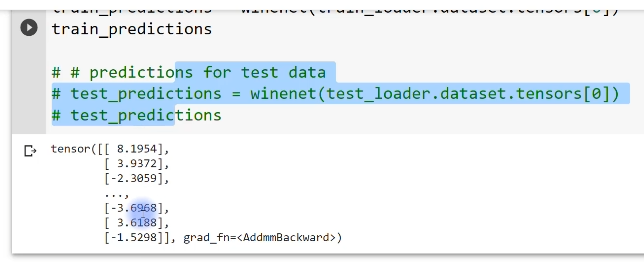
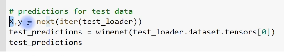

# A deep understanding of deep learning

- [A deep understanding of deep learning](#a-deep-understanding-of-deep-learning)
  - [Measuring model performance](#measuring-model-performance)
    - [Two perspective of the world](#two-perspective-of-the-world)
      - [Experiment: Did you see a cat?](#experiment-did-you-see-a-cat)
      - [Alternate terms from signal detection](#alternate-terms-from-signal-detection)
      - [The problem with accuracy](#the-problem-with-accuracy)
    - [Accuracy, precision, recall, F1](#accuracy-precision-recall-f1)
      - [Accuracy](#accuracy)
      - [Precision](#precision)
      - [Recall = sensitivity](#recall--sensitivity)
      - [Summary](#summary)
      - [Precision and recall | F1 Score](#precision-and-recall--f1-score)
      - [Numerical example 1](#numerical-example-1)
      - [Numerical example 2](#numerical-example-2)
    - [APRF in code](#aprf-in-code)
    - [APRF example 1: wine quality](#aprf-example-1-wine-quality)

## Measuring model performance

### Two perspective of the world

> - The main idea behind signal-detection theory
> - The four categories of responses in signal-dtection theory.
> - Why signal-detection theory is useful for measuring performance DL

So far in this course we have been evaluating the model performance using two matrix, losses and accuracy.

We haven't really interpreted them that much except say that losses should go down and accuracy should go out.

So it turns out there are additional measures of model performance they give us increasing insight more sensitivity of how exacatly the model is performing.

That is the major goal of this section of this course.

and in this video I'm going to give you a little bit of background about signal detection theory.

signal detection theory is widely used in 심리학, economics, and machine learning to understand performance of predictive model and categorical decisions.

One of the fundamental backbone, really the skeleton of signal detection theory is a matrix as called four categories of responses which comes out another concept called the two perspectives of the world.

So in this video I'm going to introduce you to these concept which will give you firm grounding in signal detection theory 

and that is going to allow you to understand the different measures of model performance that you'll learn about later on in this section.

#### Experiment: Did you see a cat?

So let's begin here we have our personify neural network this is our deep learning neural network 

and we're asking our neural network to look at pictures and basically just say if that picture contains a cat or if it doesn't contain a cat.

So here is a picture of a cat, here is a picture of a boat which is definitely not the same thing as as cat.

So the model looks at the picture and she just says yes, it's a cat or no it's not a cat.

so we have two perspectives of the world.

we have the reality in the columns 

and that is the picture actually is a cat or boat

and then we have the model's output which is the prediction about the state of the world.

that is either a cat or a boat.

so when the model says it's a cat, and the reality is that actually was a cat.

so the model looks this picture and says, 'yes, this is a cat.'

then that is a correct answer, we call that correct answer a Hit.

there's alternative terminology that I'll introduce you to in a moment but

it's commonly called a hit.

Now this is not the only way of giving a correct answer

it's also possible fo, you know, the actual picture to be a boat 

and the model says, that was a boat.

that is called a coprrect rejection over here.

so this is not a cat and the model says it is not a cat so a correct rejection and hits these are two different ways of being correct.

then of course we have two different ways of the model being incorrect, making a mistake 

first we have was called a Miss and that is where the picture actually was a cat, the reality was a cat but the model looked this picture and she said,  you know, i think that looks like a boat.

I'm gonna say a boat.

so she was wrong and we call this category a Miss.

and then of course, this thing over here, this is called a False alarm.

This is where the reality was the boat, we show the model the picture of a boat and she said, you know, i'm gonna go with a cat.

that looks to me like a cat.

Maybe she's just trained yet.

So this is another way of being incorrect, we call this a false alram.

so all of this here, this is one set of terminology that is used in signal detection theory.

It turns out the terminology varies a little bit in different literatures.

#### Alternate terms from signal detection

So now i'm gonna show you different terms for exactly the same concept.

Concepts are not different, just the wording is slightly different.

so sometimes we call this objective reality, you know, interesting philosophical철학적인 discussion with more on ethical implications of whether objective reality exists what that means

I think you know what i mean here.

Object reality is present or absent in this case it will be a cat

the cat was present or the cat was absent

and then we have the subjective reality which is the prediction or output of the model ant that is yes, it was a cat, or no, it wasn't a cat.

Here we have the other terms are a little different 

this is, i'm going back to the previous slide.

So here we call hits and correct rejections

here these are called true positive and true negative, 

here's false alarms and misses

and they're also called false positives and false negatives.

Again I apologize for the confusion of the different terminology but that is 

just unfortunate state of a ... in human civilization.

ok now this entire matrix, once we put numbers into this, you'll see examples of, numerical examples starting in the next video.

We can call this thing a confusion matrix.

it's called a confusion matix because it shows all the ways of confusing the subjective reality, the model prediction with the reality objective which is the target variables.

So more on confusion matrix is later on in this section.

Now why do we need to worry about these 4 different categories of responses.

#### The problem with accuracy

We already know how to compute accuracy, so why isn't that enough?

Well, what part of the answer comes from a video that you saw in the previous section about unbalanced design.

I remember here, I said, that the model can smply say a cat all the time for every picture and it will be correct 99% of the time.

This is not wrong, the true accruacy really is 99 %.

but that's not an informative number in this case because of this unbalanced design.

so the conclusion here is that accuracy is very useful, accuracy is a very informative measure but it also hides possible biases in the model performance and also due to the nature of the design, if the data set is unbalanced.

So therefore what we want is to have additional measures 

we want more tools and tool box to be able to supplement a measure of accuracy with other measures of performance that can reveal possible biases or sensitivy in the data.

### Accuracy, precision, recall, F1

> - Why accuracy is not always the best measure of performance
> - Other performance measures in machine learing
> - The relationship between recall and sensitivity

The purpose of this video is to show you how to compute the additional measures of model performance that we will use, such as precision, recall, which is also called sensitivity and the F1 score.

The good news is that once you understand the concept of the four categories of responses that result from the two perspectives of the world, then these categories of model performance are actually really straightforward to compute.

#### Accuracy

So here you see again this table that I introduce you to in the previous video, it shows the two ways of being correct and the two ways of being incorrect, depending on the reality what is actually out there in the world and the model prediction, whether the model prediction matches or mismatches the reality.

OK, so let's start with accuracy and see how accuracy maps onto these four categories of responses here.

So accuracy is the number of true positives, plus the number of true negatives divided by the total number of samples.

So essentially, to compute accuracy, you sum up the two ways of of the model being correct and you divide by the total number of numbers in the entire table.

So the total number of data samples and the interpretation of accuracy is that kind of a measure of the overall model performance.

It does ignore certain things.

It ignores the different categories.

It ignores possible biases introduced by unbalanced sample sizes.

But accuracy is an overall good measure of performance, and it's generally the first measure that you would look at.

But you can see that accuracy ignores the two ways of being incorrect, and that is where we get to the next measure of performance, which is called precision.

#### Precision

Precision is basically just the performance along the row.

So when the model says yes, so we're not including this information here.

When the model says no, it is simply the number of true positives divided by the total number of yes predictions, which is the number of true positives, plus the number of false positives.

So true positives divided by true positives plus false positives, or, in other words, the total number of times that the model said yes.

And the interpretation of precision is that it includes a cost for the model being biased just to say yes all the time.

So you can imagine if the model always says yes, the model never says no.

The model just always says Yes, this is a cat, then this category is going to be high.

There's going to be a lot of true, true positives.

But if it's a balanced design, there will be an equal number of false positives.

So then the precision would actually be one half, which is rather low.

So when is precision a useful metric?

Well, it's used.

You would use precision where false positives are particularly bad.

So this would be an example that I give here is `cancer detection`.

You don't want to go to your doctor because you have a cough and your doctor says, well, you have a brain tumor the size of a grapefruit.

That would be a horrible thing.

So the doctor makes a prediction that you have a really large brain tumor when you actually don't.

So things like cancer detection, a lot of things related to diseases should have a cost for this category here for false positives.

So then you would use precision to evaluate the model performance.

So precision is focused on true positives and false positives while ignoring false negatives, which is another way of being incorrect.

So you can probably guess what is coming up on the next slide.

#### Recall = sensitivity

I'm sure you guessed it this is a measure of the model bias for saying no, and this is called recall.

So here we have the number of true positives in the numerator.

Same as in the previous slide with precision.

But now that the denominator is the total number of times that the actual thing was present, so the total number of times that the cat appeared in the picture.

And the interpretation of recall is that it includes a cost for having a bias towards saying no, so when the model says no too often, then I then recall is going to go down.

And this is useful for cases when false negatives are bad and should be avoided.

And for this example, we can think of spreading an infectious disease like COVID 19.

So let's imagine that you actually do have COVID 19.

Unfortunately, you got COVID 19, but you take a test and the test is is not perfect.

And it says, no, you actually don't have COVID 19.

So this is bad because now you are potentially wandering around and spreading the respiratory호흡의 disease to other people, including people who might be vulnerable to serious complications합병증.

So that is a pretty severe false negative.

On the other hand, you can imagine with it with a COVID 19 test if you get a false positive so you don't actually have COVID 19.

But the test erroneously says that you do.

That's a false positive.

That's not very pleasant, either, but basically this, you know, this just means you'd have to quarantine for for a week or week and a half.

So this is less of a bad situation.

`So this is an example of where we would want to be able to measure the model's bias towards saying no because that is worse than having a bias towards saying yes.`

So here I call this recall.

It is also in literature called `sensitivity`.

So if you see the word sensitivity here, it's the same thing as recall.

It's same formula and so on.

Just different terminology, just different labels for the same quantity here.

#### Summary

OK, so we can summarize these three measures on this slide.

So we have accuracy, we have precision and we have recall and you can see that all three of these categories highlights the number of true positives.

`Precision is useful because it reveals when the model has a bias toward saying yes and recall is useful because it reveals when the model has a bias towards saying no.`

#### Precision and recall | F1 Score

Now, I can guess what you are thinking.

I guess that you are thinking that you know this is nice and all.

But wouldn't it be even better if we had a measure of model performance that told us about the precision and the recall?

So some kind of a mixture of these two?

`And then we just see how biased the model is overall, regardless of whether it's a bias towards saying yes or towards saying no.`

And the answer is yes.

Of course, that metric exists, and that is commonly called the `F1 score`.

So the F1 score basically incorporates these three categories here.

So we have the true positives in the numerator.

And then in the denominator is all three of these categories.

And the way to interpret this is just that this is the average of the two ways of being incorrect.

So the denominator is the the true positives.

Plus the average of the two ways of being of giving an erroneous response here.

Now, the number of true negatives is kind of left out here.

`However, it is implicitly included in the formula because if you know all of these three categories and you know the total number of samples, the total amount of data, then you necessarily know the true negatives.`

`So the true negatives is kind of implicitly inside this formula here.`

`OK, and the interpretation of the F1 score is that it finds a balance between precision and recall.`

So it's not necessarily going to tell you only about a bias towards saying yes or a bias towards saying no.

It's just going to give you a general view of whether the model is biased

In the F1 score is therefore only going to be high.

It's only going to be close to one when there are relatively few mistakes.

You need to have a small number of things here and a small number of things here.

And then you're going to get a an F1 score that's close to one.

#### Numerical example 1

OK, so that was all very theoretical, what I want to do now is a numerical example.

And it's actually not just me doing it, and in fact, I've already done the hard work.

It is your turn to do some hard work.

So what I want you to do is pause the video and get out a piece of paper and a pencil and compute these four metrics here based on the formulas in the previous slides.

And based on these numbers, when you're ready, you can unpause the video and come back and I'm going to talk about how to interpret these different scores.

OK, so accuracy turns out to be 75 percent.

That is just 40 plus thirty five.

So the two ways of being correct divided by the total number of samples.

And here we have precision recall and F1.

Now what you notice here, a couple of things to notice.

`F1 score is very similar to accuracy.`

Not the same, of course, but there are very similar to each other.

`And that's because 10 and 15 are relatively close to each other.`

Of course, they are not the same.

There are more false positives in this case than false negatives.

And so therefore the recall score is higher and the precision score is lower compared to the overall accuracy.

`So the interpretation of this is that the recall is closer to one, you know, relative to these other numbers, it's closer to one. So therefore, the model does not have a strong bias towards saying no.`

`However, the precision is lower, so therefore the model does have a bias towards saying yes.`

Now you see that pretty clearly when you look at this table, the model is making more false positives compared to false negatives, so it's biased towards saying yes.

So the precision is lower, and it's it's less biased towards saying no.

So the recall is higher.

With all of these metrics, you want them to be close to one, right?

`Just like with accuracy, the closer to one it is, the better.`

I think this picture also shows very nicely the balance between the two different biases, which are revealed by precision and recall and the fact that accuracy is kind of an aggregated measure of performance.

OK, so that was a numerical example, number one.

#### Numerical example 2

And now here is another numerical example.

Again, I would like you to pause the video and compute these four metrics.

And when you're ready, come back to the video and we will discuss them and interpret them.

OK, so here we have accuracy, exactly the same as the previous slide, the previous dataset.

So that's pretty interesting.

The accuracy is exactly the same, but look how different precision and recall are now.

Precision is super high, precision is 0.93.

Now that means that the model has a very low bias towards saying yes.

The model is not biased to saying yes all the time, so therefore precision is really high.

On the other hand, the model is more biased towards saying no.

So the model, you know, whatever it learned in the data, or maybe there was something, there are some unbalance of the data, and the model developed a bias towards saying no.

So it made a lot of mistakes by saying, nope, the cat is not there, even though there was actually a cat in that picture.

So now the recall score is lower, and now you see the F1 score is higher than accuracy and it's kind of in the middle.

It's always going to find the balance between precision and recall.

`So F1 Score tells us that there is some kind of a bias somewhere in the model performance, but it doesn't really tell us, you know, we'd have to separately look at precision and recall to see exactly where the bias actually stems from, whether it's coming from the false positives or the false negatives.`

All right, so that's the end of this video, I hope you found this informative in the next several videos.

We are going to explore these different metrics in code.

### APRF in code

> - See the four metrics implemented in Python.
> - Visualize the relationships among these variables

Now that you understand the theory and the formulas for how to compute these different signal detection theory metrics, it's time to see how these get implemented in Python code, which is also going to be really beneficial because that will allow us to visualize the relationships among in particular accuracy and F1.

I call this APRF that stands for accuracy, recall precision and F1 score.

You know, it's just it's a little too long to write all this stuff out in the title.

So we don't need any deep learning here.

We're not actually building real models.

We're just going to generate some fake data in Python and explore the relationships amongst these different metrics.

[DUDL_measurePerformance_APRF.ipynb](../measurePerformance/DUDL_measurePerformance_APRF.ipynb)

So all we need is numpy and matplotlib, we don't need PyTorch here, so I'm going to run some experiment.

This is how I will generate the data.

Let me scroll down first and explain what happens inside this for loop over each fake experiment, 

and then I'll scroll back up and explain the parameters on top.

So we loop through some number of experiments and then we generate the data.

We're going to create the true positives, false negatives, true negatives and false positives.

So here we are generating the four categories of responses just based on random numbers.

And then here I'm computing these four metrics accuracy, precision, recall and F1 score for this experiment.

So I'm storing all of the data.

And, well, you can take a moment to match these formulas with the formulas that I showed in the previous video.

And actually they are also printed at the bottom here.

Also included this screenshot here at the bottom.

So with that in mind now, let me just tell you quickly about the parameters.

So I set ten thousand experiments.

That's just to make sure that we get a lot of different numbers.

So we're really sampling from the full distribution of performance.

And here I specify ln this parameter N to be 50, which is the number of trials in each experiment,

although the actual number ends up being two N, and the reason why it ends up being two N or a hundred

is because I generate the true positives to be some random integer between one and 50.

And then the false negatives is actually just the inverse of the true positives.

So then these two together will sum to 50 and then of course these two categories also will come to 50, and that gives us a total of 100 responses in each experiment.

OK, so now I can run this cell.

It's of course, very fast to compute and now we can make some plots.

So this is pretty interesting.

We're going to make some scatter plots of accuracy on the X axis by F1 score on the Y axis.

Now, one neat feature of the Python scatter plot function is that we can also specify a variable for the color, and that is what this C parameter here defines.

So now the color of each dot in the scatterplot is going to be defined by the precision in the first plot.

And then we call in the second plot.

This parameter s, by the way, is size.

So we're just leaving that fixed to a dot size of five.

OK, so here you see the results.

First of all, it looks quite beautiful, right?

It's just very pleasant to look at.

So we see that each dot corresponds to a different experiment from our ten thousand experiments.

And the x axis is accuracy.

In both cases, the Y axis is F1 score.

And both of these cases now you see that they both go up and down together and that means that accuracy and F1 score are correlated.

So when accuracy is high, the F1 score is also going to be high.

However, that correlation is not perfect.

This is not a perfect correlation.

So it is not trivially the case that high accuracy necessarily means really high F1 scores.

And that is because accuracy does not incorporate these measures of biases.

The two different ways that the model can be biased either toward saying yes too often or towards saying no too often.

And the F1 score does incorporate both of these biases.

So the recall and the precision biases and then the color you see corresponds to the precision in this case and recall in this case.

So here we see that when precision is very high, we get high accuracy, but not necessarily high F1 score.

So a bias towards saying yes, towards the model saying yes is going to push up accuracy a little bit too much.

And conversely, a bias from the models saying no too often, which is defined by recall, is going to push up the F1 score.

I actually didn't include color bars, looks like here, but the purple here, this purplish color corresponds to a precision of zero or very close to zero.

And as you get to blueish and then greenish and yellowish and a little bit orangish, then that means the precision.

Also recall is getting up to one is getting higher.

So I hope this makes sense.

The key point here is that we have four different variables accuracy, precision, Recall an F1 score.

They're all kind of related to each other because they all come from the same data table, but they all highlight different aspects of model performance and different kinds of biases that the model can have.

And as I explained in the previous videos, accuracy is a great measure of overall model performance, but it kind of hides the biases that might be in the model performance.

F1 score is also a great measure of performance.

It averages the two biases together.

So the bias towards saying yes and the bias towards saying no and precision and recall will highlight the two different specific biases of how the model can go wrong.

I hope you found this video illuminating이해를 돕는, 분명하게 하는, of course, I encourage you to spend some time playing with the code and plotting the different performance metrics in different ways to visualize the relationships in different ways.

Starting in the next several videos, we are going to implement these metrics in real data and the wine quality data and also in the mnist data.

### APRF example 1: wine quality

> - See the four metrics in action (using binary outcomes)!
> - Use scikitlearn to compute these metrics based on single-item outpus
> - Use scikitlearn to compute and visualize the confusion matrix

In this and the next videos, you are going to see the ARPF measures so accuracy we call precision and F1 score in practice with real data sets numpy

in This video will do the wine data set.

That's nice because it has a binary outcome.

So it's a two alternative first choice discrimination task.

And in the next video, the next example, we will use the MNIST data set, which of course has 10 categories.

So we'll have to discuss how to modify these measures and also the confusion matrix for multi class categorization.

Also in this video, I'm going to show you how to compute these metrics using scikit learn instead of us doing it manually.

[DUDL_measurePerformance_APRFexample1.ipynb](../measurePerformance/DUDL_measurePerformance_APRFexample1.ipynb)

Very good.

So now we are here in Python and you can see we are back to importing lots and lots and lots of libraries because we need PyTorch and the train test split and all this good stuff.

So let's import those libraries.

Here are we import the data set and Z score and convert the quality ratings to boolean quality ratings 

for stuff you've seen before.

Just a little bit of a reminder here.

We do a train test split.

Now, you can see in this case, I'm not coming up with a train, devs set, test sets.

But instead, this is just a two partitions split into the training set and the test set 

and the test set is going to be 10 percent of the data.

OK, very good.

This model is the same we've been using before.

The only thing I want to mention explicitly is that we are returning just the raw numerical output of the model.

So we are not passing this through a sigmoid function that is relevant for how we are going to call the scikit learn functions to compute these performance metrics later.

I'll come back to this later on.

OK, so run this.

And here we have the function that trains the model.

Not a whole lot of stuff going on in here.

That's really interesting.

We've actually discussed previously in the course that, you know, stochastic gradient descent is not necessarily the best method, the best optimizer for these data.

We can do a little bit better.

But as I've also mentioned before, there are plenty of cases when studying deep learning where you actually want to make the model do a little bit worse.

You want to drag down the performance a little bit to increase the variability in the performance, which is going to facilitate a discussion and understanding of these different performance metrics,

in particular, the difference between recall and precision, OK, anyway, the rest of this code is pretty straightforward stuff you've seen now many times.

OK, so here we train the model, we get a new model instance and then we train the model.

So now we have our model instance, which is fully trained, so it has trained weights and we have these metrics, but in fact, we don't really care about these for this particular video because we are going to compute the new performance metrics down here.

So what I do here is take our model instance with the trained weights and everything and input train, underscore loader data sets, tensors.

Let me actually make sure we're all on the same page here.

So the train loader is this iterable is a type data loader and normally we use this as an iterable in a for loop, but we can also access all of the data directly.

So we say that data set and then this has tensors and we can see that this is a tuple of two pieces of information.

There's two items inside this tuple.

The first one is all the actual data and the second one is the labels.

So what I am doing here is grabbing all of the data.

This is not just one mini batch.

This is the entire data set.

It's stored here as one big tensor.

OK, so I get all of the data, the training data and input that into the model and then get out the predictions.

Let's see what those train predictions look like.

You can see that is a vector of numbers.

Now, these numbers are the raw outputs from the deep learning model, from the output layer.

This is not the output pass through a sigmoid function or a softmax function.

The reason why that's important is that the predictions here are just based on positive or negative numbers.

Basically the sign of the number not based on point five.

So point five as a threshold cutoff would be if these data were passed through a sigmoid function.

OK, so that's just a reminder for later.

Of course, you know that already here, this code here, these three lines of code, we have exactly the same as up here, except we are inputting the test data instead of the training data.

And here to you know, it's also just to show you a little bit of variety, because often in this course I do something like this, X comma Y equals next error test test loader.

Like this, and then here X is going to be the same thing as this, and here now these are the same thing because the test loader only has one mini batch.

If there were multiple mini batches in the test loader, then in fact, this would only be the first mini batch.

So, yeah, so then we get the predictions for the test samples.

So now we know the target values.

So the true answers here and we know the predictions here and that is what we input into this series series of functions here through scikit learn.

And so it's scikit Learn dot metrics and we're going to import that using the abbreviation skm.

So scikit, learn that metrics.

And then here you can see I'm computing these metrics accuracy, precision, recall and F1 score and

what we input here.

We provide two inputs to this function and those inputs are the target values.

Right. So this is from the train_loader.

We have the data set and then the tensors.

And then this is the second element of that tuple, which I just explained a moment ago.

So these are the target values.

This is the true state of the world, the objective reality.

And then we have the model predictions, which is the predictions or the subjective reality.

And here is this is why I kept mentioning that we're getting the raw output from the model, because

if these were softmaxified or pass through a sigmoid, then we would actually need to specify this as point five instead of zero.

OK, so these are zero.

So this ends up being a vector of a boolean vector of truth and falsies.

And this is zeros and ones.

And then we let scikit learn do all the like superduper intensely difficult math.

Totally kidding.

The math here is really, really simple.

We could actually just computed writing our own code like what you saw in the previous video.

But many people often do this through scikit learn.

And so I wanted you to know how to do this in scikit. Learn 

anyway.

Here are our four metrics for the training data and here are our four metrics for the test data.

And now I'm going to create a bar plot that shows the train metrics and the test metrics in the same bar.

Now, this one is accuracy.

So this bar here actually corresponds to what you would see at the very end of how we normally visualize accuracy as you know, as a function of training.

So normally see this like logarithmic type function going up.

And then the very last point.

So the final training epoch would be what these two numbers correspond to.

So this gives us the accuracy for train almost 90 percent and for a test where it's about seventy six percent.

So that's not super great.

I think, you know, we could work on this architecture and get this higher bit, but we don't need to worry about that for now.

So then it's interesting to see that the precision and recall are actually not the same.

So the recall is a bit higher and the precision is a bit lower.

And that's true for train and also for test, although it's more apparent in test in this case.

So what does this mean?

How do we interpret this?

Well, remember, that recall and precision are both telling us about the model biases.

Recall is that the model is has a bias for saying no, which in this case, in these data, this means the model has a bias for predicting low quality wine and precision would mean a bias towards saying yes, which in this case means the model has a bias towards predicting a high quality wine.

So the fact that the recall values here are higher than the precision values tells us that the model actually has a bit of a negative a problem with saying yes too often.

So the model is rating too many wines as being high quality.

This model would actually make a great sommelier소믈리에, right?

This is what you want.

And it's only better for a wine expert to, you know, someone at a restaurant trying to sell you wine.

It's better for them to say that all these lines are great then to be biased towards saying all these wines are terrible.

Okay, then here you see the F1 score, which, as I mentioned before, is kind of it's not literally an average, but it's basically a mixture between precision and recall.

So it's somewhere in between.

OK, so these are the bar plots and now we can visualize this in a confusion matrix.

So this is also something that comes with the scikit Learn dot Matrix Library.

So same concept.

We input the target values and the actual values of the true state of the world and the predicted state of the World from the model, and then we can visualize this confusion matrix as an image and, well, there's a lot of code in here, but it's mostly, you know, this is the most important line here.

This visualizes the matrix.

This is just making the figure look a little bit nicer.

And then here I'm adding the text labels on top, so and then repeat for a test.

So here we see what that those two matrices look like.

Now, you always expect that in these confusion matrices, the diagonals are high.

These are the correct answers and the off diagonals are relatively low.

Now, ideally, these off diagonals should be really low.

They should be very close to zero, which they are not.

But that's OK.

But but certainly the diagonals(\) should be larger than the off diagonals(/).

Now, another slightly annoying thing, or maybe a little bit more than slightly annoying, but a confusing thing about these confusion matrices in Python and scikit learn is that they swap the columns and the rows compared to how these things are often visualized.

So here we have the true positives and the lower right, whereas what I showed in the slides was the

true positives on the top left and the true negatives on the bottom right.

There's an additional exploration here that's asking you to explore that and correct for that.

OK, but it's also interesting to see that the number of false positives is higher and the number compared

to the number of false negatives.

We see that during training and we see that during test.

In fact, it's it's pretty much exactly double the number of false positives compared to the number

of false negatives.

So what does that mean?

Well, that means that our model has a bit of a bias towards saying that the wine is good and that is why the precision is relatively low compared to the recall, which is a little bit higher.

So those values that we interpreted with the bar plots are here represented in this confusion matrix.

So, again, the model has a bit of a bias towards giving false positives.

So the model is biased towards saying that wines are good, high quality wines when they're actually not.

They were actually rated as being relatively bad quality wines or at least, you know, lower quality wines.

So we have a bit of a bias here.

So this means that the precision is going to be lower than the recall.

And that is what we also see up here.

So the precision is lower.

Recall is relatively higher.

So that is the different signal detection theory derived metrics in the wine quality data set.

Stay tuned for the next video.

We are going to repeat conceptually similar, but with the endless data set, we're going to have to learn a couple of new tricks for dealing with multiclass categorisation.
